---
output:
  pdf_document: default
  html_document: default
---

<!-- ::: watermark -->

<!--  -->

<!-- ::: -->

# (PART\*) Parte 1: Bases y Preeliminares {.unnumbered}

# Introducción a Deep Learning

El aprendizaje profundo (*deep learning*) ha transformado radicalmente campos como la visión por computadora, el procesamiento del lenguaje natural, la robótica y la bioinformática. En este capítulo examinaremos qué ha impulsado su crecimiento exponencial, presentaremos algunos de los problemas más comunes que resuelve y haremos un recorrido por sus raíces históricas.

## Introducción al aprendizaje automático

El aprendizaje automático se define como el campo de estudio que da a las computadoras la capacidad de aprender sin ser programadas explícitamente (Arthur Samuel, 1959). Formalmente, un algoritmo de *machine learning* mejora su desempeño en una tarea $T$, medido por una métrica $P$, a medida que adquiere más experiencia $E$.

### Motivación: Los paradigmas del conocimiento

A lo largo de la historia, la humanidad ha transitado por distintas formas de generar y utilizar conocimiento:

-   **Era empírica**: basada en la observación directa y la experiencia.
-   **Era teórica**: dominada por modelos matemáticos y leyes físicas (por ejemplo, la mecánica newtoniana).
-   **Era computacional**: donde simulaciones numéricas permiten explorar sistemas complejos.
-   **Era de los datos**: en la que los patrones emergen no de ecuaciones, sino de grandes volúmenes de datos observados.

```{r echo=FALSE, fig.align='center'}
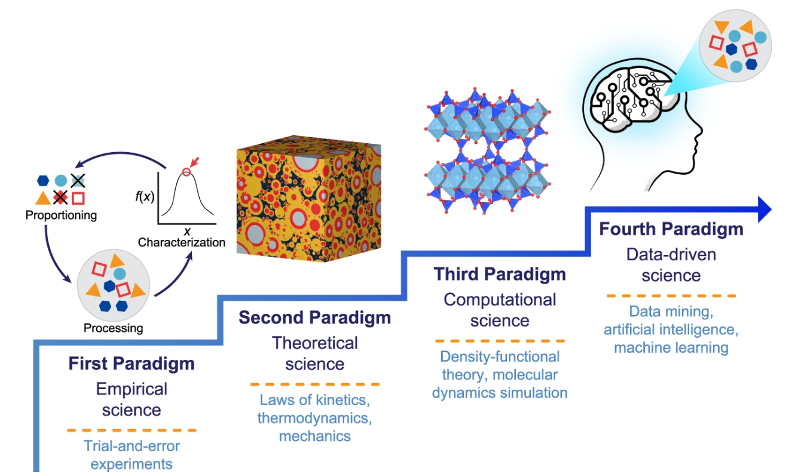
```

Para entender un poco más sobre estos paradigmas del conocimiento un paper muy interesante que estaba leyendo hace un tiempo ["Machine learning in concrete science: applications, challenges, and best practices"](https://www.nature.com/articles/s41524-022-00810-x) habla acerca de la evolución de la ciencia del concreto en estos paradigmas y la relevancia exponencial que han jugado los algoritmos de aprendizaje automatico al hacer nuevos descubrimientos en estos campos.

```{r echo=FALSE, fig.align='center'}
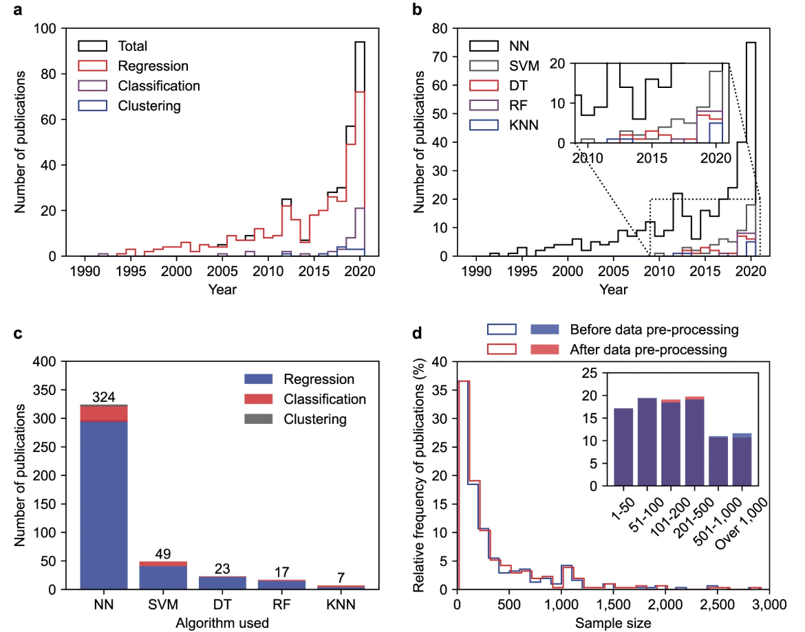
```

Es en esta última era donde el *machine learning* cobra protagonismo: en lugar de programar reglas explícitas, enseñamos a las máquinas a descubrir patrones a partir de ejemplos.

### Machine learning supervisado

Los problemas de *machine learning* se clasifican según la naturaleza de los datos y la supervisión disponible:

#### Aprendizaje supervisado

Se dispone de pares entrada-salida $(x, y)$. Subtipos comunes incluyen: - **Regresión**: predecir una variable continua (ej. precio de una casa). - **Clasificación**: asignar una etiqueta discreta (ej. detección de spam). - **Aprendizaje de secuencias**: modelar datos ordenados en el tiempo o en secuencia (ej. traducción automática, reconocimiento de voz).

#### Componentes del aprendizaje supervisado

En el aprendizaje supervisado participan los siguientes componentes.

1.  Función desconocida: $f: X->Y$ Es la relación que queremos aprender entre la entrada $X$ y las salidas $Y$
2.  Muestras de entrenamiento (data): Es el conjunto de pares observados $(x_n,y_n)$
3.  Conjunto de hipótesis: Denotado como $H$ es el conjunto de funciones candidatas que el algoritmo puede elegir para aproximar f.
4.  Algoritmo de aprendizaje: Denotado como $A$ Toma como entrada los ejemplos de entrenamiento y el conjunto de hipotesis para seleccionar una $g \in H$ que mejor se ajuste a los datos.
5.  Hipotesis final: Denotada como $g \approx f$ que es la función aprendida por el algoritmo

```{r echo=FALSE, fig.align='center'}
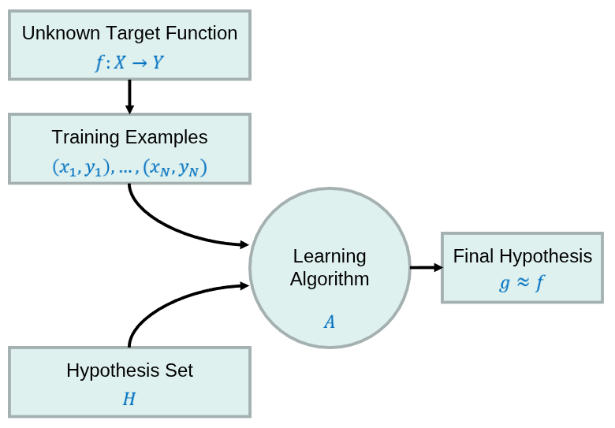
```

#### Tipos de datos en el aprendizaje supervisado

Si bien los algoritmos de aprendizaje automático operan exclusivamente con números, la estructura y el tipo de las variables (por ejemplo, categóricas, continuas, ordinales, etc.) influyen directamente en la elección del modelo más adecuado para capturar patrones y realizar predicciones efectivas.

##### Númericos

También conocido como datos cuantitativos, refleja la cuantización de algo medible y codificable numéricamente donde existe una relación de orden total.

```{r echo=FALSE, fig.align='center'}
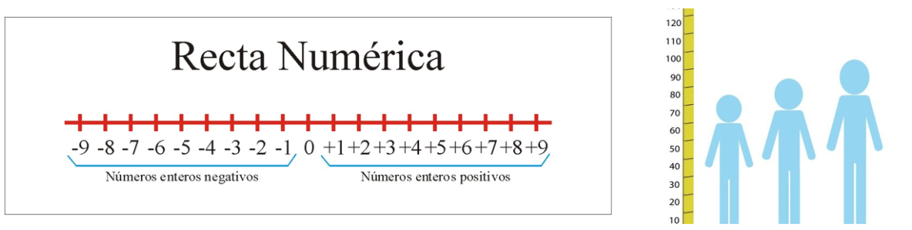
```

##### Categóricos

Los datos categóricos se utilizan para etiquetar características que no son medibles, conocido como datos cualitativos. Por lo general se emplean números como etiquetas sin que estos tengan una relación de orden total en su significado.

```{r echo=FALSE, fig.align='center'}
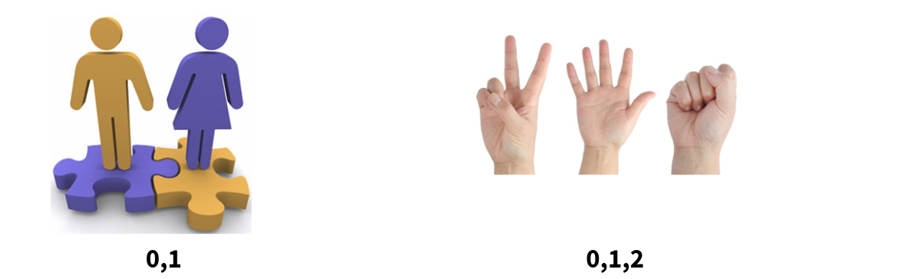
```

A menudo un mismo atributo lo podemos representar de diversas manera y la representación que elegimos podrá ser de diferente indole.

```{r echo=FALSE, fig.align='center'}
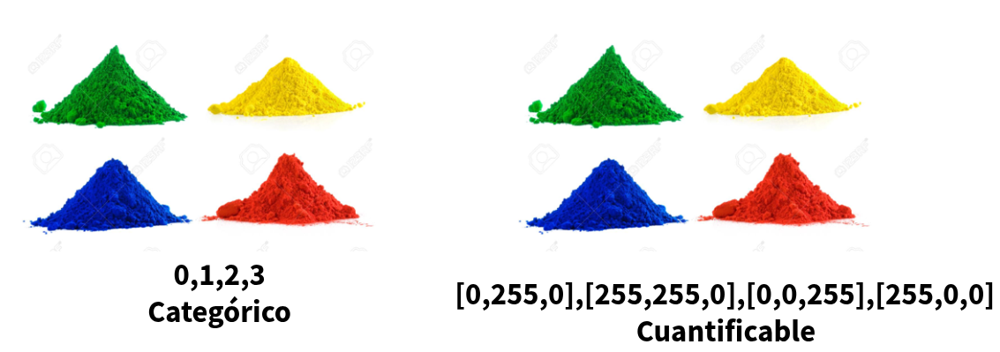
```

##### Series de tiempo

Son una secuencia de números coleccionados con un intervalo regular de tiempo sobre un periodo de tiempo. En este tipo de conjunto de datos las muestras pueden estar asociadas entre si.

```{r echo=FALSE, fig.align='center'}

```

Diversos objetos que solemos representar en este mundo como imagenes, videos o audios se pueden describir con los tipos que definimos anteriormente.

#### Los problemas de machine learning

Los dos desafíos fundamentales que definen la naturaleza de los problemas en *machine learning*:

##### El problema inverso

A diferencia de la física, donde las leyes predicen observaciones, en *machine learning* partimos de observaciones para inferir las reglas subyacentes. Esto es inherentemente ambiguo y puede derivar en un gran número de problemas. Por listar algunos tenemos.

**Falta de información:** Se intentan identificar patrones para intentar disminuir el error basado en alguna regla, pero no hay garantia de que la regla que se este intentando cumplir sea la correcta para representar al sistema.

```{r echo=FALSE, fig.align='center'}
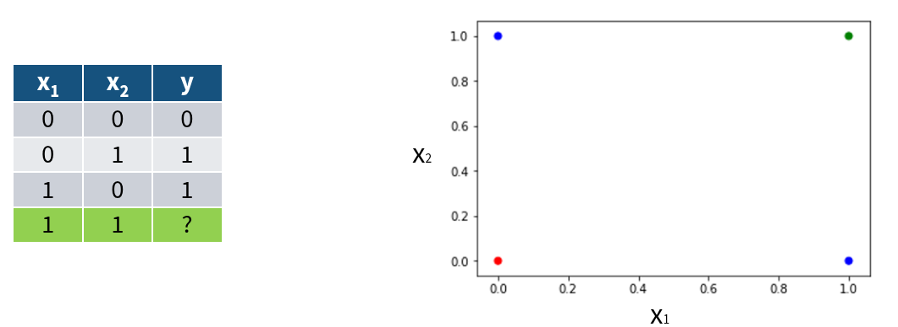
```

**No unicidad de la solución (información inconsistente):** Dado un resultado observado $y$ , puede haber múltiples configuraciones de entrada $x_1 x_2, ...$ tales que $f(x_i) = y$

```{r echo=FALSE, fig.align='center'}
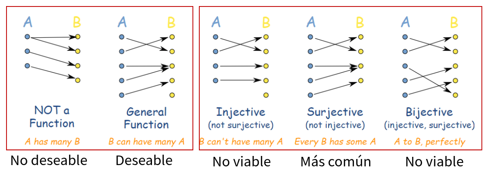
```

##### Generación del modelo que aproxime al sistema

**Falta de modelo directo preciso** : En muchos casos, la función directa $f$ (que mapea causas a efectos) no se conoce analíticamente, sino que se aproxima mediante simulaciones o modelos empíricos. Esto tambien se puede por no tener el conjunto de hipotesis adecuado.

```{r echo=FALSE, fig.align='center'}
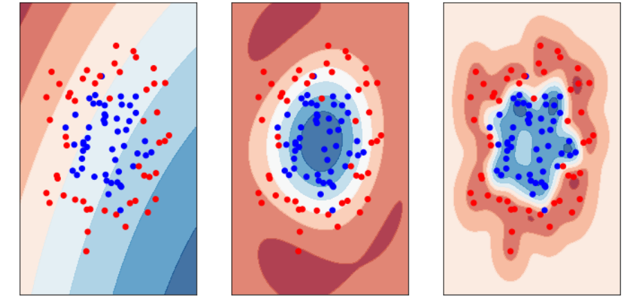
```

**Problema de optimización**: el aprendizaje se formula como la búsqueda de parámetros que minimicen una función de pérdida a mayor número de parámetros a optimizar es menos probable obtener un minimo global, lo cual se puede realizar tambien con el problema "the curse of dimensionality"

```{r echo=FALSE, fig.align='center'}
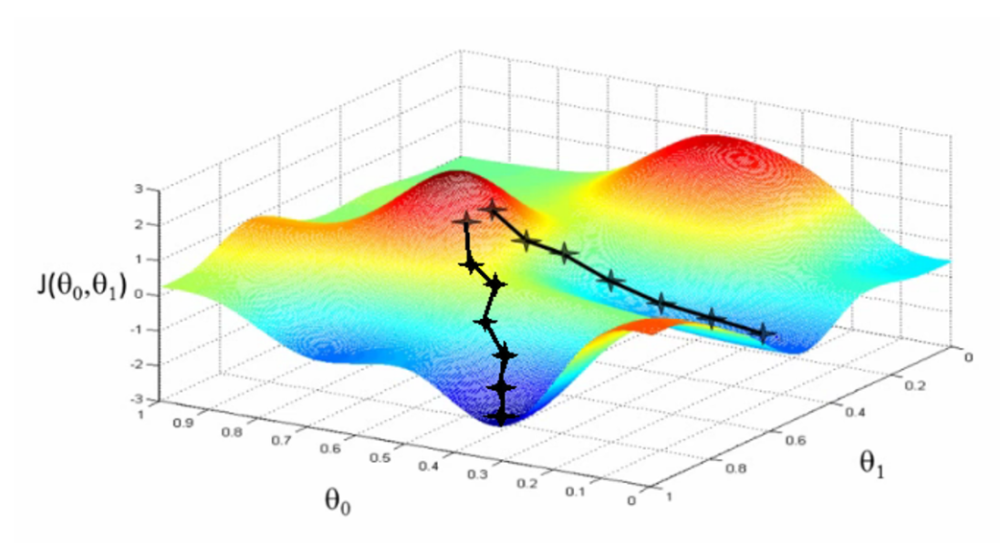
```

## ¿Por qué Deep Learning?

Una pregunta que nos podriamos hacer es ¿por qué deep learning? en esta sección abordaremos una perspectiva de contraste e historica para intentar acercarnos a esta respuesta.

### Dimensión VC

La **dimensión de Vapnik-Chervonenkis (VC)** es una medida de la capacidad de un modelo de clasificación (o conjunto de hipótesis) para distinguir entre diferentes clases. Formalmente, la dimensión VC de un conjunto de hipótesis $H$ se define de la siguiente manera:

Sea $H$ un conjunto de hipótesis; y $X$ un conjunto de instancias (espacio de entrada). La dimensión $VC$ de $H$ es el tamaño del mayor subconjunto de $X$ que puede ser destrozado (shattering) por $H$

**Shattering:** Un conjunto de puntos $S={x1,x2,…,xd}⊆X$, se dice que es **shattered** por $H$ si, para cada posible partición binaria de $S$ (es decir, cada una de las posibles asignaciones de etiquetas en $S$), existe una hipótesis $h \in H$ tal que $h$ clasifica correctamente todos los puntos de $S$ según esa partición.

En otras palabras **VC Dimension** mide la capacidad de un modelo para ajustarse a conjuntos arbitrarios de datos. Cuanto mayor sea la dimensión VC, más complejos son los patrones que puede aprender, pero también mayor el riesgo de sobreajuste (*overfitting*).

```{r echo=FALSE, fig.align='center'}
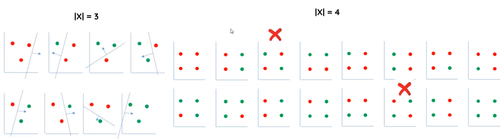
```

Es importante que el conjunto de puntos se encuentre en posición general, para evitar configuraciones precisas que se ajuntes de forma exacta a la forma del conjunto de hipotesis.

```{r echo=FALSE, fig.align='center'}
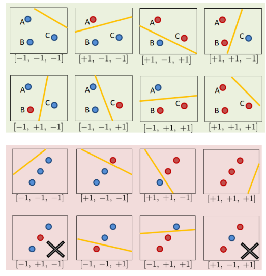
```

Algo importante a remarcar es que el VC-Dimension como su nombre lo indica representa la capacidad en una instancia númerica basada en el número de dimensiones de los puntos a separar, así que si el número de dimensiones incrementa, el número de puntos maximos a clasificar correcto tambien lo hace.

```{r echo=FALSE, fig.align='center'}
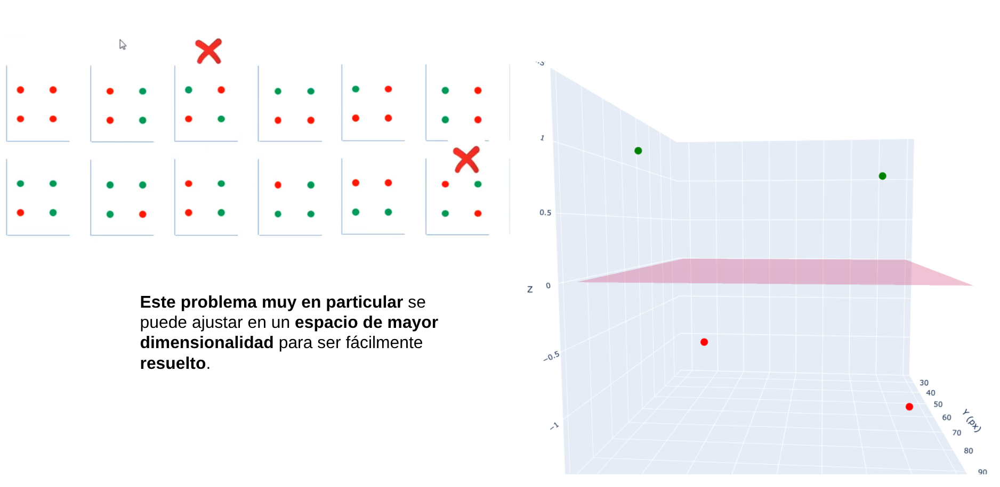
```

### El truco del Kernel (SVM)

Una **SVM (Máquina de Vectores de Soporte)** busca separar las clases de datos encontrando una frontera óptima (hiperplano) que las divida. Sin embargo, cuando los datos no son separables linealmente en su espacio original, utiliza el **truco del kernel**, que consiste en proyectarlos implícitamente a un **espacio de mayor dimensión** donde sí puedan separarse mediante una frontera lineal. De esta forma, sin transformar los datos directamente, la SVM aplica funciones como los **kernels polinomial o RBF** para capturar relaciones no lineales y lograr una mejor clasificación.

```{r echo=FALSE, fig.align='center'}
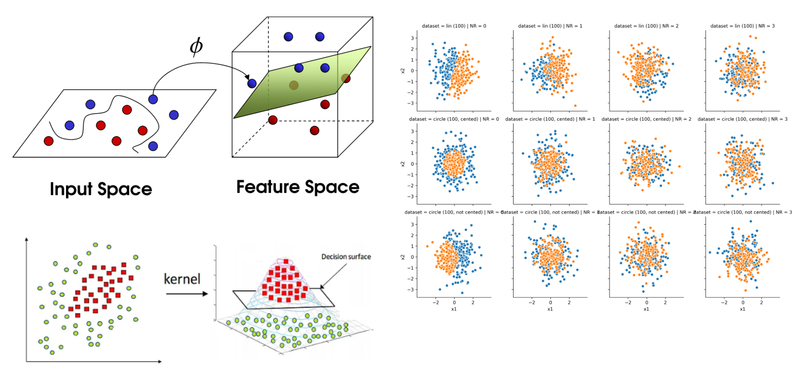
```

Sin embargo, encontrar el kernel adecuado presenta desafíos como la necesidad de probar distintas funciones, ajustar cuidadosamente sus parámetros para evitar sobreajuste o subajuste, enfrentar altos costos computacionales en grandes volúmenes de datos y lidiar con la menor interpretabilidad del modelo al trabajar en espacios de alta dimensión.

### Ingeniería de caracteristicas

La **extracción de características** ayuda a resolver problemas de **aprendizaje automático** al transformar los datos brutos en representaciones más relevantes y compactas que facilitan el trabajo del modelo. Este proceso permite **destacar la información más útil**, eliminar ruido y reducir la dimensionalidad, lo que mejora la **precisión**, **eficiencia** y **capacidad de generalización** del algoritmo. Al enfocarse en las propiedades más representativas de los datos —por ejemplo, patrones visuales en imágenes, frecuencias en audio o variables derivadas en datos tabulares—, la extracción de características permite que los modelos aprendan de manera más efectiva y requieran menos recursos para lograr un buen desempeño.

```{r echo=FALSE, fig.align='center'}
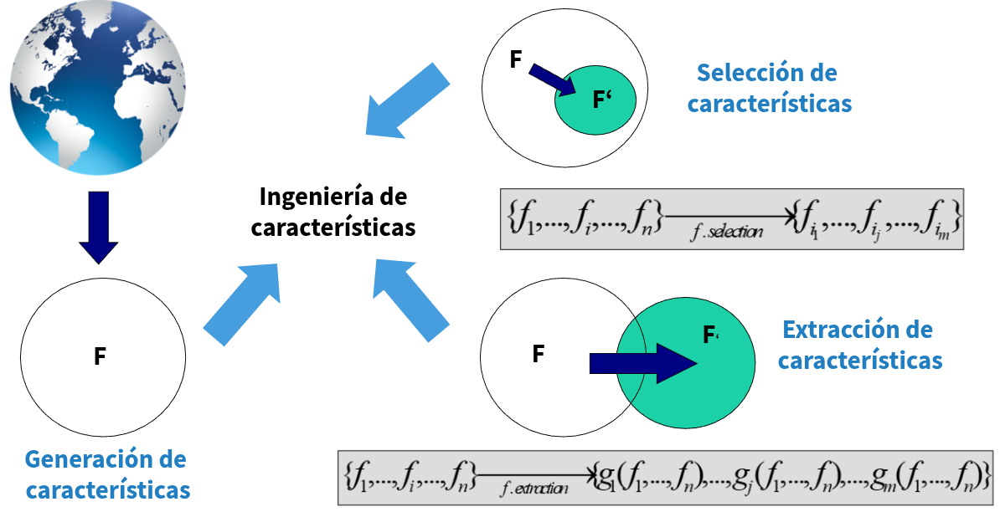
```

La extracción de caracteristicas resulta especialmente util para combinar variables que por si mismo no aportan tanto valor al describir un sistema, pero combinadas de cierta forma tiene valor. Por ejemplo el peso y la estatura combinada pueden crear el **IMC** que es un indicador clave a la hora de evaluar el sobrepeso.

### Beneficios del deep learning

#### Teorema de aproximación universal

1.  Establece que una **red neuronal** con al menos una **capa oculta** y un número suficiente de **neuronas** puede aproximar cualquier **función continua** en un espacio de **dimensión finita** con un error arbitrariamente pequeño. En otras palabras, las **redes neuronales** son **aproximadores universales**.

2.  Este **teorema** proporciona una base teórica para la capacidad de las **redes neuronales** de aprender y representar **funciones complejas**. Sin embargo, en la práctica, el **teorema** no garantiza que una **red entrenada** encontrará la **aproximación óptima**, ni especifica cuántas \*\*neuron

```{r echo=FALSE, fig.align='center'}
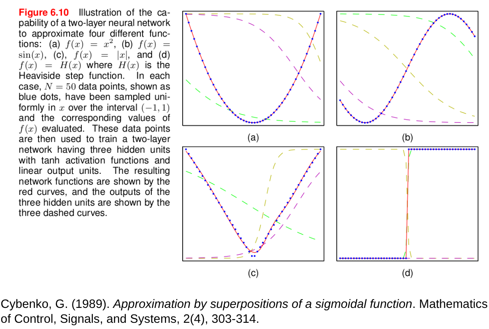
```

["Jugemos un poco con las redes multicapa"](https://playground.tensorflow.org/)

#### Extracción automática de características (feature extraction):

A diferencia de los métodos tradicionales, donde los ingenieros diseñaban manualmente características (ej. bordes, texturas, frecuencias), las redes profundas **aprenden representaciones útiles directamente de los datos brutos**. Cada capa construye representaciones de mayor nivel a partir de las anteriores (píxeles → bordes → formas → objetos).

```{r echo=FALSE, fig.align='center'}
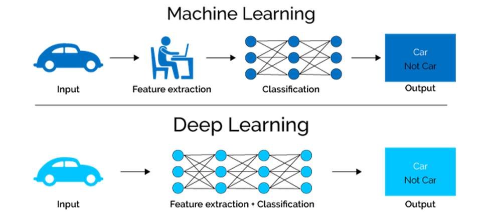
```

| Tipo de capa | Rol / función típica | Qué tipo de representaciones aprende | Apoyo en la literatura / ejemplos |
|---------------|---------------|---------------|---------------------------|
| **Primeras capas**<br>(cercanas a la entrada) | Capturan patrones de bajo nivel y locales del dato bruto | Bordes, texturas, frecuencias básicas, características locales | Se habla de “aprendizaje jerárquico de características”, donde los niveles inferiores capturan elementos simples primero. ([OpenStax](https://openstax.org/books/principles-data-science/pages/7-3-introduction-to-deep-learning?utm_source=chatgpt.com)) |
| **Capas intermedias**<br>(ocultas medias) | Combinan características simples en representaciones más abstractas | Motivos, formas, combinaciones de las características de los niveles más bajos | El trabajo “Understanding Deep Representation Learning via Layerwise Feature Compression and Discrimination” estudia cómo las capas progresivas comprimen características dentro de clase y discriminan entre clases a medida que avanza la profundidad. ([arXiv](https://arxiv.org/abs/2311.02960?utm_source=chatgpt.com)) |
| **Últimas capas**<br>(cercanas a la salida) | Transforman las representaciones abstractas hacia la decisión o la salida específica de la tarea | Conceptos de alto nivel, clases, predicciones finales | En redes de reconocimiento de imágenes, las capas finales "interpretan" las características abstractas en etiquetas o decisiones. Por ejemplo, arquitecturas como AlexNet usan capas finales totalmente conectadas para clasificar objetos. ([Wikipedia](https://en.wikipedia.org/wiki/AlexNet?utm_source=chatgpt.com)) |

["How transferable are features in deep neural networks?"](https://arxiv.org/pdf/1411.1792)

#### Escalabilidad con datos y cómputo

Mientras que muchos algoritmos clásicos saturan su rendimiento con más datos, el *deep learning* **mejora continuamente** al aumentar el tamaño del conjunto de entrenamiento y la capacidad computacional.

```{r echo=FALSE, fig.align='center'}
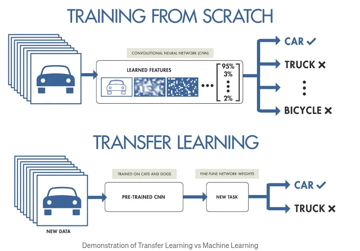
```
