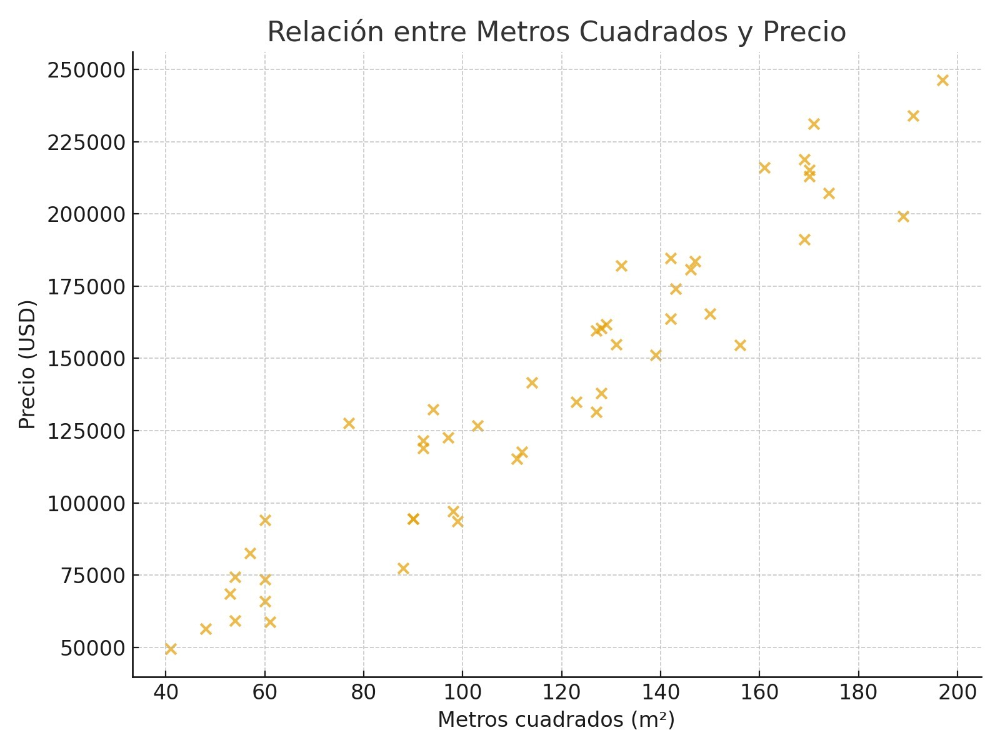
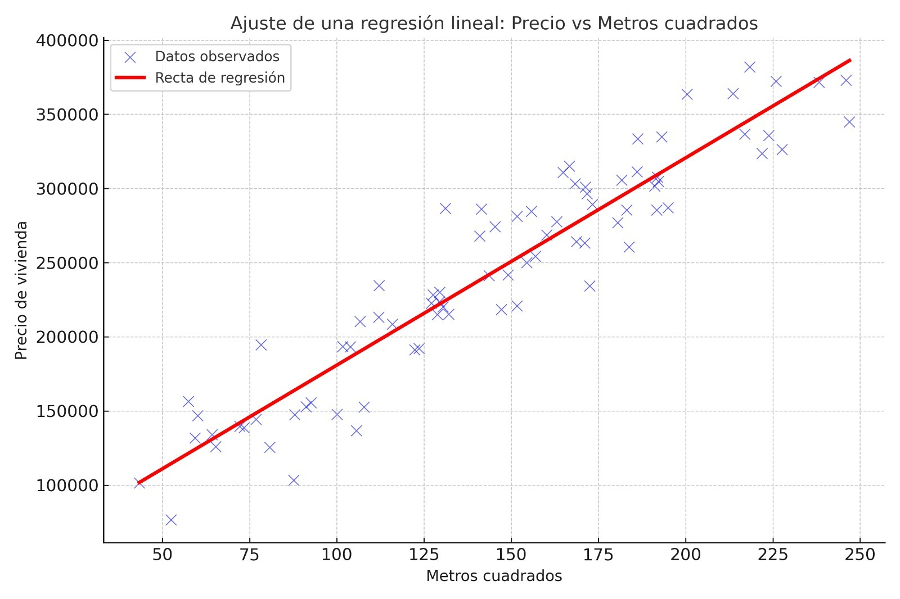

# Redes neuronales Lineales para Regresión

## Introducción

El propósito de la regresión lineal es modelar la relación entre una variable que queremos predecir (por ejemplo, el precio de una vivienda) y una o más variables que podrían influir en ella (como los metros cuadrados, la ubicación o el número de habitaciones). Este tipo de análisis nos permite identificar patrones, hacer predicciones y entender cómo cambian los valores de una variable cuando las otras se modifican. En esencia, la regresión lineal busca encontrar una línea que mejor describa la tendencia general en los datos, ofreciendo una forma sencilla pero poderosa de explorar relaciones cuantitativas.

*El término “regresión” proviene del trabajo del científico y estadístico británico Francis Galton a finales del siglo XIX. Galton, mientras estudiaba la relación entre la altura de padres e hijos, observó que los hijos de padres muy altos tendían a ser más bajos que ellos, y los hijos de padres muy bajos tendían a ser más altos. Es decir, las alturas “regresaban” hacia un valor promedio de la población. Para describir este fenómeno, Galton utilizó la expresión “regresión hacia la media”. Con el tiempo, este concepto se generalizó y dio origen al término “regresión” en estadística, que hoy usamos para describir modelos que ajustan relaciones entre variables.*

## Regresiones lineales simples

Las regresiones lineales buscan predecir una variable númerica (variable independiente), a partir de una o más variables (variables independientes), con el supuesto de que la relación que se da, entre la variable dependiente, con la independientes, es **aproximadamente** lineal.

Partamos del siguiente problema en el que se busca establecer el precio de una vivienda a partir de los metros cuadrados que lo conforman. Al graficar las dos características mencionadas se observa lo siguiente:

```{r echo=FALSE, fig.align='center', out.height='450pt', out.width='450pt'}

```

Al observar el gráfico se puede observar que el precio de la vivienda crece conforme los metros de la propiedad aumentan, manteniendo una relación "lineal". Dicha relación la representamos entonces con la siguiente fórmula:

$$
Precio=\beta*metros^2+b
$$
Si bien la relación no es lineal  a la perfección, podemos pensar en la recta que mejor se ajuste, para así, obtener predicciones de la variable dependiente a partir de la variable independiente.


<div style="border:2px solid #ccc; padding:10px; border-radius:8px;">

## Función de pérdida y función de costo

#### Función de pérdida (Loss Function)

La función de pérdida (o loss function) es una herramienta que mide qué tan bien o mal está funcionando un modelo de predicción para una observación individual. En otras palabras, compara el valor real con el predicho y asigna un número que representa el error cometido.

$$
\mathcal{L}(y,\hat{y})
$$

#### Función de costo (Cost Function)

La función de costo es una medida global del error del modelo completo.
Se obtiene al promediar (o combinar de otra forma) las pérdidas de todas las observaciones del conjunto de datos.

$$
\mathcal{J}(\theta)
$$
Existen diferentes funciones de pérdida y costo, se elige cual debe considerarse en base al problema que se quiere resolver.
</div>
<br>

Regresando a la identidad de la regresión lineal, dado que la recta queda completamente definida por la pendiente y por la ordenada al origen, nuestro problema consiste en encontrar valores para estas, tales que mejor ajustan la recta a los datos. Definimos las funciones de pérdida y costo, en la regresión lineal, de la siguiente forma:

$$
\bullet \quad\mathcal{L}=(y_i, \hat{y}_i) = (y_i - \hat{y}_i)^2 
$$
$$
\bullet \quad \mathcal{J}(\theta,b) = \frac{1}{n} \sum_{i=1}^{n} \mathcal{L}(y_i, \hat{y}_i)
= \frac{1}{n} \sum_{i=1}^{n} (y_i - \hat{y}_i)^2
= \frac{1}{n} \sum_{i=1}^{n} (y_i - (\beta x_i+b))^2
$$

<br>
**Parámetros de la regresión lineal**
<br> 
----------------------------------------------------------------------------------------------------------------------------------------------------------------------------

\[
\textbf{Modelo:}\qquad y_i = \beta_0 + \beta_1 x_i + \varepsilon_i,\quad i=1,\dots,n
\]

\[
\text{Minimizamos la suma de cuadrados de residuos:}\qquad 
S(\beta_0,\beta_1) = \sum_{i=1}^n \big(y_i - \beta_0 - \beta_1 x_i\big)^2 
\]

\[
\textbf{Derivadas parciales y ecuaciones normales:}
\]

\[
\frac{\partial S}{\partial \beta_0} 
= -2 \sum_{i=1}^n \big(y_i - \beta_0 - \beta_1 x_i\big) = 0
\;\;\Longrightarrow\;\;
\sum_{i=1}^n y_i = n\beta_0 + \beta_1 \sum_{i=1}^n x_i .
\]

\[
\frac{\partial S}{\partial \beta_1} 
= -2 \sum_{i=1}^n x_i \big(y_i - \beta_0 - \beta_1 x_i\big) = 0
\;\;\Longrightarrow\;\;
\sum_{i=1}^n x_i y_i = \beta_0 \sum_{i=1}^n x_i + \beta_1 \sum_{i=1}^n x_i^2 
\]

\[
\text{Definiendo }\bar{x}=\frac{1}{n}\sum x_i,\;\bar{y}=\frac{1}{n}\sum y_i,
\text{ la primera ecuación da }\beta_0 = \bar{y} - \beta_1 \bar{x}
\]

\[
\text{Sustituyendo en la segunda:}\quad
\sum x_i y_i 
= (\bar{y} - \beta_1 \bar{x}) \sum x_i + \beta_1 \sum x_i^2
= n\bar{x}\bar{y} - n\beta_1 \bar{x}^2 + \beta_1 \sum x_i^2 
\]

\[
\Longrightarrow\quad
\sum x_i y_i - n\bar{x}\bar{y} 
= \beta_1 \Big(\sum x_i^2 - n\bar{x}^2\Big)
\]

\[
\text{Notando que }\; 
S_{xy} := \sum_{i=1}^n (x_i-\bar{x})(y_i-\bar{y}) = \sum x_i y_i - n\bar{x}\bar{y},
\quad
S_{xx} := \sum_{i=1}^n (x_i-\bar{x})^2 = \sum x_i^2 - n\bar{x}^2,
\]

\[
\text{obtenemos}\qquad
\boxed{\,\hat{\beta}1 = \dfrac{S{xy}}{S_{xx}}\,}.
\]

\[
\text{Finalmente}\qquad
\boxed{\,\hat{\beta}_0 = \bar{y} - \hat{\beta}_1 \bar{x}\,}.
\]

\[
\text{Formas equivalentes:}\qquad
\hat{\beta}_1 
= \frac{\sum_{i=1}^n (x_i-\bar{x})(y_i-\bar{y})}{\sum_{i=1}^n (x_i-\bar{x})^2}
= \frac{\operatorname{Cov}(X,Y)}{\operatorname{Var}(X)},
\qquad
\hat{\beta}_0 = \bar{y} - \hat{\beta}_1 \bar{x}.
\]
----------------------------------------------------------------------------------------------------------------------------------------------------------------------------

```{r echo=FALSE, fig.align='center', out.height='450pt', out.width='450pt'}

```


## Supuestos en la regresión lineal 

1. Linealidad

La relación entre las variables independientes (predictoras) y la variable dependiente debe ser lineal.

Esto implica que los efectos de los predictores sobre la respuesta son proporcionales y aditivos.
Comprobación: Gráficos de dispersión o residuos vs. predicciones.

2. Independencia de los errores

Los residuos (errores) deben ser independientes entre sí.

3. Homocedasticidad

La varianza de los errores debe ser constante para todos los valores de las variables independientes.

4. Normalidad de los errores

Los errores del modelo deben seguir una distribución normal con media cero.

Este supuesto es importante para la inferencia (p-valores, intervalos de confianza).
Comprobación: Histograma o gráfico Q-Q de los residuos, prueba de Shapiro-Wilk.

5. Ausencia de multicolinealidad

Las variables independientes no deben estar altamente correlacionadas entre sí.

La multicolinealidad puede inflar las varianzas de los coeficientes.
Comprobación: VIF (Variance Inflation Factor), matriz de correlaciones.

6. No presencia de valores atípicos influyentes

Los outliers o puntos de alta influencia pueden distorsionar el ajuste del modelo.

Es importante identificarlos y tratarlos adecuadamente.
Comprobación: Distancia de Cook, leverage, o gráfico de residuos estandarizados.

---

## Regresión Lineal Múltiple

La regresión lineal múltiple es una extensión de la regresión lineal simple, que permite modelar la relación entre una variable dependiente y dos o más variables independientes. Su objetivo es estimar cómo cada variable explicativa contribuye, en promedio, al comportamiento de la variable objetivo.
Dada una varieble dependiente Y, que busca ser explicada por p características.

Para un registro de la variable dependiente, el modelo se expresa como:

$$
Y_i = \beta_0 + \beta_1 X_{i1} + \beta_2 X_{i2} + \dots + \beta_p X_{ip} + \varepsilon_i
$$

donde:  
- \( Y_i \): valor de la variable dependiente para la observación \( i \),  
- \( X_{ij} \): valor de la variable explicativa \( j \) para la observación \( i \),  
- \( \beta_0 \): intercepto,  
- \( \beta_j \): coeficiente asociado a la variable \( X_j \),  
- \( \varepsilon_i \): término de error (diferencia entre el valor real y el predicho).


Así considerando todos los registros y la forma en la que se operan los vectores y las matrices, tenemos:

$$
\mathbf{Y} = \mathbf{X}\boldsymbol{\beta} + \boldsymbol{\varepsilon}
$$

## Estimación de los parámetros

El método más común para estimar los parámetros es el de Mínimos Cuadrados Ordinarios (OLS), que busca minimizar la suma de los errores cuadráticos:

$$
 (\mathbf{y} - \mathbf{X}\boldsymbol{\beta})'(\mathbf{y} - \mathbf{X}\boldsymbol{\beta})
$$

La solución matricial es:

$$
\boxed{\hat{\boldsymbol{\beta}} = (\mathbf{X}'\mathbf{X})^{-1}\mathbf{X}'\mathbf{y}}
$$

---

Para encontrar los valores de \( \boldsymbol{\beta} \) que minimizan la suma de los errores cuadráticos:

$$
\min_{\boldsymbol{\beta}} \; (\mathbf{y} - \mathbf{X}\boldsymbol{\beta})'(\mathbf{y} - \mathbf{X}\boldsymbol{\beta})
$$

---

### Derivación paso a paso

1. *Expandir la expresión:*

$$
S(\boldsymbol{\beta}) = \mathbf{y}'\mathbf{y} - 2\mathbf{y}'\mathbf{X}\boldsymbol{\beta} + \boldsymbol{\beta}'\mathbf{X}'\mathbf{X}\boldsymbol{\beta}
$$

2. *Derivar respecto a* \( \boldsymbol{\beta} \):

$$
\frac{\partial S}{\partial \boldsymbol{\beta}} = -2\mathbf{X}'\mathbf{y} + 2\mathbf{X}'\mathbf{X}\boldsymbol{\beta}
$$

3. *Igualar a cero* (condición de mínimo):

$$
\mathbf{X}'\mathbf{X}\boldsymbol{\beta} = \mathbf{X}'\mathbf{y}
$$

---

$$
\boxed{\hat{\boldsymbol{\beta}} = (\mathbf{X}'\mathbf{X})^{-1}\mathbf{X}'\mathbf{y}}
$$


## Bondad de ajuste

Una vez estimado el modelo, se puede evaluar qué tan bien explica los datos mediante el coeficiente de determinación \(R^2\):

$$
R^2 = 1 - \frac{\sum (y_i - \hat{y}_i)^2}{\sum (y_i - \bar{y})^2}
$$

- \(R^2\) cercano a 1 → el modelo explica gran parte de la variabilidad de \(Y\).  
- \(R^2\) cercano a 0 → el modelo explica poco o nada.

Sin embargo la $R^2$ no penaliza la complejidad del modelo. Esto es, al aumentar el número de regresores, el factor $\sum (y_i - \hat{y}_i)^2$, no puede aumentar


El valor de la R^2 ajustada, penaliza la inclusión de variables irrelevantes, que pueden ser altamente colineales. Para esto considera el número de predictores y el tamaño de la muestra. Para hallar el valor de la R^2 ajustada se tienes que calcular primero el valor de la R^2, así entonces se tiene:

$$
R^2_{ajustada}=1-\frac{(1-R^2)(n-1)}{n-p-1}
$$
La diferencia entre ambas métricas es que r-cuadrada siempre aumenta o permanece cuando se agregan predictores, aunque los predictores que se añaden no mejoren significativamente el modelo. En cambio la R-cuadrada ajustada, puede disminuir si un nuev predictor no mejora el modelo.
---

## Supuestos del modelo lineal múltiple

Para que los resultados del modelo sean válidos, se asume que:

1. **Linealidad**: la relación entre \(Y\) y las \(X_j\) es lineal.  
2. **Independencia**: los errores son independientes entre sí.  
3. **Esperanza condicional cero**: \( \mathbb{E}[\varepsilon_i \mid X] = 0 \).  
4. **Homocedasticidad**: la varianza de los errores es constante.  
5. **No multicolinealidad**: las variables independientes no están perfectamente correlacionadas.  
6. **Normalidad**: los errores se distribuyen normalmente.

---

## Regularización en la Regresión Lineal

Cuando un modelo de regresión lineal se ajusta demasiado a los datos (sobreajuste), o existen muchas variables correlacionadas, los coeficientes pueden volverse inestables.  
Para controlar este problema, existen métodos de regularización, que agregan una penalización a la función de costo.  

Los tres enfoques más comunes son **Ridge, Lasso** y **Elastic Net**.

---

### Ridge Regression

Agrega una penalización cuadrática a los coeficientes para evitar sobreajuste.Los coeficientes al aportar a la función de costo, buscan ser más pequeño y con esto variables que aportaban mucho a la explicabilidad de la variable dependiente pierden relevancia.

$$
\mathcal{J}_{\text{ridge}}(\theta)
= \frac{1}{n} \sum_{i=1}^{n}(y_i - \hat{y}_i)^2 
+ \lambda \sum_{j=1}^{p} \beta_j^2
$$

- Penaliza los coeficientes grandes.  
- Los reduce, pero no los lleva exactamente a cero.  
- Útil cuando existe multicolinealidad entre las variables.

---

### Lasso Regression 

Agrega una penalización absoluta (valor absoluto) que puede llevar algunos coeficientes a cero.

$$
\mathcal{J}_{\text{lasso}}(\theta)
= \frac{1}{n} \sum_{i=1}^{n}(y_i - \hat{y}_i)^2 
+ \lambda \sum_{j=1}^{p} |\beta_j|
$$

- Además de reducir los coeficientes, elimina algunos por completo.  
- Actúa como un método de selección automática de variables.  
- Es útil en problemas de alta dimensionalidad.

---

### Elastic Net Regression

Combina las penalizaciones de Ridge y Lasso, logrando un balance entre ambos enfoques.

$$
\mathcal{J}_{\text{elastic}}(\theta)
= \frac{1}{n} \sum_{i=1}^{n}(y_i - \hat{y}_i)^2 
+ \lambda \left( 
  \alpha \sum_{j=1}^{p} |\beta_j|
  + (1 - \alpha) \sum_{j=1}^{p} \beta_j^2
\right)
$$

donde:  
- \( \lambda \) controla la intensidad de la regularización,  
- \( \alpha \in [0,1] \) controla el balance entre Lasso y Ridge.  

*Casos especiales:*  
- \( \alpha = 1 \) → modelo *Lasso*  
- \( \alpha = 0 \) → modelo *Ridge*  

---

### Comparación de métodos

| Método | Penalización | Efecto sobre los coeficientes | Selecciona variables | Principal uso |
|:--------|:--------------|:------------------------------|:--------------------|:---------------|
| *Ridge* | \( \lambda \sum \beta_j^2 \) | Los reduce (sin anularlos) | No | Multicolinealidad |
| *Lasso* | \( \lambda \sum |\beta_j| \) | Algunos se vuelven 0 | sí | Alta dimensionalidad |
| *Elastic Net* | \( \lambda [\alpha \sum |\beta_j| + (1-\alpha)\sum \beta_j^2] \) | Combina ambos efectos | Parcial | Balance entre Ridge y Lasso |


La regularización busca un equilibrio entre ajuste y simplicidad.  
Mientras Ridge controla la magnitud de los coeficientes, Lasso puede eliminarlos.  
Elastic Net combina ambos enfoques para lograr un modelo más robusto y equilibrado.


## Consideraciones

Es útil escalar los valores de la variables dependientes, sobre todo al regularizar las regresiones.

La correlación de Pearson, es una buena herramienta para seleccionar variables independientes que modelen a una variable dependiente.


## Sesgo y Varianza

El desempeño de un modelo de regresión (o de cualquier modelo de aprendizaje) depende de su capacidad para *equilibrar el sesgo y la varianza*.  
Estos dos conceptos explican los errores que comete el modelo al predecir valores nuevos.

### Sesgo 

El *sesgo* mide cuánto se alejan las predicciones promedio del modelo del valor real esperado. En términos simples, representa el *error por simplificación del modelo*.

*Alta sesgo → modelo demasiado simple*, que no logra capturar la complejidad de los datos (subajuste).  

###  Varianza

La *varianza* mide cuánto cambian las predicciones del modelo si se entrena con diferentes conjuntos de datos. Representa la *sensibilidad del modelo al ruido*.

*Alta varianza → modelo demasiado complejo*, que se ajusta demasiado a los datos de entrenamiento (sobreajuste).

**Consecuencia:**  
Predicciones muy diferentes en nuevos datos.

### Compromiso sesgo–varianza

Existe un *equilibrio* entre ambos conceptos:

| Tipo de modelo | Sesgo | Varianza | Resultado |
|:----------------|:-------:|:----------:|:-----------|
| Modelo simple (pocos parámetros) | Alto | Bajo | Subajuste |
| Modelo complejo (muchos parámetros) | Bajo | Alto | Sobreajuste |
| Modelo equilibrado | Medio | Medio | Buen ajuste |


### En regresión lineal

- La *regresión lineal clásica* tiende a tener *bajo sesgo* y *baja varianza* si el número de variables es razonable.  
- Cuando se agregan muchas variables o hay multicolinealidad, la *varianza aumenta*, porque los coeficientes se vuelven inestables.
- Métodos de *regularización* (como Ridge o Lasso) se usan precisamente para *reducir la varianza*, a costa de introducir un poco de sesgo.


## Conclusión de la sección

Finalmente buscando conectar el tema con las redes neuronales. La regresión lineal es el primer modelo que se ajusta al construir una neurona, pues recibe las variables de entrada (variables independientes), una vez ajustada la regresión lineal, esta pasará por una función de activación la cual rompe con la relación lineal entre las variables independientes con la variable dependiente.


