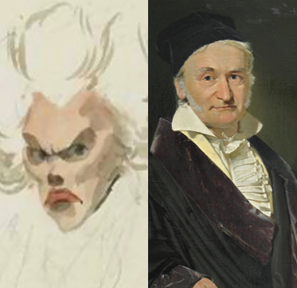
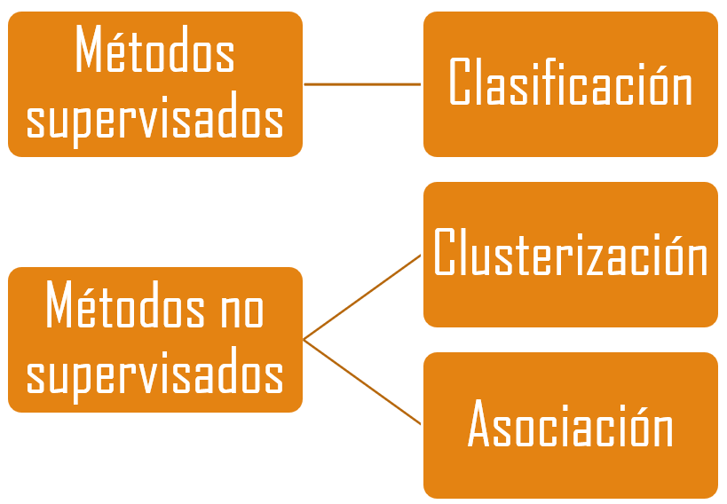
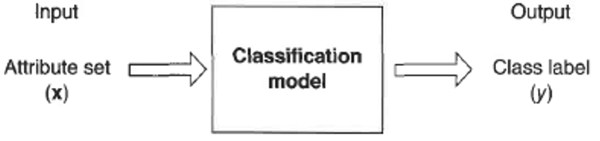
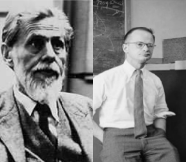
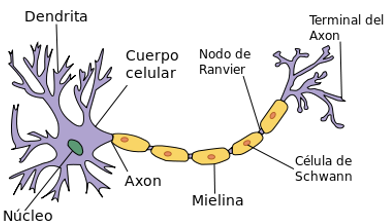
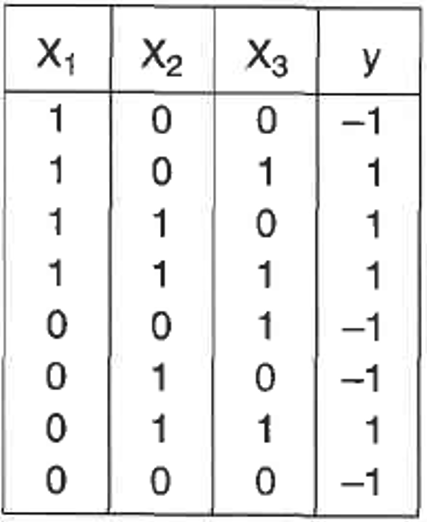
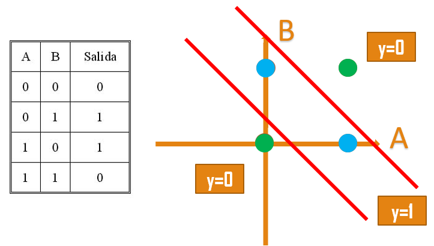
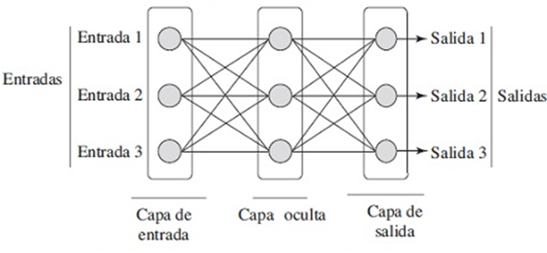
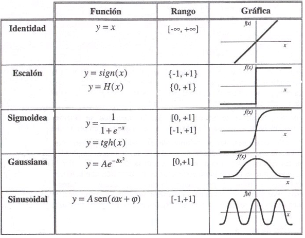

<!-- ::: watermark -->
<!--  -->
<!-- ::: -->


# Redes neuronales Lineales para Clasificación


## Modelos Lineales Generalizados

### Historia

**Regresión lineal**

```{r echo=FALSE, fig.align='left', out.width='50%'}

```
El primer método de regresión lineal documentado es el método de los mínimos cuadrados, publicado por Legendre en 1805. 
Posteriormente, Gauss publicó un trabajo donde se desarrolla con mayor detalle el tema.


**Modelo Lineal Generalizado (GLM)**

```{r echo=FALSE, fig.align='left', out.width='60%'}

```
Los GLM fueron formulados por John Nelder y Robert Wedderburn en 1972 como una manera de unificar modelos estadísticos.

Un modelo lineal generalizado es una generalización flexible de la regresión lineal ordinaria.

### Definición

Los Modelos Lineales Generalizados (GLM) son una extensión de los modelos lineales tradicionales que permiten modelar variables respuesta que no necesariamente siguen una distribución normal (por ejemplo, binarias, de conteo o proporciones). Relacionan la distribución aleatoria de la variable dependiente (variable objetivo) en el experimento, con la parte sistemática a través de una función llamada función de enlace.

Por lo tanto, un modelo lineal generalizado, tiene tres componentes  básicos:

- **Componente aleatorio** *(Y ~ Distribución de probabilidad)*: Identifica la variable de objetivo y su distribución de probabilidad.
- **Componente sistemática** *(𝜂 = xW)*: Especifica las variables explicativas de la función predictora lineal.
- **Función de enlace** *(𝑔(𝝁) = 𝜂)*: Es una función del valor esperado de Y como una combinación lineal de las variables explicativas

Algebraicamente:
$$
	𝔼(𝒀)=𝝁=𝑔^{−1}(WX)
$$

Los estudios de Wedderburn se limitaron los componentes aleatorios a la familia exponencial, cuya aplicación se puede dar de la siguiente manera:

- **Normal**: regresión lineal
- **Binomial**: regresión logística
- **Poisson**: regresión de conteo
- **Gamma**: regresión para tiempos o tasas positivas
- Inversa Gaussiana, etc.

| Distribución | Función de Enlace          | Nombre de modelo      |
|--------------|----------------------------|-----------------------|
| Normal       | g(μ) = μ                   | Regresión lineal      |
| Binomial     | g(μ) = log(μ /(1−μ))       | Regresión logística   |
| Poisson      | g(μ) = log(μ)              | Regresión de Poisson  |


Podemos apreciar una regresión logística como una neurona:
```{r echo=FALSE, fig.align='left', out.width='60%'}
knitr::include_graphics("img/04_Linear_Neural_Networks_for_Classification/fig18.png")
```


Haciendo uso de una regresión logística, podemos pasar de *how much?* a *wich class?*, el diagrama sería el siguiente:
```{r echo=FALSE, fig.align='left', out.width='60%'}
knitr::include_graphics("img/04_Linear_Neural_Networks_for_Classification/fig19.png")
```


## Regresión Logística para Clasificación

Iniciemos recordando que los algoritmos de Machine Learning pueden ser clasificados como:
```{r echo=FALSE, fig.align='left', out.width='40%'}

```

Los ***métodos de clasificación, métodos predictivos,  reconocimiento de patrones, aprendizaje supervisado*** son aquellos algoritmos en los cuales vamos a clasificar a los objetos en un conjunto de categorías previamente definidas.

En estos métodos existe una variable, conocida como variable objetivo con la cual se buscarán dos resultados:

- **Evidenciar** la razón por la cual existen las clases en cuestión, es decir, encontrar factores que puedan agrupar a los individuos en sus respectivos grupos.
- Proyectar el ingreso de **nuevos individuos** en alguna de las características anteriores.

**Definición**

La clasificación es la tarea de **aprender una función, f,** que pueda mapear cada conjunto de atributos a una categoría predefinida.
Busca predecir la clase a la cual pertenece un registro. 
La diferencia principal contra el análisis de conglomerados es el deseo de predecir a nuevos individuos.

Buscamos una función que vaya de D a C
$$
𝑓:𝐷→ Y
$$
Donde:

 - $𝐷={(𝑥_𝑖,𝑦_𝑖) | 𝑖=1,2,…,𝑁}$ es el conjunto de individuos, incluyendo $𝑥_𝑖$ corresponde a las características explicativas de un individuo y $𝑦_𝑖$ corresponde al valor de la clase
 - $Y={y _1,  y_2,…, y_𝑚}$ es el conjunto de clases.

La función resultante puede ser un árbol de decisión, SVM, etc.

La función que clasificará el conjunto X a la clase Y, comúnmente es llamada modelo de clasificación.
```{r echo=FALSE, fig.align='left', out.width='60%'}

```

Una vez recordado lo anterior, podemos definir a una regresión logística como un modelo en el cual se recibe una tabla relacional con *d* características descriptivas y una clase a la cual pertenece cada individuo de la tabla.

Como resultado, el modelo nos proporciona la *probabilidad de pertenecer* a alguna clase.

**Planteamiento del problema**

El primer paso, consistiría en construir el modelo de regresión, de tal forma que el componente aleatorio ($y_i$) se conecte con la componente sistémica (regresión lineal):
$$
𝑦_𝑖↔𝛽_0+𝛽_1 𝑥_𝑖+𝜖_𝑖
$$

---

Vamos a suponer un modelo de **regresión lineal clásica** de tal forma que:
$$
𝔼(𝑦_𝑖 | 𝑥_𝑖 )=𝛽_0+𝛽_1 𝑥_𝑖
$$
Al intentar buscar probabilidades a través de una regresión lineal, obtendríamos lo siguiente:

Sea $𝑝_𝑖$ la probabilidad de pertenecer a la clase 1 dadas las características del individuo:
$$
𝑝_𝑖=ℙ(𝑦=1|𝑥_𝑖 )
$$

Podemos asumir que $𝑝_𝑖$ sigue una distribución Bernoulli, de tal forma que su esperanza sea:
$$
𝔼(𝑦|𝑥_𝑖 )=𝑝_𝑖×1+(1−𝑝_𝑖 )×0=𝑝_𝑖
$$
De tal forma que:
$$
𝑝_𝑖= 𝛽_0+𝛽_1 𝑥_𝑖
$$
No obstante, los resultados pueden resultar absurdos debido a que nuestra fórmula nos puede proporcionar **probabilidades negativas** o **mayores a cero** $!$

---

Las probabilidades no tienen valores superiores a 1 ni negativas, pero el concepto de momios $p / (1-p)$ tiene como imagen de cero a infinito. La función exponencial tiene la misma imagen, entonces, la regresión logística relaciona ambos concpetos a través de la siguiente igualdad
$$
ℙ(𝑦=1|𝑥_𝑖 )/(1−ℙ(𝑦=1|𝑥_𝑖 ) )=𝑒^{(𝛽_0+𝛽_1 𝑥_𝑖 )}
$$
Al aplicar el logaritmo natual, podemos apreciar la definición de la función logit:
$$
logit[𝑝_𝑖 ]=ln[𝑝_𝑖/(1−𝑝_𝑖 )]=𝛽_0+𝛽_1 𝑥_𝑖
$$
Recordando que la función logit es la inversa de la función logistica (o sigmoide)

```{r echo=FALSE, fig.align='left', fig.width=6, fig.height=4}
library(ggplot2)

# Datos para la curva
x <- seq(-6, 6, length.out = 200)
y <- 1 / (1 + exp(-x))
data <- data.frame(x, y)

# Gráfico con ggplot2
ggplot(data, aes(x=x, y=y)) +
  geom_line(color="steelblue", linewidth=1.2) +
  labs(
    title = "Curva logística",
    x = "x",
    y = "f(x)"
  ) +
  theme_minimal(base_size=14)
```


## Redes neuronales

### Historia

**Redes Neuronales**

```{r echo=FALSE, fig.align='left', out.width='50%'}

```
En 1943 Warren McCulloch (neurocientífico, médico, neurólogo y fisiólogo) y Walter Pitts (matemático, psicólogo, filósofo y neurocientífico) crearon un modelo para redes neuronales basados en la lógica de umbral. Este modelo señaló el camino para que la investigación de redes neuronales se divida en dos enfoques distintos:

1. Un enfoque centrado en los procesos biológicos en el cerebro.
2. Otro en la aplicación de redes neuronales para la inteligencia artificial.

```{r echo=FALSE, fig.align='left', out.width='40%'}

```
Para la aplicación de la inteligencia artificial, fue Marvin Minsky quien dio una gran aportación con el libro **“Perceptrones”** en 1969.
Minsky es considerado como uno de los padres de las ciencias de la computación y fue cofundador del laboratorio de inteligencia artificial del MIT

### Definición

Las redes neuronales son algoritmos que tienen como objetivo el simular en una computadora la forma en la cual funcionan las redes neuronales en los humanos.
Puede recibir variables cuantitativas y cualitativas. Es un algoritmo sensible a cambios en los datos y parámetros

### Neurona

Célula del sistema nerviosos formada por un núcleo y una serie de prolongaciones, una de las cuales es más larga que las demás.
Están especializadas en la recepción de estímulos y conducción del impulso nerviosos entre ellas o con otros tipos celulares

```{r echo=FALSE, fig.align='left', out.width='60%'}

```

<br>

**Dentrita:** Es la fuente de un impulso nerviosos. De hecho el impulso nervioso es unidireccional, es decir, solamente se transmite desde las dendritas hacia el axón (canal de entrada)

**Axón:** Prolongación que arranca del cuerpo de la neurona y termina en una ramificación que está en contacto con otras células. Es la vía por la cual circulan los impulsos eléctricos (canal de salida)

**Sinapsis:** Región de comunicación entre el axón de una neurona y las dendritas o el cuerpo de otra

```{r echo=FALSE, fig.align='left', out.width='60%'}
knitr::include_graphics("img/04_Linear_Neural_Networks_for_Classification/fig8.png")
```

**Emulación:**

```{r echo=FALSE, fig.align='left', out.width='60%'}
knitr::include_graphics("img/04_Linear_Neural_Networks_for_Classification/fig9.png")
```

Las redes neuronales, tratan de modelar una red neuronal donde cada nodo es una neurona, y los arcos representan la sinapsis entre las neuronas. 
Como algoritmo, las redes neuronales reciben n entradas y pueden otorgar n salidas.

```{r echo=FALSE, fig.align='left', out.width='60%'}
knitr::include_graphics("img/04_Linear_Neural_Networks_for_Classification/fig10.png")
```

Un perceptrón puede entenderse como la unidad básica de inferencia en forma de discriminador lineal. Un perceptrón va a separar a los puntos a través de un hiperplano
Es el modelo biológico más sencillo hace referencia a una sola neurona. El perceptrón consiste de dos tipos de nodos:

- Nodos de entrada: ingreso de los atributos
- Nodos de salida: representa a los resultados del modelo

Un perceptrón genera sus resultados realizando una suma ponderada de sus atributos de entrada, restando un valor t y examinando el signo del resultado. 
Supongamos la siguiente tabla:

```{r echo=FALSE, fig.align='left', out.width='30%'}

```

El perceptrón sería aquella red neuronal que recibiera de entrada cada uno de los valores x y diera como resultado y

```{r echo=FALSE, fig.align='left', out.width='60%'}
knitr::include_graphics("img/04_Linear_Neural_Networks_for_Classification/fig12.png")
```

$$
y =
\begin{cases}
    \text{1, si:  } 0.3𝑥_1+0.3𝑥_1+0.3𝑥_1−0.4 ≥ 0 \\
    \text{-1, si:  } 0.3𝑥_1+0.3𝑥_1+0.3𝑥_1−0.4 < 0 \\
\end{cases}
$$
Como el resultado depende del signo, la función se representa como:
$$
𝑦=𝑠𝑖𝑔𝑛(𝑤,𝑥)
$$
Cuando intentamos hacer la separación de un XOr, podemos notar que necesitamos dos discriminadores lineales:

```{r echo=FALSE, fig.align='left', out.width='60%'}

```


### Redes Neuronales

Las redes neuronales, son una estructura más compleja que un perceptrón. Algunas de las complejidades son:

- Las redes neuronales tienen **varios nodos intermedios** entre los nodos de entrada y los nodos de salida.
- Las capas ocultas pueden utilizar **funciones de activación diferentes**

```{r echo=FALSE, fig.align='left', out.width='60%'}

```

```{r echo=FALSE, fig.align='left', out.width='60%'}
knitr::include_graphics("img/04_Linear_Neural_Networks_for_Classification/fig15.png")
```


Con una capa oculta, es posible generar una función de discriminación para una tabla XOr

```{r echo=FALSE, fig.align='left', out.width='60%'}
knitr::include_graphics("img/04_Linear_Neural_Networks_for_Classification/fig17.png")
```


**Funciones de activación comunes**

```{r echo=FALSE, fig.align='left', out.width='60%'}

```


## Notas adicionales {.unnumbered}
Curso de Git: https://www.youtube.com/watch?v=3GymExBkKjE&t=195s

