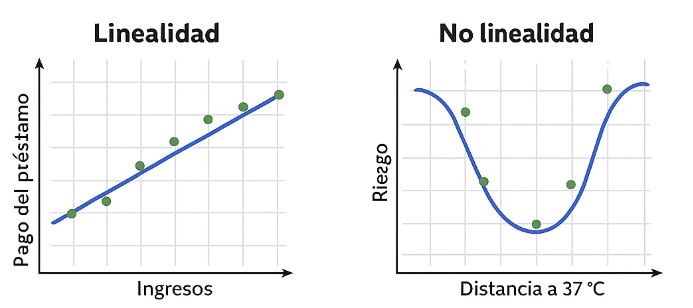
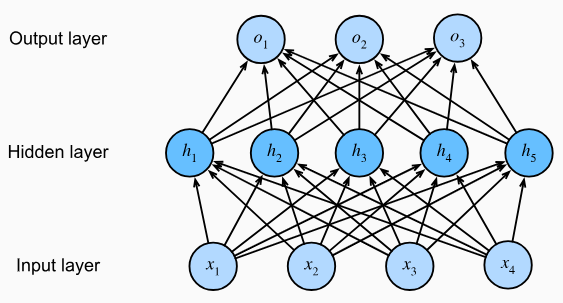
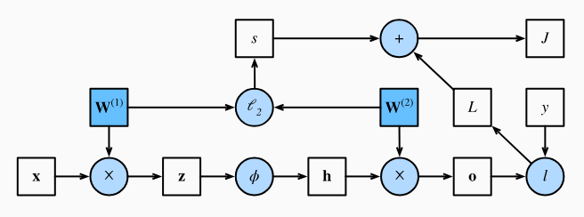
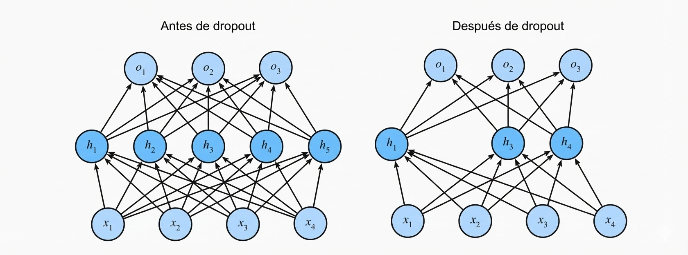
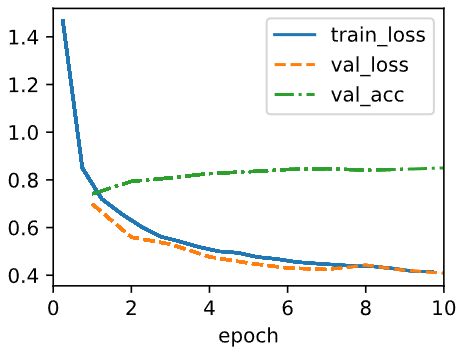

---
output:
  pdf_document: default
  html_document: default
---
<!-- ::: watermark -->
<!--  -->
<!-- ::: -->


# Perceptrón Multicapa

## Perceptrones multicapa

En la Sección anterior, se presentó la regresión softmax, implementando el algoritmo desde cero. Esto permitió entrenar clasificadores capaces de reconocer 10 categorías de prendas de vestir a partir de imágenes de baja resolución. Durante el proceso, aprendimos a manipular los datos, a convertir las salidas en una distribución de probabilidad válida, a aplicar una función de pérdida adecuada y a minimizarla con respecto a los parámetros del modelo. Ahora que se conocen estos aspectos en el contexto de modelos lineales simples, podemos comenzar la exploración de las redes neuronales profundas, la clase de modelos relativamente rica que constituye el tema principal de este curso.

### Capas ocultas

En la sección 3.1., se describen las transformaciones afines como transformaciones lineales con un sesgo añadido. Para empezar, recordemos la arquitectura del modelo correspondiente a nuestro ejemplo de regresión softmax, ilustrado en la figura 4.1.1. Este modelo asigna directamente las entradas a las salidas mediante una única transformación afín, seguida de una operación softmax. Si nuestras etiquetas estuvieran realmente relacionadas con los datos de entrada mediante una simple transformación afín, este enfoque sería suficiente. Sin embargo, la linealidad (en las transformaciones afines) es una suposición muy restrictiva.

```{r echo=FALSE, fig.align='center', out.height='300pt', out.width='650pt'}
knitr::include_graphics("img/04_Linear_Neural_Networks_for_Classification/fig15.png")
```

#### Limitaciones de los modelos lineales

La linealidad supone una relación monotónica: si una variable aumenta, la salida del modelo siempre sube o baja según el signo del peso. Esto a veces es razonable, como al predecir el pago de un préstamo según ingresos, aunque la relación no sea estrictamente lineal. En estos casos, funciones como la logística pueden hacer más plausible la linealidad.

Sin embargo, muchas relaciones reales no son monotónicas. Por ejemplo, la temperatura corporal: valores por encima o por debajo de 37 °C aumentan el riesgo, por lo que conviene transformar la variable (p. ej., usar la distancia a 37 °C).

```{r echo=FALSE, fig.align='center', out.height='300pt', out.width='650pt'}

```

En problemas como la clasificación de imágenes, la linealidad es claramente insuficiente: cambiar el brillo de un solo píxel no determina si hay un gato o un perro. Aquí el significado de cada píxel depende de su contexto, y no existe un preprocesamiento simple que lo capture. Las redes neuronales profundas resuelven esto aprendiendo simultáneamente una representación adecuada y un predictor lineal sobre esa representación.

La necesidad de modelar no linealidades se conoce desde hace un siglo y ha dado lugar a enfoques como árboles de decisión, métodos kernel, splines y, más recientemente, redes neuronales, inspiradas en las conexiones jerárquicas entre neuronas del cerebro.

#### Incorporación de Capas Ocultas

Para superar las limitaciones de los modelos lineales, podemos agregar capas ocultas. La idea más básica es apilar varias capas totalmente conectadas: cada capa envía su salida a la siguiente. Las primeras capas aprenden una representación de los datos y la última capa actúa como un modelo lineal sobre esa representación.

A esta arquitectura se le llama perceptrón multicapa o MLP.

Observa la siguiente imagen que contempla un MLP con 4 entradas, 1 capa oculta con 5 neuronas y 3 salidas. Como la capa de entrada no calcula nada, realmente el modelo tiene 2 capas de cálculo: la oculta y la de salida.

```{r echo=FALSE, fig.align='center', out.height='300pt', out.width='650pt'}

```

En un MLP, cada neurona de una capa está conectada con todas las neuronas de la siguiente. Es decir, cada entrada afecta a todas las neuronas ocultas, y cada una de estas afecta a todas las neuronas de salida.

#### De lo Lineal a lo No Lineal

Como antes, denotamos con la matriz $X \in \mathbb{R}^{n \times d}$ un minibatch de $n$ ejemplos, donde cada ejemplo tiene $d$ entradas (características). Para un MLP de una capa oculta cuya capa oculta tiene $h$ unidades ocultas, denotamos por $H \in \mathbb{R}^{n \times h}$ las salidas de la capa oculta, que son representaciones ocultas. Dado que las capas oculta y de salida están completamente conectadas, tenemos pesos de capas ocultas $W^{(1)} \in \mathbb{R}^{d \times h}$ y sesgos $b^{(1)} \in \mathbb{R}^{1 \times h}$ y pesos $W^{(2)} \in \mathbb{R}^{h \times q}$ y sesgos $b^{(2)} \in \mathbb{R}^{1 \times q}$ de la capa de salida. Esto nos permite calcular las salidas $O \in \mathbb{R}^{n \times q}$ del MLP de una capa oculta de la siguiente manera:

$$
H=XW^{(1)}+b^{(1)},
$$
$$
O=HW^{(2)}+b^{(2)}.
$$

::: {.infobox .important data-latex="{important}"}
**¡¡ RECORDATORIO !!**

Una función "Afín" está dada por: $f(x)=Ax+b$,

Mientras que una función lineal está dado por: $f(x)=Ax$
:::

Hay que tener en cuenta que, tras añadir la capa oculta, el modelo requiere que se rastree y actualicen conjuntos adicionales de parámetros. ¿Qué se ha ganado a cambio? Sorprendentemente, el modelo definido anteriormente, ¡NO GANA NADA! y la razón es sencilla. Las unidades ocultas anteriores se dan mediante una función afín de las entradas, y las salidas (pre-softmax) son simplemente una función afín de las unidades ocultas. La composición de funciones afines es todavía una función afín. Además, el modelo lineal ya era capaz de representar cualquier función afín.

Para verlo formalmente, se puede simplemente colapsar la capa oculta en la definición anterior, lo que genera un modelo equivalente de una sola capa con parámetros.

$$
W=W^{(1)}W^{(2)} \text{ and } b=b^{1}W^{(2)}+b^{(2)}:
$$
$$
O=(XW^{(1)}+b^{(1)})W^{(2)}+b^{(2)}=XW^{(1)}W^{(2)}+b^{(1)}W^{(2)}+b^{(2)}=XW+b
$$

Para aprovechar el potencial de las arquitecturas multicapa, se necesita un ingrediente clave adicional: **una función de activación no lineal** que se aplique a cada unidad oculta tras la transformación afín. na opción popular es la función de activación ReLU (unidad lineal rectificada) (Nair y Hinton, 2010) $\sigma(x)=max(0, x)$, que opera sobre sus argumentos elemento por elemento. Las salidas de las funciones de activación $\sigma(\cdot)$ se denominan **activaciones**. En general, con las funciones de activación establecidas, ya no es posible convertir el MLP en un modelo lineal:

$$
H=\sigma(XW^{(1)}+b^{(1)}),
$$
$$
O=HW^{(2)}+b^{(2)}.
$$

Dado que cada fila en $X$ corresponde a un ejemplo en el minibatch, con cierto abuso de notación, definimos la no linealidad $\sigma$ para aplicarla a sus entradas por filas, es decir, un ejemplo a la vez. Con frecuencia, las funciones de activación se aplican no solo por filas, sino también por elementos. Esto significa que, tras calcular la parte lineal de la capa, se calcula cada activación sin tener en cuenta los valores tomados por las demás unidades ocultas.

#### Aproximadores Universales

::: {.infobox .quicktip data-latex="{quicktip}"}
**¿Qué es un aproximador universal?**

Es un resultado teórico que dice que **una red neuronal con una sola capa oculta puede representar prácticamente cualquier función**, si tiene suficientes neuronas y parámetros.
:::

**Pero ojo:**

Que pueda representar cualquier función no significa que sea fácil aprenderla. Tener una sola capa oculta puede requerir muchísimas neuronas (algo poco práctico). A veces es mejor usar: métodos de kernels, cuando aplican, porque resuelven el problema de forma exacta; redes más profundas, que permiten representar las mismas funciones de manera más compacta y eficiente.

**Idea didáctica clave**

La profundidad importa. Con suficiente profundidad, una red puede aprender funciones complejas de forma más eficiente que una red muy ancha con una sola capa.

### Funciones de activación

Las funciones de activación determinan si una neurona debe activarse o no calculando la suma ponderada y agregándole un sesgo. Son operadores diferenciables que transforman señales de entrada en salidas, y la mayoría añade no linealidad. Dado que las funciones de activación son fundamentales para el aprendizaje profundo, se revisarán algunas de las más comunes.

#### Función ReLU

La opción más popular, debido tanto a su simplicidad de implementación como a su buen rendimiento en diversas tareas predictivas, es la unidad lineal rectificada (ReLU) (Nair y Hinton, 2010). ReLU proporciona una transformación no lineal muy simple. Dado un elemento , la función se define como el máximo de ese elemento y 0:

$$
ReLU(x)=max(x, 0).
$$

De manera informal, **la función ReLU conserva solo los elementos positivos y descarta todos los negativos** estableciendo las activaciones correspondientes a 0. Para una mayor comprensión, podemos representar gráficamente la función. Como se puede observar, la función de activación es lineal por partes.

```{python, fig.align='center'}
import torch
import matplotlib.pyplot as plt

# Datos
x = torch.arange(-8.0, 8.0, 0.1)
y = torch.relu(x)

# Gráfica
plt.figure(figsize=(5, 2.5))
plt.plot(x, y)
plt.xlabel("x")
plt.ylabel("ReLU(x)")
plt.title("Función de activación ReLU")
plt.grid(True)
plt.show()
```

Cuando la entrada es negativa, la derivada de la función ReLU es 0, y cuando la entrada es positiva, la derivada de la función ReLU es 1. Nótese que la función ReLU no es diferenciable cuando la entrada toma valor exactamente igual a 0. En estos casos, se usa por defecto la derivada del lado izquierdo y decimos que la derivada es 0 cuando la entrada es 0. Podemos evitar esto porque la entrada puede que nunca sea realmente cero (los matemáticos dirían que no es diferenciable en un conjunto de medida cero). Hay un viejo adagio que dice que si las condiciones de contorno sutiles importan, probablemente estemos haciendo matemáticas (reales), no ingeniería. Esa sabiduría convencional puede aplicarse aquí, o al menos, el hecho de que no estamos realizando optimización restringida (Mangasarian, 1965, Rockafellar, 1970). se traza la derivada de la función ReLU a continuación.

```{python, fig.align='center'}
x = torch.arange(-8.0, 8.0, 0.1, requires_grad=True)
y = torch.relu(x)

y.backward(torch.ones_like(x))

plt.figure(figsize=(5, 2.5))
plt.plot(x.detach(), x.grad)
plt.xlabel('x')
plt.ylabel('grad ReLU(x)')
plt.title('Derivada de ReLU')
plt.grid(True)
plt.show()
```

La razón para usar ReLU es que sus derivadas se comportan particularmente bien: o se anulan o simplemente dejan pasar el argumento. Esto mejora el comportamiento de la optimización y mitiga el problema bien documentado de los gradientes evanescentes que afectaba a versiones anteriores de redes neuronales (más sobre esto más adelante).

Cabe destacar que existen muchas variantes de la función ReLU, incluyendo la función ReLU parametrizada (pReLU) (He et al., 2015). Esta variación añade un término lineal a ReLU, por lo que parte de la información se transmite, incluso cuando el argumento es negativo:

$$
pReLU(x)=max(0,x)+\alpha \cdot min(0,x).
$$

#### Función Sigmoide

La función sigmoidea transforma las entradas cuyos valores se encuentran en el dominio $\mathbb{R}$, en salidas que se encuentran en el intervalo (0, 1). Por esta razón, la función sigmoidea suele denominarse función de aplastamiento (*squashing function*): aplasta cualquier entrada en el rango (-inf, inf) a un valor en el rango (0, 1):

$$
\text{sigmoid}(x)=\frac{1}{1+\text{exp}(-x)}
$$

A continuación, se grafica la función sigmoidea. Nótese que cuando la entrada se acerca a 0, la función sigmoidea se aproxima a una transformación lineal.

```{python, fig.align='center'}
x = torch.arange(-8.0, 8.0, 0.1)
y = torch.sigmoid(x)

plt.figure(figsize=(5, 2.5))
plt.plot(x.detach(), y.detach())
plt.xlabel("x")
plt.ylabel("sigmoid(x)")
plt.title("Función Sigmoid")
plt.grid(True)
plt.show()
```

La derivada de la función sigmoide está dada por la siguiente ecuación:

$$
\frac{d}{dx}\text{sigmoid}(x)=\frac{\text{exp(-x)}}{(1+\text{exp}(-x))^2}=\text{sigmoid}(x)(1-\text{sigmoid}(x))
$$

La derivada de la función sigmoidea se grafica a continuación. Nótese que cuando la entrada es 0, la derivada de la función sigmoidea alcanza un máximo de 0,25. A medida que la entrada diverge de 0 en cualquier dirección, la derivada tiende a 0.

```{python, fig.align='center'}
# Definir x con gradientes
x = torch.arange(-8.0, 8.0, 0.1, requires_grad=True)
y = torch.sigmoid(x)

# Borrar gradientes previos (si los hubiera)
if x.grad is not None:
    x.grad.zero_()

# Backprop para obtener la derivada
y.backward(torch.ones_like(x), retain_graph=True)

# Graficar
plt.figure(figsize=(5, 2.5))
plt.plot(x.detach(), x.grad.detach())
plt.xlabel("x")
plt.ylabel("grad sigmoid(x)")
plt.title("Derivada de la función Sigmoid")
plt.grid(True)
plt.show()
```

#### Función Tanh

Al igual que la función sigmoidea, la función tangente hiperbólica también reduce sus valores de entrada, transformándolos en elementos del intervalo entre -1 y 1.

$$
\text{tanh}(x)=\frac{1-\text{exp}(-2x)}{1+\text{exp}(-2x)}
$$

Nótese que, a medida que la entrada se acerca a 0, la función tanh se aproxima a una transformación lineal. Aunque la forma de la función es similar a la de la función sigmoidea, la función tanh presenta **simetría puntual respecto al origen** del sistema de coordenadas (Kalman y Kwasny, 1992).

```{python, fig.align='center'}
# Datos
x = torch.arange(-8.0, 8.0, 0.1)
y = torch.tanh(x)

# Gráfica
plt.figure(figsize=(5, 2.5))
plt.plot(x.detach(), y.detach())
plt.xlabel("x")
plt.ylabel("tanh(x)")
plt.title("Función tanh")
plt.grid(True)
plt.show()
```

La derivada de la función *tanh* es:

$$
\frac{d}{dx}\text{tanh}(x)=1-\text{tanh}^{2}(x)
$$

A medida que la entrada se acerca a 0, la derivada de la función *tanh* se acerca a un máximo de 1. Y, como se vio con la función sigmoidea, a medida que la entrada se aleja de 0 en cualquier dirección, la derivada de la función *tanh* se acerca a 0.

```{python, fig.align='center'}
# Definir x con gradientes activados
x = torch.arange(-8.0, 8.0, 0.1, requires_grad=True)
y = torch.tanh(x)

# Borrar gradientes anteriores
if x.grad is not None:
    x.grad.zero_()

# Backprop para obtener la derivada
y.backward(torch.ones_like(x), retain_graph=True)

# Graficar la derivada
plt.figure(figsize=(5, 2.5))
plt.plot(x.detach(), x.grad.detach())
plt.xlabel("x")
plt.ylabel("grad tanh(x)")
plt.title("Derivada de la función tanh")
plt.grid(True)
plt.show()
```

### Discusión

Ahora sabemos cómo incorporar **no linealidades** para construir arquitecturas expresivas de redes neuronales multicapa. Una ventaja de la función ReLU es que es significativamente más fácil de optimizar que la función sigmoidea o la función tanh. Se podría argumentar que esta fue una de las innovaciones clave que impulsaron el resurgimiento del aprendizaje profundo en la última década. 

Cabe destacar, sin embargo, que la investigación en funciones de activación no se ha detenido. Por ejemplo, la función de activación GELU (unidad lineal de error gaussiano) $x\phi(x)$ de Hendrycks y Gimpel (2016) $\phi(x)$ (es la función de distribución acumulativa gaussiana estándar) y la función de activación *Swish* $\sigma(x)=x\cdot\text{sigmoid}(\beta x)$, propuesta por Ramachandran et al. (2017), pueden ofrecer una mayor precisión en muchos casos.

### Ejercicios

1. Demuestre que añadir capas a una red lineal profunda, es decir, una red sin no linealidad $\sigma$, nunca puede aumentar su potencia expresiva. Dé un ejemplo donde la reduzca activamente.

2. Calcule la derivada de la función de activación pReLU.

3. Calcule la derivada de la función de activación Swish $x\cdot \text{sigmoid}(\beta x)$.

4. Demuestre que una MLP que utiliza solo ReLU (o pReLU) construye una función lineal continua por partes.

5. Sigmoid y tanh son muy similares.

* Demuestre que $\text{tanh}(x)+1 = 2\text{sigmoid}(2x)$.

* Demuestre que las clases de función parametrizadas por ambas no linealidades son idénticas. Pista: las capas afines también tienen términos de sesgo.

6. Suponga que tenemos una no linealidad que se aplica a un minibatch a la vez, como la normalización por lotes (Ioffe y Szegedy, 2015). ¿Qué tipo de problemas espera que esto cause?

7. Dé un ejemplo donde los gradientes se anulen para la función de activación sigmoide.


## Implementación de Perceptrones Multicapa

Los perceptrones multicapa (MLP) no son mucho más complejos de implementar que los modelos lineales simples. La diferencia conceptual clave radica en que ahora se concatenan múltiples capas.

### Implementación desde Cero

Comencemos de nuevo implementando dicha red desde cero.

#### Inicialización de parámetros del modelo

El conjunto de datos **Fashion-MNIST** contiene 10 clases de imágenes y cada imagen consiste en una cuadrícula de valores de píxeles en escala de grises. Como antes, por ahora ignoraremos la estructura espacial entre los píxeles, por lo que podemos considerarlo como un conjunto de datos de clasificación con 784 características de entrada y 10 clases. Para comenzar, implementaremos un MLP con una capa oculta y 256 unidades ocultas. Tanto el número de capas como su ancho son ajustables (se consideran hiperparámetros). 

::: {.infobox .quicktip data-latex="{quicktip}"}
**Tip:**

Normalmente, se busca que **el ancho de las capas (número de neuronas) sea divisible por potencias mayores de 2**, es decir: 4, 8, 16, 32, 64, 128, 256, 512, etc. Esto es computacionalmente eficiente debido a que las GPUs trabajan internamente con bloques de tamaño 32 y potencias de 2, haciendo que esos anchos sean:

* Más rápidos
* Más fáciles de paralelizar
* Más eficientes en memoria
:::

De nuevo, representaremos nuestros parámetros con varios tensores. Tenga en cuenta que, para cada capa, debemos registrar una matriz de ponderación y un vector de sesgo. Es importante tomar en cuenta la asignación de memoria para los gradientes de pérdida con respecto a estos parámetros.

```{python}
import torch
from torch import nn
import matplotlib.pyplot as plt
import inspect

class Module(nn.Module):
    def __init__(self):
        super().__init__()
        self.metrics = {}

    def save_hyperparameters(self, ignore=[]):
        frame = inspect.currentframe().f_back
        _, _, _, local_vars = inspect.getargvalues(frame)
        for k, v in local_vars.items():
            if k not in ignore and k != "self":
                setattr(self, k, v)

    def plot(self, name, value, train=True):
        """Guarda valores para graficarlos al final."""
        key = f"{name}_{'train' if train else 'val'}"
        if key not in self.metrics:
            self.metrics[key] = []
        self.metrics[key].append(value)


    def forward(self, X):
        raise NotImplementedError("Define forward() in subclass")


class Classifier(Module):
    def loss(self, y_hat, y):
        return nn.CrossEntropyLoss()(y_hat, y)

    def accuracy(self, y_hat, y):
        preds = y_hat.argmax(dim=1)
        return (preds == y).float().mean()

    # def train_step(self, batch):
    #     X, y = batch
    #     y_hat = self.forward(X)
    #     loss = self.loss(y_hat, y)
    # 
    #     # backprop
    #     self.optimizer.zero_grad()
    #     loss.backward()
    #     self.optimizer.step()
    # 
    #     return loss.item(), self.accuracy(y_hat, y).item()
       
    def evaluation_step(self, X, y):
        with torch.no_grad():
            y_hat = self(X)
            return (
                self.loss(y_hat, y).item(),
                self.accuracy(y_hat, y).item(),
            )


# ------ Decorador para agregar métodos ------
def add_to_class(cls):
    def decorator(fn):
        setattr(cls, fn.__name__, fn)
        return fn
    return decorator

```

En el código siguiente usamos nn.Parameter para registrar automáticamente un atributo de clase como un parámetro que será rastreado por autograd.

```{python}
class MLPScratch(Classifier):
    def __init__(self, num_inputs, num_outputs, num_hiddens, lr, sigma=0.01):
        super().__init__()
        self.save_hyperparameters()
        self.lr = lr

        self.W1 = nn.Parameter(torch.randn(num_inputs, num_hiddens) * sigma)
        self.b1 = nn.Parameter(torch.zeros(num_hiddens))
        
        self.W2 = nn.Parameter(torch.randn(num_hiddens, num_outputs) * sigma)
        self.b2 = nn.Parameter(torch.zeros(num_outputs))

```

#### Modelo

Para asegurarnos de que sabemos cómo funciona todo, implementaremos la activación de ReLU nosotros mismos en lugar de invocar directamente la función relu incorporada.

```{python}
def relu(X):
    a = torch.zeros_like(X)
    return torch.max(X, a)

```

Como ignoramos la estructura espacial, transformamos cada imagen bidimensional en un vector plano de longitud num_inputs. Finalmente, implementamos nuestro modelo con solo unas pocas líneas de código. Como usamos el framework autograd integrado, esto es todo lo que necesitamos.

```{python}
# Añadir método usando el decorador
@add_to_class(MLPScratch)
def forward(self, X):
    X = X.reshape((-1, self.num_inputs))
    H = relu(torch.matmul(X, self.W1) + self.b1)
    O = torch.matmul(H, self.W2) + self.b2
    return O

```

#### Entrenamiento

Afortunadamente, el ciclo de entrenamiento para las MLP es exactamente el mismo que para la regresión softmax. Definimos el modelo, los datos y el entrenador, y finalmente invocamos el método de ajuste en el modelo y los datos.

Primero, unas clases auxiliares:

##### DataLoader: {-}

```{python}
from torch.utils.data import DataLoader
from torchvision import datasets, transforms

class FashionMNISTData:
    def __init__(self, batch_size=256):
        self.batch_size = batch_size
        self.transform = transforms.ToTensor()

        self.train = datasets.FashionMNIST(
            root="./data", train=True, download=True, transform=self.transform
        )
        self.test = datasets.FashionMNIST(
            root="./data", train=False, download=True, transform=self.transform
        )

        self.train_loader = DataLoader(self.train, batch_size=batch_size, shuffle=True)
        self.test_loader = DataLoader(self.test, batch_size=batch_size)

    def __iter__(self):
        return iter(self.train_loader)

    def __len__(self):
        return len(self.train_loader)

```

##### Trainer minimalista {-}

```{python}
class Trainer:
    def __init__(self, max_epochs=10):
        self.max_epochs = max_epochs

    def fit(self, model, data):
        model.metrics = {}
        optimizer = torch.optim.SGD(model.parameters(), lr=model.lr)

        # Asegura que exista test_loader
        if not hasattr(data, "test_loader"):
            raise ValueError("El dataset debe tener data.test_loader para validación")
        
        for epoch in range(self.max_epochs):
            total_loss, total_acc, count = 0, 0, 0
            
            for X, y in data:
                optimizer.zero_grad()
                y_hat = model(X)
                loss = model.loss(y_hat, y)
                loss.backward()
                optimizer.step()

                total_loss += loss.item() * X.size(0)
                total_acc += model.accuracy(y_hat, y).item() * X.size(0)
                count += X.size(0)
                
            # Al final de cada epoch: guardar promedios de entrenamiento
            model.plot("loss", total_loss / count, train=True)
            model.plot("acc", total_acc / count, train=True)

            # ---------- VALIDACIÓN ----------
            val_loss, val_acc, val_count = 0, 0, 0
            for X, y in data.test_loader:
                l, a = model.evaluation_step(X, y)
                val_loss += l * X.size(0)
                val_acc += a * X.size(0)
                val_count += X.size(0)
            
            # guardar métricas de validación por epoch
            model.plot("loss", val_loss / val_count, train=False)
            model.plot("acc", val_acc / val_count, train=False)
            
            # -------- PRINT FULL METRICS --------
            print(
                f"Epoch {epoch+1}: "
                f"train_loss={total_loss/count:.3f}, "
                f"val_loss={val_loss/val_count:.3f}, "
                f"train_acc={total_acc/count:.3f}, "
                f"val_acc={val_acc/val_count:.3f}"
            )
            
        # Al final → graficar exactamente como el libro
        self._plot_metrics(model)

    def _plot_metrics(self, model):
        metrics = model.metrics
        
        n = len(metrics["loss_train"])
        epochs = range(n)
    
        plt.plot(epochs, metrics["loss_train"], label="train_loss")
        #plt.plot(epochs, metrics["loss_val"], label="val_loss")
        plt.plot(epochs, metrics["acc_train"], label="train_acc")
        plt.plot(epochs, metrics["acc_val"], label="val_acc")
    
        plt.xlabel("epoch")
        plt.legend()
        plt.title("Training and Validation Metrics")
        plt.show()
        
        plt.clf()       # Limpia la figura actual
        plt.close()

```


```{python}
# Crear modelo
model = MLPScratch(
    num_inputs=784,
    num_outputs=10,
    num_hiddens=256,
    lr=0.1
)

# Cargar datos (reemplaza d2l.FashionMNIST)
data = FashionMNISTData(batch_size=256)
```


```{python, eval=T}
trainer = Trainer(max_epochs=10)
#trainer.fit(model, data)
```

### Implementación

La implementación pasada es bastante útil para entender cómo funciona el modelo, no obstante, al implementar las API de alto nivel, podemos crear MLP de forma aún más concisa.

#### Modelo

En comparación con la implementación concisa de la regresión softmax, la única diferencia radica en que se añaden dos capas completamente conectadas donde antes solo se añadía una. La primera es la capa oculta y la segunda, la capa de salida.

```{python}
class MLP(Classifier):
    def __init__(self, num_outputs, num_hiddens, lr):
        super().__init__()
        self.save_hyperparameters()
        self.net = nn.Sequential(
            nn.Flatten(), 
            nn.LazyLinear(num_hiddens),
            nn.ReLU(), 
            nn.LazyLinear(num_outputs)
        )

    def forward(self, X):
        return self.net(X)

```

Anteriormente, definimos métodos **forward** para que los modelos transformen la entrada utilizando los parámetros del modelo. Estas operaciones son esencialmente una secuencia: se toma una entrada y se aplica una transformación (por ejemplo, multiplicación de matrices con pesos seguida de la adición de sesgos), y luego se utiliza repetidamente la salida de la transformación actual como entrada para la siguiente transformación. Sin embargo, es posible notar que aquí no se define ningún método **forward**. 

De hecho, MLP hereda el método de *forward* de la clase Module para simplemente invocar self.net(X) (X es la entrada), que ahora se define como una secuencia de transformaciones mediante la clase *Sequential*. La clase *Sequential* abstrae el proceso de avance (forward), lo que nos permite centrarnos en las transformaciones. Analizaremos con más detalle el funcionamiento de la clase *Sequential* en secciones posteriores.

#### Entrenamiento

El ciclo de entrenamiento es exactamente el mismo que cuando implementamos la regresión softmax. Esta modularidad permite separar los aspectos relacionados con la arquitectura del modelo de las consideraciones ortogonales.

```{python}
model = MLP(num_outputs=10, num_hiddens=256, lr=0.1)
#trainer.fit(model, data)

```

### Ejercicios

1. Cambie el número de unidades ocultas num_hiddens y grafique cómo su número afecta la precisión del modelo. ¿Cuál es el mejor valor para este hiperparámetro?

2. Intente añadir una capa oculta para ver cómo afecta a los resultados.

3. ¿Por qué es una mala idea insertar una capa oculta con una sola neurona? ¿Qué podría salir mal?

4. ¿Cómo altera los resultados el cambio de la tasa de aprendizaje? Con todos los demás parámetros fijos, ¿qué tasa de aprendizaje ofrece los mejores resultados? ¿Cómo se relaciona esto con el número de épocas?

5. Optimicemos todos los hiperparámetros conjuntamente: tasa de aprendizaje, número de épocas, número de capas ocultas y número de unidades ocultas por capa.

 * ¿Cuál es el mejor resultado que se puede obtener optimizando todos ellos?
 * ¿Por qué es mucho más difícil gestionar varios hiperparámetros?
 * Describa una estrategia eficiente para optimizar varios parámetros conjuntamente.

6. Compare la velocidad del framework y la implementación desde cero para un problema complejo. ¿Cómo cambia con la complejidad de la red?

7. Mide la velocidad de las multiplicaciones tensor-matriz para matrices bien alineadas y desalineadas. Por ejemplo, prueba matrices con dimensiones 1024, 1025, 1026, 1028 y 1032.

 * ¿Cómo cambia esto entre GPU y CPU?
 * Determina el ancho del bus de memoria de tu CPU y GPU.

8. Prueba diferentes funciones de activación. ¿Cuál funciona mejor?

9. ¿Existe alguna diferencia entre las inicializaciones de peso de la red? ¿Tiene importancia?


## Forward Propagation, Backward Propagation

Hasta ahora hemos entrenado redes con descenso de gradiente usando minibatches, pero siempre confiando en que el framework calcule los gradientes por nosotros. Gracias a la diferenciación automática, no necesitamos derivar a mano expresiones complicadas, como se hacía antes en los artículos académicos.

Pero para entender realmente cómo aprenden las redes, es importante saber qué ocurre detrás de escena. Por eso, en esta sección vamos a estudiar backpropagation, el mecanismo que calcula cómo cambia cada parámetro según el error cometido. Usaremos matemáticas básicas y grafos computacionales, trabajando con un ejemplo sencillo: un MLP de una capa oculta con regularización (weight decay $l_2$). Esto nos permitirá entender no sólo el qué, sino el cómo del aprendizaje profundo.


### Forward Propagation

La propagación hacia adelante (forward propagation o pase hacia adelante) se refiere al cálculo y almacenamiento de variables intermedias (incluidas las salidas) para una red neuronal, desde la capa de entrada hasta la capa de salida. A continuación, se explica paso a paso la mecánica de una red neuronal con una capa oculta. 

Para simplificar, supongamos que el ejemplo de entrada es $x\in \mathbb{R}^{d}$ y que nuestra capa oculta no incluye un término de sesgo. En este caso, la variable intermedia es:

$$\mathbb{z}=W^{(1)}x,$$

donde $W^{(1)} \in \mathbb{R}^{h\times d}$ es el peso del parámetro de las capas ocultas. Luego de ejecutar la variable intermedia $z\in \mathbb{R}^{h}$ a través de la función de activación $\phi$, se obtiene el vector de activación oculto de longitud $h$:

$$h=\phi(z).$$

La salida de la capa oculta $h$ también es una variable intermedia. Suponiendo que los parámetros de la capa de salida solo tienen un peso de $W^{(2)}\in \mathbb{R}^{q\times h}$, se puede obtener una variable de capa de salida con un vector de longitud $q$:

$$\mathbb{o}=W^{(2)}h$$

Asumiendo que la función de pérdida es $l$ y la etiqueta de ejemplo es $y$, se puede calcular el término de pérdida para un solo ejemplo de datos,

$$L=l(o,y)$$

Como veremos en la definición de regularización ($l_2$) que se presentará más adelante, dado el hiperparámetro $\lambda$, el término de regularización es:

$$s=\frac{\lambda}{2} \left(||W^{(1)}||^{2}_{F}+||W^{(2)}||^{2}_{F} \right),$$

Donde la *norma de Frobenius* de la matriz es simplemente la norma $l_2$ aplicada tras aplanar la matriz a un vector. Finalmente, la pérdida regularizada del modelo en un ejemplo de datos dado es:

$$J=L+s.$$

Refiriéndose a $J$ como la *función objetivo* en la siguiente discusión. A continuación se muestra el flujo computacional del proceso **Forward**.

```{r echo=FALSE, fig.align='center', out.height='300pt', out.width='650pt', fig.cap = "Computational graph of forward propagation of Dive into Deep Learning Book"}

```


### Backpropagation

La retropropagación se refiere al método para calcular el gradiente de los parámetros de una red neuronal. En resumen, el método recorre **la red en orden inverso**, desde la capa de salida hasta la de entrada, según la **regla de la cadena** del cálculo. El algoritmo almacena las variables intermedias (derivadas parciales) necesarias para calcular el gradiente con respecto a algunos parámetros. Supongamos que tenemos funciones $Y=f(X)$ y $Z=g(Y)$, donde la entrada y la salida $X, Y, Z$ son tensores de formas arbitrarias. Utilizando la regla de la cadena, podemos calcular la derivada de $Z$ con respecto a $X$ mediante:

$$\frac{\partial Z}{\partial X} = \text{prod} \left( \frac{\partial Z}{\partial Y}, \frac{\partial Y}{\partial X} \right)$$

Aquí usamos el operador $prod$ para multiplicar sus argumentos después de realizar las operaciones necesarias, como la transposición y el intercambio de posiciones de entrada. Para vectores, esto es sencillo: se trata simplemente de una multiplicación matriz-matriz. Para tensores de mayor dimensión, usamos el operador correspondiente. El operador $prod$ elimina toda la sobrecarga de notación.

```{r echo=FALSE, fig.align='center', out.height='300pt', out.width='650pt'}
knitr::include_graphics("img/05_Multilayer_Perceptron/Gradient_descent.gif")
```

El objetivo de la retropropagación es calcular los gradientes $\frac{\partial J}{\partial W^{(1)}}$ y $\frac{\partial J}{\partial W^{(2)}}$. Para ello, aplicamos la regla de la cadena y calculamos, a su vez, el gradiente de cada variable y parámetro intermedio. El orden de los cálculos se invierte con respecto a los realizados en la propagación hacia adelante, ya que debemos comenzar con el resultado del grafo computacional y avanzar hacia los parámetros. El primer paso es calcular los gradientes de la función objetivo $J=L+s$ con respecto al término de pérdida $L$ y al término de regularización $s$:

$$
\frac{\partial J}{\partial L} = 1 \quad \text{and} \quad\frac{\partial J}{\partial s}=1
$$
A continuación, calculamos el gradiente de la función objetivo con respecto a la variable de la capa de salida $o$ según la regla de la cadena:

$$
\frac{\partial J}{\partial o}=\text{prod}\left( \frac{\partial J}{\partial L}, \frac{\partial L}{\partial o} \right) = \frac{\partial J}{\partial o}\in \mathbb{R}^{q}.
$$
A continuación, calculamos los gradientes del término de regularización con respecto a ambos parámetros:

$$
\frac{\partial s}{\partial W^{(1)}}=\lambda W^{(1)} \quad and \quad \frac{\partial s}{\partial W^{(2)}}=\lambda W^{(2)}
$$
Ahora podemos calcular el gradiente $\frac{\partial J}{\partial W^{(2)}}$ de los parámetros del modelo más cercanos a la capa de salida. Usando la regla de la cadena obtenemos:

$$
\frac{\partial J}{\partial W^{(2)}}=prod\left(\frac{\partial J}{\partial o}, \frac{\partial o}{\partial W^{(2)}}\right)+prod\left(\frac{\partial J}{\partial s}, \frac{\partial s}{\partial W^{(2)}}\right)=\frac{\partial J}{\partial o}h^{T}+\lambda W^{(2)}
$$

Para obtener el gradiente con respecto a $W^{(1)}$, necesitamos continuar la retropropagación a lo largo de la capa de salida hasta la capa oculta. El gradiente con respecto a la salida de la capa oculta $\frac{\partial J}{\partial h}\in \mathbb{R}^{h}$ está dado por:

$$
\frac{\partial J}{\partial h}=prod\left(\frac{\partial J}{\partial o}, \frac{\partial o}{\partial h}\right)=W^{(2)^{T}}\frac{\partial J}{\partial o}
$$
Dado que la función de activación $\phi$ se aplica elemento por elemento, para calcular el gradiente $\frac{\partial J}{\partial z} \in \mathbb{R}^{h}$ de la variable intermedia $z$ es necesario utilizar el operador de multiplicación elemento por elemento, que denotamos como $\odot$:

$$
\frac{\partial J}{\partial z}=prod\left(\frac{\partial J}{\partial h}, \frac{\partial h}{\partial z}\right)=\frac{\partial J}{\partial h}\odot\phi^{\prime}(z).
$$
Finalmente, podemos obtener el gradiente $\frac{\partial J}{\partial W^{(1)}}\in \mathbb{R}^{h\times d}$ de los parámetros del modelo más cercanos a la capa de entrada. Según la regla de la cadena, obtenemos:

$$
\frac{\partial J}{\partial W^{(1)}}=prod\left(\frac{\partial J}{\partial z}, \frac{\partial z}{\partial W^{(1)}}\right)+prod\left(\frac{\partial J}{\partial s}, \frac{\partial s}{\partial W^{(1)}}\right)=\frac{\partial J}{\partial z}x^{T}+\lambda W^{(1)}
$$

Al entrenar redes neuronales, la propagación hacia adelante y la retropropagación se necesitan mutuamente. En la fase hacia adelante se recorre el grafo computacional según sus dependencias y se calculan variables intermedias que luego serán reutilizadas en la retropropagación.

En una red simple, por ejemplo, el término de regularización depende de los parámetros actuales $W^{(1)}$ y $W^{(2)}$, actualizados previamente mediante retropropagación. A su vez, el cálculo de gradientes en la retropropagación depende de valores generados hacia adelante, como la salida oculta $h&.

En resumen, el entrenamiento alterna continuamente entre ambas fases: la propagación hacia adelante produce valores intermedios, la retropropagación usa esos valores para obtener gradientes y actualizar parámetros, y esos parámetros actualizados se usan en la siguiente pasada hacia adelante. Esto requiere almacenar los valores intermedios hasta que termine la retropropagación.

### Resumen

La propagación hacia adelante calcula, paso a paso, las variables intermedias del grafo computacional de la red, avanzando desde la entrada hasta la salida. La retropropagación hace lo mismo pero en sentido inverso: calcula y almacena los gradientes de esas variables y de los parámetros.

Durante el entrenamiento, ambas fases dependen una de la otra, por lo que se necesita mucha más memoria que en la simple fase de predicción.

### Ejercicios

1. Suponga que las entradas $X$ de una función escalar $f$ son matrices $n \times m$. ¿Cuál es la dimensionalidad del gradiente $f$ de con respecto a $X$?

2. Agregue un sesgo a la capa oculta del modelo descrito en esta sección (no es necesario incluirlo en el término de regularización).

    * Dibuje el grafo computacional correspondiente.
    * Obtenga las ecuaciones de propagación hacia adelante y hacia atrás.

3. Calcule la huella de memoria para el entrenamiento y la predicción en el modelo descrito en esta sección.

4. Suponga que desea calcular las derivadas secundarias. ¿Qué ocurre con el grafo computacional? ¿Cuánto tiempo espera que tarde el cálculo?

5. Suponga que el grafo computacional es demasiado grande para su GPU.

    * ¿Puede particionarlo en más de una GPU?
    * ¿Cuáles son las ventajas y desventajas del entrenamiento en un minibatch más pequeño?


## Estabilidad Numérica e Inicialización

Hasta ahora, todos los modelos que hemos visto necesitaban **inicializar sus parámetros usando alguna distribución predefinida**. Hemos pasado por alto cómo se eligen realmente estos valores, lo que podría dar la impresión de que no importa demasiado. Pero en realidad, la forma de inicializar los parámetros es clave para que una red neuronal aprenda bien y mantenga la estabilidad numérica.

::: {.infobox .note data-latex="{note}"}
**¡¡ RECORDAR !!**

la forma de inicializar los parámetros es clave para que una red neuronal aprenda bien y mantenga la estabilidad numérica.
:::

Además, la inicialización está estrechamente relacionada con la función de activación elegida. **Ambas decisiones influyen en qué tan rápido converge el algoritmo de optimización**. Una mala combinación puede provocar problemas típicos como gradientes que explotan o desaparecen (exploding or vanishing).

En esta sección exploraremos estos temas con más detalle y veremos reglas prácticas que resultan muy útiles al trabajar con deep learning.


### Explotación y Desvanecimiento de Gradientes

Considera una red neuronal con $L$ capas, entrada $x$ y salida $o$. Con cada capa $l$ definida por la transformación $f_l$ parametrizada por los pesos $W^{(l)}$, cuya capa oculta de salida es $h^{(l)}$ (siendo $h^{(0)}=x$), la red puede ser expresada como:

$$
h^{(l)}=f_l(h^{(l-1)}) \quad \text{y entonces} \quad o=f_L \circ \cdot \cdot \cdot \circ f_{1}(x) 
$$
Si la salida y la entrada de la capa oculta son vectores, podemos escribir el gradiente de $o$ con respecto a cualquier conjunto de parámetros $W^{(l)}$ de la siguiente manera:

$$
\partial_{W^{(l)}}o=\underbrace{\partial_{h^{(l-1)}}h^{L}}_{M^{(L)}} \cdot \cdot \cdot  \underbrace{\partial_{h^{(l)}}h^{l+1}}_{M^{(l+1)}}\underbrace{\partial_{W^{(l)}}h^{l}}_{v^{(l)}}
$$

Resumiendo, este gradiente es el producto de $L-l$ matrices $M^{(L)}\cdot\cdot\cdot M^{(l+1)}$ y el vector gradiente $v^{(l)}.$ Esto puede causar problemas numéricos similares a cuando multiplicamos muchas probabilidades y obtenemos valores extremadamente pequeños. En probabilidades solemos pasar a “log-espacio” para evitarlo, pero aquí el problema es más serio: las matrices involucradas $M^{(l)}$ pueden tener *eigenvalores* muy grandes o muy pequeños, y su producto puede descontrolarse.

Cuando los gradientes se vuelven inestables, no solo fallan las representaciones numéricas, sino que también se afecta el proceso de optimización. Podemos terminar con actualizaciones demasiado grandes, que destrozan el modelo (gradientes que explotan), o demasiado pequeñas, donde los parámetros casi no cambian y la red deja de aprender (gradientes que desaparecen).

```{r echo=FALSE, fig.align='center', out.height='300pt', out.width='650pt'}
knitr::include_graphics("img/05_Multilayer_Perceptron/vanishing_and_exploding_gradient.webp")
```

#### Desvanecimiento de Gradientes

Un culpable frecuente del problema de gradientes que desaparecen es la función de activación $\sigma$ que se aplica después de cada operación lineal. Históricamente, la función sigmoide $\frac{1}{1+exp(-x)}$ fue muy usada porque se parece a una función de umbral, evocando la idea de neuronas biológicas que “disparan” o no. Sin embargo, si se observa más de cerca la sigmoide, vemos por qué puede provocar que los gradientes se vuelvan muy pequeños y, por lo tanto, que el aprendizaje se frene.

```{python}
# Datos y cómputo de la sigmoide y su gradiente
x = torch.arange(-8.0, 8.0, 0.1, requires_grad=True)
y = torch.sigmoid(x)
y.backward(torch.ones_like(x))

# Convertimos a numpy para graficar
x_np = x.detach().numpy()
y_np = y.detach().numpy()
grad_np = x.grad.detach().numpy()

# Graficar
plt.figure(figsize=(4.5, 2.5))
plt.plot(x_np, y_np, label='sigmoid')
plt.plot(x_np, grad_np, label='gradient')
plt.legend()
plt.xlabel('x')
plt.grid(True)
plt.tight_layout()
plt.show()

```

La sigmoide tiene un inconveniente importante: **su gradiente se hace casi cero cuando la entrada es muy grande o muy pequeña**. Esto significa que, al retropropagar a través de muchas capas, el gradiente total tiende a desaparecer a menos que todas las sigmoides trabajen en una zona muy específica cerca de cero. En redes profundas esto era un problema común: en algún punto el gradiente simplemente se “cortaba”.

::: {.infobox .quicktip data-latex="{quicktip}"}
**¡¡ RECORDAR !!**

Funciones como ReLU se volvieron la opción estándar. Aunque son menos parecidas a las neuronas biológicas, resultan mucho más estables y facilitan entrenar redes más profundas.
:::


#### Gradientes Explosivos

El problema opuesto, cuando los gradientes explotan, puede ser igualmente complejo. Para ilustrarlo mejor, dibujamos 100 matrices aleatorias gaussianas y las multiplicamos por una matriz inicial. Para la escala elegida (la elección de la varianza $\sigma^{2}=1$), el producto de la matriz explota. Cuando esto ocurre debido a la inicialización de una red profunda, no tenemos posibilidad de lograr la convergencia de un optimizador de descenso de gradiente.

```{python}
M = torch.normal(0, 1, size=(4, 4))
print('a single matrix \n',M)
for i in range(100):
    M = M @ torch.normal(0, 1, size=(4, 4))
print('after multiplying 100 matrices\n', M)
```

#### Rompiendo la Simetría

Otro problema en el diseño de redes neuronales es la simetría inherente a su parametrización. Supongamos que tenemos un MLP simple con una capa oculta y dos unidades. En este caso, podríamos permutar los pesos $W^{(1)}$ de la primera capa y, de igual manera, los de la capa de salida para obtener la misma función. No hay ninguna diferencia especial entre la primera y la segunda unidad oculta. En otras palabras, tenemos simetría de permutación entre las unidades ocultas de cada capa.

```{r echo=FALSE, fig.align='center', out.height='300pt', out.width='300pt'}
knitr::include_graphics("img/05_Multilayer_Perceptron/simetry.jpg")
```

Esto es más que una simple molestia teórica. Consideremos el MLP de una capa oculta mencionado anteriormente con dos unidades ocultas. A modo de ilustración, supongamos que la capa de salida transforma las dos unidades ocultas en una sola unidad de salida. Imaginemos qué sucedería si inicializáramos todos los parámetros de la capa oculta como $W^{(1)}=c$ para una constante $c$. En este caso, durante la propagación hacia adelante, cualquiera de las unidades ocultas toma las mismas entradas y parámetros, lo que produce la misma activación que se aplica a la unidad de salida. Durante la retropropagación, la diferenciación de la unidad de salida con respecto a los parámetros $W^{(1)}$ da como resultado un gradiente cuyos elementos toman el mismo valor. Por lo tanto, tras una iteración basada en gradientes (p. ej., el descenso de gradiente estocástico en minibatch), todos los elementos de $W^{(1)}$ siguen teniendo el mismo valor. Dichas iteraciones nunca romperían la simetría por sí solas y es posible que nunca seamos capaces de apreciar el potencial expresivo de la red. La capa oculta se comportaría como si solo tuviera una unidad. Cabe destacar que, si bien el descenso de gradiente estocástico en minibatch no rompería esta simetría, la regularización por abandono (que se presentará más adelante) sí lo haría.

### Inicialización paramétrica

Una forma de abordar, o al menos mitigar, los problemas planteados anteriormente es mediante una inicialización cuidadosa. Como veremos más adelante, un cuidado adicional durante la optimización y una regularización adecuada pueden mejorar aún más la estabilidad.

#### Inicialización Default

En las secciones anteriores, utilizamos una **distribución normal** para inicializar los valores de nuestros pesos. Si no especificamos el método de inicialización, **el framework utilizará un método de inicialización aleatorio predeterminado**, que suele funcionar bien en la práctica para problemas de tamaño moderado.

#### Inicialización Xavier

Veamos la distribución de escala de una salida $o_i$ para una capa completamente conectada sin no linealidades. Con $n_{in}$ entradas $x_{ij}$ y sus pesos asociados $w_{ij}$ para esta capa, la salida viene dada por

$$
o_i=\sum_{j=1}^{n_{in}}{w_{ij}x_{j}}
$$
Los pesos $w_{ij}$ se extraen independientemente de la misma distribución. Además, supongamos que esta distribución tiene media y varianza $\sigma^{2}$ cero. Tenga en cuenta que esto no significa que la distribución deba ser gaussiana, solo que la media y la varianza deben existir. Por ahora, supongamos que las entradas de la capa $x_{j}$ también tienen media y varianza $\gamma^{2}$ cero y que son independientes de $w_{ij}$ e independientes entre sí. En este caso, podemos calcular la media de $o_i$:

\begin{align}
E[o_i] &= \sum_{j=1}^{n_{in}}{E[w_{ij}x_{j}]} \\
&= \sum_{j=1}^{n_{in}}{E[w_{ij}]E[x_{j}]} \\
&= 0
\end{align}

y la varianza:

\begin{align}
Var[o_i] &= E[o_{i}^{2}] - \left(E[o_i] \right)^{2} \\
&= \sum_{j=1}^{n_{in}}{E[w^{2}_{ij}x^{2}_{j}]} - 0 \\
&= \sum_{j=1}^{n_{in}}{E[w^{2}_{ij}]E[x^{2}_{j}]} \\
&= n_{in}\sigma^{2}\gamma^{2}.
\end{align}

Una forma de mantener la varianza fija es establecer $n_{in}\sigma^{2}=1$. Consideremos ahora la retropropagación. En este caso, nos enfrentamos a un problema similar, aunque con gradientes que se propagan desde las capas más cercanas a la salida. Utilizando el mismo razonamiento que para la propagación hacia adelante, vemos que la varianza de los gradientes puede dispararse a menos que $n_{out}\sigma^{2}=1$, donde $n_{out}$ es el número de salidas de esta capa. Esto nos plantea un dilema: no podemos satisfacer ambas condiciones simultáneamente. En su lugar, simplemente intentamos satisfacer:

$$
\frac{1}{2}(n_{in}+n_{out})\sigma^{2}=1 \quad \text{o equivalentemente } \quad \sigma=\sqrt{\frac{2}{n_{in}+n_{out}}}
$$
Este es el razonamiento subyacente a la inicialización de Xavier, ahora estándar y prácticamente beneficiosa, llamada así por el primer autor de sus creadores (Glorot y Bengio, 2010). Normalmente, la inicialización de Xavier muestrea ponderaciones de una distribución gaussiana con media y varianza cero $\sigma^{2}=\frac{2}{n_{in}+n_{out}}$. También podemos adaptar esto para elegir la varianza al muestrear ponderaciones de una distribución uniforme. Nótese que la distribución uniforme $U(-a, a)$ tiene varianza $\frac{a^{2}}{3}$. Al sustituir $\frac{a^{2}}{3}$ en nuestra condición $\sigma^{2}$, nos lleva a inicializar según:

$$U\left(-\sqrt{\frac{6}{n_{in}+n_{out}}}, \sqrt{\frac{6}{n_{in}+n_{out}}} \right)$$

Aunque el supuesto de inexistencia de no linealidades en el razonamiento matemático anterior puede violarse fácilmente en redes neuronales, el método de inicialización de Xavier resulta funcionar bien en la práctica.

### Ejercicios

1. ¿Puedes diseñar otros casos donde una red neuronal pueda presentar simetría que deba romperse, además de la simetría de permutación en las capas de una MLP?

2. ¿Podemos inicializar todos los parámetros de peso en la regresión lineal o en la regresión softmax con el mismo valor?

3. Consulta los límites analíticos de los autovalores del producto de dos matrices. ¿Qué te indica esto sobre cómo asegurar que los gradientes estén bien condicionados?

4. Si sabemos que algunos términos divergen, ¿podemos corregirlo posteriormente? Consulta el artículo sobre escalamiento de tasa adaptativo por capas para inspirarte (You et al., 2017).


## Generalización en Deep Learning

El teorema “no free lunch” nos recuerda que ningún algoritmo aprende bien en todas las situaciones: para generalizar necesitamos asumir algo sobre cómo es el mundo. Estas suposiciones se llaman sesgos inductivos. Por ejemplo, una red profunda tiene el sesgo de construir funciones complejas combinando funciones simples capa a capa.

En machine learning solemos seguir dos pasos:

1. Ajustar el modelo a los datos de entrenamiento.
2. Medir la generalización evaluando en datos separados.

La diferencia entre ambos resultados es la brecha de generalización, y si es grande hablamos de overfitting: el modelo “memoriza” el entrenamiento pero falla con ejemplos nuevos.

En el enfoque clásico, el overfitting se relaciona con tener modelos demasiado complejos. La solución típica es regularizar, reduciendo parámetros o limitando su tamaño para evitar que el modelo se vuelva excesivamente flexible.

Sin embargo, en deep learning esta idea se vuelve contraintuitiva. Las redes profundas son tan expresivas que pueden ajustar perfectamente incluso enormes conjuntos de datos. Lo sorprendente es que, aun alcanzando cero error de entrenamiento, a veces mejoramos la generalización haciendo el modelo más grande, añadiendo capas, neuronas o entrenando más tiempo. Esto da lugar al fenómeno de double descent, donde aumentar la complejidad primero empeora y luego mejora la generalización.

En resumen, aunque las redes puedan memorizarlo todo, en la práctica generalizan, y muchas de las herramientas del deep learning —algunas que restringen el modelo y otras que lo hacen más flexible— se usan precisamente para controlar el overfitting. Lo curioso es que la teoría clásica no explica bien este éxito: medidas como VC dimension o Rademacher complexity no predicen por qué las redes profundas generalizan tan bien.

### Sobreajuste y Regularización

El teorema no free lunch dice que para generalizar necesitamos sesgos inductivos, es decir, suposiciones sobre cómo es el mundo. Las redes profundas tienen el sesgo de construir funciones complejas a partir de funciones simples.

En ML primero ajustamos los datos de entrenamiento y luego medimos la generalización. Si la diferencia es grande, aparece el overfitting. En el enfoque clásico, esto se controla reduciendo la complejidad del modelo mediante regularización.

Pero en deep learning el panorama es distinto: las redes pueden memorizar perfectamente el entrenamiento, y aun así generalizar mejor al hacerlas más grandes. Esto lleva al fenómeno de double descent, donde más complejidad primero perjudica y luego ayuda.

Lo más curioso es que la teoría clásica no explica por qué las redes profundas generalizan tan bien. Aun así, en la práctica usamos una combinación de trucos y regularizaciones para reducir el overfitting y mejorar la generalización.

### Inspiración de los no paramétricos

Aunque las redes neuronales tienen millones de parámetros, a veces es más útil pensar en ellas como modelos no paramétricos. En estos modelos, la complejidad crece con la cantidad de datos, en lugar de estar fija desde el inicio.

Un ejemplo clásico de modelo no paramétrico es k-nearest neighbors (k-NN): el algoritmo básicamente memoriza el conjunto de entrenamiento y, al predecir, busca los puntos más cercanos según alguna métrica de distancia. Con $k=1$, siempre logra cero error de entrenamiento, y aun así puede generalizar bien bajo ciertas condiciones. Eso sí, distintas métricas de distancia implican diferentes sesgos inductivos y pueden producir predictores distintos.

Las redes neuronales profundas, al estar sobrerrepresentadas (tienen muchos más parámetros de los necesarios para ajustar los datos), también tienden a interpolar o memorizar completamente el entrenamiento, comportándose en varios aspectos como modelos no paramétricos.

De hecho, investigaciones recientes muestran una conexión profunda entre redes muy anchas y métodos de kernels. En particular, cuando un MLP se hace infinitamente ancho, su comportamiento converge a un método de kernel no paramétrico llamado neural tangent kernel (NTK). Aunque el NTK no explica todo lo que ocurre en redes modernas, sirve como herramienta teórica para entender por qué los modelos sobredimensionados pueden generalizar tan bien.

### Early Stopping

Las redes neuronales profundas pueden memorizar etiquetas arbitrarias o aleatorias, pero lo hacen tarde en el entrenamiento. Estudios recientes muestran que primero aprenden los ejemplos correctamente etiquetados y solo después empiezan a ajustar las etiquetas incorrectas o ruidosas. Esto tiene una implicación importante: si el modelo ya ajustó los datos limpios pero aún no ha memorizado las etiquetas aleatorias, entonces ya está generalizando.

Este comportamiento motiva el uso de early stopping como técnica de regularización. En lugar de limitar los pesos, limitamos el número de épocas entrenadas. Lo usual es vigilar el error de validación y detener el entrenamiento cuando deja de mejorar después de cierta “paciencia”. Esto no solo mejora la generalización en presencia de ruido, sino que ahorra mucho tiempo y costo computacional, especialmente en modelos grandes.

Cuando las etiquetas no contienen ruido (problemas bien separables como gatos vs. perros), el early stopping aporta poco. Pero cuando hay ruido, ambigüedad o variabilidad natural en las etiquetas (como en medicina), el early stopping se vuelve crucial, porque entrenar hasta que el modelo memorice el ruido suele ser perjudicial.

### Métodos clásicos de regularización para redes profundas

Anteriormente vimos técnicas clásicas de regularización, como *weight decay*, que añade un término a la función de pérdida para penalizar pesos grandes. Según la norma usada, se conoce como ridge ($l_2$) o lasso ($l_1$). En el enfoque clásico, estas penalizaciones limitan la complejidad del modelo y evitan que ajuste etiquetas arbitrarias.

En deep learning, el *weight decay* sigue siendo muy usado, pero se ha observado que, por sí solo, no impide que las redes profundas interpolen completamente los datos. Por eso, sus beneficios suelen entenderse mejor cuando se combina con *early stopping*. Sin esta combinación, el efecto de técnicas como *weight decay* puede deberse menos a “restringir” la capacidad del modelo y más a introducir sesgos inductivos compatibles con los patrones reales de los datos.

Aun así, los regularizadores clásicos siguen siendo populares en práctica. Además, el deep learning ha desarrollado variantes inspiradas en estas ideas, como agregar ruido durante el entrenamiento. En la siguiente sección aparecerá dropout, una técnica muy usada cuyo funcionamiento efectivo también tiene una base teórica parcial, pero funciona muy bien en la práctica.

### Ejercicios

1. ¿En qué sentido las medidas tradicionales basadas en la complejidad no tienen en cuenta la generalización de las redes neuronales profundas?

2. ¿Por qué la interrupción anticipada podría considerarse una técnica de regularización?

3. ¿Cómo suelen determinar los investigadores el criterio de parada?

4. ¿Qué factor importante parece diferenciar los casos en los que la interrupción temprana conduce a grandes mejoras en la generalización?

5. Más allá de la generalización, describa otro beneficio de dejar de fumar temprano.

## Dropout

Pensemos brevemente en lo que esperamos de un buen modelo predictivo. Queremos que tenga un buen desempeño sobre datos no vistos. La teoría clásica de generalización sugiere que, para cerrar la brecha entre el rendimiento en entrenamiento y en prueba, deberíamos aspirar a un modelo simple. La simplicidad puede presentarse en forma de un número pequeño de dimensiones. Otra noción útil de simplicidad es la suavidad, es decir, que la función no sea sensible a pequeños cambios en sus entradas. Por ejemplo, al clasificar imágenes, esperaríamos que añadir algo de ruido aleatorio a los píxeles sea en su mayoría inofensivo.

Bishop (1995) formalizó esta idea cuando demostró que el entrenamiento con ruido en la entrada es equivalente a la regularización de Tikhonov. Este trabajo estableció una conexión matemática clara entre el requisito de que una función sea suave (y por tanto simple) y el requisito de que sea resistente a perturbaciones en la entrada.

Posteriormente, Srivastava et al. (2014) desarrollaron una idea ingeniosa para aplicar también la idea de Bishop a las capas internas de una red. Su propuesta, llamada dropout, consiste en inyectar ruido durante el cálculo de cada capa interna en la propagación hacia adelante, y se ha convertido en una técnica estándar para entrenar redes neuronales. El método se llama dropout porque literalmente se “eliminan” algunas neuronas durante el entrenamiento. A lo largo del entrenamiento, en cada iteración, el dropout estándar consiste en poner a cero una fracción de los nodos en cada capa antes de calcular la capa siguiente, la técnica de dropout en sí ha demostrado ser duradera, y diversas variantes de dropout están implementadas en la mayoría de las bibliotecas de aprendizaje profundo.
<<<<<<< HEAD

En la regularización dropout estándar, se ponen a cero una fracción de los nodos en cada capa y luego se corrige el sesgo de cada capa normalizando por la fracción de nodos que se conservaron (no eliminados). En otras palabras, con una probabilidad de dropout $p$, cada activación intermedia $h$ se sustituye por una variable aleatoria $h'$ de la siguiente manera:

$$
h' = \begin{cases} 
0 & \text{con probabilidad } p \\ 
\frac{h}{1-p} & \text{en otro caso} 
\end{cases}
$$

Por diseño, la esperanza se mantiene inalterada, es decir, $E[h'] = h$.

### Dropout en la práctica

Recuerda el MLP con una capa oculta y cinco unidades ocultas de la Sección 4.1.1. Cuando aplicamos dropout a una capa oculta, poniendo a cero cada unidad oculta con probabilidad $p$, el resultado puede verse como una red que contiene solo un subconjunto de las neuronas originales. En la Fig. 4.6.1, $h_2$ y $h_5$ han sido eliminadas. En consecuencia, el cálculo de las salidas ya no depende de $h_2$ o $h_5$ y sus respectivos gradientes también desaparecen al realizar la retropropagación (backpropagation). De esta manera, el cálculo de la capa de salida no puede ser excesivamente dependiente de ningún elemento individual de $h_1, \dots, h_5$.

```{r echo=FALSE, fig.cap="MLP antes y después del dropout", fig.align='center', out.height='300pt', out.width='650pt'}

```

Típicamente, desactivamos el dropout en el momento de la prueba (test time). Dado un modelo entrenado y un nuevo ejemplo, no eliminamos ningún nodo y, por lo tanto, no necesitamos normalizar. Sin embargo, existen algunas excepciones: algunos investigadores utilizan el dropout en el momento de la prueba como una heurística para estimar la incertidumbre de las predicciones de la red neuronal: si las predicciones coinciden a través de muchas salidas diferentes de dropout, entonces podríamos decir que la red tiene mayor confianza.

### Implementación desde cero

Para implementar la función de dropout para una sola capa, debemos extraer tantas muestras de una variable aleatoria de Bernoulli (binaria) como dimensiones tenga nuestra capa, donde la variable toma el valor $1$ (mantener) con probabilidad $1 - p$ y $0$ (eliminar) con probabilidad $p$. Una forma sencilla de implementar esto es extraer primero muestras de la distribución uniforme $U[0, 1]$. Luego podemos conservar aquellos nodos para los cuales la muestra correspondiente sea mayor que $p$, descartando el resto.

En el siguiente código, implementamos una función dropout_layer que elimina elementos en el tensor de entrada X con probabilidad dropout, reescalando el resto como se describió anteriormente: dividiendo los supervivientes por 1.0 - dropout.

```{python}
def dropout_layer(X, dropout):
    assert 0 <= dropout <= 1
    if dropout == 1: return torch.zeros_like(X)
    mask = (torch.rand(X.shape) > dropout).float()
    return mask * X / (1.0 - dropout)
```

Podemos probar la función dropout_layer con algunos ejemplos. En las siguientes líneas de código, pasamos nuestra entrada X a través de la operación de dropout, con probabilidades $0$, $0.5$ y $1$, respectivamente.

```{python, fig.align='center'}
import torch

X = torch.arange(16, dtype = torch.float32).reshape((2, 8))

print('dropout_p = 0:', dropout_layer(X, 0))
print('dropout_p = 0.5:', dropout_layer(X, 0.5))
print('dropout_p = 1:', dropout_layer(X, 1))
```

### Definición del modelo

El modelo a continuación aplica dropout a la salida de cada capa oculta (siguiendo a la función de activación). Podemos configurar las probabilidades de dropout para cada capa de forma separada. Una elección común es establecer una probabilidad de dropout más baja en las capas cercanas a la de entrada. Nos aseguramos de que el dropout esté activo únicamente durante el entrenamiento.

```{python}
class DropoutMLPScratch(Classifier):
    def __init__(self, num_outputs, num_hiddens_1, num_hiddens_2,
                 dropout_1, dropout_2, lr):
        super().__init__()
        self.save_hyperparameters()
        self.lin1 = nn.LazyLinear(num_hiddens_1)
        self.lin2 = nn.LazyLinear(num_hiddens_2)
        self.lin3 = nn.LazyLinear(num_outputs)
        self.relu = nn.ReLU()

    def forward(self, X):
        H1 = self.relu(self.lin1(X.reshape((X.shape[0], -1))))
        if self.training:
            H1 = dropout_layer(H1, self.dropout_1)
        H2 = self.relu(self.lin2(H1))
        if self.training:
            H2 = dropout_layer(H2, self.dropout_2)
        return self.lin3(H2)
```


### Entrenamiento

Lo siguiente es similar al entrenamiento de los MLP descritos anteriormente.

```{python, fig.align='center'}
hparams = {
  'num_outputs':10, 
  'num_hiddens_1':256, 
  'num_hiddens_2':256,
  'dropout_1':0.5, 
  'dropout_2':0.5, 
  'lr':0.1
  }
           
model = DropoutMLPScratch(**hparams)
data = FashionMNISTData(batch_size=256)

trainer = Trainer(max_epochs=10)
trainer.fit(model, data)
```

```{r echo=FALSE, fig.align='center', out.height='150pt'}

```

### Implementación concisa

Con las APIs de alto nivel, todo lo que necesitamos hacer es añadir una capa Dropout después de cada capa totalmente conectada (fully connected), pasando la probabilidad de dropout como único argumento a su constructor. Durante el entrenamiento, la capa Dropout eliminará aleatoriamente las salidas de la capa anterior (o, equivalentemente, las entradas a la capa posterior) de acuerdo con la probabilidad de dropout especificada. Cuando no se está en modo de entrenamiento, la capa Dropout simplemente deja pasar los datos durante la fase de prueba.

```{python, fig.align='center'}
class DropoutMLP(Classifier):
    def __init__(self, num_outputs, num_hiddens_1, num_hiddens_2,
                 dropout_1, dropout_2, lr):
        super().__init__()
        self.save_hyperparameters()
        
        self.net = nn.Sequential(
            nn.Flatten(), 
            nn.LazyLinear(num_hiddens_1), 
            nn.ReLU(),
            nn.Dropout(dropout_1), 
            nn.LazyLinear(num_hiddens_2), 
            nn.ReLU(),
            nn.Dropout(dropout_2), 
            nn.LazyLinear(num_outputs)
            )
    
    def forward(self, X):
        return self.net(X)
```

A continuación, entrenamos el modelo.

```{python, fig.align='center'}
model = DropoutMLP(**hparams)
trainer.fit(model, data)
```

```{r echo=FALSE, fig.align='center', out.height='150pt'}
knitr::include_graphics("img/05_Multilayer_Perceptron/dropout output2.png")
```

### Resumen

Además de controlar el número de dimensiones y el tamaño del vector de pesos, dropout es otra herramienta más para evitar el sobreajuste. A menudo, estas herramientas se utilizan de manera conjunta. Obsérvese que dropout se usa únicamente durante el entrenamiento: reemplaza una activación $h$ por una variable aleatoria cuyo valor esperado es $h$.

### Ejercicios

1. ¿Qué sucede si se cambian las probabilidades de dropout para la primera y la segunda capa? En particular, ¿qué ocurre si se intercambian las probabilidades de ambas capas? Diseña un experimento para responder a estas preguntas, describe tus resultados de forma cuantitativa y resume las conclusiones cualitativas.

2. Incrementa el número de épocas y compara los resultados obtenidos al usar dropout con aquellos en los que no se utiliza.

3. ¿Cuál es la varianza de las activaciones en cada capa oculta cuando se aplica dropout y cuando no se aplica? Dibuja una gráfica que muestre cómo evoluciona esta cantidad a lo largo del tiempo para ambos modelos.

4. ¿Por qué dropout no se utiliza típicamente en la fase de prueba?

5. Usando el modelo de esta sección como ejemplo, compara los efectos de usar dropout y weight decay (decaimiento de pesos). ¿Qué ocurre cuando dropout y weight decay se usan al mismo tiempo? ¿Son los resultados aditivos? ¿Existen rendimientos decrecientes (o algo peor)? ¿Se anulan entre sí?

6. ¿Qué sucede si aplicamos dropout a los pesos individuales de la matriz de pesos en lugar de a las activaciones?

7. Inventa otra técnica para inyectar ruido aleatorio en cada capa que sea distinta de la técnica estándar de dropout. ¿Puedes desarrollar un método que supere a dropout en el conjunto de datos Fashion-MNIST (para una arquitectura fija)?
=======
>>>>>>> cbe3c29 (book from container)

En la regularización dropout estándar, se ponen a cero una fracción de los nodos en cada capa y luego se corrige el sesgo de cada capa normalizando por la fracción de nodos que se conservaron (no eliminados). En otras palabras, con una probabilidad de dropout $p$, cada activación intermedia $h$ se sustituye por una variable aleatoria $h'$ de la siguiente manera:$$h' = \begin{cases} 
0 & \text{con probabilidad } p \\ 
\frac{h}{1-p} & \text{en otro caso} 
\end{cases}$$Por diseño, la esperanza se mantiene inalterada, es decir, $E[h'] = h$.

### Dropout en la práctica

Recuerda el MLP con una capa oculta y cinco unidades ocultas de la Sección 4.1.1. Cuando aplicamos dropout a una capa oculta, poniendo a cero cada unidad oculta con probabilidad $p$, el resultado puede verse como una red que contiene solo un subconjunto de las neuronas originales. En la Fig. 4.6.1, $h_2$ y $h_5$ han sido eliminadas. En consecuencia, el cálculo de las salidas ya no depende de $h_2$ o $h_5$ y sus respectivos gradientes también desaparecen al realizar la retropropagación (backpropagation). De esta manera, el cálculo de la capa de salida no puede ser excesivamente dependiente de ningún elemento individual de $h_1, \dots, h_5$.

```{r echo=FALSE, fig.cap="MLP antes y después del dropout", fig.align='center', out.height='300pt', out.width='650pt'}

```

Típicamente, desactivamos el dropout en el momento de la prueba (test time). Dado un modelo entrenado y un nuevo ejemplo, no eliminamos ningún nodo y, por lo tanto, no necesitamos normalizar. Sin embargo, existen algunas excepciones: algunos investigadores utilizan el dropout en el momento de la prueba como una heurística para estimar la incertidumbre de las predicciones de la red neuronal: si las predicciones coinciden a través de muchas salidas diferentes de dropout, entonces podríamos decir que la red tiene mayor confianza.

### Implementación desde cero

Para implementar la función de dropout para una sola capa, debemos extraer tantas muestras de una variable aleatoria de Bernoulli (binaria) como dimensiones tenga nuestra capa, donde la variable toma el valor $1$ (mantener) con probabilidad $1 - p$ y $0$ (eliminar) con probabilidad $p$. Una forma sencilla de implementar esto es extraer primero muestras de la distribución uniforme $U[0, 1]$. Luego podemos conservar aquellos nodos para los cuales la muestra correspondiente sea mayor que $p$, descartando el resto.

En el siguiente código, implementamos una función dropout_layer que elimina elementos en el tensor de entrada X con probabilidad dropout, reescalando el resto como se describió anteriormente: dividiendo los supervivientes por 1.0 - dropout.

```{python, fig.align='center'}
def dropout_layer(X, dropout):
    assert 0 <= dropout <= 1
    if dropout == 1: return torch.zeros_like(X)
    mask = (torch.rand(X.shape) > dropout).float()
    return mask * X / (1.0 - dropout)
```

Podemos probar la función dropout_layer con algunos ejemplos. En las siguientes líneas de código, pasamos nuestra entrada X a través de la operación de dropout, con probabilidades $0$, $0.5$ y $1$, respectivamente.

```{python, fig.align='center'}
import torch

X = torch.arange(16, dtype = torch.float32).reshape((2, 8))

print('dropout_p = 0:', dropout_layer(X, 0))
print('dropout_p = 0.5:', dropout_layer(X, 0.5))
print('dropout_p = 1:', dropout_layer(X, 1))
```

### Definición del modelo

El modelo a continuación aplica dropout a la salida de cada capa oculta (siguiendo a la función de activación). Podemos configurar las probabilidades de dropout para cada capa de forma separada. Una elección común es establecer una probabilidad de dropout más baja en las capas cercanas a la de entrada. Nos aseguramos de que el dropout esté activo únicamente durante el entrenamiento.

```{python, fig.align='center'}
class DropoutMLPScratch(Classifier):
    def __init__(self, num_outputs, num_hiddens_1, num_hiddens_2,
                 dropout_1, dropout_2, lr):
        super().__init__()
        self.save_hyperparameters()
        self.lin1 = nn.LazyLinear(num_hiddens_1)
        self.lin2 = nn.LazyLinear(num_hiddens_2)
        self.lin3 = nn.LazyLinear(num_outputs)
        self.relu = nn.ReLU()

    def forward(self, X):
        H1 = self.relu(self.lin1(X.reshape((X.shape[0], -1))))
        if self.training:
            H1 = dropout_layer(H1, self.dropout_1)
        H2 = self.relu(self.lin2(H1))
        if self.training:
            H2 = dropout_layer(H2, self.dropout_2)
        return self.lin3(H2)
```


### Entrenamiento

Lo siguiente es similar al entrenamiento de los MLP descritos anteriormente.

```{python, fig.align='center'}
hparams = {
  'num_outputs':10, 
  'num_hiddens_1':256, 
  'num_hiddens_2':256,
  'dropout_1':0.5, 
  'dropout_2':0.5, 
  'lr':0.1
  }

model = DropoutMLPScratch(**hparams)
data = FashionMNISTData(batch_size=256)

trainer = Trainer(max_epochs=10)
trainer.fit(model, data)
```

```{r echo=FALSE, fig.align='center', out.height='450pt'}

```

### Implementación concisa

Con las APIs de alto nivel, todo lo que necesitamos hacer es añadir una capa Dropout después de cada capa totalmente conectada (fully connected), pasando la probabilidad de dropout como único argumento a su constructor. Durante el entrenamiento, la capa Dropout eliminará aleatoriamente las salidas de la capa anterior (o, equivalentemente, las entradas a la capa posterior) de acuerdo con la probabilidad de dropout especificada. Cuando no se está en modo de entrenamiento, la capa Dropout simplemente deja pasar los datos durante la fase de prueba.

```{python, fig.align='center'}
class DropoutMLP(Classifier):
    def __init__(self, num_outputs, num_hiddens_1, num_hiddens_2,
                 dropout_1, dropout_2, lr):
        super().__init__()
        
        self.save_hyperparameters()
        
        self.net = nn.Sequential(
            nn.Flatten(), 
            nn.LazyLinear(num_hiddens_1), 
            nn.ReLU(),
            nn.Dropout(dropout_1), 
            nn.LazyLinear(num_hiddens_2), 
            nn.ReLU(),
            nn.Dropout(dropout_2), 
            nn.LazyLinear(num_outputs)
            )
    
    def forward(self, X):
        return self.net(X)
```

A continuación, entrenamos el modelo.

```{python, fig.align='center'}
model = DropoutMLP(**hparams)
trainer.fit(model, data)
```

```{r echo=FALSE, fig.align='center', out.height='450pt'}
knitr::include_graphics("img/05_Multilayer_Perceptron/dropout output2.png")
```

### Resumen

Además de controlar el número de dimensiones y el tamaño del vector de pesos, dropout es otra herramienta más para evitar el sobreajuste. A menudo, estas herramientas se utilizan de manera conjunta. Obsérvese que dropout se usa únicamente durante el entrenamiento: reemplaza una activación $h$ por una variable aleatoria cuyo valor esperado es $h$.

### Ejercicios

1. ¿Qué sucede si se cambian las probabilidades de dropout para la primera y la segunda capa? En particular, ¿qué ocurre si se intercambian las probabilidades de ambas capas? Diseña un experimento para responder a estas preguntas, describe tus resultados de forma cuantitativa y resume las conclusiones cualitativas.

2. Incrementa el número de épocas y compara los resultados obtenidos al usar dropout con aquellos en los que no se utiliza.

3. ¿Cuál es la varianza de las activaciones en cada capa oculta cuando se aplica dropout y cuando no se aplica? Dibuja una gráfica que muestre cómo evoluciona esta cantidad a lo largo del tiempo para ambos modelos.

4. ¿Por qué dropout no se utiliza típicamente en la fase de prueba?

5. Usando el modelo de esta sección como ejemplo, compara los efectos de usar dropout y weight decay (decaimiento de pesos). ¿Qué ocurre cuando dropout y weight decay se usan al mismo tiempo? ¿Son los resultados aditivos? ¿Existen rendimientos decrecientes (o algo peor)? ¿Se anulan entre sí?

6. ¿Qué sucede si aplicamos dropout a los pesos individuales de la matriz de pesos en lugar de a las activaciones?

7. Inventa otra técnica para inyectar ruido aleatorio en cada capa que sea distinta de la técnica estándar de dropout. ¿Puedes desarrollar un método que supere a dropout en el conjunto de datos Fashion-MNIST (para una arquitectura fija)?


