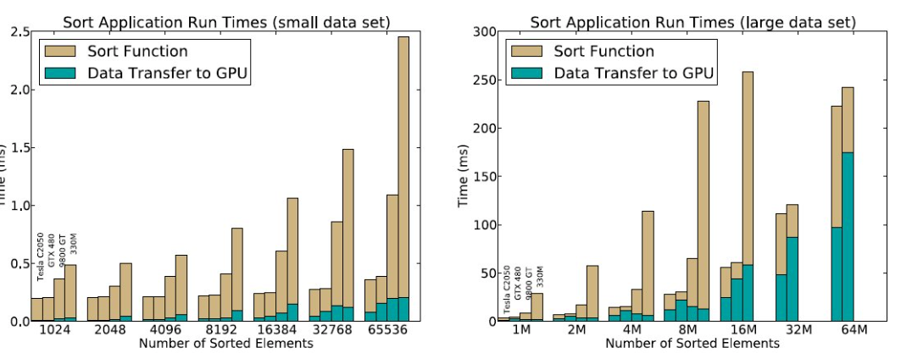
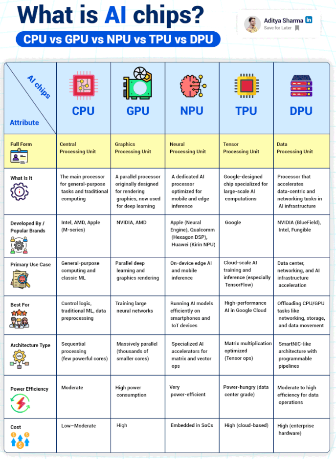

<!-- ::: watermark -->

<!--  -->

<!-- ::: -->

# GPUs

## Paralelismo y concurrencia

En esta sección partiremos de un ejercicio práctico. Si bien está pensado para realizarse en grupo, es lo suficientemente ilustrativo como para llevarse a cabo de manera individual.

**Ejercicio 1:**

Se recomienda que el ejercicio se realice de forma síncrona, ya sea de manera presencial o mediante videollamada, asegurando que todos los integrantes cuenten con acceso a un equipo de cómputo e internet.

El moderador del grupo deberá indicar el momento exacto de inicio, con el fin de que todos comiencen al mismo tiempo. Se sugiere que la actividad sea cronometrada.

El ejercicio consiste en reproducir el siguiente dibujo de manera individual en Google Sheets. La idea es asignar colores a las celdas para replicar, lo más fielmente posible, la imagen mostrada a continuación:

```{r echo=FALSE, fig.align='center'}
knitr::include_graphics("img/06_Builders_Guide/6_7-01.png")
```

Para facilitar la actividad, hemos creado un documento que puede servir como plantilla. Si deseas utilizar este documento

Para facilitar la actividad, hemos creado un documento que puede servir como plantilla. Si deseas utilizar este [documento](https://docs.google.com/spreadsheets/d/12XuyaRboQAX6OrzU-j84IEfueJtjJJQ5qFegk01nfhc/edit?usp=sharing "Plantilla dibujo tortuga"), haz una copia para poder editarlo.

Al finalizar el dibujo, deberás notificar al moderador para que registre el tiempo conforme los participantes vayan concluyendo.

***Nota***: *Si no estás en grupo, basta con que te cronometres y realices la actividad de manera individual.*

**Ejercicio 2:**

La persona que haya obtenido el mejor tiempo deberá liderar el siguiente ejercicio:

```{r echo=FALSE, fig.align='center'}
knitr::include_graphics("img/06_Builders_Guide/6_7-02.png")
```

Esta persona contará con 45 segundos para decidir quiénes formarán parte de su equipo y explicarles la estrategia que seguirán para realizar el ejercicio de manera colaborativa.

Una vez finalizada la fase de planeación, el equipo tendrá 120 segundos para ejecutar la tarea. Al concluir, el punto más importante será realizar una reflexión sobre qué se hizo bien y qué podría haberse hecho mejor.

***Algunas preguntas sugeridas:***

-   *¿El número de miembros que seleccionaste fue el optimo?*

-   *¿La estrategia que selecionaste fue la mejor o retrospectiva se te ocurre una mejor ahora?*

-   *¿Que pudimos mejorar?*

-   *¿Qué pasaría si este ejercicio lo hubieras realizado solo?*

-   *¿Qué pasaría si hubieras tenido que coordinar 1000 personas para este ejercicio?*

***Nota***: Si no estás en grupo, imagina la dinámica: planea qué instrucciones darías a un equipo para resolver el problema en el menor tiempo posible. Por ejemplo, podrías asignar a cada miembro un color específico de la imagen y posteriormente reflexionar si esa estrategia sería adecuada o no, y por qué.

### Reflexión: Concurrencia y Paralelismo

Los ejercicios anteriores no solo buscan replicar una imagen en el menor tiempo posible, sino provocar una experiencia directa sobre cómo organizamos el trabajo cuando intervienen varias personas. A través de esta dinámica es posible comprender, de manera intuitiva, los conceptos de **concurrencia** y **paralelismo**, así como la relación entre ambos.

#### ¿Qué es concurrencia?

La **concurrencia** es la capacidad de estructurar un problema de forma que múltiples tareas puedan progresar en el mismo intervalo de tiempo, aunque no necesariamente se ejecuten exactamente al mismo instante.

Implica organización, coordinación y administración de recursos compartidos. En el ejercicio 2, la fase de planeación es un claro ejemplo de concurrencia: decidir quién hará qué, cómo se dividirá el trabajo y cómo evitar interferencias (por ejemplo, que dos personas coloreen la misma celda).

En términos computacionales, la concurrencia se refiere a diseñar sistemas donde múltiples procesos o hilos avanzan de manera intercalada, gestionando correctamente el acceso a recursos.

#### ¿Qué es paralelismo?

El **paralelismo** ocurre cuando múltiples tareas se ejecutan literalmente al mismo tiempo. Esto requiere múltiples recursos físicos (por ejemplo, varios núcleos de CPU o múltiples personas trabajando simultáneamente).

En el ejercicio, el paralelismo se observa cuando varios integrantes del equipo colorean diferentes partes de la imagen al mismo tiempo. Aquí el objetivo es reducir el tiempo total mediante la ejecución simultánea de tareas independientes.

En computación, el paralelismo se logra cuando diferentes núcleos de procesamiento ejecutan instrucciones simultáneamente.

### Relación entre concurrencia y paralelismo

Aunque suelen usarse como sinónimos, no son lo mismo:

-   **La concurrencia es un modelo de organización.**
-   **El paralelismo es un modelo de ejecución.**

Podemos tener concurrencia sin paralelismo (por ejemplo, una sola persona alternando entre varias partes del dibujo). Pero no puede existir paralelismo efectivo sin una buena estrategia de concurrencia, ya que si el trabajo no está bien dividido o coordinado, la ejecución simultánea puede generar conflictos, retrabajo o ineficiencia.

El ejercicio demuestra que:

-   Dividir el trabajo sin estrategia puede generar cuellos de botella.
-   Aumentar el número de participantes no garantiza mejores resultados.
-   Coordinar a 1000 personas introduce complejidades adicionales: comunicación, sincronización y control de errores.

En sistemas computacionales ocurre exactamente lo mismo: añadir más procesadores no garantiza mayor rendimiento si el problema no está bien diseñado para ejecutarse en paralelo.

#### Conclusión

La principal enseñanza de estos ejercicios es que el rendimiento no depende únicamente de cuántos recursos tengamos, sino de **cómo organizamos el trabajo**.

La concurrencia nos obliga a pensar en la estructura y coordinación de las tareas. El paralelismo nos permite ejecutarlas simultáneamente para reducir el tiempo total. El paralelismo depende de una buena estrategia que permita concurrencia con una carga similar o identica para cada recurso por lo cual sino logramos generar concurrencia para la tarea el paralelismo no tiene forma de agilizar la tarea.

Para reforzar este último punto podemos ver 2 ejemplos, de la importancia de la concurrencia y de que no siempre es sencillo hacer concurrente una tarea.

Escenario donde la concurrencia es más viable

```{r echo=FALSE, fig.align='center'}

```

```{r echo=FALSE, fig.align='center'}
knitr::include_graphics("img/06_Builders_Guide/6_7-04.png")
```

Escenario donde la concurrencia es un problema complejo quiza inviable

```{r echo=FALSE, fig.align='center'}

```

```{r echo=FALSE, fig.align='center'}

```

## Complejidad Computacional

Para acelerar una tarea no solo dependemos del hardware disponible ni de aplicar una estrategia adecuada de paralelización. Los **algoritmos** que utilizamos para resolver un problema también influyen de manera decisiva en el desempeño: algunos son más rápidos que otros, algunos ofrecen soluciones exactas y otros proporcionan aproximaciones que reducen el tiempo de cómputo a cambio de cierta precisión.

En este bloque nos centraremos en el análisis de la **complejidad computacional**, una técnica ampliamente utilizada para describir y comparar la velocidad con la que un algoritmo resuelve un problema. Más que medir el tiempo exacto de ejecución en una máquina específica, la complejidad computacional nos permite entender cómo crece el costo del algoritmo conforme aumenta el tamaño de la entrada, proporcionando un marco teórico para evaluar su eficiencia y escalabilidad.

### Analizando la complejidad computacional en el problema de ordenamiento de números

Para entender la complejidad computacional, lo abordaremos desde uno de los temas más simples pero más ilustrativos, el ordenamiento númerico.

Tu objetivo es ordenar todos estos papeles desde el número que tiene el menor número hasta el que tiene el mayor número en el menor número de pasos posibles.

Reglas: 1. Tienes una caja llena de papeles estos papeles serán los que debemos ordenar. 2. Adicionalmente tienes dos pilas de papeles una volteando hacia arriba (A), y la otra volteando hacia abajo (B) 3. No puedes ver los papeles mientras estan en la caja, solo al sacarlo, tambien podrás ver el papel que tenemos en la Pila A. 4. Solo puedes sacar un papel a la vez, si quieres sacar un nuevo, deberás regresar el papel a la caja o ponerlo en la pila.

Para ello tienes las siguientes lista de movimientos posibles:

1.  Sacar papel: Cada que saques un papel lo podras poner en la Pila A o en la Pila B

2.  Mover papel de la pila A: De la pila A puedes quitar el papel de hasta arriba unicamente cada que saques un nuevo papel de la caja. El papel de la pila A lo podrás pasar a la pila B y el papel que sacaste lo deberás poner en la pila A.

3.  Rellenar caja: Una vez tengamos la caja vacia, podemos rellenarla con los pales de la pila B y reiniciar el proceso.

```{r echo=FALSE, fig.align='center'}
knitr::include_graphics("img/06_Builders_Guide/6_7-07.png")
```

Una aproximación para resolver este problema. Sería ir teniendo siempre el papel con menor valor en la cima de la pila A, si sale de la caja un papel con valor menor, aplicar movimiento 1 y 2, repetir este proceso n veces hasta ya no tener elementos en la caja. El movimiento 3 nos permite ir agregando un papel en cada ciclo en la Pila A (el de menor valor del ciclo).

Asumiendo que $n$ es el número de papeles en la caja de forma original, podemos describir una función que describa el número de movimiento en base al número de papeles que tenemos en la caja originalmente.

\$C(n) = \frac{n²}{2}m_1 + nhm_2 + nm_3 \$

Donde: $m_1$ es las veces que se aplica el movimiento 1. En cada ciclo se aplica $(n-c)$ c es el número del ciclo. $m_2$ es las veces que se aplica el movimiento 2. Donde $h$ es el número promedio de veces que se aplico el movimiento por ciclo. Por lo tanto $h \leq n$. $m_3$ es el número de veces que se aplica el movimiento 3. Este se aplica $n$, una vez por cada papel.

### Notación Big O

En análisis de algoritmos, la complejidad computacional se expresa comúnmente mediante la **notación Big-O**, que describe el orden de crecimiento del algoritmo en el peor caso.

Para obtener la notación Big-O:

1.  Se eliminan las constantes multiplicativas (( m_1, m_2, m_3 )).
2.  Se descartan los términos de menor orden.
3.  Se conserva únicamente el término de mayor crecimiento.

Dado que el término dominante en ( C(n) ) es proporcional a ( n\^2 ), la complejidad del algoritmo es:

$$O(n^2)$$

Esto significa que, si el número de papeles se duplica, el número de operaciones crece aproximadamente cuatro veces.

En conclusión, independientemente del hardware o del paralelismo empleado, la eficiencia del algoritmo está fuertemente determinada por su complejidad computacional. Un algoritmo ( O(n\^2) ) escalará considerablemente peor que uno ( O(n \log n) ) o ( O(n) ), incluso si ambos se ejecutan en la misma máquina.

### Bubble sort vs Merge sort.

En el ordenamiento existe un gran número de algoritmos que historicamente han competido para resolver este problema, tanto su complejidad computacional en espacio y tiempo. Como su versatilidad para se aplicados en tareas paralelizables.

Quizá algunos de los algoritmos más relevante que tenemos son el **Bubble sort** y el **Merge sort** daremos un breve analisis de ellos a continuación.

#### Bubble Sort

**Idea principal:** Es un algoritmo de ordenamiento simple que compara pares de elementos adyacentes e intercambia sus posiciones si están en el orden incorrecto. Este proceso se repite varias veces hasta que la lista queda ordenada.

En cada pasada, el elemento más grande “flota” hacia el final (de ahí el nombre *bubble*).

**Características:**

-   Fácil de entender e implementar.
-   No requiere memoria adicional significativa (es *in-place*).
-   Ineficiente para listas grandes.

**Complejidad computacional:**

-   Peor caso: ( O(n\^2) )
-   Caso promedio: ( O(n\^2) )
-   Mejor caso (si se optimiza y la lista ya está ordenada): ( O(n) )

En el peor caso realiza aproximadamente:

[ \frac{n(n-1)}{2}]

comparaciones, lo que implica un crecimiento cuadrático.

------------------------------------------------------------------------

#### Merge Sort

**Idea principal:** Es un algoritmo basado en la estrategia **divide y vencerás**:

1.  Divide la lista en dos mitades.
2.  Ordena recursivamente cada mitad.
3.  Combina (*merge*) las mitades ordenadas en una sola lista ordenada.

**Características:**

-   Algoritmo estable.
-   Desempeño consistente.
-   Requiere memoria adicional (no es *in-place*).

**Complejidad computacional:**

-   Peor caso: ( O(n \log n) )
-   Caso promedio: ( O(n \log n) )
-   Mejor caso: ( O(n \log n) )

La razón es que:

-   La lista se divide en ( \log n ) niveles.
-   En cada nivel se procesan ( n ) elementos durante la fase de mezcla.

------------------------------------------------------------------------

#### Comparación entre algoritmos de

| Algoritmo | Estrategia | Peor caso | Escalabilidad | Memoria extra | Estable |
|------------|------------|------------|--------------|------------|------------|
| Bubble Sort | Comparaciones locales | $O(n^2)$ | Baja | No | Sí |
| Selection Sort | Selección del mínimo | $O(n^2)$ | Baja | No | No |
| Insertion Sort | Inserción incremental | $O(n^2)$ | Media (en datos casi ordenados) | No | Sí |
| Merge Sort | Divide y vencerás | $O(n\log(n))$ | Alta | Sí | Sí |
| Quick Sort | Divide y vencerás (pivote) | $O(n^2)$ | Muy alta | No (in-place típico) | No\*\* |
| Heap Sort | Estructura de heap | $O(n\log(n))$ | Alta | No | No |

#### Conclusión

Ambos algoritmos resuelven correctamente el mismo problema: ordenar una lista. Sin embargo, su diferencia fundamental radica en **cómo crece su tiempo de ejecución conforme aumenta el tamaño de los datos**.

-   Bubble Sort tiene crecimiento cuadrático: si duplicamos ( n ), el tiempo se multiplica aproximadamente por cuatro.
-   Merge Sort tiene crecimiento ( n \log n ): al duplicar ( n ), el tiempo crece ligeramente más del doble.

Este contraste ilustra una idea central en complejidad computacional: **no basta con que un algoritmo funcione, debe escalar eficientemente**.

El estudio del ordenamiento permite visualizar claramente cómo la elección del algoritmo puede ser incluso más determinante que el hardware o la paralelización empleada.

## El papel del hardware

¿Cómo cambiaría la complejidad si pudieramos ver todos los papeles de forma simultanea y elegir el de menor valor?

El hardware nos brinda la forma de hacer realidad los algoritmos y ejecutarlos. En el ejercicio de ordenar los papeles establecimos reglas y movimientos.

Las reglas estan definidas por le hardware y por las estructura de datos, los movimientos estan definidos por el algoritmo.

Arquitectura con referencia de la memoria:

```{r echo=FALSE, fig.align='center'}
knitr::include_graphics("img/06_Builders_Guide/6_7-08.png")
```

Arquitectura con referencia a la capacidad de paralelización:

```{r echo=FALSE, fig.align='center'}
knitr::include_graphics("img/06_Builders_Guide/6_7-09.png")
```

### Implementación de multiplicación de matrices en distintas arquitecturas

En esta sección comparamos la implementación de la multiplicación de matrices implementado desde en CPU sin paralelizar, CPU paralelizado hasta una implementación en GPU para identificar la diferencia de performance en una operación altamente concurrente y paralelizable fundamental en el aprendizaje profundo.

Implementación de la multiplicación de matrices - 1 core - AMD Ryzen9950X - $\sim 31.56s$

```{python echo=TRUE, fig.align='center'}
import random
import time

def generate_matrix(n, m):
    return [[random.random() for _ in range(m)] for _ in range(n)]

def matmul_cpu(A, B):
    n = len(A)
    m = len(B[0])
    p = len(B)

    # Crear matriz resultado
    C = [[0.0 for _ in range(m)] for _ in range(n)]

    for i in range(n):
        for j in range(m):
            sum_val = 0.0
            for k in range(p):
                sum_val += A[i][k] * B[k][j]
            C[i][j] = sum_val

    return C

# Ejemplo
N = 1024
A = generate_matrix(N, N)
B = generate_matrix(N, N)

start = time.time()
C = matmul_cpu(A, B)
end = time.time()

print("Tiempo CPU 1 core:", end - start)
```

Implementación de la multiplicación de matrices - 16 cores - AMD Ryzen9950X - $\sim 3.89s$

```{python eval=FALSE, fig.align='center', include=FALSE}
import multiprocessing as mp

def compute_row(args):
    i, A_row, B = args
    m = len(B[0])
    p = len(B)

    result_row = []
    for j in range(m):
        sum_val = 0.0
        for k in range(p):
            sum_val += A_row[k] * B[k][j]
        result_row.append(sum_val)

    return (i, result_row)

def matmul_parallel(A, B):
    n = len(A)

    with mp.Pool(mp.cpu_count()) as pool:
        results = pool.map(
            compute_row,
            [(i, A[i], B) for i in range(n)]
        )

    C = [None] * n
    for i, row in results:
        C[i] = row

    return C

if __name__ == "__main__":
    N = 1024
    A = generate_matrix(N, N)
    B = generate_matrix(N, N)

    start = time.time()
    C = matmul_parallel(A, B)
    end = time.time()

    print("Tiempo CPU multicore:", end - start)
```

Implementación de la multiplicación de matrices - GPU Paralelizado - RTX 5090 - $\sim 0.27s$

```{python eval=FALSE, fig.align='center', include=FALSE}
import numpy as np
from numba import cuda
import math
import time

@cuda.jit
def matmul_gpu(A, B, C):
    row, col = cuda.grid(2)

    if row < C.shape[0] and col < C.shape[1]:
        tmp = 0.
        for k in range(A.shape[1]):
            tmp += A[row, k] * B[k, col]
        C[row, col] = tmp


N = 1024
A = np.random.rand(N, N).astype(np.float32)
B = np.random.rand(N, N).astype(np.float32)
C = np.zeros((N, N), dtype=np.float32)

threadsperblock = (16, 16)
blockspergrid_x = math.ceil(N / threadsperblock[0])
blockspergrid_y = math.ceil(N / threadsperblock[1])
blockspergrid = (blockspergrid_x, blockspergrid_y)

start = time.time()
matmul_gpu[blockspergrid, threadsperblock](A, B, C)
cuda.synchronize()
end = time.time()

print("Tiempo GPU:", end - start)
```

### ¿Es viable acelerar cualquier algoritmo en GPU / TPU?

Cuando se habla del poder de las GPUs, es común escuchar cifras impresionantes: aceleraciones de 100x o incluso 1000x comparado con una CPU. Sin embargo, como señalan Gregg y Hazelwood en su artículo "Where is the Data?", estas cifras suelen contar solo una parte de la historia. La pregunta que olvidamos hacer es: **¿dónde están los datos antes de que la GPU empiece a trabajar, y dónde se necesitan después?**

```{r echo=FALSE, fig.align='center'}

```

Pero hay una segunda pregunta, igual de importante: **¿cómo está organizado el trabajo que queremos acelerar?**

#### El costo oculto: mover los datos

Para que una GPU procese información, los datos deben viajar desde la memoria principal del sistema (donde la CPU los deja) hasta la memoria de la GPU. Este viaje se realiza a través del bus PCI Express, una autopista de datos que, aunque rápida, es considerablemente más lenta que la velocidad a la que la GPU puede calcular. El problema es que, una vez que la GPU termina su trabajo, muchas veces los resultados deben volver a hacer el viaje inverso para que la CPU pueda mostrarlos o usarlos en otra tarea.

Los autores del estudio demuestran que este "costo de transporte" es todo menos despreciable. En sus pruebas con once aplicaciones diferentes, descubrieron que al incluir el tiempo de transferencia de datos, el tiempo total de ejecución podía ser de **2 a 50 veces mayor** que el tiempo que la GPU pasó realmente calculando. Es decir, la GPU puede ser un chef increíblemente rápido, pero si pasa la mayor parte del tiempo esperando que le traigan los ingredientes, la comida no llegará antes a la mesa.

#### El segundo gran obstáculo: la concurrencia homogeneizable

Además del problema de la transferencia de datos, existe una barrera arquitectónica fundamental. Las GPUs están diseñadas para ejecutar miles de hilos en paralelo, pero con una condición: **todos deben hacer prácticamente lo mismo, siguiendo el mismo guión**.

Este modelo se conoce como SIMT (Single Instruction, Multiple Threads). Imagina una fábrica con miles de trabajadores, pero donde todos deben realizar exactamente la misma tarea al mismo tiempo. Si un trabajador necesita desviarse del guión (por ejemplo, porque su pieza es más complicada y requiere un tratamiento especial), el rendimiento de toda la fábrica se resiente.

Por lo tanto, un algoritmo es "homogeneizable" cuando puede dividirse en miles de tareas idénticas que realizan las mismas operaciones sobre datos diferentes. Los algoritmos que no cumplen esta condición presentan dos problemas graves:

-   **Algoritmos con baja concurrencia:** Si un problema solo se puede dividir en unas pocas tareas (por ejemplo, 8 hilos), una GPU con miles de núcleos pasará la mayor parte del tiempo desocupada. Es como tener una fábrica con 10,000 trabajadores para ensamblar un solo coche: la mayoría se quedarán mirando.
-   **Algoritmos con divergencia de control:** Si las tareas tienen que tomar caminos diferentes (condicionales del tipo "si el dato es par, haz A; si es impar, haz B"), la GPU se ve obligada a ejecutar primero todas las ramas A y luego todas las ramas B, desperdiciando ciclos y perdiendo gran parte de su ventaja.

#### ¿Cuándo merece la pena usar una GPU?

Combinando ambos factores (transferencia de datos y concurrencia homogeneizable), podemos identificar los casos favorables y desfavorables para la aceleración con GPU:

**El caso desfavorable (mucha transferencia, poco cálculo y/o baja homogeneizabilidad)**

Un algoritmo no se beneficiará de la GPU si presenta alguna de estas características:

-   **Es dominado por la transferencia de datos:** Como el algoritmo **SAXPY** (suma de vectores), donde la operación es tan simple que el tiempo de envío de los datos a la GPU eclipsa cualquier ganancia. El estudio muestra ejemplos donde la aplicación completa llegó a tardar **43 veces más** que el tiempo de cálculo en la GPU.
-   **Tiene baja concurrencia:** Problemas que solo pueden paralelizarse en unos pocos hilos no aprovechan la masividad de la GPU. La CPU, con sus pocos núcleos pero muy rápidos, será casi siempre más eficiente.
-   **Presenta alta divergencia de control:** Algoritmos con muchas bifurcaciones condicionales y patrones de acceso irregulares (como procesar estructuras de datos enlazadas o árboles con formas variables) obligan a la GPU a trabajar de forma ineficiente, perdiendo su ventaja competitiva.

**El caso favorable (mucha computación, poca transferencia y alta homogeneizabilidad)**

El caso ideal para una GPU es aquel que cumple tres condiciones: los datos llegan rápido, se quedan el mayor tiempo posible y el trabajo está perfectamente organizado en tareas idénticas.

-   **Ejemplo clásico:** Una simulación compleja como el método de **Monte Carlo** para valorar opciones financieras. Se envían pocos datos iniciales, la GPU ejecuta millones de trayectorias idénticas (cada hilo hace lo mismo), y al final solo devuelve un puñado de resultados. Aquí, el tiempo de transferencia es insignificante y la concurrencia es masiva y homogénea.
-   **Ejemplo adicional:** La multiplicación de matrices densas (**SGEMM**). Es una operación regular, predecible y masivamente paralela. Aunque tiene transferencia de datos, la cantidad de cálculo por dato es tan alta (complejidad O(n³)) que el costo de mover los datos se amortiza.

#### Entonces, ¿aceleramos cualquier algoritmo?

La respuesta es no. Acelerar un algoritmo en GPU no es automático ni universal. Para que la aceleración sea real, el algoritmo debe superar dos filtros:

1.  **El filtro de los datos:** El tiempo de cómputo en la GPU debe ser muy superior al tiempo de transferir los datos, o bien estos deben poder permanecer en la GPU para múltiples operaciones consecutivas.
2.  **El filtro de la concurrencia:** El problema debe poder dividirse en miles de tareas independientes que sigan un flujo de ejecución predecible y homogéneo.

Si tu algoritmo falla en alguno de estos dos puntos —ya sea porque mueve muchos datos y calcula poco, o porque es intrínsecamente irregular—, es muy probable que la CPU, que ya tiene los datos en su propia memoria y está optimizada para ejecutar código con bifurcaciones complejas, sea la opción más rápida y eficiente.

La próxima vez que alguien te hable de una GPU milagrosa, recuerda preguntar dos cosas: **"¿Dónde están los datos?"** y **"¿Cómo está organizado el trabajo?"**. Porque, como demuestra este estudio, las respuestas a esas preguntas marcan toda la diferencia entre una revolución de rendimiento y una decepción.

#### Cuales son las arquitecturas más comunes y favorables para procesar algoritmos de deeplearning

Claro, te ayudaré a generar una subsección basada en la información de la imagen, enfocada en las arquitecturas más comunes y favorables para deep learning. He estructurado la información de manera académica y fluida, integrando los datos de tu tabla en un texto explicativo.

Aquí tienes el texto propuesto para tu subsección:

------------------------------------------------------------------------

#### Cuales son las arquitecturas más comunes y favorables para procesar algoritmos de deep learning

El auge del *deep learning* ha impulsado el desarrollo de hardware especializado, alejándose del paradigma de los procesadores de propósito general para buscar arquitecturas que maximicen el paralelismo y la eficiencia energética. Las unidades de procesamiento han evolucionado para adaptarse a las demandas específicas de este tipo de algoritmos. A continuación, se describen las arquitecturas más comunes y favorables en este ámbito.

Tradicionalmente, la unidad central de procesamiento o **CPU** (Central Processing Unit) ha sido el pilar de la computación. Diseñada para tareas de propósito general con unos pocos núcleos potentes optimizados para procesamiento secuencial, su arquitectura resulta adecuada para el control lógico y el preprocesamiento de datos. Sin embargo, su capacidad de paralelismo limitado la hace menos favorable para la fase de entrenamiento masivo de redes neuronales.

En contraste, la unidad de procesamiento gráfico o **GPU** (Graphics Processing Unit) se convirtió en el caballo de batalla de la primera era del deep learning. Originalmente concebida para renderizar gráficos, su arquitectura masivamente paralela, compuesta por miles de núcleos más pequeños, le permite realizar innumerables operaciones matemáticas simultáneamente. Esta característica la hace ideal para el entrenamiento de grandes redes neuronales, aunque suele conllevar un alto consumo energético.

Con la necesidad de llevar la inteligencia artificial a dispositivos cotidianos, surgieron aceleradores especializados. La unidad de procesamiento neuronal o **NPU** (Neural Processing Unit) ejemplifica esta tendencia. Integrada comúnmente en sistemas en un chip (SoC) de teléfonos inteligentes y dispositivos IoT, su arquitectura está optimizada para operaciones matriciales y vectoriales con un consumo energético muy reducido, lo que la hace perfecta para la inferencia en el borde de la red (*edge inference*).

En el extremo opuesto, para las demandas de la nube, destacan unidades como la **TPU** (Tensor Processing Unit), diseñada por Google. Se trata de un circuito integrado específico para acelerar el cálculo de tensores, la operación fundamental en frameworks como TensorFlow. Optimizada para la multiplicación de matrices a gran escala, la TPU es una de las arquitecturas más potentes para el entrenamiento e inferencia en centros de datos, aunque su alto coste y consumo las circunscriben a entornos cloud especializados.

Finalmente, para orquestar la compleja infraestructura que soporta todo este cómputo, se emplea la unidad de procesamiento de datos o **DPU** (Data Processing Unit). Esta arquitectura, presente en centros de datos de alto rendimiento, actúa como un *SmartNIC* programable que acelera y descarga de los servidores las tareas relacionadas con el movimiento de datos, el networking y el almacenamiento. Al liberar a las CPU y GPU de estas tareas de *back-end*, las DPUs contribuyen a la eficiencia global de los clústeres de deep learning.

```{r echo=FALSE, fig.align='center'}

```
