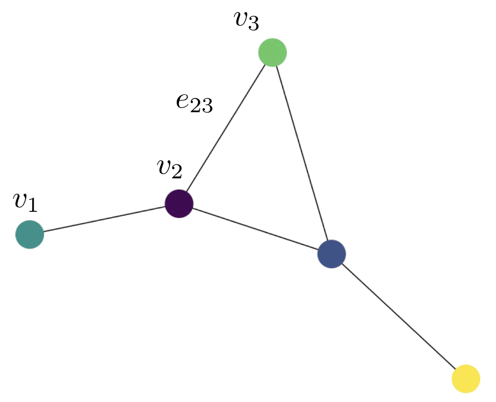
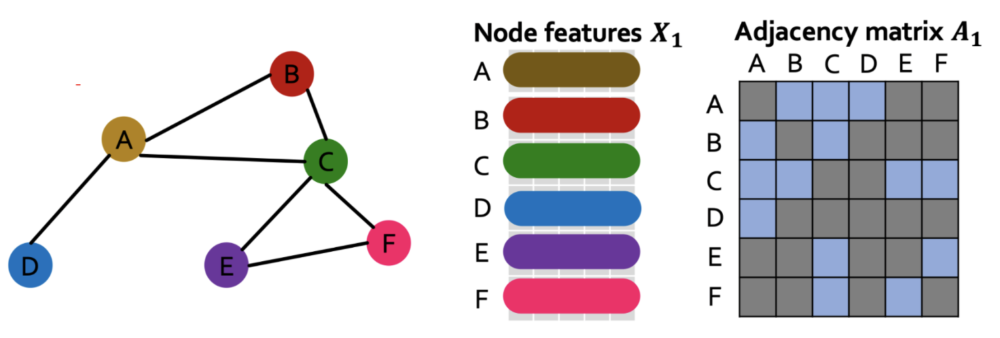

---
output:
  pdf_document: default
  html_document: default
---
<!-- ::: watermark -->
<!--  -->
<!-- ::: -->

# (PART\*) Miscellanea: Graph Neural Networks {-} 

# Introducción a la Teoría de Gráficas.
## ¿Qué es una gráfica?

Una gráfica es un objeto matemático que representa un conjunto de objetos y las
relaciones entre ellos. En esencia, se trata de un conjunto de vértices
$V = \{v_1, \ldots, v_n \}$ y de aristas $E = \{e_{i_1 i_j}, \ldots, e_{i_m i_m} \}$

```{r echo=FALSE, fig.align='center'}

```


Estos se usan para modelar fenómenos complejos, como la interacción en redes sociales,
redes de comunicaciones, las relaciones entre citas de documentos, la configuración 
de compuestos químicos y demás.

```{r echo=FALSE, fig.align='center'}
knitr::include_graphics("img/21-gnn/cite_seer_data.jpg")
```

Si bien, el conjunto de aristas define la estructura de la gráfica es comun
generar representaciones alternativas. Entre ellas se encuentra

* **Matriz de adjyacencias:** $A\in \mathbb{R}^n$, donde $n$ es el número de vertices
de la gráfica y las entradas de la matriz estan dadas como sigue

$$A_{ij} = \begin{cases}
    1,& \text{ existe arista entre } v_i \text{ y }v_j\\
    0,& \text{ en otro caso }
\end{cases}$$

```{r echo=FALSE, fig.align='center'}
knitr::include_graphics("img/21-gnn/adjacency_matrix.png")
```
Es de notar que en la práctica, dicha matriz suele ser de tipo *sparse*, dado
que no todos los nodos están conectados.

* **Lista de adjacencias:** Es una lista que compacta la representación de adyacencias.

$$ \begin{cases}
    A: & [B, C, D], \\
    B: & [A, E], \\
    C: & [A, D], \\
    D: & [A, C, E], \\
    E: & [B, E]
\end{cases}$$
* **Sparse Coodinate Format (COO):** Es una representacion tensorial de tipo
*sparse* de las estructura de la gráfica. La idea es solo almacenar los indices
de los nodos que denotan las adyacencias en la gráfica omitiendo aquellos 
lugares donde no hay relaciones ente nodos. Véase el siguiente [link](https://docs.pytorch.org/docs/stable/sparse.html#sparse-coo-tensors).


* Por otro lado, se puede considerar de forma opcional incluir en el análisis
a características numéricas y categorícas (*features*) de los vértices de la
gráfica.

```{r echo=FALSE, fig.align='center'}

```

## ¿Qué caracteriza la estructura una gráfica?

* Grado de sus vertices:
* Centralidad
* Betweness
* Grado de Centalidad
* Page Rank
* Conexidad
* Componentes conexas

## ¿Por qué combinar Graficas y Deep Learning?

WIP

## ¿Existe un Teorema de Aproximación Univeral (TAU) para GNN's?

* Muchas pruebas del existentes del TAU para GNN son extensiones de del Teorema de Stone-Weierstrass,

* Un tema a resolver en problema a resolver es si dos gráficas son isomórficas.
  * Weisfeiler y Leman idearon una heurística que trata de determinar si dos
  gráficas son isomórficas entre si.
  * Los resultados algoritmos son invariantes ante permutaciones de etiquetado
  de las gráficas
  * En la práctica, es muy dificil encontrar gráficas isomórficas entre si.
  
* Algunos resultados prueban la universalidad bajo ciertas condiciones:
  *  Maron et al. On the Universality of Invariant Networks (2019) *"G-invariant networks are universal if high-order tensors are allowed (..)"*
  * Universal Invariant and Equivariant Graph Neural Network (2019) *"GNNs are universal approximators in probability for node classification & regression tasks, as they can approximate any measurable function that satisfies
  the 1–WL equivalence on nodes"*

## Enfoques de aprendizaje transductivo e inductivo

**Aprendizaje Transductivo:** En este paradigma, el modelo se entrena considerando todo el grafo disponible, es decir, con todos los nodos y sus relaciones (aristas) presentes durante la fase de entrenamiento, incluso aquellos cuya informacion no se utiliza directamente para el cálculo de la función de pérdida.

El modelo aprende representaciones (embeddings) dependientes de la estructura completa del grafo, por lo que no puede generalizar a nodos o subgrafos no
observados durante el entrenamiento.

**Aprendizaje Inductivo:** reservan conjuntos de datos de entrenamiento y prueba
separados. El proceso de aprendizaje ingesta los datos de entrenamiento y, a
continuación, el modelo aprendido se prueba utilizando los datos de prueba, que
no ha observado antes en ninguna capacidad.

## Tipos de problemas de GNN

El aprendizaje automático en grafos se presenta en diversas modalidades:

* **Aprendizaje Supervisado/Semi-supervisado:**

  * *Clasificación de Grafos:* Grafos etiquetados → etiquetar nuevo grafo.
    * Ejemplos: Clasificación de moléculas, predicción de la eficacia de fármacos.

  * *Clasificación de Nodos (o Aristas):* Nodos etiquetados → etiquetar otros nodos.
    * Ejemplos: Marketing (orientado/segmentaciones), predicción de interfaces proteicas.

* **Aprendizaje No Supervisado (y Semi-supervisado)**
    * Ejemplos:
      * Detección de Comunidades: Un grafo → agrupar nodos
      * Análisis de redes sociales.

  * *Link prediction (o Vínculos): Un grafo → ¿posible nueva arista?*
    * Ejemplos: Sistemas de recomendación.

* **Otros tareasx:**
  * Oredicción (de nodo, de arista) en grafos dinámicos (simulación de sistemas físicos),
  * Generación de gráficas (diseño de fármacos)...

```{python echo=FALSE, fig.align='center'}
import torch
import torch.nn as nn
from torch.nn import Linear
from torch_geometric.datasets import KarateClub
from torch_geometric.utils import to_dense_adj

import numpy as np
import networkx as nx
import matplotlib.pyplot as plt


# Import dataset from PyTorch Geometric
dataset = KarateClub()

# Print information
print(dataset)
print('------------')
print(f'Number of graphs: {len(dataset)}')
print(f'Number of features: {dataset.num_features}')
print(f'Number of classes: {dataset.num_classes}')

data = dataset[0]

print(f'x = {data.x.shape}')
print(data.x)

print(f'edge_index = {data.edge_index.shape}')
print(data.edge_index)
```

```{python echo=FALSE, fig.align='center'}

```{python echo=FALSE, fig.align='center'}
from torch_geometric.utils import to_networkx

G = to_networkx(data, to_undirected=True)
plt.figure(figsize=(12,12))
plt.axis('off')
nx.draw_networkx(G,
                pos=nx.spring_layout(G, seed=0),
                with_labels=True,
                node_size=400,
                node_color=data.y,
                cmap="hsv",
                vmin=-2,
                vmax=3,
                width=0.8,
                edge_color="grey",
                font_size=14
                )
plt.show()
```
```{python echo=FALSE, fig.align='center'}
from torch.nn import Linear
from torch_geometric.nn import GCNConv

class GCN(torch.nn.Module):
    def __init__(self):
        super().__init__()
        self.gcn = GCNConv(dataset.num_features, 3)
        self.out = Linear(3, dataset.num_classes)

    def forward(self, x, edge_index):
        h = self.gcn(x, edge_index).relu()
        z = self.out(h)
        return h, z

model = GCN()
print(model)
```


```{python echo=FALSE, fig.align='center'}
criterion = torch.nn.CrossEntropyLoss()
optimizer = torch.optim.Adam(model.parameters(), lr=0.02)

# Calculate accuracy
def accuracy(pred_y, y):
    return (pred_y == y).sum() / len(y)

# Data for animations
embeddings = []
losses = []
accuracies = []
outputs = []

# Training loop
for epoch in range(201):
    # Clear gradients
    optimizer.zero_grad()

    # Forward pass
    h, z = model(data.x, data.edge_index)

    # Calculate loss function
    loss = criterion(z, data.y)

    # Calculate accuracy
    acc = accuracy(z.argmax(dim=1), data.y)

    # Compute gradients
    loss.backward()

    # Tune parameters
    optimizer.step()

    # Store data for animations
    embeddings.append(h)
    losses.append(loss)
    accuracies.append(acc)
    outputs.append(z.argmax(dim=1))

    # Print metrics every 10 epochs
    if epoch % 10 == 0:
        print(f'Epoch {epoch:>3} | Loss: {loss:.2f} | Acc: {acc*100:.2f}%')
```

```{python echo=FALSE, fig.align='center'}
import this
```


```{python echo=FALSE, fig.align='center'}

```

```{python echo=FALSE, fig.align='center'}

```

```{python echo=FALSE, fig.align='center'}

```

