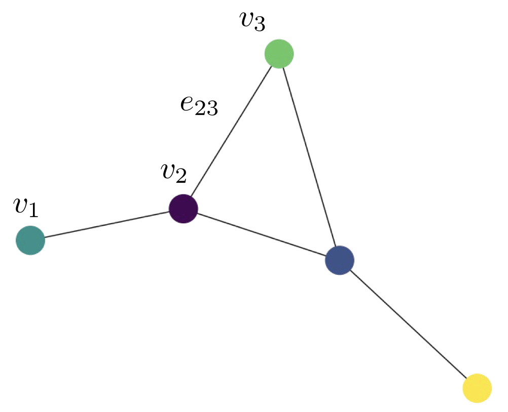
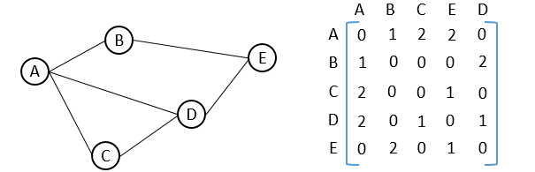
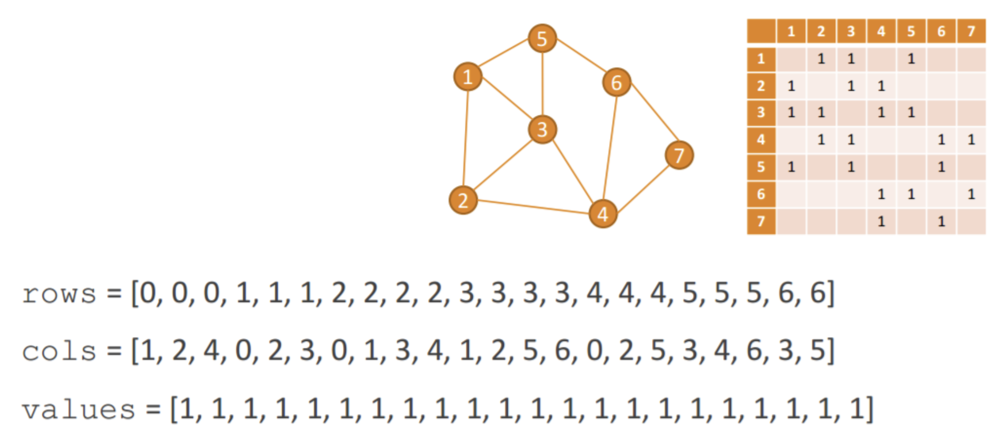
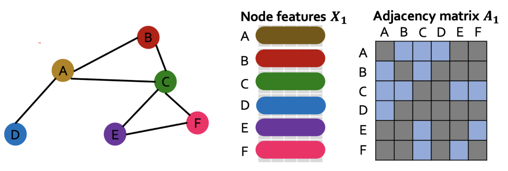
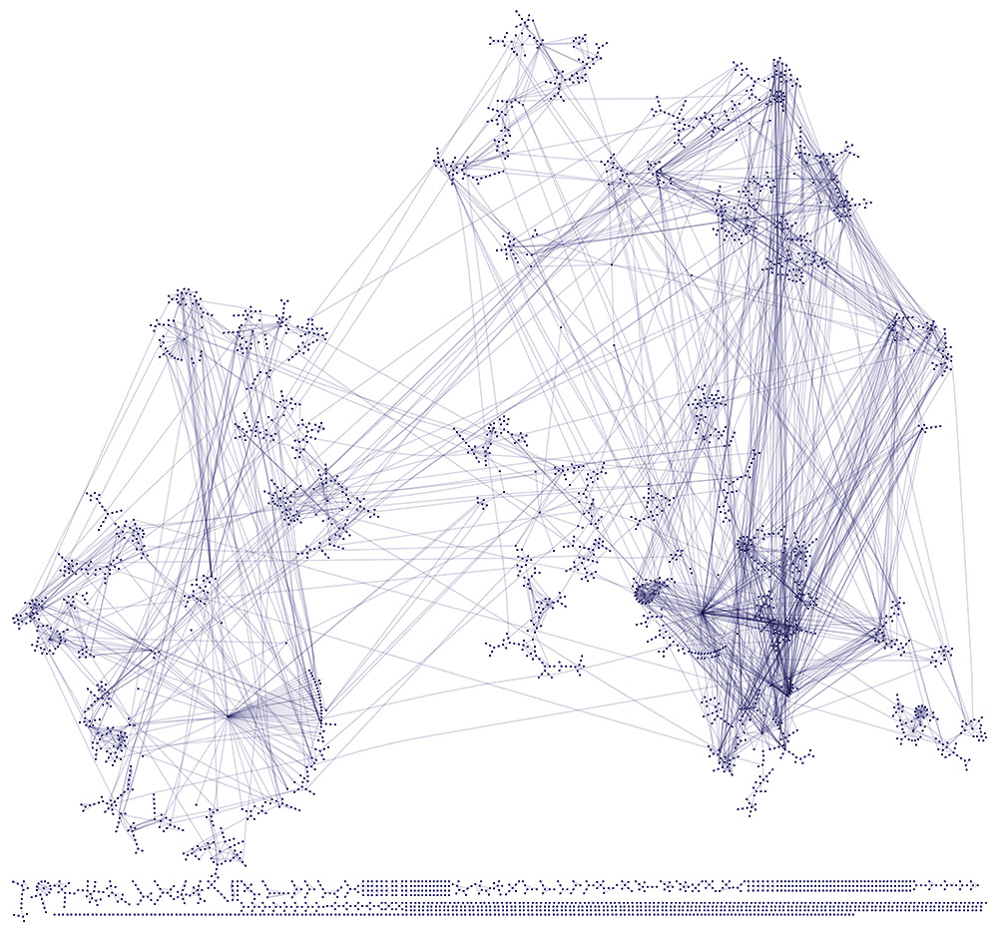
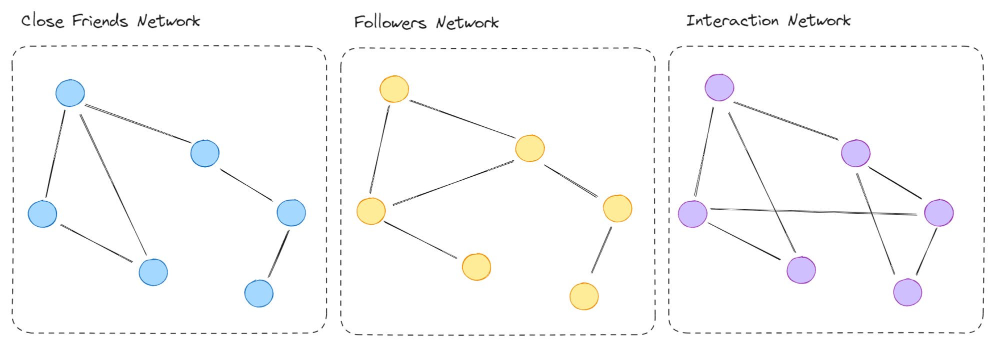

---
output:
  pdf_document: default
  html_document: default
---
<!-- ::: watermark -->
<!--  -->
<!-- ::: -->

# Miscellanea: Intro to Graph Neural Networks {-} 

# Introducción a la Teoría de Gráficas.
## ¿Qué es una gráfica?

Una gráfica es un objeto matemático que representa un conjunto de objetos y las
relaciones entre ellos. Estos se usan para modelar fenómenos complejos, como la
interacción en redes sociales, redes de comunicaciones, las relaciones entre
citas de documentos, la configuración de compuestos químicos y demás.

```{python}
import torch
import torch.nn as nn
from torch.nn import Linear
import torch.nn.functional as F
from torch_geometric.datasets import Planetoid
from torch_geometric.utils import (
  to_dense_adj, to_networkx
)
from torch_geometric.utils import degree

import numpy as np
import networkx as nx
import matplotlib.pyplot as plt
import pandas as pd
import random

# Load Zachary's Karate Club graph
G = nx.karate_club_graph()

print(f"Number of nodes: {G.number_of_nodes()}")
print(f"Number of edges: {G.number_of_edges()}")

```


```{python}
# Get the club membership attribute for coloring
club_labels = [G.nodes[i]['club'] for i in G.nodes]

# Color based on club membership ('Mr. Hi' or 'Officer')
color_map = [
  '#FF5733' if club == 'Mr. Hi' else '#3371FF' for club in club_labels
  ]

# Draw the graph
plt.figure(figsize=(8, 6))
pos = nx.spring_layout(G) # positions for all nodes
nx.draw_networkx_nodes(G, pos, node_color=color_map)
nx.draw_networkx_edges(G, pos, alpha=0.6)
nx.draw_networkx_labels(G, pos, font_color='white')
plt.title("Zachary's Karate Club Network")
plt.axis('off')
plt.show()

```

Matematicamente se representan como conjuntos de vértices (o nodos)
$V = \{v_1, \ldots, v_n \}$ y del conjunto de las relaciones entre ellas
$E = \{e_{i_1 i_j}, \ldots, e_{i_m i_m} \}$.


```{r echo=FALSE, fig.align='center'}

```


Si bien, el conjunto de aristas define la estructura de la gráfica es comun
generar representaciones alternativas. Entre ellas se encuentran:

* **Matriz de adjyacencias:** $A\in \mathbb{R}^n$, donde $n$ es el número de vertices
de la gráfica y las entradas de la matriz estan dadas como sigue

$$A_{ij} = \begin{cases}
    1,& \text{ existe arista entre } v_i \text{ y }v_j\\
    0,& \text{ en otro caso }
\end{cases}$$

```{r echo=FALSE, fig.align='center'}

```
Es de notar que en la práctica, dicha matriz suele ser de tipo *sparse*, dado
que no todos los nodos están conectados.

* **Sparse Coodinate Format (COO):** Es una representacion tensorial de tipo
*sparse* de las estructura de la gráfica. La idea es solo almacenar los indices
de los nodos que denotan las adyacencias en la gráfica omitiendo aquellos 
lugares donde no hay relaciones ente nodos. Véase el siguiente [link](https://docs.pytorch.org/docs/stable/sparse.html#sparse-coo-tensors).


```{r echo=FALSE, fig.align='center'}

```


* Por otro lado, se puede considerar de forma opcional incluir en el análisis
a características numéricas y categorícas (*features*) de los vértices de la
gráfica.

```{r echo=FALSE, fig.align='center'}

```

* **Grado de sus vertices:** el grado de un nodo $deg(v_i)$  como a la cantidad de aristas
donde dicho nodo está presente. Este se puede calcular como:

$$deg(v_i) = \sum_{i=1}^N A_{ij}$$

```{python}
G = nx.Graph()
G.add_edges_from([('A', 'B'), ('A', 'C'), ('B', 'D'),
('B', 'E'), ('C', 'F'), ('C', 'G')])

# Draw the graph
plt.figure(figsize=(8, 6))
pos = nx.spring_layout(G) # positions for all nodes
nx.draw_networkx_nodes(G, pos)
nx.draw_networkx_edges(G, pos, alpha=0.6)
nx.draw_networkx_labels(G, pos, font_color='white')
plt.title("Samaple Graph")
plt.axis('off')
plt.show()
```


```{python}
print(f"deg(A) = {G.degree['A']}")
print(f"deg(B) = {G.degree['B']}")
```

## Problemas clásicos de teoría de gráficas (selección)

###  Caminos y conectividad
**Problema:** determinar si dos nodos están conectados y cómo se propaga la información a través del grafo.  
**Aplicaciones:** navegación y mapas, análisis de redes sociales, propagación de epidemias, redes de comunicación.

### Detección de comunidades
**Problema:** identificar grupos de nodos densamente conectados entre sí.  
**Aplicaciones:** segmentación de usuarios, análisis de redes sociales, biología de sistemas, recomendación de contenidos.

### Centralidad e influencia
**Problema:** medir la importancia relativa de los nodos dentro de un grafo.  
**Aplicaciones:** ranking de páginas web, detección de líderes de opinión, identificación de nodos críticos en infraestructura, epidemiología.

### Emparejamiento y asignación
**Problema:** asignar nodos entre dos conjuntos respetando restricciones estructurales.  
**Aplicaciones:** asignación de tareas, sistemas de recomendación, mercados laborales, publicidad y subastas.


## Ecosistema de Herramientas para el Trabajo con Grafos
1) Software para Visualización y Análisis de Grafos

* *Gephi:* Herramienta open source la visualización interactiva y el análisis exploratorio de redes complejas y grandes grafos. https://gephi.org. La siguiente imagen fue generada en dicha herramienta

```{r echo=FALSE, fig.align='center'}

```

* **Bases de datos de Grafos:**
  * *Neo4j:* Sistema de gestión de bases de datos orientada a grafos que incluye el Graph Data Science (GDS) Library para ejecutar algoritmos directamente sobre los datos almacenados.
  * **Memgraph**: Base de datos de grafos con capacidades de Streaming https://memgraph.com
  * *AWS Neptune*: Base de datos serveless, funcioina en la nube de AWS https://aws.amazon.com/es/neptune/
* *Graphviz:* Herramienta basada en scripts (lenguaje DOT) que permite la generación automática de diagramas de grafos de manera estructural y jerárquica.

2) Librerías de Python para Manipulación y Algoritmos

* *NetworkX:* La librería de creación, manipulación y estudio de estructuras de
red; flexible e implementa algoritmos clásicos. https://networkx.org/en/
* *Graph:* Es un framework de Spark para trabajar con gráficas en ambientes distribuidas (https://spark.apache.org/graphx/)
* *Mercury-graph*: Libreria de BBVA para gráficos, disponible en Mercury, cuenta 
con algoritmos implementados para Python y Spark. https://www.bbvaaifactory.com/es/graph-analytics-with-mercury-graph/

3) Librerías de Deep Learning para Grafos (GNN)

* *PyTorch Geometric (PyG):* Construida sobre PyTorch. Ofrece implementaciones de última generación para operaciones de convolución y pooling en grafos. https://pytorch-geometric.readthedocs.io/en/latest/

* *Deep Graph Library (DGL):* Una librería optimizada y agnóstica al framework
(compatible con PyTorch, TensorFlow y JAX), diseñada para facilitar la
implementación de modelos GNN a escala industrial. https://www.dgl.ai


## ¿Por qué combinar Graficas y Deep Learning?
Cuando los datos de un problema, ademas de features numéricas tambien incorporan
estructura, puede resultar util tomarla en consideracion para tareas de ML.

Para ejemplificarlo, vamos a resolver el problema de clasificación de los datos
del *Cora* de la libreria *torch_geometric.datasets*.

Este es un conjunto de datos de una red de citas bibliográficas que relaciona
artículos científicos y citas bibliográficas de otros artículos en su texto.
La tabla siguiente hace un resumen

| # | Atributo                   | Valor                                    |
|---|----------------------------|------------------------------------------|
| 1 | Nodos                      | 2,708 (Artículos científicos)            |
| 2 | Aristas                    | 10,556 (Citas)                           |
| 3 | Características (Features) | 1,433 (Vector binario de palabras clave, Bag-of-Words) |
| 4 | Clases                     | 7 categorías de investigación            |


Las categorias de los artìculos son las siguientes:

| Categoria | Nombre                 | Descripción                                                              |
|-----------|------------------------|--------------------------------------------------------------------------|
| 0         | Theory                 | Aspectos teóricos, algoritmos fundamentales y pruebas matemáticas.       |
| 1         | Reinforcement Learning | Agentes que aprenden mediante prueba y error para maximizar recompensas. |
| 2         | Genetic Algorithms     | Algoritmos de optimización inspirados en la evolución biológica.         |
| 3         | Neural Networks        | Modelos basados en capas de neuronas artificiales y Deep Learning.       |
| 4         | Probabilistic Methods  | Modelos que gestionan la incertidumbre (Redes Bayesianas, etc.).         |
| 5         | Case Based             | Sistemas de razonamiento basados en casos y analogías previas.           |


```{python}
dataset = Planetoid(root='./tmp/cora', name='cora')
data = dataset[0]
```

```{python}
class GraphUtils:
    @staticmethod
    def create_adjacency_matrix(data):
        # Crea matriz de adyacencia
        adjacency = to_dense_adj(data.edge_index)[0]
        # Agrega una diagonal de unos (auto-referencia a nodos)
        adjacency = adjacency + torch.eye(len(adjacency))
        return adjacency

    @staticmethod
    def convert_to_networkx(graph, n_sample=None):
        g = to_networkx(graph, node_attrs=["x"])
        y = graph.y.numpy()
    
        if n_sample is not None:
            sampled_nodes  = random.sample(list(g.nodes), n_sample)
            g = g.subgraph(sampled_nodes)
            y = y[sampled_nodes]
    
        return g, y
    
    @staticmethod
    def plot_graph(g, y):
        plt.figure(figsize=(9, 7))
        nx.draw_spring(g, node_size=30, arrows=False, node_color=y)
        plt.show() 
```

Esta es una representación de una muestra de 1,000 artículos en el conjunto Cora.

```{python}
g, y = GraphUtils.convert_to_networkx(data, n_sample=1000)
GraphUtils.plot_graph(g, y)  
```
En complemento, ahora veremos el arreglo tabular de datos donde cada reglón es un
artículo, los features son el Bag of Words del corpus del artículo con las
palabras de toda la colección y la categoría a la que pertenece dicho artículo.

```{python}
cora_features = pd.DataFrame(dataset.x.numpy(),columns=["word"+str(i) for i in range(1433)])
cora_features["category"] = data.y

cora_features[cora_features.columns[-5:]].head(20)
```

Para la comparativa consistirá en los siguientes:

A) Un modelo de tipo Multilayer Percepton con dos capas que usa las features
numéricas para predecir la categoría a la que corresponde cada artículos

B) Un modelo que combina capaz, que conectan los datos las features
numèricas a una capa lineal y despúes multiplican la salida por la matriz de
adyacencias para involucrar la estrucura de la red.

### A. Multilayer Percepton en las features tabulares de Cora

```{python}
# Define MLP model
class MLP(torch.nn.Module):
    def __init__(self, dim_in, dim_h, dim_out):
        super().__init__()
        self.linear1 = Linear(dim_in, dim_h)
        self.linear2 = Linear(dim_h, dim_out)

    def forward(self, x):
        x = self.linear1(x)
        x = torch.relu(x)
        x = self.linear2(x)
        return F.log_softmax(x, dim=1)

    def fit(self, data, epochs, learning_rate=0.01, weight_decay=5e-4):
        criterion = torch.nn.CrossEntropyLoss()
        optimizer = torch.optim.Adam(self.parameters(), lr=learning_rate, weight_decay=weight_decay)

        self.train()
        for epoch in range(epochs+1):
            optimizer.zero_grad()
            out = self(data.x)
            loss = criterion(out[data.train_mask], data.y[data.train_mask])
            acc = self.accuracy(out[data.train_mask].argmax(dim=1), data.y[data.train_mask])
            loss.backward()
            optimizer.step()

            if epoch % 20 == 0:
                val_loss = criterion(out[data.val_mask], data.y[data.val_mask])
                val_acc = self.accuracy(out[data.val_mask].argmax(dim=1), data.y[data.val_mask])
                print(f'Epoch {epoch:>3} | Train Loss: {loss:.3f} | Train Acc:'
                      f' {acc*100:>5.2f}% | Val Loss: {val_loss:.2f} | '
                      f'Val Acc: {val_acc*100:.2f}%')

    @torch.no_grad()
    def test(self, data):
        self.eval()
        out = self(data.x)
        acc = self.accuracy(out.argmax(dim=1)[data.test_mask], data.y[data.test_mask])
        return acc

    @staticmethod
    def accuracy(y_pred, y_true):
        return torch.sum(y_pred == y_true).item() / len(y_true)
```

### B. Modelo basado en una capa lineal que se multiplica por la matriz de adyacencia.

```{python}
class GNNLayer(torch.nn.Module):
    def __init__(self, dim_in, dim_out):
        super().__init__()
        self.linear = Linear(dim_in, dim_out, bias=False)

    def forward(self, x, adjacency):
        x = self.linear(x)
        x = torch.sparse.mm(adjacency, x)
        return x
```

```{python}
class GNN(torch.nn.Module):
    def __init__(self, dim_in, dim_h, dim_out):
        super().__init__()
        self.gnn1 = GNNLayer(dim_in, dim_h)
        self.gnn2 = GNNLayer(dim_h, dim_out)

    def forward(self, x, adjacency):
        h = self.gnn1(x, adjacency)
        h = torch.relu(h)
        h = self.gnn2(h, adjacency)
        return F.log_softmax(h, dim=1)

    def fit(self, data, adjacency, epochs, learning_rate=0.01, weight_decay=5e-4):
        criterion = torch.nn.CrossEntropyLoss()
        optimizer = torch.optim.Adam(self.parameters(), lr=learning_rate, weight_decay=weight_decay)

        self.train()
        for epoch in range(epochs+1):
            optimizer.zero_grad()
            out = self(data.x, adjacency)
            loss = criterion(out[data.train_mask], data.y[data.train_mask])
            acc = MLP.accuracy(out[data.train_mask].argmax(dim=1), data.y[data.train_mask])
            loss.backward()
            optimizer.step()

            if epoch % 20 == 0:
                val_loss = criterion(out[data.val_mask], data.y[data.val_mask])
                val_acc = MLP.accuracy(out[data.val_mask].argmax(dim=1), data.y[data.val_mask])
                print(f'Epoch {epoch:>3} | Train Loss: {loss:.3f} | Train Acc:'
                      f' {acc*100:>5.2f}% | Val Loss: {val_loss:.2f} | '
                      f'Val Acc: {val_acc*100:.2f}%')

    @torch.no_grad()
    def test(self, data, adjacency):
        self.eval()
        out = self(data.x, adjacency)
        acc = MLP.accuracy(out.argmax(dim=1)[data.test_mask], data.y[data.test_mask])
        return acc
```

Ahora entrenamos ambos modelos:

```{python}
mlp = MLP(dataset.num_features, 16, dataset.num_classes)
print(mlp)
mlp.fit(data, epochs=100)
acc_mlp = mlp.test(data)
print(f'\nMLP test accuracy: {acc_mlp*100:.2f}%')
```

```{python}
adjacency = GraphUtils.create_adjacency_matrix(data)
gnn = GNN(dataset.num_features, 16, dataset.num_classes)
print(gnn)
gnn.fit(data, adjacency, epochs=100)
acc_gnn = gnn.test(data, adjacency)

print(f'\nGNN test accuracy: {acc_gnn*100:.2f}%')
```


```{python}
pd.DataFrame(
  {
    "modelo": ["MLP", "GNN"],
    "accuracy": [acc_mlp*100, acc_gnn*100]
  }
)
```

En este ejemplo, el factor que marco la diferencia de la accion de la matriz
de transaciones sobre los pesos de la red, pues intutivamente sirve para
comunicar la estructura de relaciones de los nodos en el proceso de aprendizaje.

Dicho modelo es una implementación *dummy* de una familia conocida como
**Graph Convolutional Networks** que abordaremos más adelante.

### ¿Qué esta haciendo la red?

En este caso usaremos los datos del Karate Club presentes en PyTorch Geoemtric.

Entrenaremos nuevamente una red con la misma idea previa, que las features
numéricas sean multiplicadas por la matriz de adyancencia


```{python}
from torch_geometric.datasets import KarateClub

# Import dataset from PyTorch Geometric
dataset = KarateClub()
data = dataset[0]
```

Podemos acceder a la información de la gráfica:

```{python}
# Print information
print(dataset)
print('------------')
print(f'Number of graphs: {len(dataset)}')
print(f'Number of features: {dataset.num_features}')
print(f'Number of classes: {dataset.num_classes}')
```

En este caso las features numéricas son solo encoding de los nodos con el indice
que se han numerado:

```{python}
print(f'x = {data.x.shape}')
print(data.x)

print(f'edge_index = {data.edge_index.shape}')
pd.DataFrame(data.x, columns=["x"+str(i+1) for i in range(data.x.shape[0])]).head()
```


```{python}
from torch_geometric.utils import to_networkx

G = to_networkx(data, to_undirected=True)
plt.figure(figsize=(12,12))
plt.axis('off')
nx.draw_networkx(G,
                pos=nx.spring_layout(G, seed=0),
                with_labels=True,
                node_size=400,
                node_color=data.y,
                cmap="hsv",
                vmin=-2,
                vmax=3,
                width=0.8,
                edge_color="grey",
                font_size=14
                )
plt.show()
```


```{python}
from torch.nn import Linear
from torch_geometric.nn import GCNConv

class GCN(torch.nn.Module):
    def __init__(self):
        super().__init__()
        self.gcn = GCNConv(dataset.num_features, 3)
        self.out = Linear(3, dataset.num_classes)

    def forward(self, x, edge_index):
        h = self.gcn(x, edge_index).relu()
        z = self.out(h)
        return h, z

model = GCN()
print(model)
```


```{python}
criterion = torch.nn.CrossEntropyLoss()
optimizer = torch.optim.Adam(model.parameters(), lr=0.02)

# Calculate accuracy
def accuracy(pred_y, y):
    return (pred_y == y).sum() / len(y)

# Data for animations
embeddings = []
losses = []
accuracies = []
outputs = []

# Training loop
for epoch in range(201):
    # Clear gradients
    optimizer.zero_grad()

    # Forward pass
    h, z = model(data.x, data.edge_index)

    # Calculate loss function
    loss = criterion(z, data.y)

    # Calculate accuracy
    acc = accuracy(z.argmax(dim=1), data.y)

    # Compute gradients
    loss.backward()

    # Tune parameters
    optimizer.step()

    # Store data for animations
    embeddings.append(h)
    losses.append(loss)
    accuracies.append(acc)
    outputs.append(z.argmax(dim=1))

    # Print metrics every 10 epochs
    if epoch % 10 == 0:
        print(f'Epoch {epoch:>3} | Loss: {loss:.2f} | Acc: {acc*100:.2f}%')
```

```{python}
plt.rcParams["animation.bitrate"] = 3000

def draw_predicted_graph(i):
    G = to_networkx(data, to_undirected=True)
    fig = plt.figure(figsize=(12, 12))
    plt.axis('off')
    nx.draw_networkx(G,
                    pos=nx.spring_layout(G, seed=0),
                    with_labels=True,
                    node_size=300,
                    node_color=outputs[i].numpy(),
                    cmap="hsv",
                    vmin=0,
                    vmax=5,
                    width=0.8,
                    edge_color="grey",
                    font_size=14
                    )
    plt.title(
      f'Epoch {i} | Loss: {losses[i]:.2f} | Acc: {accuracies[i]*100:.2f}%',
      fontsize=18, pad=20)
    plt.show()
```

```{python}
draw_predicted_graph(1)
```


```{python}
draw_predicted_graph(5)
```

```{python}
draw_predicted_graph(9)
```
```{python}
draw_predicted_graph(100)
```

En las imágenes se aprecia como poco a poco, los pesos se van ajustando, a través
de la información de la matriz de adyancias, para predecir las etiquetas de los nodos.

## Tipos de problemas de GNN

El aprendizaje automático en grafos se presenta en diversas modalidades:

* **Aprendizaje Supervisado/Semi-supervisado:**

  * *Clasificación de Nodos (o Aristas):* Nodos etiquetados → etiquetar otros nodos.
    * Ejemplos: Marketing (orientado/segmentaciones), predicción de interfaces proteicas.

  * *Clasificación de Grafos:* Grafos etiquetados → etiquetar nuevo grafo.
    * Ejemplos: Clasificación de moléculas, predicción de la eficacia de fármacos.

```{r echo=FALSE, fig.align='center'}
knitr::include_graphics("img/21-gnn/gnn_node_classification.png")
```


* **Aprendizaje No Supervisado (y Semi-supervisado)**
    * Ejemplos:
      * Detección de Comunidades: Un grafo → agrupar nodos
      * Análisis de redes sociales.

```{r echo=FALSE, fig.align='center'}
knitr::include_graphics("img/21-gnn/gnn_node_clustering.png")
```


  * *Link prediction (o Vínculos): Un grafo → ¿posible nueva arista?*
    * Ejemplos: Sistemas de recomendación. Cabe mencionar que Uber usa modelos
    de este este estilo para hacer recomendaciones de comida https://www.uber.com/en-MX/blog/uber-eats-graph-learning/

```{r echo=FALSE, fig.align='center'}
knitr::include_graphics("img/21-gnn/gnn_link_prediction.png")
```

* **Otros tareas:**
  * Predicción (de nodo, de arista) en grafos dinámicos (simulación de sistemas físicos),
  * Generación de gráficas (diseño de fármacos)
  * Predicción de Tráfico: Google Maps hace estimaciones de condiciones de tráfico empleando Graph Nuera Networks https://deepmind.google/blog/traffic-prediction-with-advanced-graph-neural-networks/
  
```{r echo=FALSE, fig.align='center'}

```

## ¿Existe un Teorema de Aproximación Univeral (TAU) para GNN's?

* Muchas pruebas del existentes del TAU para GNN son extensiones de del Teorema de Stone-Weierstrass,

* Un tema a resolver en problema a resolver es si dos gráficas son isomórficas.
  * Weisfeiler y Leman idearon una heurística que trata de determinar si dos
  gráficas son isomórficas entre si.
  * Los resultados algoritmos son invariantes ante permutaciones de etiquetado
  de las gráficas
  * En la práctica, es muy dificil encontrar gráficas isomórficas entre si.
  
* Algunos resultados prueban la universalidad bajo ciertas condiciones:
  *  Maron et al. On the Universality of Invariant Networks (2019)
  *"G-invariant networks are universal if high-order tensors are allowed (..)"*
  * Universal Invariant and Equivariant Graph Neural Network (2019) *"GNNs are universal approximators in probability for node classification & regression tasks, as they can approximate any measurable function that satisfies
  the 1–WL equivalence on nodes"*

## Enfoques de aprendizaje transductivo e inductivo

**Aprendizaje Transductivo:** En este paradigma, el modelo se entrena
considerando todo el grafo disponible, es decir, con todos los nodos y sus
relaciones (aristas) presentes durante la fase de entrenamiento, incluso aquellos
cuya informacion no se utiliza directamente para el cálculo de la función de pérdida.

**Nota:** Bajo dicho enfoque, un modelo aprende representaciones
(embeddings) dependientes de la estructura completa del grafo, por lo que **no
puede generalizar a nodos o subgrafos no observados durante el entrenamiento**.

**Aprendizaje Inductivo:** reservan conjuntos de datos de entrenamiento y prueba
separados. El proceso de aprendizaje ingesta los datos de entrenamiento y, a
continuación, el modelo aprendido se prueba utilizando los datos de prueba, que
no ha observado antes en ninguna capacidad.

```{r echo=FALSE, fig.align='center'}
knitr::include_graphics("img/21-gnn/transductive-inductive.png")
```


