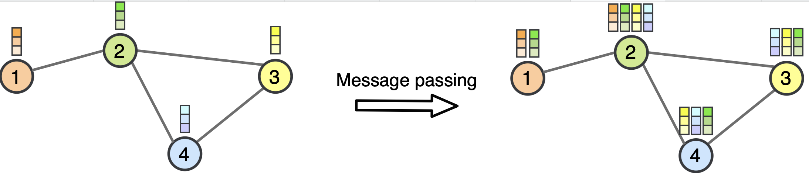
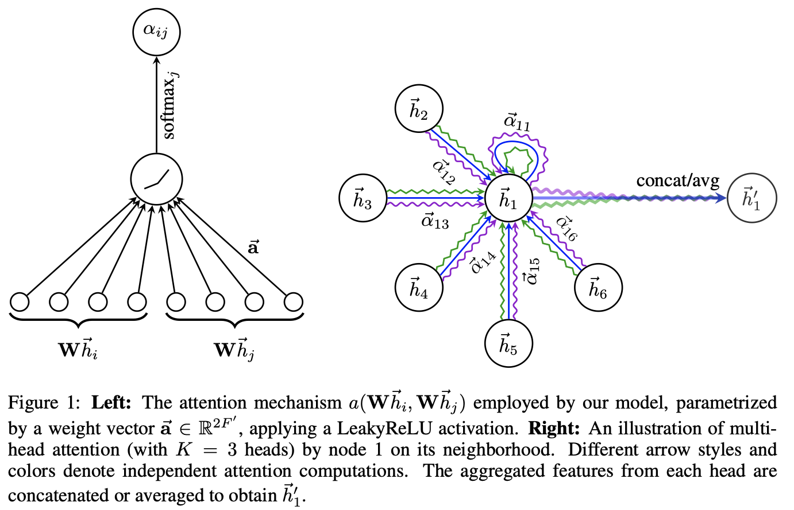

---
output:
  html_document: default
  pdf_document: default
---
<!-- ::: watermark -->
<!--  -->
<!-- ::: -->

# Graph Neural Network
## ¿Qué es una Graph Neural Network?

Las Graph Neural Network son una combinación de redes neuronales con datos no estructurados en forma de gráficas. Dicha combinación permite incorporar al proceso de aprendizaje las relaciones entre los datos.

Este proceso es interesante, pues en el diseño de las redes neuronales se debe incorporar la estructura subyacente de las gráficas para enriquecer las predicciones

## Consideraciones sobre PyTorch Geometric

Como hemos comentado previamente, PyTorch Geometric (https://pytorch-geometric.readthedocs.io/en/2.7.0/index.html)
es una libreria de Python que está escrita basándose en el framework.

Formato de las aristas de las gráficas:
  * Para los ejes de las gráficas, se emplea el formato COO
  * La libreria provee utilidades para convertir una matriz de adyancecias a dicho formato COO y viceversa.

## Graph Convolutional Networks (GNN)

Para entender las GCN, primero debemos mirar hacia las CNN (Convolutional Neural
Networks) tradicionales. Las CNN son herramientas imágenes, pero las
imágenes son, en esencia, grafos muy ordenados como una rejilla perfecta de píxeles.

```{r echo=FALSE, fig.align='center'}
knitr::include_graphics("img/21-gnn/conv_nn.png")
```

El problema surge cuando los datos son no euclidianos. Por ejemplo, en una red
social un usuario puede tener 5 amigos, otro 500. No hay un orden fijo y no
existe precisamente una dirección de "arriba" o "abajo" clara como en una foto.

De hecho, en una red social la estructura de conexiones es irregular y dinámica.

Esto motiva la necesidad tener modelos que extraigan características e 
información de los nodos (quienes son los usuarios) y de la estructura local 
(quiénes son sus amigos y cómo se relacionan).

## ¿Cómo funcionan?

Dichas redes fueron introducidas por Thomas N. Kipf y Max Welling (ver
https://openreview.net/pdf?id=SJU4ayYgl). La idea central de una convolución en
grafos es el *Message Passing*, es decir, que la estructura de una gráfica
permite que los nodos compartan la información de sus features junto con sus
vecinos en la red y ponderandolo por los pesos que la red aprende en su proceso
de entrenamiento.

Esto generaliza en algún sentido la acción de las redes convolucionales que procesan
imagenes, pero en vez de deslizar una ventana cuadrada (filtro) sobre píxeles, 
los nodos "interrogan" a sus vecinos.

```{r echo=FALSE, fig.align='center'}

```


El proceso se resume en tres pasos clave que ocurren en cada capa: 1) **Agregación:** Cada nodo recolecta las características (vectores de datos) de sus vecinos inmediatos. Dado que las gráficas pueden ser etiquetadas de forma distinta, es de particular interés que las tranformaciones de agregación sean *invariantes bajo permutaciones*, 2) **Actualización:** El nodo combina esa información vecina con su propia información actual, 3) **Transformación:** Se aplica una función matemática (normalmente una matriz de pesos aprendible y una función de activación como ReLU) para generar una nueva representación del nodo.

Para mayor referencia, presentamos una expresion matematica de como se lleva
a cabo éste proceso en tales redes:

\begin{equation}
h_i^{(l+1)} = \sigma \left( \sum_{j \in \mathcal{N}(i) \cup \{i\}} \frac{1}{c_{ij}} h_j^{(l)} W^{(l)} \right)
\end{equation}

* $\mathcal{N}(i) \cup \{i\}$: Representa la vecindad del nodo $i$ incluyendo al
propio nodo (esto se conoce como añadir \textit{self-loops} para no olvidar la información propia).
* $h_j^{(l)}$: El estado del nodo vecino $j$ en la capa anterior.
* $W^{(l)}$: Una matriz de pesos compartida que la red aprende durante el entrenamiento.
* $c_{ij}$: Un factor de normalización (típicamente $\sqrt{d_i d_j}$) que evita
que los nodos con muchos vecinos tengan valores excesivamente altos, estabilizando el proceso de entrenamiento.
* $\sigma$: Una función de activación no lineal (como $\text{ReLU}$ o $\text{Sigmoid}$).
* $h_i^{(l+1)}$: Es el nuevo vector de características (\textit{embedding}) del nodo $i$ tras la convolución.

**Nota:** En el capítulo previo, el ejemplo con el que se introdujo a las
GNN's, la matriz de adyacencias no se normalizó.


Alternativamente, la red se puede presentar en forma matricial:

\begin{equation}
H^{(l+1)} = \sigma \left( \tilde{D}^{-\frac{1}{2}} \tilde{A} \tilde{D}^{-\frac{1}{2}} H^{(l)} W^{(l)} \right)
\end{equation}

* $H^{(l)} \in \mathbb{R}^{N \times F}$: Matriz de activaciones en la capa $l$.
* $\tilde{A} = A + I_N$: Matriz de adyacencia con auto-bucles (self-loops).
* $\tilde{D}_{ii} = \sum_j \tilde{A}_{ij}$: Matriz diagonal de grados de $\tilde{A}$.
* $W^{(l)} \in \mathbb{R}^{F \times F'}$: Matriz de pesos entrenables para la capa $l$.
* $\sigma(\cdot)$: Función de activación no lineal (e.g., ReLU).

La siguiente es una representación de una GNN con capaz convolucionales:

```{r echo=FALSE, fig.align='center', out.width="120%"}
knitr::include_graphics("img/21-gnn/gcn_web.png")
```


La representación matricial nos ayuda a tener una intución de cómo red conjunta
en el problema a difernetes ejes; por un lado  involucra un componente estrutural
al basarse directamente en los nodos y compartes informacion con su vecindad. En
segund termino a través de dicha herramienta los nodos comparten información
resumida de todos los nodos que están a k pasos de distancia de él.

Adicionalmente, utilizan representaciones matriciales de la teoria de gráficas
clásica como la matriz de adyacencias, la diognal de grados o el Laplaciano del
Grafo para operar en el dominio de las frecuencias.

## Implementación en PyTorch Geometric

### Ejemplo: Predicción del volumen de tráfico en Wikipedia (Regresión)

El siguiente ejemplo muestra como emplear las GCN para predecir el volumen de tráfico
en algunos sitios Wikipedia, es decir es un problema de Regresión.

En este sentido, los datos se recopilaron de la Wikipedia en inglés (diciembre de 2018).
Tales se asocian a redes de páginas sobre temas específicos (camaleones, cocodrilos y ardillas) donde los nodos representan artículos y las aristas son enlaces mutuos entre ellos. 

El archivo .csv que se lee en el codigo  contiene los identificadores de los nodos
y el tráfico mensual promedio entre octubre de 2017 y noviembre de 2018 para cada página.

https://snap.stanford.edu/data/wikipedia-article-networks.html

```{python}
import torch
import numpy as np
import matplotlib.pyplot as plt
#import seaborn as sns
import pandas as pd
from torch_geometric.datasets import WikipediaNetwork
from torch_geometric.nn import GCNConv
import torch.nn.functional as F
import torch_geometric.transforms as T
from sklearn.metrics import mean_squared_error, mean_absolute_error

# Clase para dividir los nodos en train, test y validation
chameleon_transform = T.RandomNodeSplit(num_val=300, num_test=300)
```

Descargamos la data:


```{python}
dataset = WikipediaNetwork(
    root="./data/",
    name="chameleon",
    transform = chameleon_transform
)

data = dataset[0]
```

Ahora visualizemos el gráfico:

```{python}
import networkx as nx
from torch_geometric.utils import (
  to_dense_adj, to_networkx
)
import random

class GraphUtils:
    @staticmethod
    def create_adjacency_matrix(data):
        # Crea matriz de adyacencia
        adjacency = to_dense_adj(data.edge_index)[0]
        # Agrega una diagonal de unos (auto-referencia a nodos)
        adjacency = adjacency + torch.eye(len(adjacency))
        return adjacency

    @staticmethod
    def convert_to_networkx(graph, n_sample=None):
        g = to_networkx(graph, node_attrs=["x"])
        y = graph.y.numpy()
    
        if n_sample is not None:
            sampled_nodes  = random.sample(list(g.nodes), n_sample)
            g = g.subgraph(sampled_nodes)
            y = y[sampled_nodes]
    
        return g, y
    
    @staticmethod
    def plot_graph(g, y):
        plt.figure(figsize=(9, 7))
        nx.draw_spring(g, node_size=30, arrows=False, node_color=y)
        plt.show() 
```

Algunas estadisticas

```{python}
print()
print(data)
print('===========================================================================================================')

# Gather some statistics about the graph.
print(f'Number of nodes: {data.num_nodes}')
print(f'Number of edges: {data.num_edges}')
print(f'Average node degree: {data.num_edges / data.num_nodes:.2f}')
print(f'Number of training nodes: {data.train_mask.sum()}')
print(f'Training node label rate: {int(data.train_mask.sum()) / data.num_nodes:.2f}')
print(f'Has isolated nodes: {data.has_isolated_nodes()}')
print(f'Has self-loops: {data.has_self_loops()}')
print(f'Is undirected: {data.is_undirected()}')
```

La siguiente es una grafica de 1,000 nodos de Cora:

```{python}
g, y = GraphUtils.convert_to_networkx(data, n_sample=1000)
GraphUtils.plot_graph(g, y)  
```
Ahora leeremos los datos de trafico a los sitios:


```{python}
df = pd.read_csv('./data/wikipedia/chameleon/musae_chameleon_target.csv')
```

Este archivo contiene el tráfico, medido en cantidas de visitas, que representan
los nodos del conjunto (sitios web de Wikipedia).

```{python}
df.head()
```
Vamos a concentranos en predecir el logaritmo de las visitas:

```{python}
values = np.log10(df['target'])
df['target'] = values
```

Ahora definiremos una red basada en capas de GCN para predeir el tráfico a los
nodos:

```{python}
class GCNRegressor(torch.nn.Module):
    def __init__(self, dim_in, dim_h, dim_out):
        super().__init__()
        self.gcn1 = GCNConv(dim_in, dim_h * 4)
        self.gcn2 = GCNConv(dim_h * 4, dim_h * 2)
        self.gcn3 = GCNConv(dim_h * 2, dim_h)
        self.linear = torch.nn.Linear(dim_h, dim_out)

    def forward(self, x, edge_index):
        h = self.gcn1(x, edge_index)
        h = torch.relu(h)
        h = F.dropout(h, p=0.5, training=self.training)
        h = self.gcn2(h, edge_index)
        h = torch.relu(h)
        h = F.dropout(h, p=0.5, training=self.training)
        h = self.gcn3(h, edge_index)
        h = torch.relu(h)
        h = self.linear(h)
        return h

    def fit(self, data, epochs):
        optimizer = torch.optim.Adam(
            self.parameters(),
            lr=0.02,
            weight_decay=5e-4
            )

        self.train()

        for epoch in range(epochs + 1):
            optimizer.zero_grad()
            out = self(data.x, data.edge_index)
            loss = F.mse_loss(
                out.squeeze()[data.train_mask],
                data.y[data.train_mask].float()
                )
            loss.backward()
            optimizer.step()
            if epoch % 20 == 0:
                val_loss = F.mse_loss(
                    out.squeeze()[data.val_mask],
                    data.y[data.val_mask]
                    )
                print(f"Epoch {epoch:>3} | Train Loss: {loss:.5f} | Val Loss: {val_loss:.5f}")

    def test(self, data):
        self.eval()
        out = self(data.x, data.edge_index)
        return F.mse_loss(out.squeeze()[data.test_mask], data.y[data.test_mask].float())
```

Ahora instanciamos el modelo:

```{python}
gcn_regressor = GCNRegressor(dataset.num_features, dim_h=128, dim_out=1)
print(gcn_regressor)
```

```{python}
gcn_regressor.fit(data, epochs=200)
loss = gcn_regressor.test(data)
print(f'\nGCN test loss: {loss:.5f}\n')
```
Ahora veamos los resultados con distintas metricas en el conjunto de test:

```{python}
out = gcn_regressor(data.x, data.edge_index)
y_pred = out.squeeze()[data.test_mask].detach().numpy()
mse = mean_squared_error(data.y[data.test_mask], y_pred)
mae = mean_absolute_error(data.y[data.test_mask], y_pred)
print('=' * 43)
print("GNN for Regression")
print("Chameleon Dataset - Traffic Prediction")
print(f'MSE = {mse:.4f} | RMSE = {np.sqrt(mse):.4f} | MAE = {mae:.4f}')
print('=' * 43)
```


```{python}
def plot_true_vs_predicted(y_true, y_pred):
    # Convert to numpy if they are torch tensors
    if hasattr(y_true, "detach"):
        y_true = y_true.detach().cpu().numpy()
    if hasattr(y_pred, "detach"):
        y_pred = y_pred.detach().cpu().numpy()
    
    # Ensure arrays are flattened (1D)
    y_true = y_true.flatten()
    y_pred = y_pred.flatten()

    plt.figure(figsize=(8, 8))
    
    sns.scatterplot(x=y_true, y=y_pred, alpha=0.6)

    # Determine plot limits for the identity line
    min_val = min(np.min(y_true), np.min(y_pred))
    max_val = max(np.max(y_true), np.max(y_pred))

    # Add the identity line (y = x)
    plt.plot([min_val, max_val], [min_val, max_val], color='red', linestyle='--', label='Perfect Prediction')

    plt.title('True Values vs. Predicted Values', fontsize=16)
    plt.xlabel('True Values ($y$)', fontsize=14)
    plt.ylabel('Predicted Values ($\hat{y}$)', fontsize=14)
    plt.grid(True, linestyle=':', alpha=0.6)
    plt.legend()
    plt.show()

# Calling the function correctly
#plot_true_vs_predicted(data.y[data.test_mask], y_pred)
```


```{python}
def plot_residuals_distribution(y_true, y_pred):
    # 1. Convert to numpy and flatten
    if hasattr(y_true, "detach"):
        y_true = y_true.detach().cpu().numpy()
    if hasattr(y_pred, "detach"):
        y_pred = y_pred.detach().cpu().numpy()
    
    y_true = y_true.flatten()
    y_pred = y_pred.flatten()

    # 2. Calculate the residuals
    residuals = y_true - y_pred
    
    # 3. Calculate key statistics
    mean_residual = np.mean(residuals)
    std_residual = np.std(residuals)

    # 4. Initialize the plot
    plt.figure(figsize=(10, 6))
    
    # 5. Create the histogram and KDE plot
    sns.histplot(
        residuals, 
        bins=30, 
        kde=True, 
        color='skyblue', 
        edgecolor='black',
        line_kws={'linewidth': 3, 'color': 'darkblue', 'label': 'KDE Curve'}
    )
    
    # 6. Add a vertical line at the mean
    plt.axvline(
        x=mean_residual, 
        color='red', 
        linestyle='--', 
        linewidth=2, 
        label=f'Mean: {mean_residual:.4f}'
    )
    
    # 7. Add titles and labels
    plt.title('Distribution of Residuals (Errors)', fontsize=16)
    plt.xlabel('Residual ($y - \hat{y}$)', fontsize=14)
    plt.ylabel('Frequency', fontsize=14)
    
    # 8. Add text box for statistics
    stats_text = f'Mean: {mean_residual:.4f}\nStd Dev: {std_residual:.4f}'
    plt.text(
        0.95, 0.95, 
        stats_text, 
        transform=plt.gca().transAxes, 
        verticalalignment='top', 
        horizontalalignment='right',
        fontsize=12,
        bbox=dict(boxstyle="round,pad=0.5", facecolor='white', alpha=0.8)
    )
    
    plt.legend()
    plt.grid(True, linestyle=':', alpha=0.6, axis='y')
    plt.show()

#plot_residuals_distribution(data.y[data.test_mask], y_pred)
```

### Ejemplo: Clasificación de artículos de investigación por categoría

```{python}
from torch_geometric.datasets import Planetoid
from torch_geometric.transforms import NormalizeFeatures
```

```{python}
dataset = Planetoid(
    root='./data/',
    name='Cora',
    transform=NormalizeFeatures()
    )

print()
print(f'Dataset: {dataset}:')
print('======================')
print(f'Number of graphs: {len(dataset)}')
print(f'Number of features: {dataset.num_features}')
print(f'Number of classes: {dataset.num_classes}')

data = dataset[0]  # Get the first graph object.

print()
print(data)
print('===========================================================================================================')

# Gather some statistics about the graph.
print(f'Number of nodes: {data.num_nodes}')
print(f'Number of edges: {data.num_edges}')
print(f'Average node degree: {data.num_edges / data.num_nodes:.2f}')
print(f'Number of training nodes: {data.train_mask.sum()}')
print(f'Training node label rate: {int(data.train_mask.sum()) / data.num_nodes:.2f}')
print(f'Has isolated nodes: {data.has_isolated_nodes()}')
print(f'Has self-loops: {data.has_self_loops()}')
print(f'Is undirected: {data.is_undirected()}')
```

La arquitectura de la red es representada en la siguiente imagen:

```{r echo=FALSE, fig.align='center', out.width="120%"}
knitr::include_graphics("img/21-gnn/gcn_class_example.png")
```

Esta es su implementación:


```{python}
import torch
import torch.nn.functional as F
from torch_geometric.nn import GCNConv

class GCNClassifier(torch.nn.Module):
    def __init__(self, dim_in, dim_h, dim_out):
        super().__init__()
        torch.manual_seed(1234567)

        self.gcn1 = GCNConv(dim_in, dim_h)
        self.gcn2 = GCNConv(dim_h, dim_out)

    def forward(self, x, edge_index):
        h = self.gcn1(x, edge_index)
        h = torch.relu(h)
        h = F.dropout(h, p=0.5, training=self.training)
        h = self.gcn2(h, edge_index)
        return h

    def fit(self, data, epochs, lr=0.01, weight_decay=5e-4):
        optimizer = torch.optim.Adam(
            self.parameters(),
            lr=lr,
            weight_decay=weight_decay
        )
        criterion = torch.nn.CrossEntropyLoss()

        self.train()

        for epoch in range(epochs + 1):
            optimizer.zero_grad()

            out = self(data.x, data.edge_index)
            loss = criterion(
                out[data.train_mask],
                data.y[data.train_mask]
            )

            loss.backward()
            optimizer.step()

            if epoch % 10 == 0:
                val_acc = self.validate(data)
                print(
                    f"Epoch {epoch:>3} | "
                    f"Train Loss: {loss:.4f} | "
                    f"Val Acc: {val_acc:.4f}"
                )

    @torch.no_grad()
    def validate(self, data):
        self.eval()
        out = self(data.x, data.edge_index)
        pred = out.argmax(dim=1)
        correct = pred[data.val_mask] == data.y[data.val_mask]
        return correct.sum().item() / int(data.val_mask.sum())

    @torch.no_grad()
    def test(self, data):
        self.eval()
        out = self(data.x, data.edge_index)
        pred = out.argmax(dim=1)
        correct = pred[data.test_mask] == data.y[data.test_mask]
        return correct.sum().item() / int(data.test_mask.sum())
```

```{python}
model = GCNClassifier(
    dim_in=dataset.num_features,
    dim_h=16,
    dim_out=dataset.num_classes
)

model.fit(data, epochs=200)

test_acc = model.test(data)
print(f"Test Accuracy: {test_acc:.4f}")

```


```{python}
import matplotlib.pyplot as plt
from sklearn.manifold import TSNE

def visualize(h, color):
    z = TSNE(n_components=2).fit_transform(h.detach().cpu().numpy())

    plt.figure(figsize=(10,10))
    plt.xticks([])
    plt.yticks([])

    plt.scatter(z[:, 0], z[:, 1], s=70, c=color, cmap="Set2")
    plt.show()
```


```{python}   
out = model(data.x, data.edge_index)
visualize(out, color=data.y)
```

## Graph Attention Network (GAT)

En las convoluciones tradicionales (GCN), la información de los vecinos se
agrega de forma estática. Normalmente, se usa un promedio o un factor basado
únicamente en el grado (cuántos amigos tienes), pero no en quiénes son esos
amigos o qué tan relevantes son para una tarea específica. 

La limitación: No todos los vecinos son igual de importantes.

Por ejemplo, en una red de citaciones de articulos académicdos sobre Deep Learning,
un artículo sobre "Deep Learning" puede citar 50 artículos, pero solo 3 son sus
bases teóricas fundamentales. Desortunadamente una red GCN trataría a los 50 por igual.

Las GAT introducen el **mecanismo de atención**, permitiendo que cada nodo decida
dinámicamente qué vecinos "escuchar" más y cuáles ignorar.

### ¿Cómo funcionan?

En líneas generales, la atención describe un promedio ponderado de múltiples
elementos, cuyos pesos se calculan dinámicamente a partir de una consulta de
entrada y las claves de los elementos.

Así como en otros entornos de Deeo Learning, este concepto se puede aplicar de
forma similar a los grafos; uno de ellos es la Red de Atención de Grafos (GAT, 
propuesta por el equipo de Petar Veličković en 2017 (https://arxiv.org/abs/1710.10903).

De forma similar a la GCN, la capa de atención de grafos crea un mensaje para
cada nodo mediante una matriz lineal de capas y pesos. Para la atención, 
utiliza el mensaje del propio nodo como consulta y los mensajes a promediar como
claves y valores (tenga en cuenta que esto también incluye el mensaje a sí mismo).

La función de puntuación se implementa como una MLP de una capa que asigna la consulta y la clave a un único valor

Entrando a mayor detalle, la idea clave es que el factor de normalización $c_ij$
(que en las GCN era fijo) se convierta en un coeficiente de atención aprendible $\alpha_ij$

De este modo, el mecanismo de atención se obtiene a partir de un proceso para
calcular la nueva representación de un nodo i se divide en tres pasos:

* **Transformación Lineal:** Se aplica una matriz de pesos W a todas las
características de los nodos para proyectarlos a una dimensión superior.

* **Cómputo de Coeficientes** ($e_{ij}$: Se calcula una "puntuación" de importancia 
entre el nodo i y su vecino j usando un mecanismo de atención (usualmente una
pequeña red neuronal de una sola capa).

\begin{equation}
e_{ij} = a\left( \mathbf{W} \vec{h}_i, \mathbf{W} \vec{h}_j \right)
\end{equation}

* **Normalización (Softmax)** Se aplica la función Softmax sobre todos los vecinos
para que la suma de las importancias sea igual a 1.

\begin{equation}
\alpha_{ij} = \text{softmax}_j(e_{ij}) = \frac{\exp(e_{ij})}{\sum_{k \in \mathcal{N}(i)} \exp(e_{ik})}
\end{equation}

Multi-Head Attention (Atención de múltiples cabezales)

Para estabilizar el aprendizaje, las GAT no usan solo un mecanismo de atención,
sino varios en paralelo (como en los Transformers). Cada "cabezal" puede aprender
a enfocarse en diferentes tipos de relaciones.

\begin{equation}
\vec{h}_i^{(l+1)} = \sigma \left( \sum_{j \in \mathcal{N}(i)} \alpha_{ij} \mathbf{W} \vec{h}_j^{(l)} \right)
\end{equation}

```{r echo=FALSE, fig.align='center', out.width="120%"}

```

\begin{equation}
\alpha_{ij} = \frac{\exp\left(\text{LeakyReLU}\left(\mathbf{a}\left[\mathbf{W}h_i||\mathbf{W}h_j\right]\right)\right)}{\sum_{k\in\mathcal{N}_i} \exp\left(\text{LeakyReLU}\left(\mathbf{a}\left[\mathbf{W}h_i||\mathbf{W}h_k\right]\right)\right)}
\end{equation}

Enn resumen, los componentes de las GAT pueden esquematizarse como:

* $e_{ij}$: Es el coeficiente de atención (o puntuación) que indica la importancia de las características del nodo $j$ para el nodo $i$.
* $a(\cdot)$: Es un mecanismo de atención, generalmente implementado como una red neuronal de una sola capa (\textit{feed-forward}) que transforma la concatenación de los vectores de los nodos en un escalar.
* $\mathbf{W}$: Una matriz de pesos compartida que realiza una transformación lineal sobre las características de entrada de todos los nodos.
* $\alpha_{ij}$: Son los coeficientes de atención normalizados mediante la función \textit{softmax}, asegurando que la suma de las influencias de los vecinos de $i$ sea igual a 1.
* $\mathcal{N}(i)$: El conjunto de vecinos de primer orden del nodo $i$.
* $\vec{h}_i^{(l+1)}$: El nuevo vector de características generado para el nodo $i$, resultado de la suma ponderada de las características transformadas de su vecindad.
* $\exp(\cdot)$: La función exponencial, utilizada para calcular el peso relativo de cada conexión antes de la normalización.


## Implementación en PyTorch Geometric

### Ejemplo: Clasificación de artículos de investigación por categoría (Parte II)

Volveremos a trabajar con el conjunto de datos Cora, para predecir la categorìa
a la que pertnecen sus artìculos de investigacion. Como cambio, usaremos redes
GAT para revisar el cambio de performace en la predicción:

```{python}
import torch
import torch.nn.functional as F
from torch_geometric.nn import GATConv

class GATClassifier(torch.nn.Module):
    def __init__(self, dim_in, dim_h, dim_out, heads):
        super().__init__()
        torch.manual_seed(1234567)

        self.gat1 = GATConv(
            in_channels=dim_in,
            out_channels=dim_h,
            heads=heads,
            dropout=0.6
        )

        self.gat2 = GATConv(
            in_channels=dim_h * heads,
            out_channels=dim_out,
            heads=1,
            concat=False,
            dropout=0.6
        )

    def forward(self, x, edge_index):
        h = F.dropout(x, p=0.6, training=self.training)
        h = self.gat1(h, edge_index)
        h = F.elu(h)
        h = F.dropout(h, p=0.6, training=self.training)
        h = self.gat2(h, edge_index)
        return h

    def fit(self, data, epochs, lr=0.005, weight_decay=5e-4):
        optimizer = torch.optim.Adam(
            self.parameters(),
            lr=lr,
            weight_decay=weight_decay
        )
        criterion = torch.nn.CrossEntropyLoss()

        self.train()

        for epoch in range(epochs + 1):
            optimizer.zero_grad()

            out = self(data.x, data.edge_index)
            loss = criterion(
                out[data.train_mask],
                data.y[data.train_mask]
            )

            loss.backward()
            optimizer.step()

            if epoch % 10 == 0:
                val_acc = self.validate(data)
                test_acc = self.test(data)
                print(
                    f"Epoch {epoch:>3} | "
                    f"Train Loss: {loss:.4f} | "
                    f"Val Acc: {val_acc:.4f} | "
                    f"Test Acc: {test_acc:.4f}"
                )

    @torch.no_grad()
    def validate(self, data):
        self.eval()
        out = self(data.x, data.edge_index)
        pred = out.argmax(dim=1)
        correct = pred[data.val_mask] == data.y[data.val_mask]
        return correct.sum().item() / int(data.val_mask.sum())

    @torch.no_grad()
    def test(self, data):
        self.eval()
        out = self(data.x, data.edge_index)
        pred = out.argmax(dim=1)
        correct = pred[data.test_mask] == data.y[data.test_mask]
        return correct.sum().item() / int(data.test_mask.sum())

```

Ahora instanciamos el modelo:


```{python}
model = GATClassifier(
    dim_in=dataset.num_features,
    dim_h=6,
    dim_out=dataset.num_classes,
    heads=3
)

print(model)
```
Ahora entrenamos el modelo con capaz GAT:

```{python}
model.fit(data, epochs=50)
```
Ahora evaluamos al modelo:

```{python}
test_acc = model.test(data)
print(f"Final Test Accuracy: {test_acc:.4f}")
```

