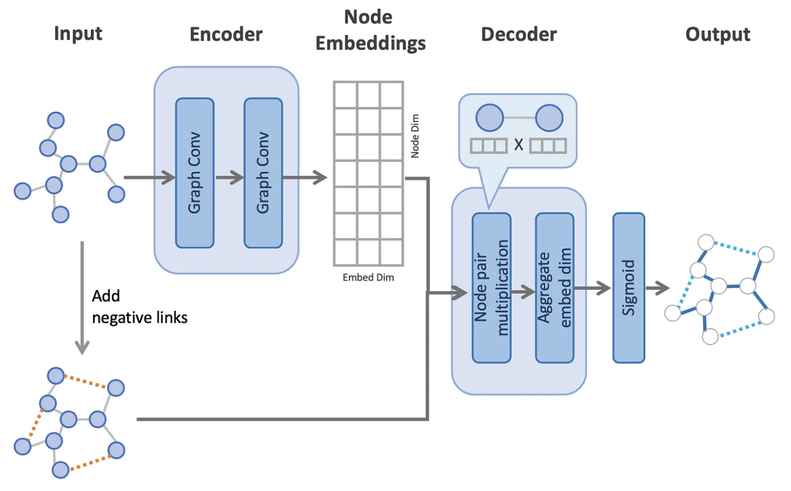

---
output:
  html_document: default
  pdf_document: default
---
<!-- ::: watermark -->
<!--  -->
<!-- ::: -->

# Embeddings y Graph Neural Network
## ¿Qué es un embedding?

XXX

## Node2Vec

Antes de que las GNN fueran el estándar, el reto era: ¿Cómo convertimos un nodo
de un grafo en un vector de números (embedding) que una red neuronal tradicional pueda entender?

La inspiración (DeepWalk y Word2vec): En NLP, word2vec demostró que las palabras
que aparecen en contextos similares tienen vectores similares. Node2vec nace de 
una idea brillante: Si las palabras son a las oraciones lo que los nodos son a 
los caminos aleatorios (random walks), podemos tratar un grafo como un lenguaje.

La motivación de node2vec específicamente fue mejorar a su predecesor, DeepWalk,
que era demasiado rígido. Node2vec surge para permitir que el algoritmo explore 
el grafo de forma más flexible, capturando tanto comunidades locales como roles estructurales.


Node2vec se basa en generar "paseos aleatorios" (random walks) desde cada nodo y
luego alimentar esos paseos a un modelo Skip-gram (el mismo de word2vec).

El mecanismo de búsqueda flexible

La innovación de node2vec es su caminata aleatoria sesgada (biased random walk),
controlada por dos parámetros:

Parámetro de Retorno (p): Controla la probabilidad de regresar inmediatamente al
nodo anterior. Un p bajo favorece la exploración local (BFS - Breadth-First Search),
capturando la similitud estructural (nodos que actúan como "hubs").

Parámetro de "In-out" (q): Controla la probabilidad de alejarse hacia nodos no visitados.
Un q bajo favorece la exploración profunda (DFS - Depth-First Search), capturando comunidades o macro-estructuras.

El proceso de optimización

El objetivo es maximizar la probabilidad de co-ocurrencia de nodos en una vecindad:

Donde f(u) es la función de mapeo (el embedding) que queremos aprender para el nodo u.

# Shallow Embeddinf

```{r echo=FALSE, fig.align='center', out.width="120%"}
knitr::include_graphics("img/21-gnn/shallow_node_embeddings.png")
```

La diferencia clave entre las incrustaciones de nodos superficiales
(p. ej., Node2Vec) y las incrustaciones de nodos profundos (p. ej., GNN) reside
en la elección del codificador. Específicamente, las técnicas de incrustación de
nodos superficiales se basan en la incrustación de nodos en representaciones 
vectoriales de baja dimensión mediante una tabla de búsqueda de incrustaciones
superficiales, de modo que se maximiza la probabilidad de preservar las
vecindades; es decir, los nodos cercanos deberían recibir incrustaciones similares,
mientras que los nodos distantes deberían recibir incrustaciones distintas. Estas
técnicas generalizan el famoso modelo SkipGram para obtener incrustaciones de
palabras de baja dimensión, en el que las secuencias de palabras se interpretan
ahora como secuencias de nodos, p. ej., dadas mediante recorridos generados
aleatoriamente:


Específicamente, dado un recorrido aleatorio de longitud que comienza en el nodo,
el objetivo es maximizar la probabilidad de observar el nodo dado el nodo. 

Este objetivo se puede entrenar eficientemente mediante el descenso de gradiente
estocástico en un escenario de aprendizaje contrastivo, en el que los recorridos
inexistentes (denominados ejemplos negativos) se muestrean y entrenan conjuntamente,
lo que denota la función. Cabe destacar que el producto escalar entre las 
incrustaciones se utiliza habitualmente para medir la similitud, pero también son
aplicables otras medidas de similitud.

Es importante destacar que las incrustaciones de nodos superficiales se entrenan
de forma no supervisada y pueden utilizarse como entrada para una tarea posterior
determinada; por ejemplo, en tareas a nivel de nodo, pueden utilizarse directamente
como entrada para un clasificador final. Para tareas a nivel de borde, las
representaciones a nivel de borde se pueden obtener mediante el promedio o el
producto de Hadamard.

A pesar de la simplicidad de las técnicas de incrustación de nodos, también presentan
ciertas deficiencias. En particular, no incorporan información rica de características
asociada a nodos y aristas, y no pueden aplicarse fácilmente a grafos no visibles,
ya que los parámetros aprendibles están fijados a los nodos de un grafo en particular
(lo que hace que este enfoque sea transductivo por naturaleza y difícil de escalar
debido a la complejidad de los parámetros). Sin embargo, sigue siendo una técnica
común para preservar la información estructural del grafo en vectores de tamaño fijo,
y a menudo también se utiliza para generar entradas a las GNN para su posterior
procesamiento en caso de que el conjunto inicial de características de los nodos
no sea rico.


# SageConv

La mayoría de los modelos anteriores (como GCN o node2vec) asumen que el grafo
es estático y que todos los nodos están presentes durante el entrenamiento. Esto
se conoce como aprendizaje transductivo.

El problema: En el mundo real (como en la red de Amazon o Twitter), el grafo 
cambia cada segundo.

Si llega un usuario nuevo, los modelos transductivos no saben qué hacer; tendrías
que reentrenar todo el modelo desde cero para generar un embedding para ese nuevo nodo.

GraphSAGE (SAGE viene de SAmple and aggreGatE) fue diseñado para ser inductivo:
aprende una función de agregación, no un embedding fijo. Esto le permite generar
representaciones para nodos que nunca vio durante el entrenamiento.

2. Ideas Generales: ¿Cómo funciona SAGEConv?
A diferencia de las GCN que utilizan la matriz de adyacencia completa, SAGEConv
opera mediante un proceso de muestreo de vecindad.

Los dos pilares de GraphSAGE:

Muestreo (Sampling): En lugar de usar todos los vecinos (que podrían ser miles),
SAGEConv selecciona un subconjunto aleatorio de tamaño fijo. Esto hace que el
tiempo de cómputo sea predecible y constante.

Agregación (Aggregation): SAGEConv no se limita a un promedio. Permite usar
diferentes funciones para "resumir" la información de los vecinos:

Mean aggregator: Promedio de los vectores.

LSTM aggregator: Usa una red LSTM (aplicada a una permutación aleatoria de los vecinos).

Pooling aggregator: Aplica una red densa seguida de un operador de máximo (MAX).


Paso 1: Agregación de la vecindad

Primero, se recolecta la información de los vecinos muestreados:

Fragmento de código
\begin{equation}
h_{\mathcal{N}(i)}^{(k)} = \text{aggregate}_k \left( \{ h_j^{(k-1)}, \forall j \in \mathcal{N}(i) \} \right)
\end{equation}
Paso 2: Combinación y actualización

Luego, se concatena la información agregada con la representación actual del nodo y se proyecta:

Fragmento de código
\begin{equation}
h_i^{(k)} = \sigma \left( \mathbf{W}^{(k)} \cdot \text{concat}(h_i^{(k-1)}, h_{\mathcal{N}(i)}^{(k)}) \right)
\end{equation}
Desglose de los componentes:

Fragmento de código
* $h_{\mathcal{N}(i)}^{(k)}$: Representación agregada de los vecinos del nodo $i$ en la capa $k$.
*$\text{aggregate}_k$: Función de agregación (puede ser \textit{Mean, Pooling} o \textit{LSTM}).
* $\text{concat}(\cdot, \cdot)$: Operación de concatenación que preserva la identidad del nodo central diferenciándola de su contexto.
* $\mathbf{W}^{(k)}$: Matriz de pesos aprendible de la capa $k$.
* $\sigma$: Función de activación no lineal.

## Implementación en PyTorch Geometric

### Ejemplo: Clasificación de artículos de investigación por categoría (Parte II)

La arquitecura del ejemplo es la siguiente:

```{r echo=FALSE, fig.align='center', out.width="120%"}

```


```{python}
import torch
from torch import nn
import torch.nn.functional as F
from torch_geometric.nn import SAGEConv
from torch_geometric.utils import negative_sampling
from torch_geometric.loader import DataLoader
from tqdm.notebook import tqdm

```


```{python}

class GraphSAGELinkPredictor(nn.Module):
    def __init__(
        self,
        dim_in,
        dim_h,
        num_gnn_layers,
        num_mlp_layers,
        dropout
    ):
        super().__init__()
        torch.manual_seed(1234567)

        # -------- GNN encoder (GraphSAGE) --------
        self.convs = nn.ModuleList()
        self.convs.append(SAGEConv(dim_in, dim_h))
        for _ in range(num_gnn_layers - 1):
            self.convs.append(SAGEConv(dim_h, dim_h))

        self.dropout = dropout
        self.num_gnn_layers = num_gnn_layers

        # -------- Link predictor (MLP) --------
        self.lins = nn.ModuleList()
        self.lins.append(nn.Linear(dim_h, dim_h))
        for _ in range(num_mlp_layers - 2):
            self.lins.append(nn.Linear(dim_h, dim_h))
        self.lins.append(nn.Linear(dim_h, 1))

    # -------------------------------------------------
    # GNN encoder
    # -------------------------------------------------
    def encode(self, x, edge_index):
        for conv in self.convs:
            x = conv(x, edge_index)
            x = F.relu(x)
            x = F.dropout(x, p=self.dropout, training=self.training)
        return x

    # -------------------------------------------------
    # Link predictor
    # -------------------------------------------------
    def decode(self, z_i, z_j):
        h = z_i * z_j
        for lin in self.lins[:-1]:
            h = lin(h)
            h = F.relu(h)
            h = F.dropout(h, p=self.dropout, training=self.training)
        h = self.lins[-1](h)
        return torch.sigmoid(h).view(-1)

    # -------------------------------------------------
    # Full forward (edges explicit)
    # -------------------------------------------------
    def forward(self, x, edge_index, edge_pairs):
        z = self.encode(x, edge_index)
        return self.decode(z[edge_pairs[0]], z[edge_pairs[1]])

    # -------------------------------------------------
    # Training loop
    # -------------------------------------------------
    def fit(
        self,
        data,
        epochs,
        batch_size,
        lr=1e-3,
        weight_decay=0
    ):
        optimizer = torch.optim.Adam(
            self.parameters(),
            lr=lr,
            weight_decay=weight_decay
        )

        self.train()

        pos_edges = data.pos_edge_label_index.T

        for epoch in range(epochs):
            epoch_losses = []

            for edge_id in tqdm(
                DataLoader(range(pos_edges.shape[0]), batch_size, shuffle=True),
                leave=False
            ):
                optimizer.zero_grad()

                # Encode nodes
                z = self.encode(data.x, data.edge_index)

                # Positive edges
                pos_edge = pos_edges[edge_id].T
                pos_pred = self.decode(
                    z[pos_edge[0]],
                    z[pos_edge[1]]
                )

                # Negative edges
                neg_edge = negative_sampling(
                    edge_index=data.edge_index,
                    num_nodes=data.num_nodes,
                    num_neg_samples=edge_id.shape[0],
                    method="dense"
                ).T

                neg_pred = self.decode(
                    z[neg_edge[0]],
                    z[neg_edge[1]]
                )

                # Binary cross-entropy loss (manual, stable)
                loss = (
                    -torch.log(pos_pred + 1e-15).mean()
                    -torch.log(1 - neg_pred + 1e-15).mean()
                )

                loss.backward()
                optimizer.step()

                epoch_losses.append(loss.item())

            print(
                f"Epoch {epoch:03d} | "
                f"Train Loss: {sum(epoch_losses) / len(epoch_losses):.5f}"
            )

    # -------------------------------------------------
    # Evaluation
    # -------------------------------------------------
    @torch.no_grad()
    def test(self, data):
        self.eval()

        z = self.encode(data.x, data.edge_index)
        pos_edge = data.pos_edge_label_index
        neg_edge = data.neg_edge_label_index

        pos_pred = self.decode(z[pos_edge[0]], z[pos_edge[1]])
        neg_pred = self.decode(z[neg_edge[0]], z[neg_edge[1]])

        preds = torch.cat([pos_pred, neg_pred])
        labels = torch.cat([
            torch.ones(pos_pred.size(0)),
            torch.zeros(neg_pred.size(0))
        ]).to(preds.device)

        return F.binary_cross_entropy(preds, labels).item()

```


```{python}
device = torch.device("cuda" if torch.cuda.is_available() else "cpu")

model = GraphSAGELinkPredictor(
    dim_in=1,
    dim_h=1024,
    num_gnn_layers=2,
    num_mlp_layers=3,
    dropout=0.3
).to(device)

train_graph = train_graph.to(device)

```


```{python}
model.fit(
    data=train_graph,
    epochs=10,
    batch_size=1024,
    lr=1e-5,
    weight_decay=0
)
```


```{python}

```


```{python}

```


```{python}

```


```{python}

```


