```{r setup, include=FALSE}
knitr::opts_chunk$set(
 echo = TRUE,
 warning = FALSE, 
 message = FALSE
 )

```

# BIENVENIDA {.unnumbered}

## Objetivo {.unnumbered}

Brindar al participante los elementos teóricos y prácticos básicos alrededor de la programación de ***REDES NEURONALES ARTIFICIALES***. Aprenderá las definiciones y aprenderá a distinguir estrategias y diferentes soluciones a problemas que pueden resolverse con algoritmos de deep learning y aprenderá a usar el conjunto de librerías en **Python** más novedoso, estructuradas y ampliamente usadas para la creación de estructuras neuronales aplicadas a problemas predictivos, clasificación y segmentación de imagenes, series de tiempo, procesamiento de lenguaje natural (NLP), etc.

```{r echo=FALSE, fig.align='center', out.height='350pt', out.width='600pt'}

```

## Alcances del Programa {.unnumbered}

Al finalizar este curso, el participante será capaz de consumir, manipular y visualizar información para resolver problemas de propósito general asociados a los datos. Apenderá a implementar diferentes algoritmos de machine learning y mejorar su desempeño predictivo en problemas de clasificación, regresión y segmentación.

Requisitos:

-   Computadora con al menos 8Gb Ram
-   Instalar Python con versión 3.11 o superior
-   Instalar un IDE preferido. Jupyter, RStudio, Spyder, VSCode, Colab

### Temario: {.unnumbered}

**00. Instalación**

**01. Introducción a Deep Learning**

**02. Preliminares**

**03. Redes Neuronales Lineales para Regresión**

**04. Redes neuronales Lineales para Clasificación**

**05. Perceptrón Multicapa**

**06. Guía del Constructor**

**07. Redes Neuronales Convolucionales**

**08. Redes Neuronales Convolucionales Modernas**

**09. Redes Neuronales Recurrentes**

**10. Redes Neuronales Recurrentes Modernas**

**11. Mecanismos de Atención y Transformers**

**12. Algoritmos de Optimización**

**13. Desempeño Computacional**

**14. Visión por Computadora**

**15. Procesamiento de Lenguaje Natural: Pre-entrenamiento**

**16. Procesamiento de Lenguaje Natural: Aplicaciones**

**17. Aprendizaje por Refuerzo**

**18. Procesos Gausianos**

**19. Optimización paramétrica**

**20. Redes Generativas Adversarias**

```{r echo=FALSE,fig.align='center',  out.width='500pt'}
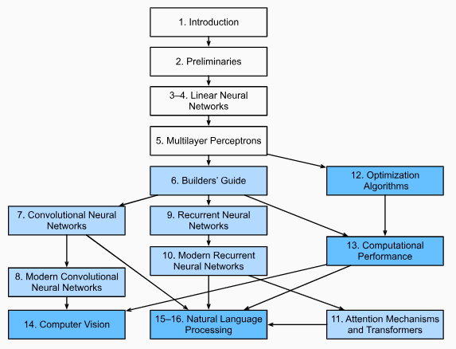
```

## Código {.unnumbered}

La mayoría de las secciones de este material presentan código ejecutable. En definitiva algunas intuiciones se desarrollan mejor mediante ensayo y error, modificando el código poco a poco y observando los resultados.

El código será presentado en chunks visibles y detacados respecto del resto del texto. Este puede ser copiador mediante el botón superior del lado derecho para su revisión y replicación en algún otro ambiente de prueba.

```{python, eval=F}
import collections
import hashlib
import inspect
import math
import os
import random
import re
import shutil
import sys
import tarfile
import time
import zipfile
from collections import defaultdict
import pandas as pd
import requests
from IPython import display
from matplotlib import pyplot as plt
from matplotlib_inline import backend_inline
```

## Duración y evaluación del programa {.unnumbered}

-   El programa tiene una duración de XXX hrs.

-   Las sesiones serán atendidas los días XxXx, de 4:30 pm a 5:45 pm

-   Serán asignados ejercicios que el participante deberá resolver entre una semana y otra.

-   Durante todo el programa se realizarán prácticas para reforzar el aprendizaje.

## Recursos y dinámica {.unnumbered}

### Agenda {-}

Todos los participantes del Hub podrán participar aprendiendo y compartiendo el conocimiento.

Este es nuestro [documento](https://docs.google.com/spreadsheets/d/1ZbMttnLjYRvaW6ppJBMQ9YZmoBHiVUZjC9y96IOr03E/edit?gid=1890664429#gid=1890664429) para organizarnos internamente en cuanto a los temas a impartir, fechas y orden en que se irá compartiendo cada tema.

### Software {-}

En esta clase estaremos usando:

-   Python [da click aquí si aún no lo descargas](https://www.python.org/downloads/)
-   R & RStudio [da click aquí también](https://posit.co/downloads/)
-   Reticulate [da click para aprender](https://anderfernandez.com/blog/reticulate-usar-python-en-r/)
-   Bookdown [da click aquí también](https://bookdown.org/yihui/bookdown/)

### Bibliografía {-}

<table>
  <tr>
    <td style="width:150px; vertical-align:top;">
      <a href="https://D2L.ai" target="_blank">
        
      </a>
    </td>
    <td style="vertical-align:top; padding-left:15px;">
      **Dive into Deep Learning**  
      Autor: Zhang, Aston and Lipton, Zachary C. and Li, Mu and Smola, Alexander J. 
      Editorial: Cambridge University Press  
      Año: 2023  
   </td>
  </tr>  
  
  <tr>
    <td style="width:150px; vertical-align:top;">
      <a href="https://personalpages.manchester.ac.uk/staff/mingfei.sun/books/deep-learning.pdf" target="_blank">
        
      </a>
    </td>
    <td style="vertical-align:top; padding-left:15px;">
      **Deep Learning Foundations and Concepts**  
      Autor: Christopher M. Bishop with Hugh Bishop  
      Editorial: Springer  
      Año: 2023  
      ISBN: 978-3-031-45467-7
   </td>
  </tr>  
  
  <tr>
    <td style="width:150px; vertical-align:top;">
      <a href="http://14.139.161.31/OddSem-0822-1122/Hands-On_Machine_Learning_with_Scikit-Learn-Keras-and-TensorFlow-2nd-Edition-Aurelien-Geron.pdf" target="_blank">
        
      </a>
    </td>
    <td style="vertical-align:top; padding-left:15px;">
      **Hands On Machine Learning with Scikit-Learn, Keras and TensorFlow**  
      Autor: Aurélien Géron  
      Editorial: O´REILLY  
      Año: 2019  
      ISBN: 978-1-492-03264-9
    </td>
  </tr>
  
  <tr>
    <td style="width:150px; vertical-align:top;">
      <a href="https://www.andrew.cmu.edu/course/10-703/textbook/BartoSutton.pdf" target="_blank">
        
      </a>
    </td>
    <td style="vertical-align:top; padding-left:15px;">
      **Reinforcement Learning**  
      Autor: Richard S. Sutton, Andrew G. Barto  
      Editorial: The MIT Press  
      Año: 2018  
      ISBN: 978-0-262-19398-6
   </td>
  </tr>  

  <tr>
    <td style="width:150px; vertical-align:top;">
      <a href="https://bookdown.org/yihui/bookdown/" target="_blank">
        
      </a>
    </td>
    <td style="vertical-align:top; padding-left:15px;">
      **Bookdown**  
      Autor: Yihui Xie  
      Editorial: The R Series  
      Año: 2025  
   </td>
  </tr>  

</table>

<!--chapter:end:index.Rmd-->

---
output:
  pdf_document: default
  html_document: default
---

<!-- ::: watermark -->

<!--  -->

<!-- ::: -->

# Introducción a Deep Learning

El aprendizaje profundo (*deep learning*) ha transformado radicalmente campos como la visión por computadora, el procesamiento del lenguaje natural, la robótica y la bioinformática. En este capítulo examinaremos qué ha impulsado su crecimiento exponencial, presentaremos algunos de los problemas más comunes que resuelve y haremos un recorrido por sus raíces históricas.

## Introducción al aprendizaje automático

El aprendizaje automático se define como el campo de estudio que da a las computadoras la capacidad de aprender sin ser programadas explícitamente (Arthur Samuel, 1959). Formalmente, un algoritmo de *machine learning* mejora su desempeño en una tarea $T$, medido por una métrica $P$, a medida que adquiere más experiencia $E$.

### Motivación: Los paradigmas del conocimiento

A lo largo de la historia, la humanidad ha transitado por distintas formas de generar y utilizar conocimiento:

-   **Era empírica**: basada en la observación directa y la experiencia.
-   **Era teórica**: dominada por modelos matemáticos y leyes físicas (por ejemplo, la mecánica newtoniana).
-   **Era computacional**: donde simulaciones numéricas permiten explorar sistemas complejos.
-   **Era de los datos**: en la que los patrones emergen no de ecuaciones, sino de grandes volúmenes de datos observados.

```{r echo=FALSE, fig.align='center'}
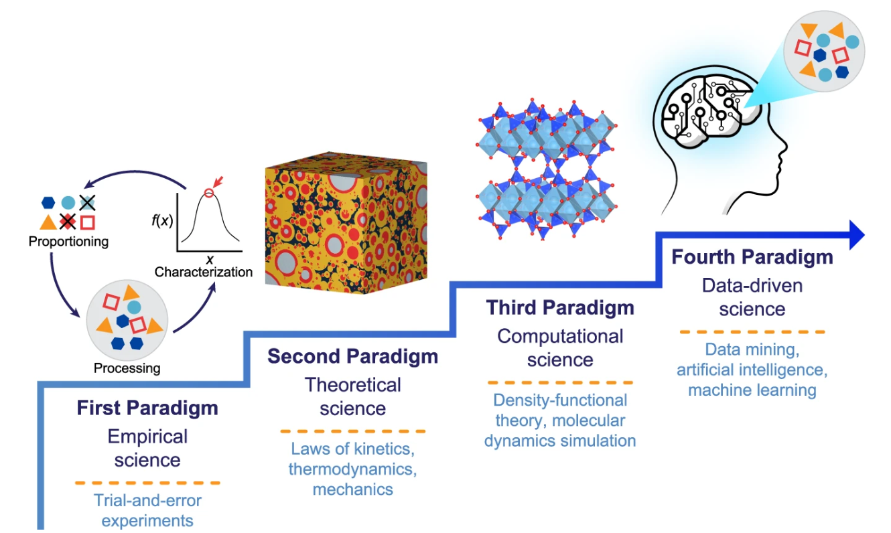
```

Para entender un poco más sobre estos paradigmas del conocimiento un paper muy interesante que estaba leyendo hace un tiempo ["Machine learning in concrete science: applications, challenges, and best practices"](https://www.nature.com/articles/s41524-022-00810-x) habla acerca de la evolución de la ciencia del concreto en estos paradigmas y la relevancia exponencial que han jugado los algoritmos de aprendizaje automatico al hacer nuevos descubrimientos en estos campos.

```{r echo=FALSE, fig.align='center'}
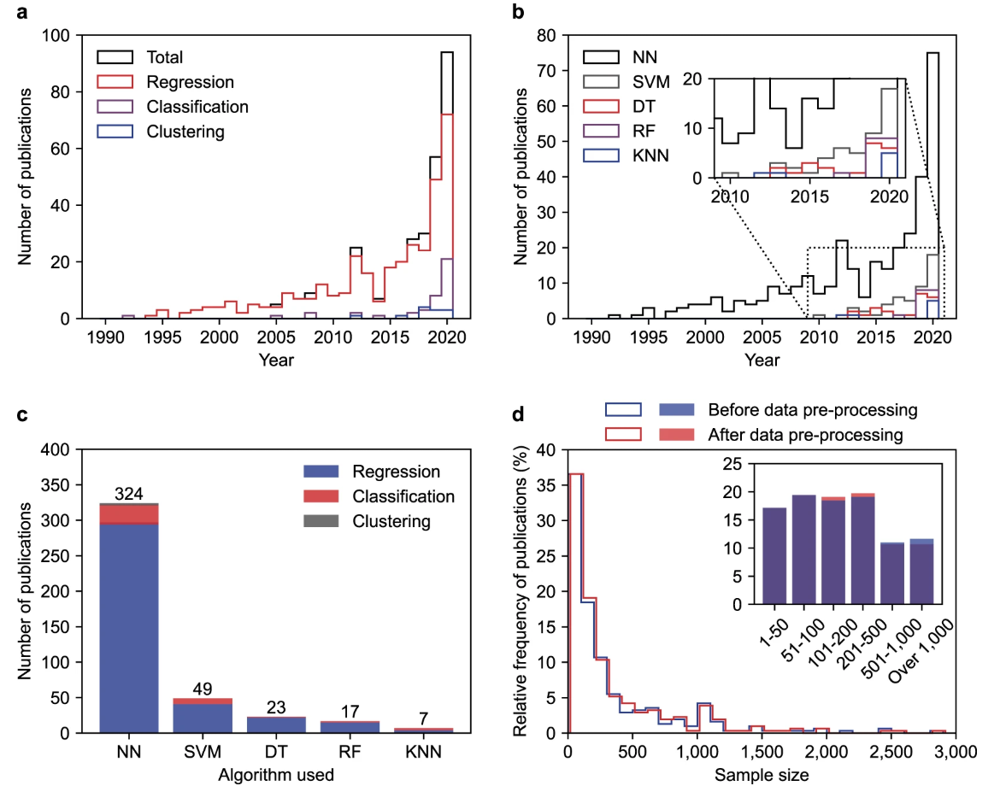
```

Es en esta última era donde el *machine learning* cobra protagonismo: en lugar de programar reglas explícitas, enseñamos a las máquinas a descubrir patrones a partir de ejemplos.

### Machine learning supervisado

Los problemas de *machine learning* se clasifican según la naturaleza de los datos y la supervisión disponible:

#### Aprendizaje supervisado

Se dispone de pares entrada-salida $(x, y)$. Subtipos comunes incluyen: - **Regresión**: predecir una variable continua (ej. precio de una casa). - **Clasificación**: asignar una etiqueta discreta (ej. detección de spam). - **Aprendizaje de secuencias**: modelar datos ordenados en el tiempo o en secuencia (ej. traducción automática, reconocimiento de voz).

#### Componentes del aprendizaje supervisado

En el aprendizaje supervisado participan los siguientes componentes.

1.  Función desconocida: $f: X->Y$ Es la relación que queremos aprender entre la entrada $X$ y las salidas $Y$
2.  Muestras de entrenamiento (data): Es el conjunto de pares observados $(x_n,y_n)$
3.  Conjunto de hipótesis: Denotado como $H$ es el conjunto de funciones candidatas que el algoritmo puede elegir para aproximar f.
4.  Algoritmo de aprendizaje: Denotado como $A$ Toma como entrada los ejemplos de entrenamiento y el conjunto de hipotesis para seleccionar una $g \in H$ que mejor se ajuste a los datos.
5.  Hipotesis final: Denotada como $g \approx f$ que es la función aprendida por el algoritmo

```{r echo=FALSE, fig.align='center'}
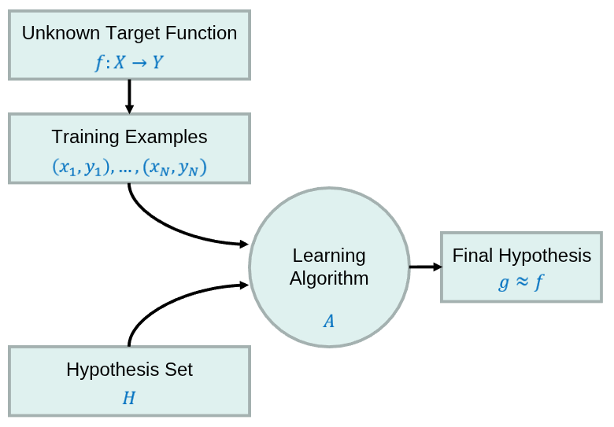
```

#### Tipos de datos en el aprendizaje supervisado

Si bien los algoritmos de aprendizaje automático operan exclusivamente con números, la estructura y el tipo de las variables (por ejemplo, categóricas, continuas, ordinales, etc.) influyen directamente en la elección del modelo más adecuado para capturar patrones y realizar predicciones efectivas.

##### Númericos

También conocido como datos cuantitativos, refleja la cuantización de algo medible y codificable numéricamente donde existe una relación de orden total.

```{r echo=FALSE, fig.align='center'}
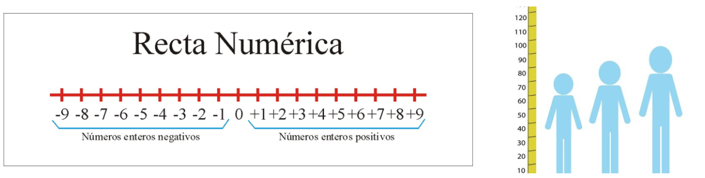
```

##### Categóricos

Los datos categóricos se utilizan para etiquetar características que no son medibles, conocido como datos cualitativos. Por lo general se emplean números como etiquetas sin que estos tengan una relación de orden total en su significado.

```{r echo=FALSE, fig.align='center'}
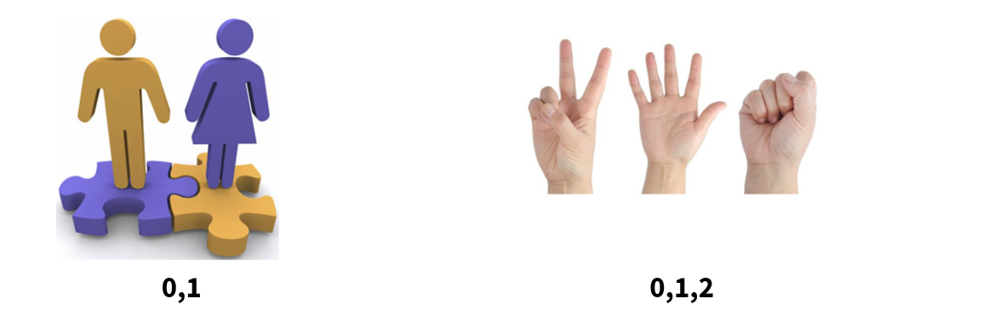
```

A menudo un mismo atributo lo podemos representar de diversas manera y la representación que elegimos podrá ser de diferente indole.

```{r echo=FALSE, fig.align='center'}
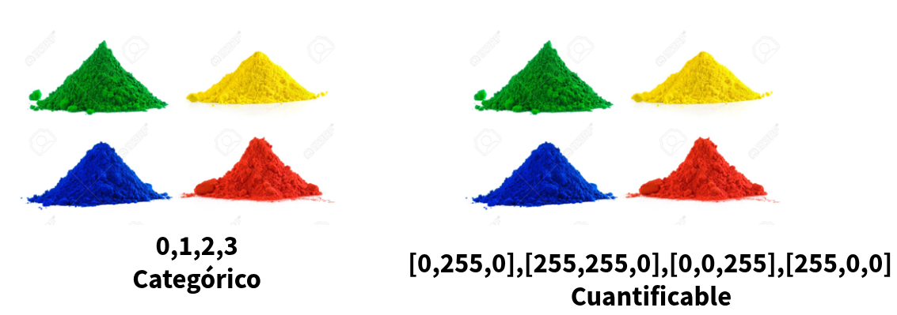
```

##### Series de tiempo

Son una secuencia de números coleccionados con un intervalo regular de tiempo sobre un periodo de tiempo. En este tipo de conjunto de datos las muestras pueden estar asociadas entre si.

```{r echo=FALSE, fig.align='center'}
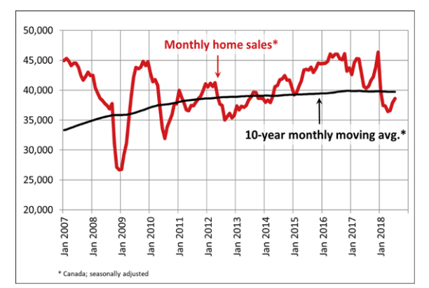
```

Diversos objetos que solemos representar en este mundo como imagenes, videos o audios se pueden describir con los tipos que definimos anteriormente.

#### Los problemas de machine learning

Los dos desafíos fundamentales que definen la naturaleza de los problemas en *machine learning*:

##### El problema inverso

A diferencia de la física, donde las leyes predicen observaciones, en *machine learning* partimos de observaciones para inferir las reglas subyacentes. Esto es inherentemente ambiguo y puede derivar en un gran número de problemas. Por listar algunos tenemos.

**Falta de información:** Se intentan identificar patrones para intentar disminuir el error basado en alguna regla, pero no hay garantia de que la regla que se este intentando cumplir sea la correcta para representar al sistema.

```{r echo=FALSE, fig.align='center'}
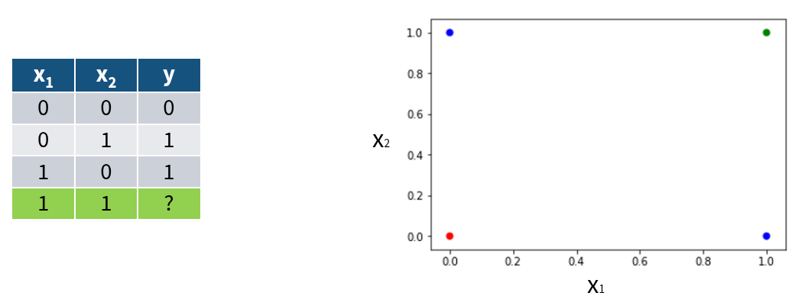
```

**No unicidad de la solución (información inconsistente):** Dado un resultado observado $y$ , puede haber múltiples configuraciones de entrada $x_1 x_2, ...$ tales que $f(x_i) = y$

```{r echo=FALSE, fig.align='center'}
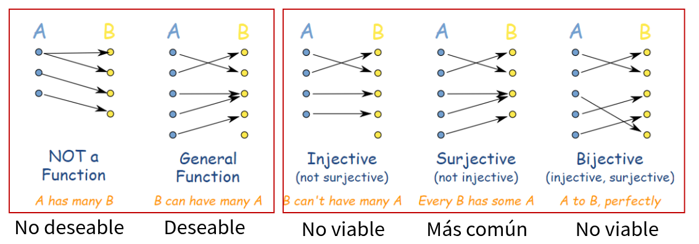
```

##### Generación del modelo que aproxime al sistema

**Falta de modelo directo preciso** : En muchos casos, la función directa $f$ (que mapea causas a efectos) no se conoce analíticamente, sino que se aproxima mediante simulaciones o modelos empíricos. Esto tambien se puede por no tener el conjunto de hipotesis adecuado.

```{r echo=FALSE, fig.align='center'}
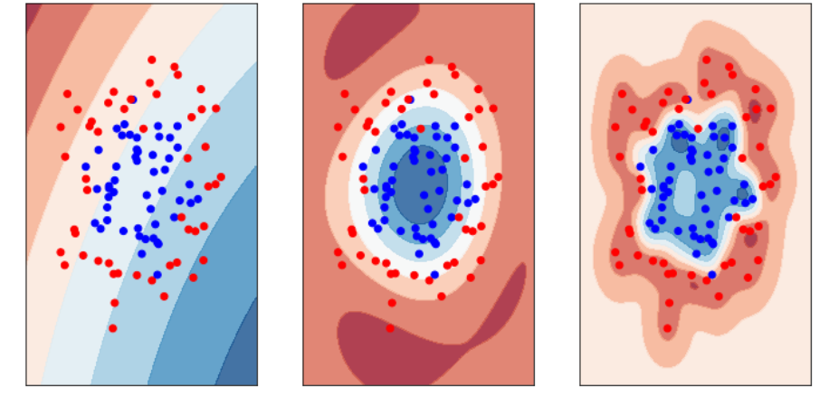
```

**Problema de optimización**: el aprendizaje se formula como la búsqueda de parámetros que minimicen una función de pérdida a mayor número de parámetros a optimizar es menos probable obtener un minimo global, lo cual se puede realizar tambien con el problema "the curse of dimensionality"

```{r echo=FALSE, fig.align='center'}
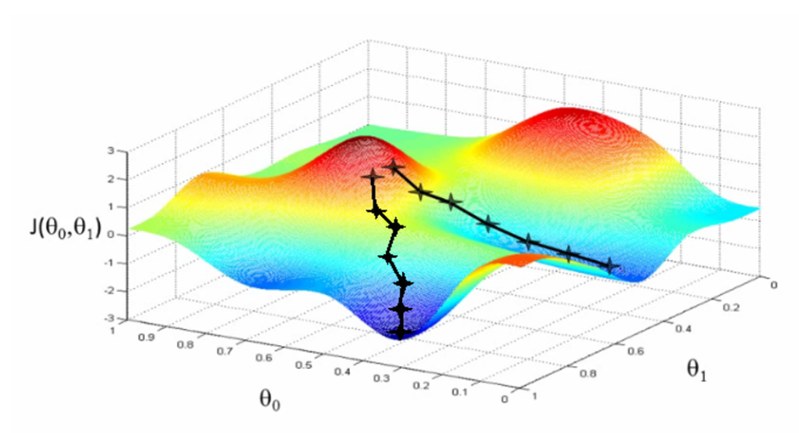
```

## ¿Por qué Deep Learning?

Una pregunta que nos podriamos hacer es ¿por qué deep learning? en esta sección abordaremos una perspectiva de contraste e historica para intentar acercarnos a esta respuesta.

### Dimensión VC

La **dimensión de Vapnik-Chervonenkis (VC)** es una medida de la capacidad de un modelo de clasificación (o conjunto de hipótesis) para distinguir entre diferentes clases. Formalmente, la dimensión VC de un conjunto de hipótesis $H$ se define de la siguiente manera:

Sea $H$ un conjunto de hipótesis; y $X$ un conjunto de instancias (espacio de entrada). La dimensión $VC$ de $H$ es el tamaño del mayor subconjunto de $X$ que puede ser destrozado (shattering) por $H$

**Shattering:** Un conjunto de puntos $S={x1,x2,…,xd}⊆X$, se dice que es **shattered** por $H$ si, para cada posible partición binaria de $S$ (es decir, cada una de las posibles asignaciones de etiquetas en $S$), existe una hipótesis $h \in H$ tal que $h$ clasifica correctamente todos los puntos de $S$ según esa partición.

En otras palabras **VC Dimension** mide la capacidad de un modelo para ajustarse a conjuntos arbitrarios de datos. Cuanto mayor sea la dimensión VC, más complejos son los patrones que puede aprender, pero también mayor el riesgo de sobreajuste (*overfitting*).

```{r echo=FALSE, fig.align='center'}
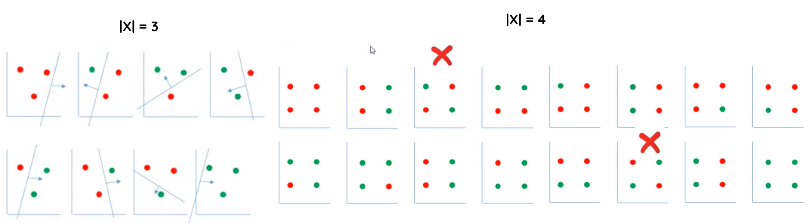
```

Es importante que el conjunto de puntos se encuentre en posición general, para evitar configuraciones precisas que se ajuntes de forma exacta a la forma del conjunto de hipotesis.

```{r echo=FALSE, fig.align='center'}
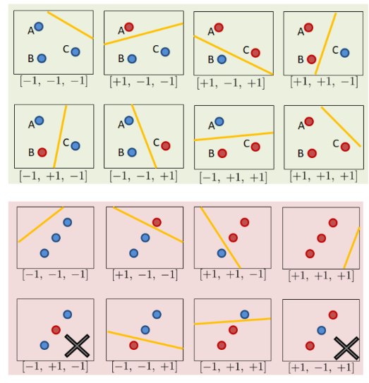
```

Algo importante a remarcar es que el VC-Dimension como su nombre lo indica representa la capacidad en una instancia númerica basada en el número de dimensiones de los puntos a separar, así que si el número de dimensiones incrementa, el número de puntos maximos a clasificar correcto tambien lo hace.

```{r echo=FALSE, fig.align='center'}
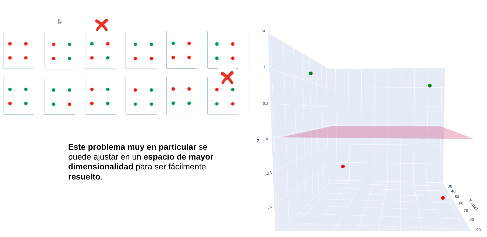
```

### El truco del Kernel (SVM)

Una **SVM (Máquina de Vectores de Soporte)** busca separar las clases de datos encontrando una frontera óptima (hiperplano) que las divida. Sin embargo, cuando los datos no son separables linealmente en su espacio original, utiliza el **truco del kernel**, que consiste en proyectarlos implícitamente a un **espacio de mayor dimensión** donde sí puedan separarse mediante una frontera lineal. De esta forma, sin transformar los datos directamente, la SVM aplica funciones como los **kernels polinomial o RBF** para capturar relaciones no lineales y lograr una mejor clasificación.

```{r echo=FALSE, fig.align='center'}
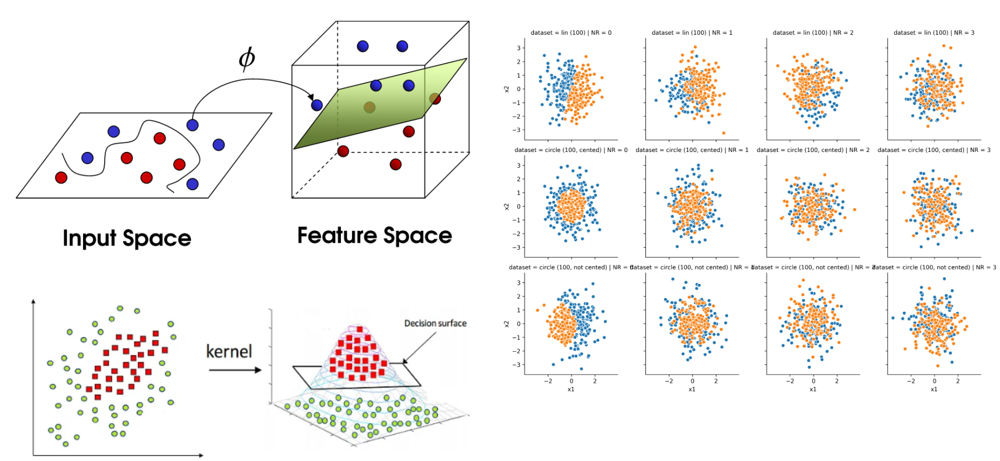
```

Sin embargo, encontrar el kernel adecuado presenta desafíos como la necesidad de probar distintas funciones, ajustar cuidadosamente sus parámetros para evitar sobreajuste o subajuste, enfrentar altos costos computacionales en grandes volúmenes de datos y lidiar con la menor interpretabilidad del modelo al trabajar en espacios de alta dimensión.

### Ingeniería de caracteristicas

La **extracción de características** ayuda a resolver problemas de **aprendizaje automático** al transformar los datos brutos en representaciones más relevantes y compactas que facilitan el trabajo del modelo. Este proceso permite **destacar la información más útil**, eliminar ruido y reducir la dimensionalidad, lo que mejora la **precisión**, **eficiencia** y **capacidad de generalización** del algoritmo. Al enfocarse en las propiedades más representativas de los datos —por ejemplo, patrones visuales en imágenes, frecuencias en audio o variables derivadas en datos tabulares—, la extracción de características permite que los modelos aprendan de manera más efectiva y requieran menos recursos para lograr un buen desempeño.

```{r echo=FALSE, fig.align='center'}
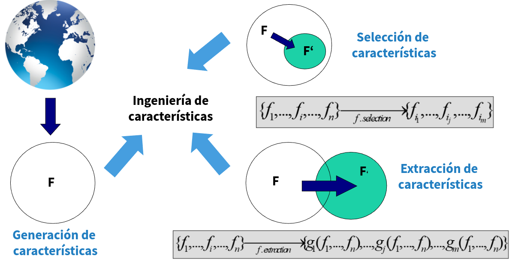
```

La extracción de caracteristicas resulta especialmente util para combinar variables que por si mismo no aportan tanto valor al describir un sistema, pero combinadas de cierta forma tiene valor. Por ejemplo el peso y la estatura combinada pueden crear el **IMC** que es un indicador clave a la hora de evaluar el sobrepeso.

### Beneficios del deep learning

#### Teorema de aproximación universal

1.  Establece que una **red neuronal** con al menos una **capa oculta** y un número suficiente de **neuronas** puede aproximar cualquier **función continua** en un espacio de **dimensión finita** con un error arbitrariamente pequeño. En otras palabras, las **redes neuronales** son **aproximadores universales**.

2.  Este **teorema** proporciona una base teórica para la capacidad de las **redes neuronales** de aprender y representar **funciones complejas**. Sin embargo, en la práctica, el **teorema** no garantiza que una **red entrenada** encontrará la **aproximación óptima**, ni especifica cuántas \*\*neuron

```{r echo=FALSE, fig.align='center'}
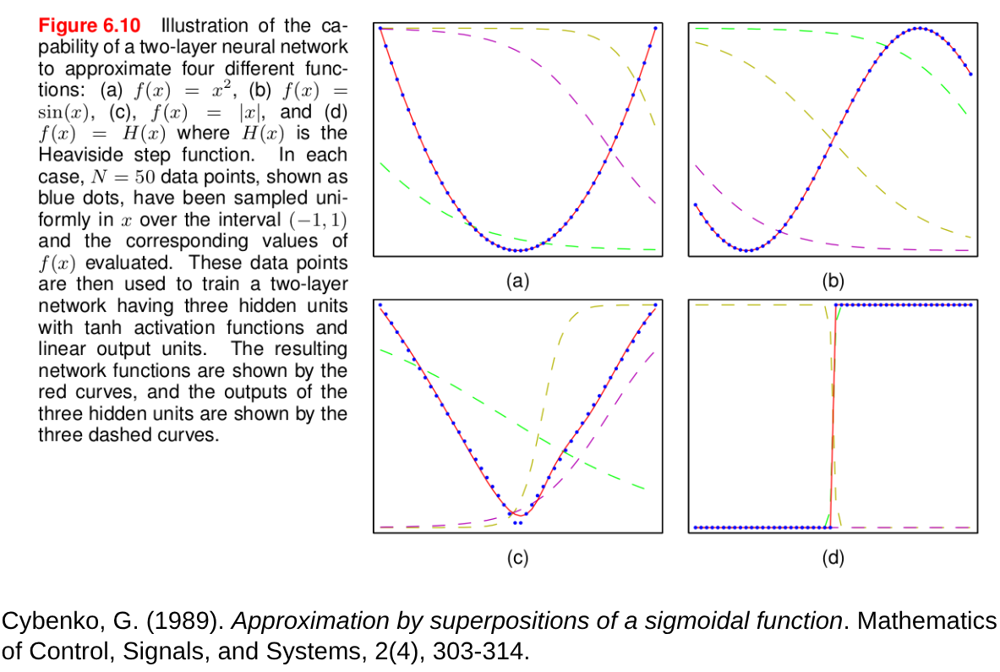
```

["Jugemos un poco con las redes multicapa"](https://playground.tensorflow.org/)

#### Extracción automática de características (feature extraction):

A diferencia de los métodos tradicionales, donde los ingenieros diseñaban manualmente características (ej. bordes, texturas, frecuencias), las redes profundas **aprenden representaciones útiles directamente de los datos brutos**. Cada capa construye representaciones de mayor nivel a partir de las anteriores (píxeles → bordes → formas → objetos).

```{r echo=FALSE, fig.align='center'}
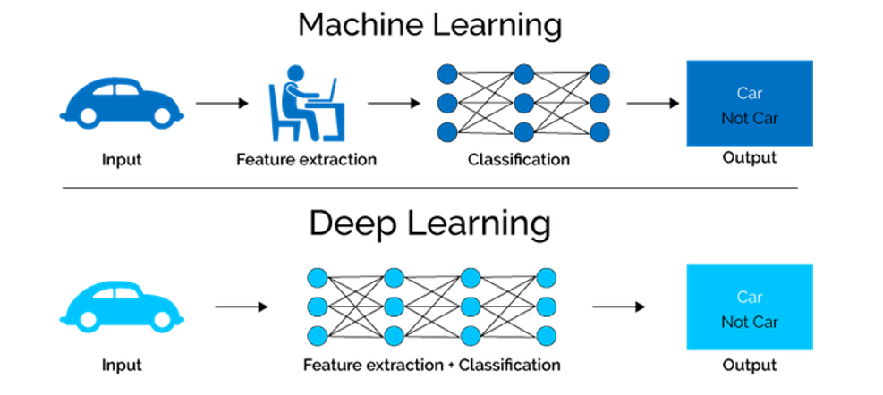
```

| Tipo de capa | Rol / función típica | Qué tipo de representaciones aprende | Apoyo en la literatura / ejemplos |
|---------------|---------------|---------------|---------------------------|
| **Primeras capas**<br>(cercanas a la entrada) | Capturan patrones de bajo nivel y locales del dato bruto | Bordes, texturas, frecuencias básicas, características locales | Se habla de “aprendizaje jerárquico de características”, donde los niveles inferiores capturan elementos simples primero. ([OpenStax](https://openstax.org/books/principles-data-science/pages/7-3-introduction-to-deep-learning?utm_source=chatgpt.com)) |
| **Capas intermedias**<br>(ocultas medias) | Combinan características simples en representaciones más abstractas | Motivos, formas, combinaciones de las características de los niveles más bajos | El trabajo “Understanding Deep Representation Learning via Layerwise Feature Compression and Discrimination” estudia cómo las capas progresivas comprimen características dentro de clase y discriminan entre clases a medida que avanza la profundidad. ([arXiv](https://arxiv.org/abs/2311.02960?utm_source=chatgpt.com)) |
| **Últimas capas**<br>(cercanas a la salida) | Transforman las representaciones abstractas hacia la decisión o la salida específica de la tarea | Conceptos de alto nivel, clases, predicciones finales | En redes de reconocimiento de imágenes, las capas finales "interpretan" las características abstractas en etiquetas o decisiones. Por ejemplo, arquitecturas como AlexNet usan capas finales totalmente conectadas para clasificar objetos. ([Wikipedia](https://en.wikipedia.org/wiki/AlexNet?utm_source=chatgpt.com)) |

["How transferable are features in deep neural networks?"](https://arxiv.org/pdf/1411.1792)

#### Escalabilidad con datos y cómputo

Mientras que muchos algoritmos clásicos saturan su rendimiento con más datos, el *deep learning* **mejora continuamente** al aumentar el tamaño del conjunto de entrenamiento y la capacidad computacional.

```{r echo=FALSE, fig.align='center'}
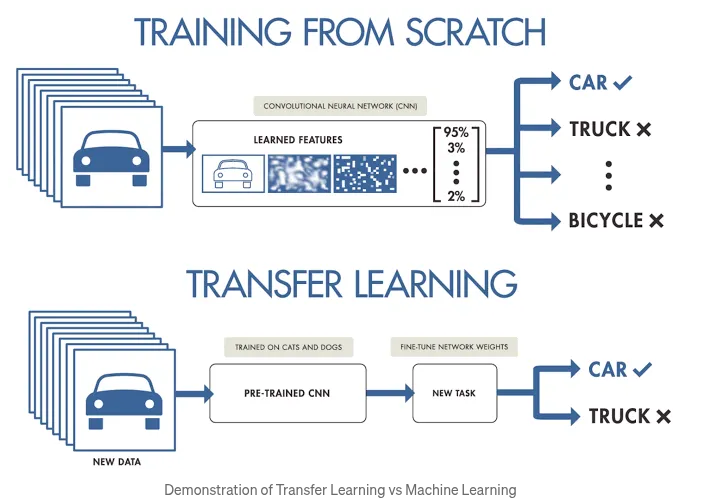
```

<!--chapter:end:01-intro2nn.Rmd-->

<!-- ::: watermark -->
<!--  -->
<!-- ::: -->


# Preliminares

## Algebra Lineal

### Introducción

El álgebra lineal es la rama de las matemáticas que estudia los espacios vectoriales y transformaciones lineales así como los elementos que son parte de estas como son los vectores, matrices, bases, operadores así como las propiedades geométricas que ocurren en los espacios vectoriales.

Enfocandose en como se representan y manipulan los datos que pueden tener múltiples dimensiones o características de una forma estructurada y dando así, interpretaciones de estos con una serie de observaciones, estructura y rigor matemático.

### Motivación

El aprendizaje profundo se basa en procesar y transformar datos numéricos (imágenes, sonidos, textos, etc) y dichas transformaciones son operaciones lineales y no lineales aplicadas repetidamente, encontramos una forma muy natural de hacer uso del álgebra lineal para el aprendizaje profundo, representado como el procesamiento de redes neuronales.

De forma natural, podemos ver como las entradas, salidas, neuronas y funciones de activación hacen uso de estructuras como vectores, matrices y transformaciones lineales:

#### Vectores

Representan entradas, salidas y parámetros.

#### Matrices

Representan conexiones entre neuronas así como transformaciones entre espacios. Esto porque una red neuronal puede expresarse como
$$
	y = Wx + b
$$
donde:

 - $x$ es el vector de entrada,
 - $W$ es una matriz de pesos.
 - $b$ es el sesgo,
 - $y$ es la salida.

#### Transformaciones lineales

Cada capa lineal en una red neuronal transforma el espacio de las entradas. Estas transformaciones cambian orientación, posición, o escala de los datos en un espacio multidimensional.

### Escalares

#### Campos Algebraicos

Un **campo algebraico** (o simplemente _campo_) es una estructura matemática formada por un conjunto de elementos en el que se pueden realizar las operaciones de **suma**, **resta**, **multiplicación** y **división** (excepto por cero), cumpliendo ciertas reglas de consistencia.

Algunos ejemplos de campos algebraicos son los números reales (denotado por $\mathbb{R}$) y los números complejos (denotado por $\mathbb{C}$).

En este contexto, cuando hablamos de escalares, nos referiremos a un elemento del campo sobre el que trabajamos, usualmente sobre los números reales, o en ocasiones particulares, números imaginarios.

#### Dato curioso

Si en lugar de un campo tenemos un anillo algebraico (a diferencia del campo, no necesariamente existe un inverso multiplicativo), entonces los escalares perteneceran al anillo, y en lugar de tener un espacio vectorial, diremos que tendremos un **módulo** y eso es campo de estudio de otra rama de las matemáticas. Por lo que en este contexto, únicamente trataremos con los números reales como campo y posiblemente con complejos.

### Vectores

Un vector es un objeto matemático que posee magnitud y dirección. Estos pertenecen a un espacio vectorial que está definido sobre un campo y por ende, las entradas de un vector, son elementos de este campo (denotado como escalares), así como dichas entradas es una lista ordenada.
$$
v =
\begin{pmatrix}
	v_1 \\
	v_2 \\
	\vdots \\
	v_n
\end{pmatrix}
$$
Estos números son las coordenadas del vector respecto a la base del espacio.

### Matrices

Una matríz es un arreglo rectangular de escalares (o con entradas en el campo vectorial), organizada en filas y columnas de la siguiente forma:
$$
A =
\begin{pmatrix}
	a_{11} & a_{12} & \dots & a_{1n} \\
	a_{21} & a_{22} & \dots & a_{2n} \\
	\vdots & \vdots & \ddots & \vdots \\
	a_{m1} & a_{m2} & \dots & a_{mn}
\end{pmatrix}
$$
donde $A$ tiene $m$ filas y $n$ columnas, y se dice que es de tamaño $m \times n$.

#### Alternativas conceptuales para entenderlas

Una matríz puede entenderse como:

- Un conjunto de vectores organizados de manera estructurada.
- Una herramienta para transformar un vector en otro mediante operaciones lineales.
- Una representación compacta de un sistema de ecuaciones lineales.

Por dar un ejemplo, la expresión $y = Ax$ con $x, y$ como vectores y $A$ como matríz, denota como se transforma $x$ en $y$ por medio de $A$, o un sistema de ecuaciones lineales.

#### Propiedades matemáticas

Las matrices permiten realizar:

- Suma y multiplicación de transformaciones lineales.
- Cálculo de determinante e inversas de matrices (en caso de existir).
- Cambios de base, rotaciones, escalamientos y proyecciones.

En esencia podemos pensar que son la forma algebraica de expresar operaciones lineales entre espacios vectoriales.

#### En el aprendizaje profundo

Las matrices son un componente clave en el núcleo operativo de las redes neuronales considerando las siguientes observaciones:

 - Cada capa lineal se representa por una matríz de pesos que transforma las entradas en salidas.
 - Las operaciones de multiplicación matricial permite combinar miles de variables de entrada con miles de parámetros a la vez.
 - Durante el entrenamiento, las matrices cambian, siendo ajustadas para minimizar el error de predicción.

#### Resumen

Las matrices son arreglos ordenados de escalares o vectores que suelen representar transformaciones lineales así como bases vectoriales. Esta es la forma matemática que se usa para describir el procesamiento y transformación numérica que ocurre en una red neuronal.

### Tensores

De forma simétrica a las estructuras de escalares, vectores y matrices, un tensor es una estructura matemática que generaliza estos conceptos para describir relaciones lineales y multidimensionales entre conjuntos de datos numéricos.

Una forma de ejemplificar usando como base la relación entre puntos, líneas, cuadrados y cubos puede ser la siguiente: una matríz es a un tensor (arreglo de matrices), como un vector es a una matríz (arreglo de vectores), como un escalar es a un vector (arreglo de escalares).

#### Intuición geométrica

Un tensor puede verse como un objeto que transforma o relaciona vectores y covectores de manera multilineal, conservando coherencia bajo cambios de coordenadas. Esto en espacios físicos permite describir propiedades como:

- Fuerza y dirección (vectores).
- Tensiones, deformaciones o inercia (tensores de segundo orden).
- Curvaturas o transformaciones complejas (tensores de orden superior).

#### Su rol en el aprendizaje profundo

En el contexto del aprendizaje profundo, los tensores suelen usarse en un sentido computacional más que geométrico. Por ejemplo:

- Una imagen puede representarse como un arreglo dimensional de dos dimensiones, pero donde sus elementos son vectores de dimensión 3 (pixeles con sus 3 colores).
- Un lote de imágenes forma un tensor de orden 4: número o etiqueta de la imagen, alto, ancho y colores.
- Los pesos de una red neuronal y sus gradientes también son tensores.

#### Propiedades básicas de la aritmética de tensores

Escalares, vectores, matrices y tensores de orden superior tienen propiedades que son útiles, por ejemplo operaciones elemento a elemento producen salidas que tienen las mismas dimensiones que sus entradas.

El producto de elemento a elemento de dos matrices es llamado _producto Hadamard_ y es denotado con $\odot$. Podemos ver esto de la siguiente forma para dos matrices $A, B \in \mathbb{R}^{m \times n}$:
$$
A \odot B =
\begin{pmatrix}
	a_{11}  b_{11} & a_{12}  b_{12} & \dots  & a_{1n}  b_{1n} \\
	a_{21}  b_{21} & a_{22}  b_{22} & \dots  & a_{2n}  b_{2n} \\
	\vdots & \vdots & \ddots & \vdots \\
	a_{m1}  b_{m1} & a_{m2}  b_{m2} & \dots  & a_{mn}  b_{mn}
\end{pmatrix}
$$

### Reducciones sobre tensores

Una reducción es una operación que toma un tensor y "reduce" una o más de sus dimensiones, combinando los elementos mediante una operación como la suma, el promedio, máximo o cualquier otra función agregadora

#### Ejemplos

Suponiendo que tenemos la siguiente matriz
$$
A =
\begin{pmatrix}
	1 & 2 & 3 \\
	4 & 5 & 6
\end{pmatrix}
$$
Tenemos las siguientes posibilidades de sumas:

- Suma total: $\mbox{sum}(A) = 1  + 2 + 3 + 4 + 5 + 6 = 21$
- Suma por filas: $\mbox{sum}(A, \mbox{axis} = 1) = [6, 16]$ que es un vector (tensor de orden 1).#
- Suma por columnas: $\mbox{sum}(A, \mbox{axis} = 0) = [5, 7, 9]$

#### Intuición geométrica

Una reducción colapsa una dirección del espacio del tensor.

- Dada una matriz, reducir sobre las filas equivale a proyectar todo el espacio de datos sobre el eje de las columnas.
- En tensores de orden mayor, esto trata de aplanar parte de la estructura multidimensional.

#### En aprendizaje profundo

Las reducciones son operaciones fundamentales en el cálculo dentro de las redes neuronales. Consideremos las siguientes:

- Función de pérdida:
	Se calcula reduciendo las diferencias entre predicciones y etiquetas. Por ejemplo:
	$$
		\mbox{loss} = \mbox{mean}((y_{\mbox{pred}} - y_{\mbox{true}})^2)
	$$
	reducción con media sobre todos los ejemplos.
- Normalización:
	Reducir sobre ciertas dimensiones (por ejemplo, el canal o lote) para calcular medias y desviaciones estándar.
- Gradientes:
	Durante el entrenamiento, los gradientes a menudo se *acumulan* (se reducen) sobre los lotes de datos.

#### Tipos comunes de reducciones

| Operación      | Resultado           | Uso típico                           |
| -------------- | ------------------- | ------------------------------------ |
| suma           | Suma de elementos   | Energía total, acumulaciones         |
| promedio       | Promedio            | Pérdidas, normalización              |
| máximo, mínimo | Valor extremo       | Selección, agrupamiento, submuestreo |
| producto       | Producto total      | Escalados, combinaciones             |
| norma          | Magnitud del tensor | Regularización, análisis geométrico  |

#### Resumen

Podemos pensar en la reducción como el proceso de combinar las entradas a lo largo de ciertas dimensiones, para producir una representación más simple o resumida del tensor original.

Matemáticamente, una reducción es una contracción parcial de índices y computacionalmente, una operación de agregación que permite manejar de forma eficiente grandes volúmenes de datos en redes neuronales.

### Producto punto

De momento hemos estado revisando operaciones tanto de reducción como operaciones elemento a elemento. Pero para el producto punto, tenemos una combinación muy interesante. Ya que por un lado, es una operación binaria que toma dos vectores, y nos regresa una agregación, siendo esta la suma total del producto elemento a elemento. O más matemáticamente, sea $d \in \mathbb{N}$, dado $\mathbf{x}, \mathbf{y} \in \mathbb{R}^d$ y $\mathbf{x}^\top$ la transpuesta de $\mathbf{x}$, entonces su producto punto $\mathbf{x} \cdot \mathbf{y}$ ó $\mathbf{x}^\top \mathbf{y}$ (o también conocido como producto interno $\langle \mathbf{x}, \mathbf{y} \rangle$) se define así:
$$
	\mathbf{x}^\top \mathbf{y} = \sum_{i=1}^{d} x_i y_i
$$
Este resultado sin embargo, tiene repercusiones importantes así como interpretaciones geométricas de gran importancia. A este producto también se puede ver como una forma bilineal, es decir, que en ambas entradas, es linear (abre sumas y saca escalares: $f(ax + by) = af(x) + bf(y)$).

#### Interpretación geométrica

El producto punto mide _cuanto apunta un vector en la dirección de otro_ o el ángulo que hay entre estos:
$$
	\mathbf{a} \cdot \mathbf{b} = \|a\| \|b\| \cos(\theta)
$$
donde:

- Las longitudes de los vectores están representadas por $\|a\|$ y $\|b\|$,
- el ángulo entre estos es $\theta$.

Si:

- Apuntan en direcciones similares: $\mathbf{a} \cdot \mathbf{b} > 0$.
- Son perpendiculares $\mathbf{a} \cdot \mathbf{b} = 0$.
- Apuntan en direcciones opuestas: $\mathbf{a} \cdot \mathbf{b} < 0$.

#### En el aprendizaje profundo

El producto punto aparece de forma constante en redes neuronales:

- En cada neurona, el valor de activación se calcula como un producto punto entre el vector de entrada y el vector de pesos:
	$$
		z = \mathbf{w} \cdot \mathbf{x} + b
	$$
- En el contexto de atención (*transformers*), se usa para medir la similitud entre representaciones:
	$$
		\mathbf{q} \sim \mathbf{k} = \mbox{sim}(\mathbf{q}, \mathbf{k}) = \mathbf{q} \cdot \mathbf{k}
	$$

#### Resumen

El producto punto es la operación fundamental para medir la relación de direcciones y magnitud entre dos vectores, y en redes neuronales, es la base matemática de como las neuronas evalúan la información que procesan.

### Producto entre matrices y vectores

Para definir el producto entre matrices y vectores, tomemos $m, n \in \mathbb{N}$, una matriz $A \in \mathbb{R}^{n \times m}$ y un vector $x \in \mathbb{R}^m$, entonces lo definiremos de la siguiente forma:
$$
	A\cdot x =
	\begin{pmatrix}
		a_{11} & a_{12} & \cdots & a_{1m} \\
		a_{21} & a_{22} & \cdots & a_{2m} \\
		\vdots & \vdots & \ddots & \vdots \\
		a_{n1} & a_{n2} & \cdots & a_{nm} \\
	\end{pmatrix}
	\cdot
	\begin{pmatrix}
		x_1 \\ x_2 \\ \vdots \\ x_m
	\end{pmatrix}
	=
	\begin{pmatrix}
		a_{11}x_1 + a_{12}x_2 + \cdots + a_{1m}x_m \\
		a_{21}x_1 + a_{22}x_2 + \cdots + a_{2m}x_m \\
		\vdots \\
		a_{n1}x_1 + a_{n2}x_2 + \cdots + a_{nm}x_m \\
	\end{pmatrix}
$$
Si recordamos que $A$ puede verse como un arreglo o lista de vectores $n$ vectores $\mathbf{a}_j$ con $j \in {1, \cdots, n}$, entonces lo anterior lo podemos reescribir de la siguiente forma:
$$
	A \cdot x =
	\begin{pmatrix}
		\mathbf{a}_1^\top \cdot x \\
		\mathbf{a}_2^\top \cdot x \\
		\vdots \\
		\mathbf{a}_n^\top \cdot x \\
	\end{pmatrix}
	=
	\begin{pmatrix}
		\mathbf{a}_1^\top \\
		\mathbf{a}_2^\top \\
		\vdots \\
		\mathbf{a}_n^\top \\
	\end{pmatrix} \cdot x
$$
donde podemos ver como esta multiplicación matricial es una transformación que proyecta vectores de $\mathbb{R}^m$ hacia $\mathbb{R}^n$ (viendo como toma $x$, y lo transforma en $A\cdot x$).

#### Interpretación geométrica

Las transformaciones que puede hacer $A$ sobre $x$ son:

- Rotarlo, escalarlo, reflejarlo o cambiar su dimensión.
- Si $A$ es una matriz cuadrada ($A \in \mathbb{R}^{n \times n}$), entonces la transformación es hacia el mismo espacio
- Cuando $A\cdot x = 0$, hablaremos del núcleo de la transformación ($\ker(A)$), o espacio nulo y este será todos los vectores $x$ tales que satisfacen esa condición.

##### Teorema del rango y nulidad

El teorema del rango y nulidad nos habla de la relación que existe entre el núcleo y la imagen de $A$: Sea $A: V \rightarrow W$  una transformación lineal entre espacios vectoriales de dimensión finita, donde:

- $\dim(V) = n$.
- $\mbox{rango}(A)$ es la imagen (también llamada rango),
- $\ker(A)$ es el núcleo o kernel (también llamado espacio nulo).
entonces:
	$$
		\dim(V) = dim(\mbox{rango(A)}) + \dim(\ker(A))
	$$
o de forma equivalente:
	$$
		n = \mbox{rango}(A) + \ker(A)
	$$

#### En aprendizaje profundo

En una neurona o capa lineal, el cálculo principal es precisamente este producto:
$$
	\mathbf{y} = A\mathbf{x} + \mathbf{b}
$$
donde los elementos son los siguientes:

- vector de entradas: $\mathbf{x}$,
- matriz de pesos: $A$,
- vector de sesgos: $\mathbf{b}$,
- salida o activación previa: $\mathbf{y}$.

Cada multiplicación entre matriz y vector permite a la red combinar las características y extraer patrones de los datos, siendo una de las operaciones más repetidas en todo el aprendizaje profundo.

En relación al teorema de rango y nulidad en el contexto de redes neuronales, podemos ver lo siguiente:

- Qué parte de la información de entrada puede conservarse (rango).
- Qué parte se pierde o colapsa (nulidad).
- Como el modelo puede aprender representaciones comprimidas al pasar de un espacio con alta dimensión a otro más pequeño.

#### Resumen

El producto de matriz con vector aplica una transformación lineal al vector, combinando sus componentes mediante productos punto con las filas de la matriz. Esta es la base matemática de como las redes neuronales procesan la información y generan nuevas representaciones.

En conjunto con el teorema de rango y nulidad, podemos ver que en toda transformación lineal, la suma del número de direcciones que se conservan y las que se anulan es igual a la dimensión del espacio original.

### Multiplicación matricial

Siguiendo el patrón de partir de lo particular y empezar a generalizar, y teniendo presente que una matriz es un arreglo ordenado de vectores, naturalmente podemos preguntarnos por el producto matricial, y respondernos de forma directa.

Sean $n, k, m \in \mathbb{N}$ y dos matrices $\mathbf{A} \in \mathbb{R}^{n \times k}$ y $\mathbf{B} \in \mathbb{R}^{k \times m}$ con la estructura que ya conocemos:
$$
\begin{split}\mathbf{A}=\begin{pmatrix}
 a_{11} & a_{12} & \cdots & a_{1k} \\
 a_{21} & a_{22} & \cdots & a_{2k} \\
\vdots & \vdots & \ddots & \vdots \\
 a_{n1} & a_{n2} & \cdots & a_{nk} \\
\end{pmatrix},\quad
\mathbf{B}=\begin{pmatrix}
 b_{11} & b_{12} & \cdots & b_{1m} \\
 b_{21} & b_{22} & \cdots & b_{2m} \\
\vdots & \vdots & \ddots & \vdots \\
 b_{k1} & b_{k2} & \cdots & b_{km} \\
\end{pmatrix}.\end{split}
$$
Sea $\mathbf{a}_i^\top \in \mathbb{R}^k$ el $i$-ésimo vector fila de la matriz $\mathbf{A}$ y sea $\mathbf{b}_j \in \mathbb{R}^k$ el $j$-ésimo vector columna de $\mathbf{B}$, entonces:
$$
\begin{split}\mathbf{A}=
\begin{pmatrix}
\mathbf{a}^\top_{1} \\
\mathbf{a}^\top_{2} \\
\vdots \\
\mathbf{a}^\top_n \\
\end{pmatrix},
\quad \mathbf{B}=\begin{pmatrix}
 \mathbf{b}_{1} & \mathbf{b}_{2} & \cdots & \mathbf{b}_{m} \\
\end{pmatrix}.\end{split}
$$
Para formar el producto matricial $\mathbf{C} \in \mathbb{R}^{n \times m}$, vamos a calcular el elemento $c_{ij}$ como el producto punto entre la $i$-ésima fila de $\mathbf{A}$ y la $j$-ésima columna de $\mathbf{B}$, es decir $\mathbf{a}_i^\top \mathbf{b}_j$:
$$
\begin{split}\mathbf{C} = \mathbf{AB} = \begin{pmatrix}
\mathbf{a}^\top_{1} \\
\mathbf{a}^\top_{2} \\
\vdots \\
\mathbf{a}^\top_n \\
\end{pmatrix}
\begin{pmatrix}
 \mathbf{b}_{1} & \mathbf{b}_{2} & \cdots & \mathbf{b}_{m} \\
\end{pmatrix}
= \begin{pmatrix}
\mathbf{a}^\top_{1} \mathbf{b}_1 & \mathbf{a}^\top_{1}\mathbf{b}_2& \cdots & \mathbf{a}^\top_{1} \mathbf{b}_m \\
 \mathbf{a}^\top_{2}\mathbf{b}_1 & \mathbf{a}^\top_{2} \mathbf{b}_2 & \cdots & \mathbf{a}^\top_{2} \mathbf{b}_m \\
 \vdots & \vdots & \ddots &\vdots\\
\mathbf{a}^\top_{n} \mathbf{b}_1 & \mathbf{a}^\top_{n}\mathbf{b}_2& \cdots& \mathbf{a}^\top_{n} \mathbf{b}_m
\end{pmatrix}.\end{split}
$$
De esta forma, podemos pensar en el producto matricial como realizar $m$ productos entre matrices y vectores o $m \times n$ productos punto y recolectandolos todos para formar una matriz de $n \times m$. Cabe mencionar que este no es el producto Hadamard mencionado previamente.

#### Interpretación geométrica

Dado que cada elemento del producto matricial, es el producto punto entre las filas de la matriz de la izquierda y las columnas de la matriz de la derecha, entonces el producto punto puede verse como una composición de transformaciones lineales:
$$
	(AB)x = A(Bx).
$$
Esto significa que aplicar primero $B$ y luego $A$ a un vector es equivalente a aplicar una sola transformación representada por $AB$.

#### Propiedades importantes

Sean $A, B, C$ matrices con las dimensiones compatibles para el producto matricial, hay algunos puntos muy importantes que se tienen que mencionar:

- Las matrices no necesariamente conmutan: $AB \neq BA$.
- Las matrices son asociativas: $(AB)C = A(BC)$.
- Las matrices son distributivas: $A(B+C) = AB + AC$.
- Compatibilidad con escalares: $(\alpha A)B = A(\alpha B) = \alpha(AB)$ para $\alpha$ escalar.

#### En el aprendizaje profundo

El producto matricial es la operación más esencial en el cálculo de redes neuronales:

- Cada capa lineal o densa se expresa como:
	$$
		\mathbf{Y} = \mathbf{A}\mathbf{X} + \mathbf{B}
	$$
	donde $\mathbf{A}$ (matriz de pesos) multiplica la matriz o vector de entrada $\mathbf{X}$.
- En redes convolucionales, transformadores o encajes vectoriales, los productos matriciales generalizan a productos tensoriales u operaciones de atención.

#### Producto matricial como cambio de base del espacio vectorial

Una interpretación adicional al producto matricial es la de cambio de base del espacio vectorial y esto puede verse de la siguiente forma

#### Resumen

El producto entre dos matrices es la combinación de filas y columnas entre la primera y segunda matriz para formar una nueva matriz, que representa la composición de transformaciones lineales: una idea central en álgebra lineal y por lo tanto, en aprendizaje profundo.

### Normas

Una norma es una función que asigna a cada vector un número real no negativo que representa su longitud, magnitud o tamaño dentro de un espacio vectorial.

Descrito de forma matemática, sea $V$ un espacio vectorial sobre un campo $\mathbb{R}$ ó $\mathbb{C}$. Una forma es una función tal que:
$$
	\|\cdot\|:V \rightarrow \mathbb{R}_{\ge0}
$$
que a cada vector $v \in V$ le asigna el número $\|v\|$, cumpliendo las siguientes tres propiedades:
1. No negatividad y definitud:
	$$
		\|v\| \ge 0, \space \mbox{y} \space \|v\| = 0 \Leftrightarrow v = 0
	$$
	(la longitud nunca es negativa y solamente es cero con el vector cero).
2. Homogeneidad (o multiplicación por escalar):
	$$
	\|\alpha v\| = |\alpha| \|v\|
	$$
	(Escalar un vector cambia su longitud en el mismo factor absoluto).
3. Desigualdad triangular:
	$$
		\|u + v\| \le \|u\| + \|v\|
	$$
	(la longitud de la suma nunca excede la suma de las longitudes, como ocurre en un triángulo).

#### Ejemplos de normas

Sea $V$ un espacio vectorial de dimensión $n \in \mathbb{N}$, con entradas en los reales o complejos, y sea $v \in V$ un vector, entonces las siguientes normas están definidas de la siguiente forma

##### Norma Euclidiana (o $L^2$):

$$
	\|v\|_2 = \sqrt{v_1^2 + v_2^2 + \cdots + v_n^2}
$$
Observa que:
$$
	 \langle v, v \rangle= v^\top \cdot v = v_1^2 + v_2^2 + \cdots + v_n^2 = \|v\|_2^2,
$$
por lo tanto:
$$
	\|v\|_2 = \sqrt{\langle v, v\rangle} = \sqrt{v^\top \cdot v}.
$$

##### Norma Manhattan (o $L^1$)

$$
	\|v\|_1 = |v_1| + |v_2| + \cdots + |v_n|
$$
Esta norma también es conocida como la norma del taxista.

##### Norma máxima ($L^{\infty}$)

$$
	\|v\|_{\infty} = \max_{i}|v_i|
$$

##### Norma Frobenius

En el caso de las matrices, la situación es un poco más compleja. Esto porque las matrices pueden ser vistas como arreglos de vectores, o arreglos de números, al mismo tiempo que son transformaciones lineales. Por ejemplo, podríamos preguntarnos cuál es la relación de distancia para un producto de matriz y vector $Xv$ con relación a $v$. Esta línea de pensamiento nos lleva a algo llamado _norma espectral_. Pero por ahora presentamos la norma Frobenius, la cuál es mucho más fácil de calcular y queda definida de la siguiente forma
$$
	\|X\|_F = \sqrt{\sum_{i=1}^{m}\sum_{j=1}^{n}x_{ij}^2}.
$$
Esta norma se comporta como la norma $L^2$ para vectores, pero en caso matricial.

#### Interpretación geométrica

Una norma define la noción de la distancia y magnitud (o topología) dentro del espacio vectorial. Diferentes normas producen distintas geometrías del espacio (círculos, cuadrados, octágonos, etc).

#### En aprendizaje profundo

Las normas son esenciales para:

- Medir errores (como ejemplo, usando la norma $L^2$ para el error cuadrático medio).
- Regularización de modelos (normas como $L^1$ y $L^2$ reducen el sobreajuste penalizando los pesos grandes).
- Normalizar datos o vectores de características, para estabilizar el entrenamiento y mejorar la interpretación de la similitud entre vectores.

#### Resumen

Una norma mide la longitud o tamaño de un vector de forma consistente con las reglas del espacio vectorial, permitiendo cuantificar distancias, magnitudes y relaciones entre vectores.

## Cálculo Diferencial

### Introducción

Él cálculo diferencial es la rama de la matemática que surge para estudiar los cambios que ocurren en la naturaleza representado como fenómenos dinámicos, partiendo de las leyes Newtonianas estudiando el cambio de movimiento para definir así la velocidad, y posteriormente el cambio de la velocidad para entender la aceleración.

En el contexto del aprendizaje profundo, este tema es de vital importancia ya que las redes neuronales se calibran optimizando funciones mediante la medición y ajuste de cambios infinitesimales usando conceptos como mínimos locales y globales por medio de un concepto llamado _gradiente_, minimizando algo conocido como función de pérdida y recurriendo a técnicas modernas como la autodiferenciación para optimizar estas funciones usando la propagación hacia atrás.

Podemos pensar que una red neuronal aprende observando como las variaciones pequeñas en los pesos afectan el error o la función de pérdida. Esta relación, se describe con derivadas y gradientes.

De esta forma, el cálculo diferencial proporciona el marco de trabajo para:

- comprender como fluye la información y el error a través de la red.
- Analizar la convergencia y estabilidad de los algoritmos de optimización.
- Desarrollar modelos más eficientes y estables desde el punto de vista numérico y teórico.

### Motivación

La motivación directa es precisamente el optimizar las funciones de pérdida que están relacionadas con los pesos de las redes neuronales para mejorar como desempeña nuestra red neuronal.

### Derivadas y diferenciación

Para proceder con las derivadas, primero definiremos rápidamente (sin entrar en tanto detalle) el concepto de función para una variable y posteriormente, como función de múltiples variables.

#### Funciones

Sean $X, Y$ dos conjuntos, una función es una relación que existe entre dos conjuntos, de tal forma que para $x \in X$ y $y \in Y$, $f(x) = y$. Esto podemos pensarlo como una regla o mapeo para relacionar ambos conjuntos y lo denotamos como $f: X \rightarrow Y$.

Para el cálculo de una variable, usualmente nuestro dominio será algún subconjunto $X$ de los números reales, y este estará relacionado con otro número real que de momento diremos pertenecerá a un subconjunto $Y$ de los reales, el cuál será el contradominio. Es decir: $f: X \subset\mathbb{R} \rightarrow Y \subset\mathbb{R}$.

Para cuando trabajemos con cálculo vectorial, diremos que el dominio será precisamente un espacio vectorial $\mathbb{R}^n$, para $n \in \mathbb{N}$. Pero el contradominio será en los números reales. Es decir, las funciones para el cálculo vectorial serán: $f: \mathbb{R}^n \rightarrow \mathbb{R}$.

#### Derivada

La derivada de una función $f$ la vamos a definir de la siguiente forma:
$$
	f'(x) = \lim_{h \rightarrow 0}\frac{f(x + h) - f(x)}{h}.
$$

A esta expresión se le llama límite y se interpreta como hacer una pequeña perturbación que tiende a cero en el parámetro $h$ y cuando este límite existe, se dice que $f$ es diferenciable en $x$, siendo así $f'(x)$ su derivada. Esto se dice que debe ocurrir en al menos un subconjunto ya que al considerar las perturbaciones del parámetro $h$, estamos considerando números del orden infinitesimal ya que estamos tratando con los números reales, y estos poseen una propiedad de densidad que nos permite encontrar estos elementos para realizar dicho límite.

Para mantener el foco en el aprendizaje profundo y no desviarnos a un curso tradicional de ciencias o ingeniería, de momento lo dejaremos hasta aquí en relación a las propiedades matemáticas de los reales, límites, y otros temas que tienen mucho material para ser desarrollados.

Como dato útil, podemos pensar también en la derivada de la derivada, nombrando esta como la segunda derivada y sus propiedades serán las mismas por definición. Sin embargo, esta recursividad nos permite poder obtener información a partir de una función con sus diferentes derivadas de acuerdo al contexto. Por ejemplo, si registramos la aceleración de un objeto, la derivada nos indicará la velocidad del objeto, y su segunda derivada, la posición del objeto.

#### Derivada vectorial

De forma simétrica a como hemos definido la derivada en una variable, podemos ver para funciones escalar de varias variables $f: \mathbb{R}^n \rightarrow \mathbb{R}$, que el gradiente queda definido de la siguiente forma:
$$
	\nabla f(\vec{x}) =
	\begin{pmatrix}
		\frac{\partial}{\partial x_1}f(\vec{x}) \\
		\frac{\partial}{\partial x_2}f(\vec{x}) \\
		\vdots \\
		\frac{\partial}{\partial x_n}f(\vec{x})
	\end{pmatrix}
$$
donde para $0 \le i \le n$, tenemos que:
$$
	\frac{\partial}{\partial x_i}f(\vec{x})
$$
es la derivada de $f$ en la $i$-ésima dirección (o coordenada o variable) definida de la siguiente forma considerando $y = f(x_1, x_2, \dots, x_n)$:
$$
	\frac{\partial y}{\partial x_i} = \lim_{h \rightarrow 0} \frac{f(x_1, \ldots, x_{i-1}, x_i+h, x_{i+1}, \ldots, x_n) - f(x_1, \ldots, x_i, \ldots, x_n)}{h}.
$$

Como ejemplo, consideremos la función $f(x, y) = 3x^2 y$. Entonces tenemos lo siguiente:
$$
	\begin{align}
		\frac{\partial}{\partial x}3x^2y = 6xy \\
		\frac{\partial}{\partial y}3x^2y = 3x^2 \\
	\end{align}
$$
Por lo tanto, su gradiente es:
$$
	\nabla f(x, y) =
	\begin{pmatrix}
		6xy \\
		3x^2
	\end{pmatrix}
$$
y este nos dirá como se comporta $f$ de forma análoga al caso de 1 variable. Otros casos como funciones vectoriales de una variable real, o funciones vectoriales de varias variables quedan fuera por el momento de este estudio.

#### Algunas formulas y reglas

A continuación hay algunas formulas que nos pueden ayudar a calcular algunas derivadas:
$$
\begin{split}\begin{aligned} \frac{d}{dx} C & = 0 && \textrm{para cualquier constante $C$} \\ \frac{d}{dx} x^n & = n x^{n-1} && \textrm{para } n \neq 0 \\ \frac{d}{dx} e^x & = e^x \\ \frac{d}{dx} \ln x & = x^{-1}. \end{aligned}\end{split}
$$
Y continuamos con algunas reglas que nos permitirán trabajar con funciones compuestas:
$$
\begin{split}\begin{aligned} \frac{d}{dx} [C f(x)] & = C \frac{d}{dx} f(x) && \textrm{La constante sale} \\ \frac{d}{dx} [f(x) + g(x)] & = \frac{d}{dx} f(x) + \frac{d}{dx} g(x) && \textrm{Suma de derivadas} \\ \frac{d}{dx} [f(x) g(x)] & = f(x) \frac{d}{dx} g(x) + g(x) \frac{d}{dx} f(x) && \textrm{Producto o multiplicación de derivadas} \\ \frac{d}{dx} \frac{f(x)}{g(x)} & = \frac{g(x) \frac{d}{dx} f(x) - f(x) \frac{d}{dx} g(x)}{g^2(x)} && \textrm{Cociente o división de derivadas} \end{aligned}\end{split}
$$
De esta forma, podemos hacer uso de diferentes reglas para calcular derivadas. Más aún, con el teorema fundamental del cálculo, y al ver la integral como anti-derivada, podemos aprovechar algunos resultados del cálculo integral.

##### Reglas útiles para derivar funciones multivariable

Para toda $A \in \mathbb{R}^{m \times n}$, tenemos $\nabla_x Ax = A^\top$ y $\nabla_x x^\top A = A$. Así como para matrices cuadradas $A \in \mathbb{R}^{n \times n}$, tenemos que $\nabla_x x^\top A x = (A + A^\top)x$, y en particular: $\nabla_x \|x\|^2 = \nabla_x x^\top x = 2x$.

De forma similar para cualquier matriz $X$, tenemos $\nabla_x \|X\|_F^2 = 2X$.

### Regla de la cadena

En general, las funciones suelen tener composiciones más elaboradas y sofisticadas de lo que hemos enlistado antes, haciendo que sea complicado realizar el cálculo de la derivada en estos casos. Por fortuna existe algo llamado _regla de la cadena_ y que nos apoya completamente en estos escenarios.

De momento pensando en derivadas de una variable, partamos de la siguiente función $y = f(g(x))$, resaltando que $y = f(u)$ así como $u = g(x)$ son ambas diferenciables. Entonces la regla de la cadena afirma que:
$$
	\frac{dy}{dx} = \frac{dy}{du}\frac{du}{dx}.
$$
De esta forma, viendo el escenario desde el contexto de funciones multivariable, supón que $y = f(\vec{u})$ tiene variables $u_1, u_2, \dots, u_m$ donde para cada $u_i = g_i(\vec{x})$ tiene variables $x_1, x_2, \dots, x_n$, es decir $\vec{u} = g(\vec{x})$, entonces la regla de la cadena afirma que:
$$
\frac{\partial y}{\partial x_{i}} = \frac{\partial y}{\partial u_{1}} \frac{\partial u_{1}}{\partial x_{i}} + \frac{\partial y}{\partial u_{2}} \frac{\partial u_{2}}{\partial x_{i}} + \ldots + \frac{\partial y}{\partial u_{m}} \frac{\partial u_{m}}{\partial x_{i}} \ \textrm{ y así } \ \nabla_{\mathbf{x}} y =  \mathbf{A} \nabla_{\mathbf{u}} y,
$$
donde $A \in \mathbb{R}^{n \times m}$ es una matriz que contiene la derivada del vector $\vec{u}$ con respecto al vector $\vec{x}$. Por lo tanto, para evaluar el gradiente requiere calcular un producto entre vector y matriz.

Esta es una de las razones principales de por qué el álgebra lineal es un componente vital en la construcción de sistemas de aprendizaje profundo.

### Interpretación geométrica de la derivada

Calcular la derivada representa más que la definición que hemos dado, y esta sin duda tiene una interpretación geométrica: el ángulo de la línea tangente en el punto $x$ se le asocia con $f'(x)$. De esta forma podemos ver otras interpretaciones geométricas ya que a medida que las tangentes son positivas, podemos ver que la función se incrementa en valor, así como con tangentes negativas, significa que la función decrementa en valor. De esta forma, cuando encontramos que las tangentes son cero, significa que hay una meseta o valor constante en la función en ese punto.

También podemos ver que para funciones escalares de varias variables, que su gradiente tiene una estructura similar, diciendonos estos comportamientos en sus variables o direcciones, pudiendo así conceptualizar como el pensar en _gradiente descendiente_ nos lleva a buscar las direcciones de decrecimiento de una función para así, buscar sus valores mínimos, pensando que al llegar a estas mesetas hundidas o valles, encontraremos los mínimos que buscamos.

### Teorema fundamental del cálculo

Un teorema muy importante en el cálculo es el teorema fundamental de este, estableciendo la conexión entre derivadas e integrales. Sirviendo así como puente para conectar las derivadas con las integrales, viendo a una integral como _antiderivada_.

Sea $f: [a, b]: \rightarrow \mathbb{R}$ una función continua. Definamos una nueva función $F(x)$ como:
$$
	F(x) = \int_{a}^{x}f(t)dt,
$$
entonces
$$
	F'(x) = f(x).
$$
Es decir, derivar la integral de una función continua nos regresa la función original. Las interpretaciones de este resultado son:

- $F(x)$ acumula el área bajo la curva de $f$ desde $a$ hasta $x$.
- La derivada $F'(x)$ mide cuán rápido crece esa área al mover el límite superior $x$.
- De esta forma, la derivada y la integral son operaciones inversas.

### Autodiferenciación

Esta idea es un concepto poderoso que conecta el cálculo diferencial con la computación moderna y el aprendizaje profundo. Esto porque computacionalmente, no es eficiente realizar cálculos simbólicos, así como la forma de calcular derivadas numéricas solía ser con una forma más antigua en un contexto de diferencias finitas.

#### Historia

Mientras tanto, el concepto de autodiferenciación es un tema más reciente en la historia de las matemáticas, encontrando las primeras referencias en el trabajo de Wengert en 1964 [^Wengert1964] . Las ideas núcleo para la propagación hacia atrás se pueden trazar a una tesis de doctorado (PhD) de Speelpenning en 1980 [^Speelpenning1980] y fueron trabajadas y desarrolladas a finales de los 80's por Griewank [^Griewank1989]. Aunque la propagación hacia atrás es el método por eleccción para calcular gradientes, no es la única opción que existe. Un ejemplo lo encontramos en el lenguaje de programación Julia, que emplea una propagación hacia adelante [^RevelsEtAl2016].

#### ¿Qué es?

Es un conjunto de técnicas que permiten calcular derivadas de funciones expresadas como programas de manera exacta y eficiente. Utilizando la regla de la cadena a nivel de operaciones elementales. No tratándose de:

- Diferenciación simbólica, donde se manipulan las expresiones algebraicamente (como en el caso de *SymPy*), resultando altamente ineficiente.
- Ni de diferenciación numérica, que aproxima derivadas con diferencias finitas y es propensa a errores de redondeo.

De esta forma la autodiferenciación combina la precisión del cálculo analítico con la eficiencia computacional del cálculo numérico.

#### Fundamento matemático

Toda función implementada computacionalmente se puede descomponer como una composición de operaciones elementales (suma, multiplicación, exponencial, etc). Consideremos el siguiente ejemplo:
$$
	y = f(x_1, x_2) = e^{x_1x_2} + \sin(x_1).
$$
El cálculo de su derivada implica aplicar sistemáticamente la regla de la cadena:
$$
	\frac{dy}{dx_i} = \frac{\partial f}{\partial x_i}.
$$
La autodiferenciación recorre ese mismo proceso de forma automática, propagando derivadas locales a lo largo de la gráfica o grafo computacional que representa dicha función.

#### Dos modos principales

##### Modo directo

Calcula las derivadas de salida respecto a una entrada. Ideal cuando tienes pocas entradas y muchas salidas.

Consideremos el siguiente ejemplo:
$$
	f(x, y) =
	\begin{pmatrix}
		x^2 + \sin(y) \\
		e^{xy}
	\end{pmatrix}
$$

```julia
using ForwardDiff

### f: ℝ² → ℝ²
f(x::AbstractVector) = [
    x[1]^2 + sin(x[2]);
    exp(x[1] * x[2])
]

### g: ℝ² → ℝ (para gradiente y Hessiano)
g(x::AbstractVector) = 0.5 * (x[1]^2 + 3x[2]^2) + sin(x[1]*x[2])

x = [1.0, 0.5]

### Jacobiano de f en x
J = ForwardDiff.jacobian(f, x)

### Gradiente de g en x
∇g = ForwardDiff.gradient(g, x)

### Hessiano de g en x
H = ForwardDiff.hessian(g, x)

println("J =\n", J)
println("∇g = ", ∇g)
println("H =\n", H)
###=
Resultados:
J =
[2.0 0.8775825618903728;
 0.8243606353500641 1.6487212707001282]
∇g = [1.4387912809451864, 2.3775825618903728]
H =
[0.8801436153489492 0.6378697925882713;
 0.6378697925882713 2.520574461395797]
=#
```

Los resultados son los siguientes:

###### El Jacobiano $J_f(x, y)$:

$$
	\left.J_f(x_0, y_0)\right|_{x_0 = 1,\ y_0 = 0.5} =
	\begin{pmatrix}
		2.0 & 0.8775825618903728 \\
		 0.8243606353500641 & 1.6487212707001282
	\end{pmatrix}
$$
Lo que nos dice la sensibilidad al variar cerca del punto $(x_0, y_0)$.

###### El gradiente $\nabla g(x, y)$:

$$
	\left.\nabla g(x_0, y_0)\right|_{(x_0, y_0) = (1, 0.5)} =
	\begin{pmatrix}
		1.4387912809451864 \\
		2.3775825618903728
	\end{pmatrix}
$$

Esto nos dice la dirección de máximo incremento local de $g$; para un paso pequeño $\Delta x$, tenemos que $g(x + \Delta x) \approx g(x) + \nabla g(x) \cdot \Delta x$.  

###### El hessiano $H_g(x, y)$

$$
	\left.H_g(x_0, y_0)\right|_{(x_0, y_0) = (1, 0.5)} =
	\begin{pmatrix}
		0.8801436153489492 & 0.6378697925882713 \\
		0.6378697925882713 & 2.520574461395797
	\end{pmatrix}
$$
Lo que nos dice esto es la curvatura local de $g$. Si $H$ es definida positiva en $(x, y)$, el punto es un mínimo local.

###### Uso de estos resultados

Estos cálculos nos sirven para los siguientes conceptos en la práctica:

- Linealizar $f$ alrededor de $x$: $f(x + \Delta x) \approx f(x) + J \Delta x$. La derivada es una buena aproximación que tiene un comportamiento lineal de forma local.
- Buscar descenso de $g$: mover $x$ en la dirección $-\nabla g$,
- Aprovechar la curvatura: $\Delta x = -H^{-1} \nabla g$ si $H$ es bien condicionada y positiva definida ($H \succ 0$).

**Qué pasa:** `ForwardDiff` propaga **números duales** (pares valor-derivada) por cada operación elemental y arma automáticamente el Jacobiano/gradiente/Hessiano.

##### Modo inverso

Calcula derivadas de una salida respecto a todas las entradas. Este modo es ideal cuando tienes una salida escalar (como es el caso de una función de pérdida en aprendizaje profundo) y muchas entradas o parámetros.

```julia
using Zygote, LinearAlgebra, Statistics, Random
Random.seed!(0)

### Definimos un MLP Perceptrón Multicapa o Multilayer Perceptron
### sencillo "a mano"
struct MLP
    W1::Matrix{Float64}
    b1::Vector{Float64}
    W2::Matrix{Float64}
    b2::Vector{Float64}
end

### Inicialización
function MLP(inDim::Int, hid::Int, outDim::Int; σ = 0.1)
    W1 = σ .* randn(hid, inDim)
    b1 = zeros(hid)
    W2 = σ .* randn(outDim, hid)
    b2 = zeros(outDim)
    MLP(W1, b1, W2, b2)
end

### Forward pass
predict(m::MLP, X::Matrix) = m.W2 * tanh.(m.W1 * X .+ m.b1) .+ m.b2

### Pérdida MSE escalar
mse(m::MLP, X::Matrix, Y::Matrix) = mean((predict(m, X) .- Y).^2)

### Datos de juguete: 2 entradas, 1 salida, N muestras
N = 5
X = randn(2, N)
trueW = [2.0 -1.0]             # fila 1x2
Y = trueW * X .+ 0.1 .* randn(1, N)  # 1xN

### Modelo: 2 neuronas de entrada, 8 en la capa oculta y 1 de salida.
m = MLP(2, 8, 1)

### Gradiente de la pérdida respecto a todos los parámetros
loss(m) = mse(m, X, Y)
grads = Zygote.gradient(loss, m)

### grads es una tupla con ∂loss/∂(W1,b1,W2,b2) empaquetada como MLP
∂W1 = grads[1].W1
∂b1 = grads[1].b1
∂W2 = grads[1].W2
∂b2 = grads[1].b2

println("‖∂W1‖ = ", norm(∂W1))
println("‖∂b1‖ = ", norm(∂b1))
println("‖∂W2‖ = ", norm(∂W2))
println("‖∂b2‖ = ", norm(∂b2))
```

Las normas calculadas son las siguientes:

| Parámetro | Norma | Capa   | Tipo   |
| --------- | ----- | ------ | ------ |
| ‖∂W1‖     | 0.34  | Oculta | Pesos  |
| ‖∂b1‖     | 0.53  | Oculta | Sesgos |
| ‖∂W2‖     | 0.25  | Salida | Pesos  |
| ‖∂b2‖     | 1.77  | Salida | Sesgos |

Con lo que podemos ver que no existe explosión ni desvanecimiento de gradiente. Y parece indicar que el modelo comienza _cerca_ de un mínimo local o en una zona de pérdida menos pronunciada.


[^Wengert1964]: Wengert, R. E. (1964). A simple automatic derivative evaluation program. _Communications of the ACM_, _7_(8), 463–464.
[^Speelpenning1980]: Speelpenning, B. (1980). _Compiling fast partial derivatives of functions given by algorithms_ (Doctoral dissertation). University of Illinois at Urbana-Champaign.
[^Griewank1989]: Griewank, A. (1989). On automatic differentiation. _Mathematical Programming: Recent Developments and Applications_ (pp. 83–107). Kluwer.
[^RevelsEtAl2016]: Revels, J., Lubin, M., & Papamarkou, T. (2016). Forward-mode automatic differentiation in Julia. _ArXiv:1607.07892_.

<!--chapter:end:02-Preliminares.Rmd-->


# Redes neuronales Lineales para Regresión

## Introducción

El propósito de la regresión lineal es modelar la relación entre una variable que queremos predecir (por ejemplo, el precio de una vivienda) y una o más variables que podrían influir en ella (como los metros cuadrados, la ubicación o el número de habitaciones). Este tipo de análisis nos permite identificar patrones, hacer predicciones y entender cómo cambian los valores de una variable cuando las otras se modifican. En esencia, la regresión lineal busca encontrar una línea que mejor describa la tendencia general en los datos, ofreciendo una forma sencilla pero poderosa de explorar relaciones cuantitativas.

*El término “regresión” proviene del trabajo del científico y estadístico británico Francis Galton a finales del siglo XIX. Galton, mientras estudiaba la relación entre la altura de padres e hijos, observó que los hijos de padres muy altos tendían a ser más bajos que ellos, y los hijos de padres muy bajos tendían a ser más altos. Es decir, las alturas “regresaban” hacia un valor promedio de la población. Para describir este fenómeno, Galton utilizó la expresión “regresión hacia la media”. Con el tiempo, este concepto se generalizó y dio origen al término “regresión” en estadística, que hoy usamos para describir modelos que ajustan relaciones entre variables.*

## Regresiones lineales simples

Las regresiones lineales buscan predecir una variable númerica (variable independiente), a partir de una o más variables (variables independientes), con el supuesto de que la relación que se da, entre la variable dependiente, con la independientes, es **aproximadamente** lineal.

Partamos del siguiente problema en el que se busca establecer el precio de una vivienda a partir de los metros cuadrados que lo conforman. Al graficar las dos características mencionadas se observa lo siguiente:

```{r echo=FALSE, fig.align='center', out.height='450pt', out.width='450pt'}
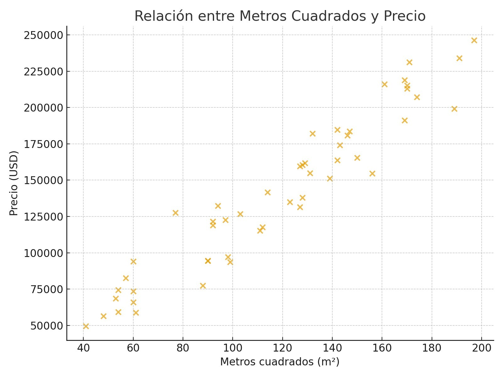
```

Al observar el gráfico se puede observar que el precio de la vivienda crece conforme los metros de la propiedad aumentan, manteniendo una relación "lineal". Dicha relación la representamos entonces con la siguiente fórmula:

$$
Precio=\beta*metros^2+b
$$
Si bien la relación no es lineal  a la perfección, podemos pensar en la recta que mejor se ajuste, para así, obtener predicciones de la variable dependiente a partir de la variable independiente.


<div style="border:2px solid #ccc; padding:10px; border-radius:8px;">

## Función de pérdida y función de costo

#### Función de pérdida (Loss Function)

La función de pérdida (o loss function) es una herramienta que mide qué tan bien o mal está funcionando un modelo de predicción para una observación individual. En otras palabras, compara el valor real con el predicho y asigna un número que representa el error cometido.

$$
\mathcal{L}(y,\hat{y})
$$

#### Función de costo (Cost Function)

La función de costo es una medida global del error del modelo completo.
Se obtiene al promediar (o combinar de otra forma) las pérdidas de todas las observaciones del conjunto de datos.

$$
\mathcal{J}(\theta)
$$
Existen diferentes funciones de pérdida y costo, se elige cual debe considerarse en base al problema que se quiere resolver.
</div>
<br>

Regresando a la identidad de la regresión lineal, dado que la recta queda completamente definida por la pendiente y por la ordenada al origen, nuestro problema consiste en encontrar valores para estas, tales que mejor ajustan la recta a los datos. Definimos las funciones de pérdida y costo, en la regresión lineal, de la siguiente forma:

$$
\bullet \quad\mathcal{L}=(y_i, \hat{y}_i) = (y_i - \hat{y}_i)^2 
$$
$$
\bullet \quad \mathcal{J}(\theta,b) = \frac{1}{n} \sum_{i=1}^{n} \mathcal{L}(y_i, \hat{y}_i)
= \frac{1}{n} \sum_{i=1}^{n} (y_i - \hat{y}_i)^2
= \frac{1}{n} \sum_{i=1}^{n} (y_i - (\beta x_i+b))^2
$$

<br>
**Parámetros de la regresión lineal**
<br> 
----------------------------------------------------------------------------------------------------------------------------------------------------------------------------

\[
\textbf{Modelo:}\qquad y_i = \beta_0 + \beta_1 x_i + \varepsilon_i,\quad i=1,\dots,n
\]

\[
\text{Minimizamos la suma de cuadrados de residuos:}\qquad 
S(\beta_0,\beta_1) = \sum_{i=1}^n \big(y_i - \beta_0 - \beta_1 x_i\big)^2 
\]

\[
\textbf{Derivadas parciales y ecuaciones normales:}
\]

\[
\frac{\partial S}{\partial \beta_0} 
= -2 \sum_{i=1}^n \big(y_i - \beta_0 - \beta_1 x_i\big) = 0
\;\;\Longrightarrow\;\;
\sum_{i=1}^n y_i = n\beta_0 + \beta_1 \sum_{i=1}^n x_i .
\]

\[
\frac{\partial S}{\partial \beta_1} 
= -2 \sum_{i=1}^n x_i \big(y_i - \beta_0 - \beta_1 x_i\big) = 0
\;\;\Longrightarrow\;\;
\sum_{i=1}^n x_i y_i = \beta_0 \sum_{i=1}^n x_i + \beta_1 \sum_{i=1}^n x_i^2 
\]

\[
\text{Definiendo }\bar{x}=\frac{1}{n}\sum x_i,\;\bar{y}=\frac{1}{n}\sum y_i,
\text{ la primera ecuación da }\beta_0 = \bar{y} - \beta_1 \bar{x}
\]

\[
\text{Sustituyendo en la segunda:}\quad
\sum x_i y_i 
= (\bar{y} - \beta_1 \bar{x}) \sum x_i + \beta_1 \sum x_i^2
= n\bar{x}\bar{y} - n\beta_1 \bar{x}^2 + \beta_1 \sum x_i^2 
\]

\[
\Longrightarrow\quad
\sum x_i y_i - n\bar{x}\bar{y} 
= \beta_1 \Big(\sum x_i^2 - n\bar{x}^2\Big)
\]

\[
\text{Notando que }\; 
S_{xy} := \sum_{i=1}^n (x_i-\bar{x})(y_i-\bar{y}) = \sum x_i y_i - n\bar{x}\bar{y},
\quad
S_{xx} := \sum_{i=1}^n (x_i-\bar{x})^2 = \sum x_i^2 - n\bar{x}^2,
\]

\[
\text{obtenemos}\qquad
\boxed{\,\hat{\beta}1 = \dfrac{S{xy}}{S_{xx}}\,}.
\]

\[
\text{Finalmente}\qquad
\boxed{\,\hat{\beta}_0 = \bar{y} - \hat{\beta}_1 \bar{x}\,}.
\]

\[
\text{Formas equivalentes:}\qquad
\hat{\beta}_1 
= \frac{\sum_{i=1}^n (x_i-\bar{x})(y_i-\bar{y})}{\sum_{i=1}^n (x_i-\bar{x})^2}
= \frac{\operatorname{Cov}(X,Y)}{\operatorname{Var}(X)},
\qquad
\hat{\beta}_0 = \bar{y} - \hat{\beta}_1 \bar{x}.
\]
----------------------------------------------------------------------------------------------------------------------------------------------------------------------------

```{r echo=FALSE, fig.align='center', out.height='450pt', out.width='450pt'}
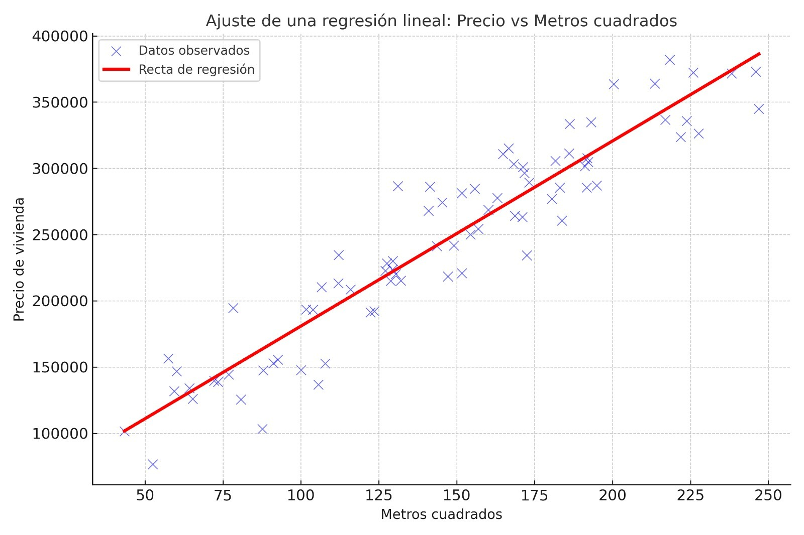
```


## Supuestos en la regresión lineal 

1. Linealidad

La relación entre las variables independientes (predictoras) y la variable dependiente debe ser lineal.

Esto implica que los efectos de los predictores sobre la respuesta son proporcionales y aditivos.
Comprobación: Gráficos de dispersión o residuos vs. predicciones.

2. Independencia de los errores

Los residuos (errores) deben ser independientes entre sí.

3. Homocedasticidad

La varianza de los errores debe ser constante para todos los valores de las variables independientes.

4. Normalidad de los errores

Los errores del modelo deben seguir una distribución normal con media cero.

Este supuesto es importante para la inferencia (p-valores, intervalos de confianza).
Comprobación: Histograma o gráfico Q-Q de los residuos, prueba de Shapiro-Wilk.

5. Ausencia de multicolinealidad

Las variables independientes no deben estar altamente correlacionadas entre sí.

La multicolinealidad puede inflar las varianzas de los coeficientes.
Comprobación: VIF (Variance Inflation Factor), matriz de correlaciones.

6. No presencia de valores atípicos influyentes

Los outliers o puntos de alta influencia pueden distorsionar el ajuste del modelo.

Es importante identificarlos y tratarlos adecuadamente.
Comprobación: Distancia de Cook, leverage, o gráfico de residuos estandarizados.

---

## Regresión Lineal Múltiple

La regresión lineal múltiple es una extensión de la regresión lineal simple, que permite modelar la relación entre una variable dependiente y dos o más variables independientes. Su objetivo es estimar cómo cada variable explicativa contribuye, en promedio, al comportamiento de la variable objetivo.
Dada una varieble dependiente Y, que busca ser explicada por p características.

Para un registro de la variable dependiente, el modelo se expresa como:

$$
Y_i = \beta_0 + \beta_1 X_{i1} + \beta_2 X_{i2} + \dots + \beta_p X_{ip} + \varepsilon_i
$$

donde:  
- \( Y_i \): valor de la variable dependiente para la observación \( i \),  
- \( X_{ij} \): valor de la variable explicativa \( j \) para la observación \( i \),  
- \( \beta_0 \): intercepto,  
- \( \beta_j \): coeficiente asociado a la variable \( X_j \),  
- \( \varepsilon_i \): término de error (diferencia entre el valor real y el predicho).


Así considerando todos los registros y la forma en la que se operan los vectores y las matrices, tenemos:

$$
\mathbf{Y} = \mathbf{X}\boldsymbol{\beta} + \boldsymbol{\varepsilon}
$$

## Estimación de los parámetros

El método más común para estimar los parámetros es el de Mínimos Cuadrados Ordinarios (OLS), que busca minimizar la suma de los errores cuadráticos:

$$
 (\mathbf{y} - \mathbf{X}\boldsymbol{\beta})'(\mathbf{y} - \mathbf{X}\boldsymbol{\beta})
$$

La solución matricial es:

$$
\boxed{\hat{\boldsymbol{\beta}} = (\mathbf{X}'\mathbf{X})^{-1}\mathbf{X}'\mathbf{y}}
$$

---

Para encontrar los valores de \( \boldsymbol{\beta} \) que minimizan la suma de los errores cuadráticos:

$$
\min_{\boldsymbol{\beta}} \; (\mathbf{y} - \mathbf{X}\boldsymbol{\beta})'(\mathbf{y} - \mathbf{X}\boldsymbol{\beta})
$$

---

### Derivación paso a paso

1. *Expandir la expresión:*

$$
S(\boldsymbol{\beta}) = \mathbf{y}'\mathbf{y} - 2\mathbf{y}'\mathbf{X}\boldsymbol{\beta} + \boldsymbol{\beta}'\mathbf{X}'\mathbf{X}\boldsymbol{\beta}
$$

2. *Derivar respecto a* \( \boldsymbol{\beta} \):

$$
\frac{\partial S}{\partial \boldsymbol{\beta}} = -2\mathbf{X}'\mathbf{y} + 2\mathbf{X}'\mathbf{X}\boldsymbol{\beta}
$$

3. *Igualar a cero* (condición de mínimo):

$$
\mathbf{X}'\mathbf{X}\boldsymbol{\beta} = \mathbf{X}'\mathbf{y}
$$

---

$$
\boxed{\hat{\boldsymbol{\beta}} = (\mathbf{X}'\mathbf{X})^{-1}\mathbf{X}'\mathbf{y}}
$$


## Bondad de ajuste

Una vez estimado el modelo, se puede evaluar qué tan bien explica los datos mediante el coeficiente de determinación \(R^2\):

$$
R^2 = 1 - \frac{\sum (y_i - \hat{y}_i)^2}{\sum (y_i - \bar{y})^2}
$$

- \(R^2\) cercano a 1 → el modelo explica gran parte de la variabilidad de \(Y\).  
- \(R^2\) cercano a 0 → el modelo explica poco o nada.

Sin embargo la $R^2$ no penaliza la complejidad del modelo. Esto es, al aumentar el número de regresores, el factor $\sum (y_i - \hat{y}_i)^2$, no puede aumentar


El valor de la R^2 ajustada, penaliza la inclusión de variables irrelevantes, que pueden ser altamente colineales. Para esto considera el número de predictores y el tamaño de la muestra. Para hallar el valor de la R^2 ajustada se tienes que calcular primero el valor de la R^2, así entonces se tiene:

$$
R^2_{ajustada}=1-\frac{(1-R^2)(n-1)}{n-p-1}
$$
La diferencia entre ambas métricas es que r-cuadrada siempre aumenta o permanece cuando se agregan predictores, aunque los predictores que se añaden no mejoren significativamente el modelo. En cambio la R-cuadrada ajustada, puede disminuir si un nuev predictor no mejora el modelo.
---

## Supuestos del modelo lineal múltiple

Para que los resultados del modelo sean válidos, se asume que:

1. **Linealidad**: la relación entre \(Y\) y las \(X_j\) es lineal.  
2. **Independencia**: los errores son independientes entre sí.  
3. **Esperanza condicional cero**: \( \mathbb{E}[\varepsilon_i \mid X] = 0 \).  
4. **Homocedasticidad**: la varianza de los errores es constante.  
5. **No multicolinealidad**: las variables independientes no están perfectamente correlacionadas.  
6. **Normalidad**: los errores se distribuyen normalmente.

---

## Regularización en la Regresión Lineal

Cuando un modelo de regresión lineal se ajusta demasiado a los datos (sobreajuste), o existen muchas variables correlacionadas, los coeficientes pueden volverse inestables.  
Para controlar este problema, existen métodos de regularización, que agregan una penalización a la función de costo.  

Los tres enfoques más comunes son **Ridge, Lasso** y **Elastic Net**.

---

### Ridge Regression

Agrega una penalización cuadrática a los coeficientes para evitar sobreajuste.Los coeficientes al aportar a la función de costo, buscan ser más pequeño y con esto variables que aportaban mucho a la explicabilidad de la variable dependiente pierden relevancia.

$$
\mathcal{J}_{\text{ridge}}(\theta)
= \frac{1}{n} \sum_{i=1}^{n}(y_i - \hat{y}_i)^2 
+ \lambda \sum_{j=1}^{p} \beta_j^2
$$

- Penaliza los coeficientes grandes.  
- Los reduce, pero no los lleva exactamente a cero.  
- Útil cuando existe multicolinealidad entre las variables.

---

### Lasso Regression 

Agrega una penalización absoluta (valor absoluto) que puede llevar algunos coeficientes a cero.

$$
\mathcal{J}_{\text{lasso}}(\theta)
= \frac{1}{n} \sum_{i=1}^{n}(y_i - \hat{y}_i)^2 
+ \lambda \sum_{j=1}^{p} |\beta_j|
$$

- Además de reducir los coeficientes, elimina algunos por completo.  
- Actúa como un método de selección automática de variables.  
- Es útil en problemas de alta dimensionalidad.

---

### Elastic Net Regression

Combina las penalizaciones de Ridge y Lasso, logrando un balance entre ambos enfoques.

$$
\mathcal{J}_{\text{elastic}}(\theta)
= \frac{1}{n} \sum_{i=1}^{n}(y_i - \hat{y}_i)^2 
+ \lambda \left( 
  \alpha \sum_{j=1}^{p} |\beta_j|
  + (1 - \alpha) \sum_{j=1}^{p} \beta_j^2
\right)
$$

donde:  
- \( \lambda \) controla la intensidad de la regularización,  
- \( \alpha \in [0,1] \) controla el balance entre Lasso y Ridge.  

*Casos especiales:*  
- \( \alpha = 1 \) → modelo *Lasso*  
- \( \alpha = 0 \) → modelo *Ridge*  

---

### Comparación de métodos

| Método | Penalización | Efecto sobre los coeficientes | Selecciona variables | Principal uso |
|:--------|:--------------|:------------------------------|:--------------------|:---------------|
| *Ridge* | \( \lambda \sum \beta_j^2 \) | Los reduce (sin anularlos) | No | Multicolinealidad |
| *Lasso* | \( \lambda \sum |\beta_j| \) | Algunos se vuelven 0 | sí | Alta dimensionalidad |
| *Elastic Net* | \( \lambda [\alpha \sum |\beta_j| + (1-\alpha)\sum \beta_j^2] \) | Combina ambos efectos | Parcial | Balance entre Ridge y Lasso |


La regularización busca un equilibrio entre ajuste y simplicidad.  
Mientras Ridge controla la magnitud de los coeficientes, Lasso puede eliminarlos.  
Elastic Net combina ambos enfoques para lograr un modelo más robusto y equilibrado.


## Consideraciones

Es útil escalar los valores de la variables dependientes, sobre todo al regularizar las regresiones.

La correlación de Pearson, es una buena herramienta para seleccionar variables independientes que modelen a una variable dependiente.


## Sesgo y Varianza

El desempeño de un modelo de regresión (o de cualquier modelo de aprendizaje) depende de su capacidad para *equilibrar el sesgo y la varianza*.  
Estos dos conceptos explican los errores que comete el modelo al predecir valores nuevos.

### Sesgo 

El *sesgo* mide cuánto se alejan las predicciones promedio del modelo del valor real esperado. En términos simples, representa el *error por simplificación del modelo*.

*Alta sesgo → modelo demasiado simple*, que no logra capturar la complejidad de los datos (subajuste).  

###  Varianza

La *varianza* mide cuánto cambian las predicciones del modelo si se entrena con diferentes conjuntos de datos. Representa la *sensibilidad del modelo al ruido*.

*Alta varianza → modelo demasiado complejo*, que se ajusta demasiado a los datos de entrenamiento (sobreajuste).

**Consecuencia:**  
Predicciones muy diferentes en nuevos datos.

### Compromiso sesgo–varianza

Existe un *equilibrio* entre ambos conceptos:

| Tipo de modelo | Sesgo | Varianza | Resultado |
|:----------------|:-------:|:----------:|:-----------|
| Modelo simple (pocos parámetros) | Alto | Bajo | Subajuste |
| Modelo complejo (muchos parámetros) | Bajo | Alto | Sobreajuste |
| Modelo equilibrado | Medio | Medio | Buen ajuste |


### En regresión lineal

- La *regresión lineal clásica* tiende a tener *bajo sesgo* y *baja varianza* si el número de variables es razonable.  
- Cuando se agregan muchas variables o hay multicolinealidad, la *varianza aumenta*, porque los coeficientes se vuelven inestables.
- Métodos de *regularización* (como Ridge o Lasso) se usan precisamente para *reducir la varianza*, a costa de introducir un poco de sesgo.


## Conclusión de la sección

Finalmente buscando conectar el tema con las redes neuronales. La regresión lineal es el primer modelo que se ajusta al construir una neurona, pues recibe las variables de entrada (variables independientes), una vez ajustada la regresión lineal, esta pasará por una función de activación la cual rompe con la relación lineal entre las variables independientes con la variable dependiente.


<!--chapter:end:03-Linear_Neural_Networks_for_Regression.Rmd-->

<!-- ::: watermark -->
<!--  -->
<!-- ::: -->


# Redes neuronales Lineales para Clasificación


## Modelos Lineales Generalizados

### Historia

**Regresión lineal**

```{r echo=FALSE, fig.align='left', out.width='50%', fig.align='center'}
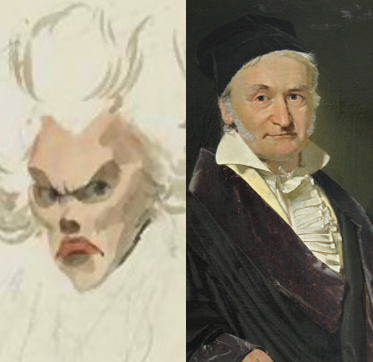
```
El primer método de regresión lineal documentado es el método de los mínimos cuadrados, publicado por Legendre en 1805. 
Posteriormente, Gauss publicó un trabajo donde se desarrolla con mayor detalle el tema.


**Modelo Lineal Generalizado (GLM)**

```{r echo=FALSE, fig.align='left', out.width='60%', fig.align='center'}

```
Los GLM fueron formulados por John Nelder y Robert Wedderburn en 1972 como una manera de unificar modelos estadísticos.

Un modelo lineal generalizado es una generalización flexible de la regresión lineal ordinaria.

### Definición

Los Modelos Lineales Generalizados (GLM) son una extensión de los modelos lineales tradicionales que permiten modelar variables respuesta que no necesariamente siguen una distribución normal (por ejemplo, binarias, de conteo o proporciones). Relacionan la distribución aleatoria de la variable dependiente (variable objetivo) en el experimento, con la parte sistemática a través de una función llamada función de enlace.

Por lo tanto, un modelo lineal generalizado, tiene tres componentes  básicos:

- **Componente aleatorio** *(Y ~ Distribución de probabilidad)*: Identifica la variable de objetivo y su distribución de probabilidad.
- **Componente sistemática** *(𝜂 = xW)*: Especifica las variables explicativas de la función predictora lineal.
- **Función de enlace** *(𝑔(𝝁) = 𝜂)*: Es una función del valor esperado de Y como una combinación lineal de las variables explicativas

Algebraicamente:
$$
	𝔼(𝒀)=𝝁=𝑔^{−1}(WX)
$$

Los estudios de Wedderburn se limitaron los componentes aleatorios a la familia exponencial, cuya aplicación se puede dar de la siguiente manera:

- **Normal**: regresión lineal
- **Binomial**: regresión logística
- **Poisson**: regresión de conteo
- **Gamma**: regresión para tiempos o tasas positivas
- Inversa Gaussiana, etc.

| Distribución | Función de Enlace          | Nombre de modelo      |
|--------------|----------------------------|-----------------------|
| Normal       | g(μ) = μ                   | Regresión lineal      |
| Binomial     | g(μ) = log(μ /(1−μ))       | Regresión logística   |
| Poisson      | g(μ) = log(μ)              | Regresión de Poisson  |


**Representación gráfica**

Podemos apreciar una regresión lineal como una neurona:
```{r echo=FALSE, fig.align='left', out.width='60%', fig.align='center'}
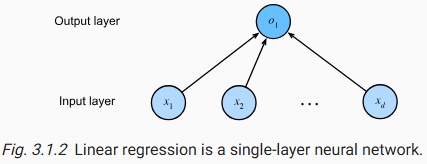
```


Haciendo uso de una regresión logística, podemos pasar de *how much?* a *wich class?*, el diagrama sería el siguiente:
```{r echo=FALSE, fig.align='left', out.width='60%', fig.align='center'}
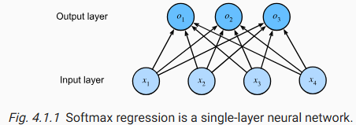
```


## Regresión Logística para Clasificación

Iniciemos recordando que los algoritmos de Machine Learning pueden ser clasificados como:
```{r echo=FALSE, fig.align='left', out.width='40%', fig.align='center'}
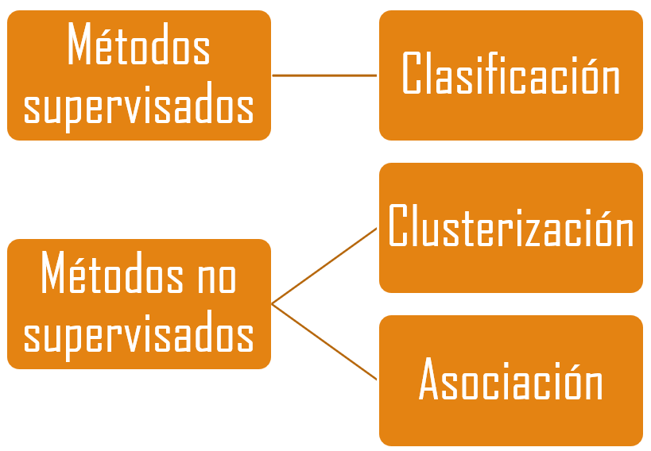
```

Los ***métodos de clasificación, métodos predictivos,  reconocimiento de patrones, aprendizaje supervisado*** son aquellos algoritmos en los cuales vamos a clasificar a los objetos en un conjunto de categorías previamente definidas.

En estos métodos existe una variable, conocida como variable objetivo con la cual se buscarán dos resultados:

- **Evidenciar** la razón por la cual existen las clases en cuestión, es decir, encontrar factores que puedan agrupar a los individuos en sus respectivos grupos.
- Proyectar el ingreso de **nuevos individuos** en alguna de las características anteriores.

**Definición**

La clasificación es la tarea de **aprender una función, f,** que pueda mapear cada conjunto de atributos a una categoría predefinida.
Busca predecir la clase a la cual pertenece un registro. 
La diferencia principal contra el análisis de conglomerados es el deseo de predecir a nuevos individuos.

Buscamos una función que vaya de D a C
$$
𝑓:𝐷→ Y
$$
Donde:

 - $𝐷={(𝑥_𝑖,𝑦_𝑖) | 𝑖=1,2,…,𝑁}$ es el conjunto de individuos, incluyendo $𝑥_𝑖$ corresponde a las características explicativas de un individuo y $𝑦_𝑖$ corresponde al valor de la clase
 - $Y={y _1,  y_2,…, y_𝑚}$ es el conjunto de clases.

La función resultante puede ser un árbol de decisión, SVM, etc.

La función que clasificará el conjunto X a la clase Y, comúnmente es llamada modelo de clasificación.
```{r echo=FALSE, fig.align='left', out.width='60%', fig.align='center'}
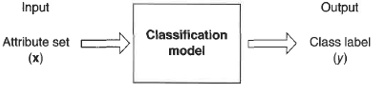
```

Una vez recordado lo anterior, podemos definir a una regresión logística como un modelo en el cual se recibe una tabla relacional con *d* características descriptivas y una clase a la cual pertenece cada individuo de la tabla.

Como resultado, el modelo nos proporciona la *probabilidad de pertenecer* a alguna clase.

**Planteamiento del problema**

El primer paso, consistiría en construir el modelo de regresión, de tal forma que el componente aleatorio ($y_i$) se conecte con la componente sistémica (regresión lineal):
$$
𝑦_𝑖↔𝛽_0+𝛽_1 𝑥_𝑖+𝜖_𝑖
$$

---

Vamos a suponer un modelo de **regresión lineal clásica** de tal forma que:
$$
𝔼(𝑦_𝑖 | 𝑥_𝑖 )=𝛽_0+𝛽_1 𝑥_𝑖
$$
Al intentar buscar probabilidades a través de una regresión lineal, obtendríamos lo siguiente:

Sea $𝑝_𝑖$ la probabilidad de pertenecer a la clase 1 dadas las características del individuo:
$$
𝑝_𝑖=ℙ(𝑦=1|𝑥_𝑖 )
$$

Podemos asumir que $𝑝_𝑖$ sigue una distribución Bernoulli, de tal forma que su esperanza sea:
$$
𝔼(𝑦|𝑥_𝑖 )=𝑝_𝑖×1+(1−𝑝_𝑖 )×0=𝑝_𝑖
$$
De tal forma que:
$$
𝑝_𝑖= 𝛽_0+𝛽_1 𝑥_𝑖
$$
No obstante, los resultados pueden resultar absurdos debido a que nuestra fórmula nos puede proporcionar **probabilidades negativas** o **mayores a cero** $!$

---

Las probabilidades no tienen valores superiores a 1 ni negativas, pero el concepto de momios $p / (1-p)$ tiene como imagen de cero a infinito. La función exponencial tiene la misma imagen, entonces, la regresión logística relaciona ambos concpetos a través de la siguiente igualdad
$$
ℙ(𝑦=1|𝑥_𝑖 )/(1−ℙ(𝑦=1|𝑥_𝑖 ) )=𝑒^{(𝛽_0+𝛽_1 𝑥_𝑖 )}
$$
Al aplicar el logaritmo natual, podemos apreciar la definición de la función logit:
$$
logit[𝑝_𝑖 ]=ln[𝑝_𝑖/(1−𝑝_𝑖 )]=𝛽_0+𝛽_1 𝑥_𝑖
$$
Recordando que la función logit es la inversa de la función logistica (o sigmoide)

```{r echo=FALSE, fig.align='center', fig.width=6, fig.height=4}
library(ggplot2)

# Datos para la curva
x <- seq(-6, 6, length.out = 200)
y <- 1 / (1 + exp(-x))
data <- data.frame(x, y)

# Gráfico con ggplot2
ggplot(data, aes(x=x, y=y)) +
  geom_line(color="steelblue", linewidth=1.2) +
  labs(
    title = "Curva logística",
    x = "x",
    y = "f(x)"
  ) +
  theme_minimal(base_size=14)
```

La función logit es apropiada para los problemas de clasificación con dos clases. No obstante, la generalización para múltiples clases se hace con la función Softmax()
$$
\sigma_{softmax} = \frac{e^{z_m}}{\sum_{m=1}^M e^{z_m}}
$$

La estructura aplicada en Redes Neuronales es la siguiente:
```{r echo=FALSE, fig.align='center', out.width='70%'}
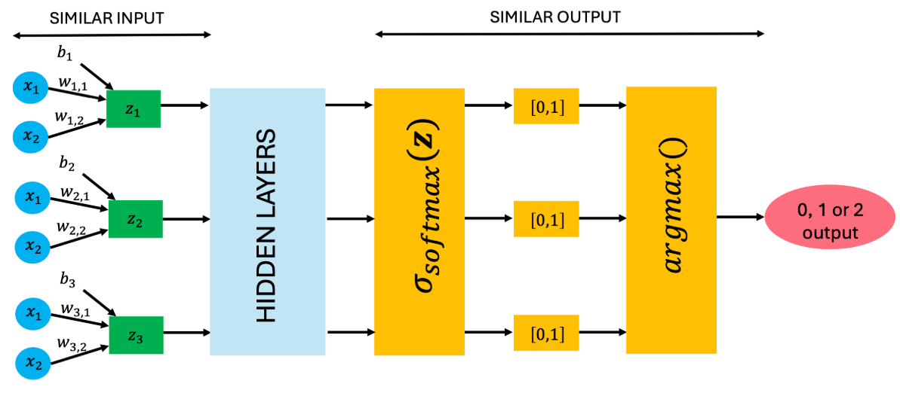
```

<br>


## Redes neuronales

### Historia

**Redes Neuronales**

```{r echo=FALSE, fig.align='center', out.width='50%'}
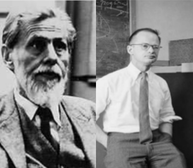
```
En 1943 Warren McCulloch (neurocientífico, médico, neurólogo y fisiólogo) y Walter Pitts (matemático, psicólogo, filósofo y neurocientífico) crearon un modelo para redes neuronales basados en la lógica de umbral. Este modelo señaló el camino para que la investigación de redes neuronales se divida en dos enfoques distintos:

1. Un enfoque centrado en los procesos biológicos en el cerebro.
2. Otro en la aplicación de redes neuronales para la inteligencia artificial.

```{r echo=FALSE, fig.align='center', out.width='40%'}

```
Para la aplicación de la inteligencia artificial, fue Marvin Minsky quien dio una gran aportación con el libro **“Perceptrones”** en 1969.
Minsky es considerado como uno de los padres de las ciencias de la computación y fue cofundador del laboratorio de inteligencia artificial del MIT

### Definición

Las redes neuronales son algoritmos que tienen como objetivo el simular en una computadora la forma en la cual funcionan las redes neuronales en los humanos.
Puede recibir variables cuantitativas y cualitativas. Es un algoritmo sensible a cambios en los datos y parámetros

### Neurona

Célula del sistema nerviosos formada por un núcleo y una serie de prolongaciones, una de las cuales es más larga que las demás.
Están especializadas en la recepción de estímulos y conducción del impulso nerviosos entre ellas o con otros tipos celulas

```{r echo=FALSE, fig.align='center', out.width='60%'}
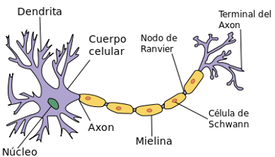
```

<br>

**Dentrita:** Es la fuente de un impulso nerviosos. De hecho el impulso nervioso es unidireccional, es decir, solamente se transmite desde las dendritas hacia el axón (canal de entrada)

**Axón:** Prolongación que arranca del cuerpo de la neurona y termina en una ramificación que está en contacto con otras células. Es la vía por la cual circulan los impulsos eléctricos (canal de salida)

**Sinapsis:** Región de comunicación entre el axón de una neurona y las dendritas o el cuerpo de otra

```{r echo=FALSE, fig.align='center', out.width='60%'}
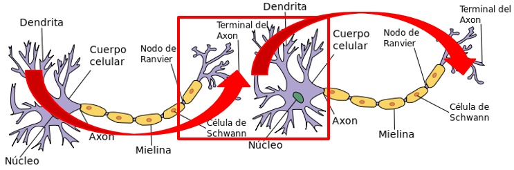
```

**Emulación:**

```{r echo=FALSE, fig.align='center', out.width='60%'}
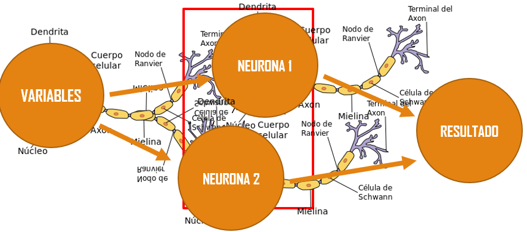
```

Las redes neuronales, tratan de modelar una red neuronal donde cada nodo es una neurona, y los arcos representan la sinapsis entre las neuronas. 
Como algoritmo, las redes neuronales reciben n entradas y pueden otorgar n salidas.

```{r echo=FALSE, fig.align='center', out.width='60%'}
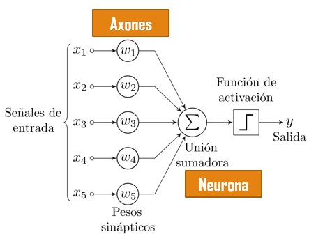
```

Un perceptrón puede entenderse como la unidad básica de inferencia en forma de discriminador lineal. Un perceptrón va a separar a los puntos a través de un hiperplano
Es el modelo biológico más sencillo hace referencia a una sola neurona. El perceptrón consiste de dos tipos de nodos:

- Nodos de entrada: ingreso de los atributos
- Nodos de salida: representa a los resultados del modelo

Un perceptrón genera sus resultados realizando una suma ponderada de sus atributos de entrada, restando un valor t y examinando el signo del resultado. 
Supongamos la siguiente tabla:

```{r echo=FALSE, fig.align='center', out.width='30%'}
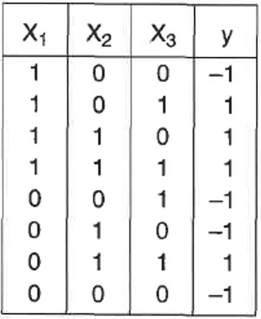
```

El perceptrón sería aquella red neuronal que recibiera de entrada cada uno de los valores x y diera como resultado y

```{r echo=FALSE, fig.align='center', out.width='60%'}
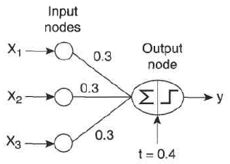
```

$$
y =
\begin{cases}
    \text{1, si:  } 0.3𝑥_1+0.3𝑥_1+0.3𝑥_1−0.4 ≥ 0 \\
    \text{-1, si:  } 0.3𝑥_1+0.3𝑥_1+0.3𝑥_1−0.4 < 0 \\
\end{cases}
$$
Como el resultado depende del signo, la función se representa como:
$$
𝑦=𝑠𝑖𝑔𝑛(𝑤,𝑥)
$$

Cuando intentamos hacer la separación de un XOr, podemos notar que necesitamos dos discriminadores lineales:

```{r echo=FALSE, fig.align='center', out.width='60%'}
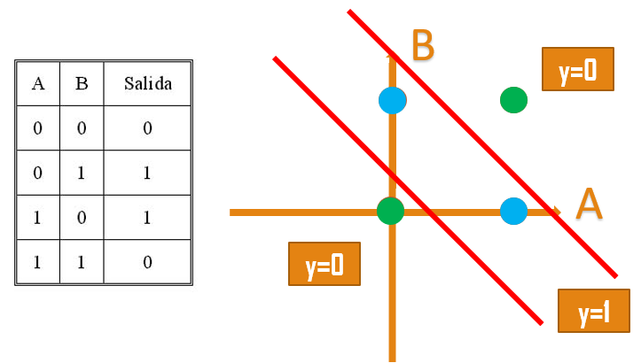
```


### Redes Neuronales

Las redes neuronales, son una estructura más compleja que un perceptrón. Algunas de las complejidades son:

- Las redes neuronales tienen **varios nodos intermedios** entre los nodos de entrada y los nodos de salida.
- Las capas ocultas pueden utilizar **funciones de activación diferentes**

```{r echo=FALSE, fig.align='center', out.width='60%'}
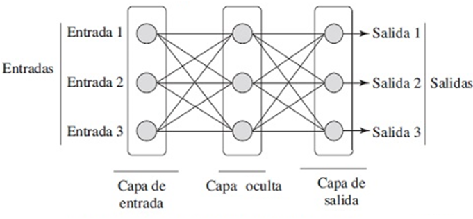
```

```{r echo=FALSE, fig.align='center', out.width='60%'}
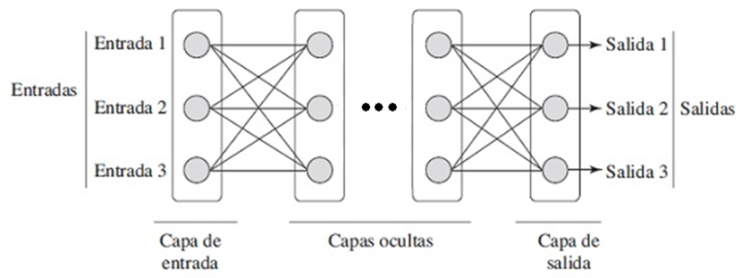
```


Con una capa oculta, es posible generar una función de discriminación para una tabla XOr

```{r echo=FALSE, fig.align='center', out.width='60%'}
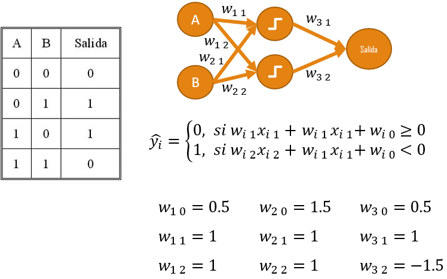
```


**Funciones de activación comunes**

```{r echo=FALSE, fig.align='center', out.width='60%'}
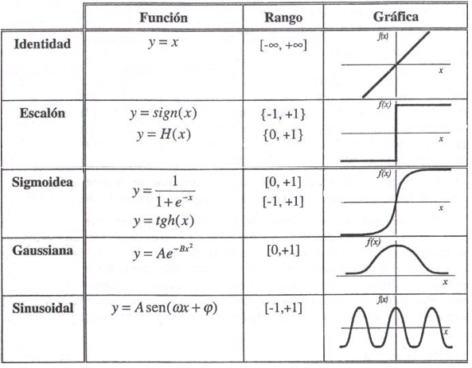
```


## Notas adicionales {.unnumbered}
Curso de Git: https://www.youtube.com/watch?v=3GymExBkKjE&t=195s


<!--chapter:end:04-Linear_Neural_Networks_for_Classification.Rmd-->

---
output:
  pdf_document: default
  html_document: default
---
<!-- ::: watermark -->
<!--  -->
<!-- ::: -->


# Perceptrón Multicapa

## Perceptrones multicapa

En la Sección anterior, se presentó la regresión softmax, implementando el algoritmo desde cero. Esto permitió entrenar clasificadores capaces de reconocer 10 categorías de prendas de vestir a partir de imágenes de baja resolución. Durante el proceso, aprendimos a manipular los datos, a convertir las salidas en una distribución de probabilidad válida, a aplicar una función de pérdida adecuada y a minimizarla con respecto a los parámetros del modelo. Ahora que se conocen estos aspectos en el contexto de modelos lineales simples, podemos comenzar la exploración de las redes neuronales profundas, la clase de modelos relativamente rica que constituye el tema principal de este curso.

### Capas ocultas

En la sección 3.1., se describen las transformaciones afines como transformaciones lineales con un sesgo añadido. Para empezar, recordemos la arquitectura del modelo correspondiente a nuestro ejemplo de regresión softmax, ilustrado en la figura 4.1.1. Este modelo asigna directamente las entradas a las salidas mediante una única transformación afín, seguida de una operación softmax. Si nuestras etiquetas estuvieran realmente relacionadas con los datos de entrada mediante una simple transformación afín, este enfoque sería suficiente. Sin embargo, la linealidad (en las transformaciones afines) es una suposición muy restrictiva.

```{r echo=FALSE, fig.align='center', out.height='300pt', out.width='650pt'}

```

#### Limitaciones de los modelos lineales

La linealidad supone una relación monotónica: si una variable aumenta, la salida del modelo siempre sube o baja según el signo del peso. Esto a veces es razonable, como al predecir el pago de un préstamo según ingresos, aunque la relación no sea estrictamente lineal. En estos casos, funciones como la logística pueden hacer más plausible la linealidad.

Sin embargo, muchas relaciones reales no son monotónicas. Por ejemplo, la temperatura corporal: valores por encima o por debajo de 37 °C aumentan el riesgo, por lo que conviene transformar la variable (p. ej., usar la distancia a 37 °C).

```{r echo=FALSE, fig.align='center', out.height='300pt', out.width='650pt'}
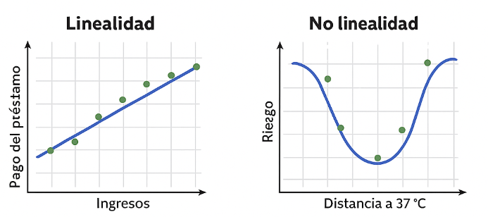
```

En problemas como la clasificación de imágenes, la linealidad es claramente insuficiente: cambiar el brillo de un solo píxel no determina si hay un gato o un perro. Aquí el significado de cada píxel depende de su contexto, y no existe un preprocesamiento simple que lo capture. Las redes neuronales profundas resuelven esto aprendiendo simultáneamente una representación adecuada y un predictor lineal sobre esa representación.

La necesidad de modelar no linealidades se conoce desde hace un siglo y ha dado lugar a enfoques como árboles de decisión, métodos kernel, splines y, más recientemente, redes neuronales, inspiradas en las conexiones jerárquicas entre neuronas del cerebro.

#### Incorporación de Capas Ocultas

Para superar las limitaciones de los modelos lineales, podemos agregar capas ocultas. La idea más básica es apilar varias capas totalmente conectadas: cada capa envía su salida a la siguiente. Las primeras capas aprenden una representación de los datos y la última capa actúa como un modelo lineal sobre esa representación.

A esta arquitectura se le llama perceptrón multicapa o MLP.

Observa la siguiente imagen que contempla un MLP con 4 entradas, 1 capa oculta con 5 neuronas y 3 salidas. Como la capa de entrada no calcula nada, realmente el modelo tiene 2 capas de cálculo: la oculta y la de salida.

```{r echo=FALSE, fig.align='center', out.height='300pt', out.width='650pt'}
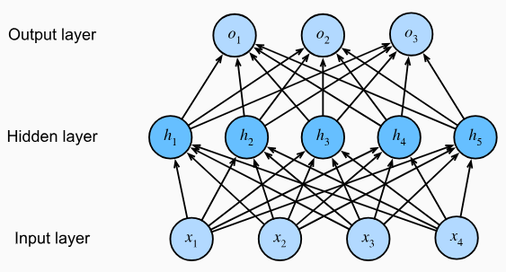
```

En un MLP, cada neurona de una capa está conectada con todas las neuronas de la siguiente. Es decir, cada entrada afecta a todas las neuronas ocultas, y cada una de estas afecta a todas las neuronas de salida.

#### De lo Lineal a lo No Lineal

Como antes, denotamos con la matriz $X \in \mathbb{R}^{n \times d}$ un minibatch de $n$ ejemplos, donde cada ejemplo tiene $d$ entradas (características). Para un MLP de una capa oculta cuya capa oculta tiene $h$ unidades ocultas, denotamos por $H \in \mathbb{R}^{n \times h}$ las salidas de la capa oculta, que son representaciones ocultas. Dado que las capas oculta y de salida están completamente conectadas, tenemos pesos de capas ocultas $W^{(1)} \in \mathbb{R}^{d \times h}$ y sesgos $b^{(1)} \in \mathbb{R}^{1 \times h}$ y pesos $W^{(2)} \in \mathbb{R}^{h \times q}$ y sesgos $b^{(2)} \in \mathbb{R}^{1 \times q}$ de la capa de salida. Esto nos permite calcular las salidas $O \in \mathbb{R}^{n \times q}$ del MLP de una capa oculta de la siguiente manera:

$$
H=XW^{(1)}+b^{(1)},
$$
$$
O=HW^{(2)}+b^{(2)}.
$$

::: {.infobox .important data-latex="{important}"}
**¡¡ RECORDATORIO !!**

Una función "Afín" está dada por: $f(x)=Ax+b$,

Mientras que una función lineal está dado por: $f(x)=Ax$
:::

Hay que tener en cuenta que, tras añadir la capa oculta, el modelo requiere que se rastree y actualicen conjuntos adicionales de parámetros. ¿Qué se ha ganado a cambio? Sorprendentemente, el modelo definido anteriormente, ¡NO GANA NADA! y la razón es sencilla. Las unidades ocultas anteriores se dan mediante una función afín de las entradas, y las salidas (pre-softmax) son simplemente una función afín de las unidades ocultas. La composición de funciones afines es todavía una función afín. Además, el modelo lineal ya era capaz de representar cualquier función afín.

Para verlo formalmente, se puede simplemente colapsar la capa oculta en la definición anterior, lo que genera un modelo equivalente de una sola capa con parámetros.

$$
W=W^{(1)}W^{(2)} \text{ and } b=b^{1}W^{(2)}+b^{(2)}:
$$
$$
O=(XW^{(1)}+b^{(1)})W^{(2)}+b^{(2)}=XW^{(1)}W^{(2)}+b^{(1)}W^{(2)}+b^{(2)}=XW+b
$$

Para aprovechar el potencial de las arquitecturas multicapa, se necesita un ingrediente clave adicional: **una función de activación no lineal** que se aplique a cada unidad oculta tras la transformación afín. na opción popular es la función de activación ReLU (unidad lineal rectificada) (Nair y Hinton, 2010) $\sigma(x)=max(0, x)$, que opera sobre sus argumentos elemento por elemento. Las salidas de las funciones de activación $\sigma(\cdot)$ se denominan **activaciones**. En general, con las funciones de activación establecidas, ya no es posible convertir el MLP en un modelo lineal:

$$
H=\sigma(XW^{(1)}+b^{(1)}),
$$
$$
O=HW^{(2)}+b^{(2)}.
$$

Dado que cada fila en $X$ corresponde a un ejemplo en el minibatch, con cierto abuso de notación, definimos la no linealidad $\sigma$ para aplicarla a sus entradas por filas, es decir, un ejemplo a la vez. Con frecuencia, las funciones de activación se aplican no solo por filas, sino también por elementos. Esto significa que, tras calcular la parte lineal de la capa, se calcula cada activación sin tener en cuenta los valores tomados por las demás unidades ocultas.

#### Aproximadores Universales

::: {.infobox .quicktip data-latex="{quicktip}"}
**¿Qué es un aproximador universal?**

Es un resultado teórico que dice que **una red neuronal con una sola capa oculta puede representar prácticamente cualquier función**, si tiene suficientes neuronas y parámetros.
:::

**Pero ojo:**

Que pueda representar cualquier función no significa que sea fácil aprenderla. Tener una sola capa oculta puede requerir muchísimas neuronas (algo poco práctico). A veces es mejor usar: métodos de kernels, cuando aplican, porque resuelven el problema de forma exacta; redes más profundas, que permiten representar las mismas funciones de manera más compacta y eficiente.

**Idea didáctica clave**

La profundidad importa. Con suficiente profundidad, una red puede aprender funciones complejas de forma más eficiente que una red muy ancha con una sola capa.

### Funciones de activación

Las funciones de activación determinan si una neurona debe activarse o no calculando la suma ponderada y agregándole un sesgo. Son operadores diferenciables que transforman señales de entrada en salidas, y la mayoría añade no linealidad. Dado que las funciones de activación son fundamentales para el aprendizaje profundo, se revisarán algunas de las más comunes.

#### Función ReLU

La opción más popular, debido tanto a su simplicidad de implementación como a su buen rendimiento en diversas tareas predictivas, es la unidad lineal rectificada (ReLU) (Nair y Hinton, 2010). ReLU proporciona una transformación no lineal muy simple. Dado un elemento , la función se define como el máximo de ese elemento y 0:

$$
ReLU(x)=max(x, 0).
$$

De manera informal, **la función ReLU conserva solo los elementos positivos y descarta todos los negativos** estableciendo las activaciones correspondientes a 0. Para una mayor comprensión, podemos representar gráficamente la función. Como se puede observar, la función de activación es lineal por partes.

```{python, fig.align='center'}
import torch
import matplotlib.pyplot as plt

# Datos
x = torch.arange(-8.0, 8.0, 0.1)
y = torch.relu(x)

# Gráfica
plt.figure(figsize=(5, 2.5))
plt.plot(x, y)
plt.xlabel("x")
plt.ylabel("ReLU(x)")
plt.title("Función de activación ReLU")
plt.grid(True)
plt.show()
```

Cuando la entrada es negativa, la derivada de la función ReLU es 0, y cuando la entrada es positiva, la derivada de la función ReLU es 1. Nótese que la función ReLU no es diferenciable cuando la entrada toma valor exactamente igual a 0. En estos casos, se usa por defecto la derivada del lado izquierdo y decimos que la derivada es 0 cuando la entrada es 0. Podemos evitar esto porque la entrada puede que nunca sea realmente cero (los matemáticos dirían que no es diferenciable en un conjunto de medida cero). Hay un viejo adagio que dice que si las condiciones de contorno sutiles importan, probablemente estemos haciendo matemáticas (reales), no ingeniería. Esa sabiduría convencional puede aplicarse aquí, o al menos, el hecho de que no estamos realizando optimización restringida (Mangasarian, 1965, Rockafellar, 1970). se traza la derivada de la función ReLU a continuación.

```{python, fig.align='center'}
x = torch.arange(-8.0, 8.0, 0.1, requires_grad=True)
y = torch.relu(x)

y.backward(torch.ones_like(x))

plt.figure(figsize=(5, 2.5))
plt.plot(x.detach(), x.grad)
plt.xlabel('x')
plt.ylabel('grad ReLU(x)')
plt.title('Derivada de ReLU')
plt.grid(True)
plt.show()
```

La razón para usar ReLU es que sus derivadas se comportan particularmente bien: o se anulan o simplemente dejan pasar el argumento. Esto mejora el comportamiento de la optimización y mitiga el problema bien documentado de los gradientes evanescentes que afectaba a versiones anteriores de redes neuronales (más sobre esto más adelante).

Cabe destacar que existen muchas variantes de la función ReLU, incluyendo la función ReLU parametrizada (pReLU) (He et al., 2015). Esta variación añade un término lineal a ReLU, por lo que parte de la información se transmite, incluso cuando el argumento es negativo:

$$
pReLU(x)=max(0,x)+\alpha \cdot min(0,x).
$$

#### Función Sigmoide

La función sigmoidea transforma las entradas cuyos valores se encuentran en el dominio $\mathbb{R}$, en salidas que se encuentran en el intervalo (0, 1). Por esta razón, la función sigmoidea suele denominarse función de aplastamiento (*squashing function*): aplasta cualquier entrada en el rango (-inf, inf) a un valor en el rango (0, 1):

$$
\text{sigmoid}(x)=\frac{1}{1+\text{exp}(-x)}
$$

A continuación, se grafica la función sigmoidea. Nótese que cuando la entrada se acerca a 0, la función sigmoidea se aproxima a una transformación lineal.

```{python, fig.align='center'}
x = torch.arange(-8.0, 8.0, 0.1)
y = torch.sigmoid(x)

plt.figure(figsize=(5, 2.5))
plt.plot(x.detach(), y.detach())
plt.xlabel("x")
plt.ylabel("sigmoid(x)")
plt.title("Función Sigmoid")
plt.grid(True)
plt.show()
```

La derivada de la función sigmoide está dada por la siguiente ecuación:

$$
\frac{d}{dx}\text{sigmoid}(x)=\frac{\text{exp(-x)}}{(1+\text{exp}(-x))^2}=\text{sigmoid}(x)(1-\text{sigmoid}(x))
$$

La derivada de la función sigmoidea se grafica a continuación. Nótese que cuando la entrada es 0, la derivada de la función sigmoidea alcanza un máximo de 0,25. A medida que la entrada diverge de 0 en cualquier dirección, la derivada tiende a 0.

```{python, fig.align='center'}
# Definir x con gradientes
x = torch.arange(-8.0, 8.0, 0.1, requires_grad=True)
y = torch.sigmoid(x)

# Borrar gradientes previos (si los hubiera)
if x.grad is not None:
    x.grad.zero_()

# Backprop para obtener la derivada
y.backward(torch.ones_like(x), retain_graph=True)

# Graficar
plt.figure(figsize=(5, 2.5))
plt.plot(x.detach(), x.grad.detach())
plt.xlabel("x")
plt.ylabel("grad sigmoid(x)")
plt.title("Derivada de la función Sigmoid")
plt.grid(True)
plt.show()
```

#### Función Tanh

Al igual que la función sigmoidea, la función tangente hiperbólica también reduce sus valores de entrada, transformándolos en elementos del intervalo entre -1 y 1.

$$
\text{tanh}(x)=\frac{1-\text{exp}(-2x)}{1+\text{exp}(-2x)}
$$

Nótese que, a medida que la entrada se acerca a 0, la función tanh se aproxima a una transformación lineal. Aunque la forma de la función es similar a la de la función sigmoidea, la función tanh presenta **simetría puntual respecto al origen** del sistema de coordenadas (Kalman y Kwasny, 1992).

```{python, fig.align='center'}
# Datos
x = torch.arange(-8.0, 8.0, 0.1)
y = torch.tanh(x)

# Gráfica
plt.figure(figsize=(5, 2.5))
plt.plot(x.detach(), y.detach())
plt.xlabel("x")
plt.ylabel("tanh(x)")
plt.title("Función tanh")
plt.grid(True)
plt.show()
```

La derivada de la función *tanh* es:

$$
\frac{d}{dx}\text{tanh}(x)=1-\text{tanh}^{2}(x)
$$

A medida que la entrada se acerca a 0, la derivada de la función *tanh* se acerca a un máximo de 1. Y, como se vio con la función sigmoidea, a medida que la entrada se aleja de 0 en cualquier dirección, la derivada de la función *tanh* se acerca a 0.

```{python, fig.align='center'}
# Definir x con gradientes activados
x = torch.arange(-8.0, 8.0, 0.1, requires_grad=True)
y = torch.tanh(x)

# Borrar gradientes anteriores
if x.grad is not None:
    x.grad.zero_()

# Backprop para obtener la derivada
y.backward(torch.ones_like(x), retain_graph=True)

# Graficar la derivada
plt.figure(figsize=(5, 2.5))
plt.plot(x.detach(), x.grad.detach())
plt.xlabel("x")
plt.ylabel("grad tanh(x)")
plt.title("Derivada de la función tanh")
plt.grid(True)
plt.show()
```

### Discusión

Ahora sabemos cómo incorporar **no linealidades** para construir arquitecturas expresivas de redes neuronales multicapa. Una ventaja de la función ReLU es que es significativamente más fácil de optimizar que la función sigmoidea o la función tanh. Se podría argumentar que esta fue una de las innovaciones clave que impulsaron el resurgimiento del aprendizaje profundo en la última década. 

Cabe destacar, sin embargo, que la investigación en funciones de activación no se ha detenido. Por ejemplo, la función de activación GELU (unidad lineal de error gaussiano) $x\phi(x)$ de Hendrycks y Gimpel (2016) $\phi(x)$ (es la función de distribución acumulativa gaussiana estándar) y la función de activación *Swish* $\sigma(x)=x\cdot\text{sigmoid}(\beta x)$, propuesta por Ramachandran et al. (2017), pueden ofrecer una mayor precisión en muchos casos.

### Ejercicios

1. Demuestre que añadir capas a una red lineal profunda, es decir, una red sin no linealidad $\sigma$, nunca puede aumentar su potencia expresiva. Dé un ejemplo donde la reduzca activamente.

2. Calcule la derivada de la función de activación pReLU.

3. Calcule la derivada de la función de activación Swish $x\cdot \text{sigmoid}(\beta x)$.

4. Demuestre que una MLP que utiliza solo ReLU (o pReLU) construye una función lineal continua por partes.

5. Sigmoid y tanh son muy similares.

* Demuestre que $\text{tanh}(x)+1 = 2\text{sigmoid}(2x)$.

* Demuestre que las clases de función parametrizadas por ambas no linealidades son idénticas. Pista: las capas afines también tienen términos de sesgo.

6. Suponga que tenemos una no linealidad que se aplica a un minibatch a la vez, como la normalización por lotes (Ioffe y Szegedy, 2015). ¿Qué tipo de problemas espera que esto cause?

7. Dé un ejemplo donde los gradientes se anulen para la función de activación sigmoide.


## Implementación de Perceptrones Multicapa

Los perceptrones multicapa (MLP) no son mucho más complejos de implementar que los modelos lineales simples. La diferencia conceptual clave radica en que ahora se concatenan múltiples capas.

### Implementación desde Cero

Comencemos de nuevo implementando dicha red desde cero.

#### Inicialización de parámetros del modelo

El conjunto de datos **Fashion-MNIST** contiene 10 clases de imágenes y cada imagen consiste en una cuadrícula de valores de píxeles en escala de grises. Como antes, por ahora ignoraremos la estructura espacial entre los píxeles, por lo que podemos considerarlo como un conjunto de datos de clasificación con 784 características de entrada y 10 clases. Para comenzar, implementaremos un MLP con una capa oculta y 256 unidades ocultas. Tanto el número de capas como su ancho son ajustables (se consideran hiperparámetros). 

::: {.infobox .quicktip data-latex="{quicktip}"}
**Tip:**

Normalmente, se busca que **el ancho de las capas (número de neuronas) sea divisible por potencias mayores de 2**, es decir: 4, 8, 16, 32, 64, 128, 256, 512, etc. Esto es computacionalmente eficiente debido a que las GPUs trabajan internamente con bloques de tamaño 32 y potencias de 2, haciendo que esos anchos sean:

* Más rápidos
* Más fáciles de paralelizar
* Más eficientes en memoria
:::

De nuevo, representaremos nuestros parámetros con varios tensores. Tenga en cuenta que, para cada capa, debemos registrar una matriz de ponderación y un vector de sesgo. Es importante tomar en cuenta la asignación de memoria para los gradientes de pérdida con respecto a estos parámetros.

```{python}
import torch
from torch import nn
import matplotlib.pyplot as plt
import inspect

class Module(nn.Module):
    def __init__(self):
        super().__init__()
        self.metrics = {}

    def save_hyperparameters(self, ignore=[]):
        frame = inspect.currentframe().f_back
        _, _, _, local_vars = inspect.getargvalues(frame)
        for k, v in local_vars.items():
            if k not in ignore and k != "self":
                setattr(self, k, v)

    def plot(self, name, value, train=True):
        """Guarda valores para graficarlos al final."""
        key = f"{name}_{'train' if train else 'val'}"
        if key not in self.metrics:
            self.metrics[key] = []
        self.metrics[key].append(value)


    def forward(self, X):
        raise NotImplementedError("Define forward() in subclass")


class Classifier(Module):
    def loss(self, y_hat, y):
        return nn.CrossEntropyLoss()(y_hat, y)

    def accuracy(self, y_hat, y):
        preds = y_hat.argmax(dim=1)
        return (preds == y).float().mean()

    # def train_step(self, batch):
    #     X, y = batch
    #     y_hat = self.forward(X)
    #     loss = self.loss(y_hat, y)
    # 
    #     # backprop
    #     self.optimizer.zero_grad()
    #     loss.backward()
    #     self.optimizer.step()
    # 
    #     return loss.item(), self.accuracy(y_hat, y).item()
       
    def evaluation_step(self, X, y):
        with torch.no_grad():
            y_hat = self(X)
            return (
                self.loss(y_hat, y).item(),
                self.accuracy(y_hat, y).item(),
            )


# ------ Decorador para agregar métodos ------
def add_to_class(cls):
    def decorator(fn):
        setattr(cls, fn.__name__, fn)
        return fn
    return decorator

```

En el código siguiente usamos nn.Parameter para registrar automáticamente un atributo de clase como un parámetro que será rastreado por autograd.

```{python}
class MLPScratch(Classifier):
    def __init__(self, num_inputs, num_outputs, num_hiddens, lr, sigma=0.01):
        super().__init__()
        self.save_hyperparameters()
        self.lr = lr

        self.W1 = nn.Parameter(torch.randn(num_inputs, num_hiddens) * sigma)
        self.b1 = nn.Parameter(torch.zeros(num_hiddens))
        
        self.W2 = nn.Parameter(torch.randn(num_hiddens, num_outputs) * sigma)
        self.b2 = nn.Parameter(torch.zeros(num_outputs))

```

#### Modelo

Para asegurarnos de que sabemos cómo funciona todo, implementaremos la activación de ReLU nosotros mismos en lugar de invocar directamente la función relu incorporada.

```{python}
def relu(X):
    a = torch.zeros_like(X)
    return torch.max(X, a)

```

Como ignoramos la estructura espacial, transformamos cada imagen bidimensional en un vector plano de longitud num_inputs. Finalmente, implementamos nuestro modelo con solo unas pocas líneas de código. Como usamos el framework autograd integrado, esto es todo lo que necesitamos.

```{python}
# Añadir método usando el decorador
@add_to_class(MLPScratch)
def forward(self, X):
    X = X.reshape((-1, self.num_inputs))
    H = relu(torch.matmul(X, self.W1) + self.b1)
    O = torch.matmul(H, self.W2) + self.b2
    return O

```

#### Entrenamiento

Afortunadamente, el ciclo de entrenamiento para las MLP es exactamente el mismo que para la regresión softmax. Definimos el modelo, los datos y el entrenador, y finalmente invocamos el método de ajuste en el modelo y los datos.

Primero, unas clases auxiliares:

##### DataLoader: {-}

```{python}
from torch.utils.data import DataLoader
from torchvision import datasets, transforms

class FashionMNISTData:
    def __init__(self, batch_size=256):
        self.batch_size = batch_size
        self.transform = transforms.ToTensor()

        self.train = datasets.FashionMNIST(
            root="./data", train=True, download=True, transform=self.transform
        )
        self.test = datasets.FashionMNIST(
            root="./data", train=False, download=True, transform=self.transform
        )

        self.train_loader = DataLoader(self.train, batch_size=batch_size, shuffle=True)
        self.test_loader = DataLoader(self.test, batch_size=batch_size)

    def __iter__(self):
        return iter(self.train_loader)

    def __len__(self):
        return len(self.train_loader)

```

##### Trainer minimalista {-}

```{python}
class Trainer:
    def __init__(self, max_epochs=10):
        self.max_epochs = max_epochs

    def fit(self, model, data):
        model.metrics = {}
        optimizer = torch.optim.SGD(model.parameters(), lr=model.lr)

        # Asegura que exista test_loader
        if not hasattr(data, "test_loader"):
            raise ValueError("El dataset debe tener data.test_loader para validación")
        
        for epoch in range(self.max_epochs):
            total_loss, total_acc, count = 0, 0, 0
            
            for X, y in data:
                optimizer.zero_grad()
                y_hat = model(X)
                loss = model.loss(y_hat, y)
                loss.backward()
                optimizer.step()

                total_loss += loss.item() * X.size(0)
                total_acc += model.accuracy(y_hat, y).item() * X.size(0)
                count += X.size(0)
                
            # Al final de cada epoch: guardar promedios de entrenamiento
            model.plot("loss", total_loss / count, train=True)
            model.plot("acc", total_acc / count, train=True)

            # ---------- VALIDACIÓN ----------
            val_loss, val_acc, val_count = 0, 0, 0
            for X, y in data.test_loader:
                l, a = model.evaluation_step(X, y)
                val_loss += l * X.size(0)
                val_acc += a * X.size(0)
                val_count += X.size(0)
            
            # guardar métricas de validación por epoch
            model.plot("loss", val_loss / val_count, train=False)
            model.plot("acc", val_acc / val_count, train=False)
            
            # -------- PRINT FULL METRICS --------
            print(
                f"Epoch {epoch+1}: "
                f"train_loss={total_loss/count:.3f}, "
                f"val_loss={val_loss/val_count:.3f}, "
                f"train_acc={total_acc/count:.3f}, "
                f"val_acc={val_acc/val_count:.3f}"
            )
            
        # Al final → graficar exactamente como el libro
        self._plot_metrics(model)

    def _plot_metrics(self, model):
        metrics = model.metrics
        
        n = len(metrics["loss_train"])
        epochs = range(n)
    
        plt.plot(epochs, metrics["loss_train"], label="train_loss")
        #plt.plot(epochs, metrics["loss_val"], label="val_loss")
        plt.plot(epochs, metrics["acc_train"], label="train_acc")
        plt.plot(epochs, metrics["acc_val"], label="val_acc")
    
        plt.xlabel("epoch")
        plt.legend()
        plt.title("Training and Validation Metrics")
        plt.show()
        
        plt.clf()       # Limpia la figura actual
        plt.close()

```


```{python}
# Crear modelo
model = MLPScratch(
    num_inputs=784,
    num_outputs=10,
    num_hiddens=256,
    lr=0.1
)

# Cargar datos (reemplaza d2l.FashionMNIST)
data = FashionMNISTData(batch_size=256)
```


```{python, eval=T}
trainer = Trainer(max_epochs=10)
#trainer.fit(model, data)
```

### Implementación

La implementación pasada es bastante útil para entender cómo funciona el modelo, no obstante, al implementar las API de alto nivel, podemos crear MLP de forma aún más concisa.

#### Modelo

En comparación con la implementación concisa de la regresión softmax, la única diferencia radica en que se añaden dos capas completamente conectadas donde antes solo se añadía una. La primera es la capa oculta y la segunda, la capa de salida.

```{python}
class MLP(Classifier):
    def __init__(self, num_outputs, num_hiddens, lr):
        super().__init__()
        self.save_hyperparameters()
        self.net = nn.Sequential(
            nn.Flatten(), 
            nn.LazyLinear(num_hiddens),
            nn.ReLU(), 
            nn.LazyLinear(num_outputs)
        )

    def forward(self, X):
        return self.net(X)

```

Anteriormente, definimos métodos **forward** para que los modelos transformen la entrada utilizando los parámetros del modelo. Estas operaciones son esencialmente una secuencia: se toma una entrada y se aplica una transformación (por ejemplo, multiplicación de matrices con pesos seguida de la adición de sesgos), y luego se utiliza repetidamente la salida de la transformación actual como entrada para la siguiente transformación. Sin embargo, es posible notar que aquí no se define ningún método **forward**. 

De hecho, MLP hereda el método de *forward* de la clase Module para simplemente invocar self.net(X) (X es la entrada), que ahora se define como una secuencia de transformaciones mediante la clase *Sequential*. La clase *Sequential* abstrae el proceso de avance (forward), lo que nos permite centrarnos en las transformaciones. Analizaremos con más detalle el funcionamiento de la clase *Sequential* en secciones posteriores.

#### Entrenamiento

El ciclo de entrenamiento es exactamente el mismo que cuando implementamos la regresión softmax. Esta modularidad permite separar los aspectos relacionados con la arquitectura del modelo de las consideraciones ortogonales.

```{python}
model = MLP(num_outputs=10, num_hiddens=256, lr=0.1)
#trainer.fit(model, data)

```

### Ejercicios

1. Cambie el número de unidades ocultas num_hiddens y grafique cómo su número afecta la precisión del modelo. ¿Cuál es el mejor valor para este hiperparámetro?

2. Intente añadir una capa oculta para ver cómo afecta a los resultados.

3. ¿Por qué es una mala idea insertar una capa oculta con una sola neurona? ¿Qué podría salir mal?

4. ¿Cómo altera los resultados el cambio de la tasa de aprendizaje? Con todos los demás parámetros fijos, ¿qué tasa de aprendizaje ofrece los mejores resultados? ¿Cómo se relaciona esto con el número de épocas?

5. Optimicemos todos los hiperparámetros conjuntamente: tasa de aprendizaje, número de épocas, número de capas ocultas y número de unidades ocultas por capa.

 * ¿Cuál es el mejor resultado que se puede obtener optimizando todos ellos?
 * ¿Por qué es mucho más difícil gestionar varios hiperparámetros?
 * Describa una estrategia eficiente para optimizar varios parámetros conjuntamente.

6. Compare la velocidad del framework y la implementación desde cero para un problema complejo. ¿Cómo cambia con la complejidad de la red?

7. Mide la velocidad de las multiplicaciones tensor-matriz para matrices bien alineadas y desalineadas. Por ejemplo, prueba matrices con dimensiones 1024, 1025, 1026, 1028 y 1032.

 * ¿Cómo cambia esto entre GPU y CPU?
 * Determina el ancho del bus de memoria de tu CPU y GPU.

8. Prueba diferentes funciones de activación. ¿Cuál funciona mejor?

9. ¿Existe alguna diferencia entre las inicializaciones de peso de la red? ¿Tiene importancia?


## Forward Propagation, Backward Propagation

Hasta ahora hemos entrenado redes con descenso de gradiente usando minibatches, pero siempre confiando en que el framework calcule los gradientes por nosotros. Gracias a la diferenciación automática, no necesitamos derivar a mano expresiones complicadas, como se hacía antes en los artículos académicos.

Pero para entender realmente cómo aprenden las redes, es importante saber qué ocurre detrás de escena. Por eso, en esta sección vamos a estudiar backpropagation, el mecanismo que calcula cómo cambia cada parámetro según el error cometido. Usaremos matemáticas básicas y grafos computacionales, trabajando con un ejemplo sencillo: un MLP de una capa oculta con regularización (weight decay $l_2$). Esto nos permitirá entender no sólo el qué, sino el cómo del aprendizaje profundo.


### Forward Propagation

La propagación hacia adelante (forward propagation o pase hacia adelante) se refiere al cálculo y almacenamiento de variables intermedias (incluidas las salidas) para una red neuronal, desde la capa de entrada hasta la capa de salida. A continuación, se explica paso a paso la mecánica de una red neuronal con una capa oculta. 

Para simplificar, supongamos que el ejemplo de entrada es $x\in \mathbb{R}^{d}$ y que nuestra capa oculta no incluye un término de sesgo. En este caso, la variable intermedia es:

$$\mathbb{z}=W^{(1)}x,$$

donde $W^{(1)} \in \mathbb{R}^{h\times d}$ es el peso del parámetro de las capas ocultas. Luego de ejecutar la variable intermedia $z\in \mathbb{R}^{h}$ a través de la función de activación $\phi$, se obtiene el vector de activación oculto de longitud $h$:

$$h=\phi(z).$$

La salida de la capa oculta $h$ también es una variable intermedia. Suponiendo que los parámetros de la capa de salida solo tienen un peso de $W^{(2)}\in \mathbb{R}^{q\times h}$, se puede obtener una variable de capa de salida con un vector de longitud $q$:

$$\mathbb{o}=W^{(2)}h$$

Asumiendo que la función de pérdida es $l$ y la etiqueta de ejemplo es $y$, se puede calcular el término de pérdida para un solo ejemplo de datos,

$$L=l(o,y)$$

Como veremos en la definición de regularización ($l_2$) que se presentará más adelante, dado el hiperparámetro $\lambda$, el término de regularización es:

$$s=\frac{\lambda}{2} \left(||W^{(1)}||^{2}_{F}+||W^{(2)}||^{2}_{F} \right),$$

Donde la *norma de Frobenius* de la matriz es simplemente la norma $l_2$ aplicada tras aplanar la matriz a un vector. Finalmente, la pérdida regularizada del modelo en un ejemplo de datos dado es:

$$J=L+s.$$

Refiriéndose a $J$ como la *función objetivo* en la siguiente discusión. A continuación se muestra el flujo computacional del proceso **Forward**.

```{r echo=FALSE, fig.align='center', out.height='300pt', out.width='650pt', fig.cap = "Computational graph of forward propagation of Dive into Deep Learning Book"}
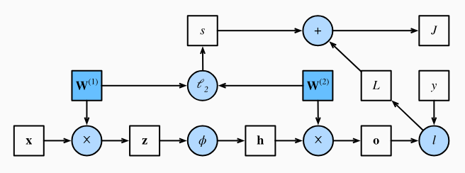
```


### Backpropagation

La retropropagación se refiere al método para calcular el gradiente de los parámetros de una red neuronal. En resumen, el método recorre **la red en orden inverso**, desde la capa de salida hasta la de entrada, según la **regla de la cadena** del cálculo. El algoritmo almacena las variables intermedias (derivadas parciales) necesarias para calcular el gradiente con respecto a algunos parámetros. Supongamos que tenemos funciones $Y=f(X)$ y $Z=g(Y)$, donde la entrada y la salida $X, Y, Z$ son tensores de formas arbitrarias. Utilizando la regla de la cadena, podemos calcular la derivada de $Z$ con respecto a $X$ mediante:

$$\frac{\partial Z}{\partial X} = \text{prod} \left( \frac{\partial Z}{\partial Y}, \frac{\partial Y}{\partial X} \right)$$

Aquí usamos el operador $prod$ para multiplicar sus argumentos después de realizar las operaciones necesarias, como la transposición y el intercambio de posiciones de entrada. Para vectores, esto es sencillo: se trata simplemente de una multiplicación matriz-matriz. Para tensores de mayor dimensión, usamos el operador correspondiente. El operador $prod$ elimina toda la sobrecarga de notación.

```{r echo=FALSE, fig.align='center', out.height='300pt', out.width='650pt'}
knitr::include_graphics("img/05_Multilayer_Perceptron/Gradient_descent.gif")
```

El objetivo de la retropropagación es calcular los gradientes $\frac{\partial J}{\partial W^{(1)}}$ y $\frac{\partial J}{\partial W^{(2)}}$. Para ello, aplicamos la regla de la cadena y calculamos, a su vez, el gradiente de cada variable y parámetro intermedio. El orden de los cálculos se invierte con respecto a los realizados en la propagación hacia adelante, ya que debemos comenzar con el resultado del grafo computacional y avanzar hacia los parámetros. El primer paso es calcular los gradientes de la función objetivo $J=L+s$ con respecto al término de pérdida $L$ y al término de regularización $s$:

$$
\frac{\partial J}{\partial L} = 1 \quad \text{and} \quad\frac{\partial J}{\partial s}=1
$$
A continuación, calculamos el gradiente de la función objetivo con respecto a la variable de la capa de salida $o$ según la regla de la cadena:

$$
\frac{\partial J}{\partial o}=\text{prod}\left( \frac{\partial J}{\partial L}, \frac{\partial L}{\partial o} \right) = \frac{\partial J}{\partial o}\in \mathbb{R}^{q}.
$$
A continuación, calculamos los gradientes del término de regularización con respecto a ambos parámetros:

$$
\frac{\partial s}{\partial W^{(1)}}=\lambda W^{(1)} \quad and \quad \frac{\partial s}{\partial W^{(2)}}=\lambda W^{(2)}
$$
Ahora podemos calcular el gradiente $\frac{\partial J}{\partial W^{(2)}}$ de los parámetros del modelo más cercanos a la capa de salida. Usando la regla de la cadena obtenemos:

$$
\frac{\partial J}{\partial W^{(2)}}=prod\left(\frac{\partial J}{\partial o}, \frac{\partial o}{\partial W^{(2)}}\right)+prod\left(\frac{\partial J}{\partial s}, \frac{\partial s}{\partial W^{(2)}}\right)=\frac{\partial J}{\partial o}h^{T}+\lambda W^{(2)}
$$

Para obtener el gradiente con respecto a $W^{(1)}$, necesitamos continuar la retropropagación a lo largo de la capa de salida hasta la capa oculta. El gradiente con respecto a la salida de la capa oculta $\frac{\partial J}{\partial h}\in \mathbb{R}^{h}$ está dado por:

$$
\frac{\partial J}{\partial h}=prod\left(\frac{\partial J}{\partial o}, \frac{\partial o}{\partial h}\right)=W^{(2)^{T}}\frac{\partial J}{\partial o}
$$
Dado que la función de activación $\phi$ se aplica elemento por elemento, para calcular el gradiente $\frac{\partial J}{\partial z} \in \mathbb{R}^{h}$ de la variable intermedia $z$ es necesario utilizar el operador de multiplicación elemento por elemento, que denotamos como $\odot$:

$$
\frac{\partial J}{\partial z}=prod\left(\frac{\partial J}{\partial h}, \frac{\partial h}{\partial z}\right)=\frac{\partial J}{\partial h}\odot\phi^{\prime}(z).
$$
Finalmente, podemos obtener el gradiente $\frac{\partial J}{\partial W^{(1)}}\in \mathbb{R}^{h\times d}$ de los parámetros del modelo más cercanos a la capa de entrada. Según la regla de la cadena, obtenemos:

$$
\frac{\partial J}{\partial W^{(1)}}=prod\left(\frac{\partial J}{\partial z}, \frac{\partial z}{\partial W^{(1)}}\right)+prod\left(\frac{\partial J}{\partial s}, \frac{\partial s}{\partial W^{(1)}}\right)=\frac{\partial J}{\partial z}x^{T}+\lambda W^{(1)}
$$

Al entrenar redes neuronales, la propagación hacia adelante y la retropropagación se necesitan mutuamente. En la fase hacia adelante se recorre el grafo computacional según sus dependencias y se calculan variables intermedias que luego serán reutilizadas en la retropropagación.

En una red simple, por ejemplo, el término de regularización depende de los parámetros actuales $W^{(1)}$ y $W^{(2)}$, actualizados previamente mediante retropropagación. A su vez, el cálculo de gradientes en la retropropagación depende de valores generados hacia adelante, como la salida oculta $h&.

En resumen, el entrenamiento alterna continuamente entre ambas fases: la propagación hacia adelante produce valores intermedios, la retropropagación usa esos valores para obtener gradientes y actualizar parámetros, y esos parámetros actualizados se usan en la siguiente pasada hacia adelante. Esto requiere almacenar los valores intermedios hasta que termine la retropropagación.

### Resumen

La propagación hacia adelante calcula, paso a paso, las variables intermedias del grafo computacional de la red, avanzando desde la entrada hasta la salida. La retropropagación hace lo mismo pero en sentido inverso: calcula y almacena los gradientes de esas variables y de los parámetros.

Durante el entrenamiento, ambas fases dependen una de la otra, por lo que se necesita mucha más memoria que en la simple fase de predicción.

### Ejercicios

1. Suponga que las entradas $X$ de una función escalar $f$ son matrices $n \times m$. ¿Cuál es la dimensionalidad del gradiente $f$ de con respecto a $X$?

2. Agregue un sesgo a la capa oculta del modelo descrito en esta sección (no es necesario incluirlo en el término de regularización).

    * Dibuje el grafo computacional correspondiente.
    * Obtenga las ecuaciones de propagación hacia adelante y hacia atrás.

3. Calcule la huella de memoria para el entrenamiento y la predicción en el modelo descrito en esta sección.

4. Suponga que desea calcular las derivadas secundarias. ¿Qué ocurre con el grafo computacional? ¿Cuánto tiempo espera que tarde el cálculo?

5. Suponga que el grafo computacional es demasiado grande para su GPU.

    * ¿Puede particionarlo en más de una GPU?
    * ¿Cuáles son las ventajas y desventajas del entrenamiento en un minibatch más pequeño?


## Estabilidad Numérica e Inicialización

Hasta ahora, todos los modelos que hemos visto necesitaban **inicializar sus parámetros usando alguna distribución predefinida**. Hemos pasado por alto cómo se eligen realmente estos valores, lo que podría dar la impresión de que no importa demasiado. Pero en realidad, la forma de inicializar los parámetros es clave para que una red neuronal aprenda bien y mantenga la estabilidad numérica.

::: {.infobox .note data-latex="{note}"}
**¡¡ RECORDAR !!**

la forma de inicializar los parámetros es clave para que una red neuronal aprenda bien y mantenga la estabilidad numérica.
:::

Además, la inicialización está estrechamente relacionada con la función de activación elegida. **Ambas decisiones influyen en qué tan rápido converge el algoritmo de optimización**. Una mala combinación puede provocar problemas típicos como gradientes que explotan o desaparecen (exploding or vanishing).

En esta sección exploraremos estos temas con más detalle y veremos reglas prácticas que resultan muy útiles al trabajar con deep learning.


### Explotación y Desvanecimiento de Gradientes

Considera una red neuronal con $L$ capas, entrada $x$ y salida $o$. Con cada capa $l$ definida por la transformación $f_l$ parametrizada por los pesos $W^{(l)}$, cuya capa oculta de salida es $h^{(l)}$ (siendo $h^{(0)}=x$), la red puede ser expresada como:

$$
h^{(l)}=f_l(h^{(l-1)}) \quad \text{y entonces} \quad o=f_L \circ \cdot \cdot \cdot \circ f_{1}(x) 
$$
Si la salida y la entrada de la capa oculta son vectores, podemos escribir el gradiente de $o$ con respecto a cualquier conjunto de parámetros $W^{(l)}$ de la siguiente manera:

$$
\partial_{W^{(l)}}o=\underbrace{\partial_{h^{(l-1)}}h^{L}}_{M^{(L)}} \cdot \cdot \cdot  \underbrace{\partial_{h^{(l)}}h^{l+1}}_{M^{(l+1)}}\underbrace{\partial_{W^{(l)}}h^{l}}_{v^{(l)}}
$$

Resumiendo, este gradiente es el producto de $L-l$ matrices $M^{(L)}\cdot\cdot\cdot M^{(l+1)}$ y el vector gradiente $v^{(l)}.$ Esto puede causar problemas numéricos similares a cuando multiplicamos muchas probabilidades y obtenemos valores extremadamente pequeños. En probabilidades solemos pasar a “log-espacio” para evitarlo, pero aquí el problema es más serio: las matrices involucradas $M^{(l)}$ pueden tener *eigenvalores* muy grandes o muy pequeños, y su producto puede descontrolarse.

Cuando los gradientes se vuelven inestables, no solo fallan las representaciones numéricas, sino que también se afecta el proceso de optimización. Podemos terminar con actualizaciones demasiado grandes, que destrozan el modelo (gradientes que explotan), o demasiado pequeñas, donde los parámetros casi no cambian y la red deja de aprender (gradientes que desaparecen).

```{r echo=FALSE, fig.align='center', out.height='300pt', out.width='650pt'}
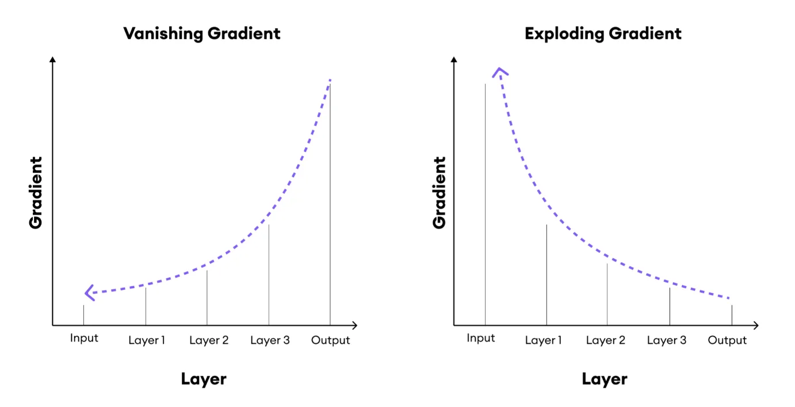
```

#### Desvanecimiento de Gradientes

Un culpable frecuente del problema de gradientes que desaparecen es la función de activación $\sigma$ que se aplica después de cada operación lineal. Históricamente, la función sigmoide $\frac{1}{1+exp(-x)}$ fue muy usada porque se parece a una función de umbral, evocando la idea de neuronas biológicas que “disparan” o no. Sin embargo, si se observa más de cerca la sigmoide, vemos por qué puede provocar que los gradientes se vuelvan muy pequeños y, por lo tanto, que el aprendizaje se frene.

```{python}
# Datos y cómputo de la sigmoide y su gradiente
x = torch.arange(-8.0, 8.0, 0.1, requires_grad=True)
y = torch.sigmoid(x)
y.backward(torch.ones_like(x))

# Convertimos a numpy para graficar
x_np = x.detach().numpy()
y_np = y.detach().numpy()
grad_np = x.grad.detach().numpy()

# Graficar
plt.figure(figsize=(4.5, 2.5))
plt.plot(x_np, y_np, label='sigmoid')
plt.plot(x_np, grad_np, label='gradient')
plt.legend()
plt.xlabel('x')
plt.grid(True)
plt.tight_layout()
plt.show()

```

La sigmoide tiene un inconveniente importante: **su gradiente se hace casi cero cuando la entrada es muy grande o muy pequeña**. Esto significa que, al retropropagar a través de muchas capas, el gradiente total tiende a desaparecer a menos que todas las sigmoides trabajen en una zona muy específica cerca de cero. En redes profundas esto era un problema común: en algún punto el gradiente simplemente se “cortaba”.

::: {.infobox .quicktip data-latex="{quicktip}"}
**¡¡ RECORDAR !!**

Funciones como ReLU se volvieron la opción estándar. Aunque son menos parecidas a las neuronas biológicas, resultan mucho más estables y facilitan entrenar redes más profundas.
:::


#### Gradientes Explosivos

El problema opuesto, cuando los gradientes explotan, puede ser igualmente complejo. Para ilustrarlo mejor, dibujamos 100 matrices aleatorias gaussianas y las multiplicamos por una matriz inicial. Para la escala elegida (la elección de la varianza $\sigma^{2}=1$), el producto de la matriz explota. Cuando esto ocurre debido a la inicialización de una red profunda, no tenemos posibilidad de lograr la convergencia de un optimizador de descenso de gradiente.

```{python}
M = torch.normal(0, 1, size=(4, 4))
print('a single matrix \n',M)
for i in range(100):
    M = M @ torch.normal(0, 1, size=(4, 4))
print('after multiplying 100 matrices\n', M)
```

#### Rompiendo la Simetría

Otro problema en el diseño de redes neuronales es la simetría inherente a su parametrización. Supongamos que tenemos un MLP simple con una capa oculta y dos unidades. En este caso, podríamos permutar los pesos $W^{(1)}$ de la primera capa y, de igual manera, los de la capa de salida para obtener la misma función. No hay ninguna diferencia especial entre la primera y la segunda unidad oculta. En otras palabras, tenemos simetría de permutación entre las unidades ocultas de cada capa.

```{r echo=FALSE, fig.align='center', out.height='300pt', out.width='300pt'}
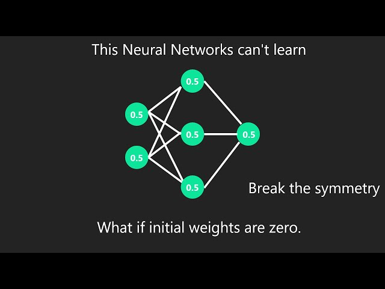
```

Esto es más que una simple molestia teórica. Consideremos el MLP de una capa oculta mencionado anteriormente con dos unidades ocultas. A modo de ilustración, supongamos que la capa de salida transforma las dos unidades ocultas en una sola unidad de salida. Imaginemos qué sucedería si inicializáramos todos los parámetros de la capa oculta como $W^{(1)}=c$ para una constante $c$. En este caso, durante la propagación hacia adelante, cualquiera de las unidades ocultas toma las mismas entradas y parámetros, lo que produce la misma activación que se aplica a la unidad de salida. Durante la retropropagación, la diferenciación de la unidad de salida con respecto a los parámetros $W^{(1)}$ da como resultado un gradiente cuyos elementos toman el mismo valor. Por lo tanto, tras una iteración basada en gradientes (p. ej., el descenso de gradiente estocástico en minibatch), todos los elementos de $W^{(1)}$ siguen teniendo el mismo valor. Dichas iteraciones nunca romperían la simetría por sí solas y es posible que nunca seamos capaces de apreciar el potencial expresivo de la red. La capa oculta se comportaría como si solo tuviera una unidad. Cabe destacar que, si bien el descenso de gradiente estocástico en minibatch no rompería esta simetría, la regularización por abandono (que se presentará más adelante) sí lo haría.

### Inicialización paramétrica

Una forma de abordar, o al menos mitigar, los problemas planteados anteriormente es mediante una inicialización cuidadosa. Como veremos más adelante, un cuidado adicional durante la optimización y una regularización adecuada pueden mejorar aún más la estabilidad.

#### Inicialización Default

En las secciones anteriores, utilizamos una **distribución normal** para inicializar los valores de nuestros pesos. Si no especificamos el método de inicialización, **el framework utilizará un método de inicialización aleatorio predeterminado**, que suele funcionar bien en la práctica para problemas de tamaño moderado.

#### Inicialización Xavier

Veamos la distribución de escala de una salida $o_i$ para una capa completamente conectada sin no linealidades. Con $n_{in}$ entradas $x_{ij}$ y sus pesos asociados $w_{ij}$ para esta capa, la salida viene dada por

$$
o_i=\sum_{j=1}^{n_{in}}{w_{ij}x_{j}}
$$
Los pesos $w_{ij}$ se extraen independientemente de la misma distribución. Además, supongamos que esta distribución tiene media y varianza $\sigma^{2}$ cero. Tenga en cuenta que esto no significa que la distribución deba ser gaussiana, solo que la media y la varianza deben existir. Por ahora, supongamos que las entradas de la capa $x_{j}$ también tienen media y varianza $\gamma^{2}$ cero y que son independientes de $w_{ij}$ e independientes entre sí. En este caso, podemos calcular la media de $o_i$:

\begin{align}
E[o_i] &= \sum_{j=1}^{n_{in}}{E[w_{ij}x_{j}]} \\
&= \sum_{j=1}^{n_{in}}{E[w_{ij}]E[x_{j}]} \\
&= 0
\end{align}

y la varianza:

\begin{align}
Var[o_i] &= E[o_{i}^{2}] - \left(E[o_i] \right)^{2} \\
&= \sum_{j=1}^{n_{in}}{E[w^{2}_{ij}x^{2}_{j}]} - 0 \\
&= \sum_{j=1}^{n_{in}}{E[w^{2}_{ij}]E[x^{2}_{j}]} \\
&= n_{in}\sigma^{2}\gamma^{2}.
\end{align}

Una forma de mantener la varianza fija es establecer $n_{in}\sigma^{2}=1$. Consideremos ahora la retropropagación. En este caso, nos enfrentamos a un problema similar, aunque con gradientes que se propagan desde las capas más cercanas a la salida. Utilizando el mismo razonamiento que para la propagación hacia adelante, vemos que la varianza de los gradientes puede dispararse a menos que $n_{out}\sigma^{2}=1$, donde $n_{out}$ es el número de salidas de esta capa. Esto nos plantea un dilema: no podemos satisfacer ambas condiciones simultáneamente. En su lugar, simplemente intentamos satisfacer:

$$
\frac{1}{2}(n_{in}+n_{out})\sigma^{2}=1 \quad \text{o equivalentemente } \quad \sigma=\sqrt{\frac{2}{n_{in}+n_{out}}}
$$
Este es el razonamiento subyacente a la inicialización de Xavier, ahora estándar y prácticamente beneficiosa, llamada así por el primer autor de sus creadores (Glorot y Bengio, 2010). Normalmente, la inicialización de Xavier muestrea ponderaciones de una distribución gaussiana con media y varianza cero $\sigma^{2}=\frac{2}{n_{in}+n_{out}}$. También podemos adaptar esto para elegir la varianza al muestrear ponderaciones de una distribución uniforme. Nótese que la distribución uniforme $U(-a, a)$ tiene varianza $\frac{a^{2}}{3}$. Al sustituir $\frac{a^{2}}{3}$ en nuestra condición $\sigma^{2}$, nos lleva a inicializar según:

$$U\left(-\sqrt{\frac{6}{n_{in}+n_{out}}}, \sqrt{\frac{6}{n_{in}+n_{out}}} \right)$$

Aunque el supuesto de inexistencia de no linealidades en el razonamiento matemático anterior puede violarse fácilmente en redes neuronales, el método de inicialización de Xavier resulta funcionar bien en la práctica.

### Ejercicios

1. ¿Puedes diseñar otros casos donde una red neuronal pueda presentar simetría que deba romperse, además de la simetría de permutación en las capas de una MLP?

2. ¿Podemos inicializar todos los parámetros de peso en la regresión lineal o en la regresión softmax con el mismo valor?

3. Consulta los límites analíticos de los autovalores del producto de dos matrices. ¿Qué te indica esto sobre cómo asegurar que los gradientes estén bien condicionados?

4. Si sabemos que algunos términos divergen, ¿podemos corregirlo posteriormente? Consulta el artículo sobre escalamiento de tasa adaptativo por capas para inspirarte (You et al., 2017).


## Generalización en Deep Learning

El teorema “no free lunch” nos recuerda que ningún algoritmo aprende bien en todas las situaciones: para generalizar necesitamos asumir algo sobre cómo es el mundo. Estas suposiciones se llaman sesgos inductivos. Por ejemplo, una red profunda tiene el sesgo de construir funciones complejas combinando funciones simples capa a capa.

En machine learning solemos seguir dos pasos:

1. Ajustar el modelo a los datos de entrenamiento.
2. Medir la generalización evaluando en datos separados.

La diferencia entre ambos resultados es la brecha de generalización, y si es grande hablamos de overfitting: el modelo “memoriza” el entrenamiento pero falla con ejemplos nuevos.

En el enfoque clásico, el overfitting se relaciona con tener modelos demasiado complejos. La solución típica es regularizar, reduciendo parámetros o limitando su tamaño para evitar que el modelo se vuelva excesivamente flexible.

Sin embargo, en deep learning esta idea se vuelve contraintuitiva. Las redes profundas son tan expresivas que pueden ajustar perfectamente incluso enormes conjuntos de datos. Lo sorprendente es que, aun alcanzando cero error de entrenamiento, a veces mejoramos la generalización haciendo el modelo más grande, añadiendo capas, neuronas o entrenando más tiempo. Esto da lugar al fenómeno de double descent, donde aumentar la complejidad primero empeora y luego mejora la generalización.

En resumen, aunque las redes puedan memorizarlo todo, en la práctica generalizan, y muchas de las herramientas del deep learning —algunas que restringen el modelo y otras que lo hacen más flexible— se usan precisamente para controlar el overfitting. Lo curioso es que la teoría clásica no explica bien este éxito: medidas como VC dimension o Rademacher complexity no predicen por qué las redes profundas generalizan tan bien.

### Sobreajuste y Regularización

El teorema no free lunch dice que para generalizar necesitamos sesgos inductivos, es decir, suposiciones sobre cómo es el mundo. Las redes profundas tienen el sesgo de construir funciones complejas a partir de funciones simples.

En ML primero ajustamos los datos de entrenamiento y luego medimos la generalización. Si la diferencia es grande, aparece el overfitting. En el enfoque clásico, esto se controla reduciendo la complejidad del modelo mediante regularización.

Pero en deep learning el panorama es distinto: las redes pueden memorizar perfectamente el entrenamiento, y aun así generalizar mejor al hacerlas más grandes. Esto lleva al fenómeno de double descent, donde más complejidad primero perjudica y luego ayuda.

Lo más curioso es que la teoría clásica no explica por qué las redes profundas generalizan tan bien. Aun así, en la práctica usamos una combinación de trucos y regularizaciones para reducir el overfitting y mejorar la generalización.

### Inspiración de los no paramétricos

Aunque las redes neuronales tienen millones de parámetros, a veces es más útil pensar en ellas como modelos no paramétricos. En estos modelos, la complejidad crece con la cantidad de datos, en lugar de estar fija desde el inicio.

Un ejemplo clásico de modelo no paramétrico es k-nearest neighbors (k-NN): el algoritmo básicamente memoriza el conjunto de entrenamiento y, al predecir, busca los puntos más cercanos según alguna métrica de distancia. Con $k=1$, siempre logra cero error de entrenamiento, y aun así puede generalizar bien bajo ciertas condiciones. Eso sí, distintas métricas de distancia implican diferentes sesgos inductivos y pueden producir predictores distintos.

Las redes neuronales profundas, al estar sobrerrepresentadas (tienen muchos más parámetros de los necesarios para ajustar los datos), también tienden a interpolar o memorizar completamente el entrenamiento, comportándose en varios aspectos como modelos no paramétricos.

De hecho, investigaciones recientes muestran una conexión profunda entre redes muy anchas y métodos de kernels. En particular, cuando un MLP se hace infinitamente ancho, su comportamiento converge a un método de kernel no paramétrico llamado neural tangent kernel (NTK). Aunque el NTK no explica todo lo que ocurre en redes modernas, sirve como herramienta teórica para entender por qué los modelos sobredimensionados pueden generalizar tan bien.

### Early Stopping

Las redes neuronales profundas pueden memorizar etiquetas arbitrarias o aleatorias, pero lo hacen tarde en el entrenamiento. Estudios recientes muestran que primero aprenden los ejemplos correctamente etiquetados y solo después empiezan a ajustar las etiquetas incorrectas o ruidosas. Esto tiene una implicación importante: si el modelo ya ajustó los datos limpios pero aún no ha memorizado las etiquetas aleatorias, entonces ya está generalizando.

Este comportamiento motiva el uso de early stopping como técnica de regularización. En lugar de limitar los pesos, limitamos el número de épocas entrenadas. Lo usual es vigilar el error de validación y detener el entrenamiento cuando deja de mejorar después de cierta “paciencia”. Esto no solo mejora la generalización en presencia de ruido, sino que ahorra mucho tiempo y costo computacional, especialmente en modelos grandes.

Cuando las etiquetas no contienen ruido (problemas bien separables como gatos vs. perros), el early stopping aporta poco. Pero cuando hay ruido, ambigüedad o variabilidad natural en las etiquetas (como en medicina), el early stopping se vuelve crucial, porque entrenar hasta que el modelo memorice el ruido suele ser perjudicial.

### Métodos clásicos de regularización para redes profundas

Anteriormente vimos técnicas clásicas de regularización, como *weight decay*, que añade un término a la función de pérdida para penalizar pesos grandes. Según la norma usada, se conoce como ridge ($l_2$) o lasso ($l_1$). En el enfoque clásico, estas penalizaciones limitan la complejidad del modelo y evitan que ajuste etiquetas arbitrarias.

En deep learning, el *weight decay* sigue siendo muy usado, pero se ha observado que, por sí solo, no impide que las redes profundas interpolen completamente los datos. Por eso, sus beneficios suelen entenderse mejor cuando se combina con *early stopping*. Sin esta combinación, el efecto de técnicas como *weight decay* puede deberse menos a “restringir” la capacidad del modelo y más a introducir sesgos inductivos compatibles con los patrones reales de los datos.

Aun así, los regularizadores clásicos siguen siendo populares en práctica. Además, el deep learning ha desarrollado variantes inspiradas en estas ideas, como agregar ruido durante el entrenamiento. En la siguiente sección aparecerá dropout, una técnica muy usada cuyo funcionamiento efectivo también tiene una base teórica parcial, pero funciona muy bien en la práctica.

### Ejercicios

1. ¿En qué sentido las medidas tradicionales basadas en la complejidad no tienen en cuenta la generalización de las redes neuronales profundas?

2. ¿Por qué la interrupción anticipada podría considerarse una técnica de regularización?

3. ¿Cómo suelen determinar los investigadores el criterio de parada?

4. ¿Qué factor importante parece diferenciar los casos en los que la interrupción temprana conduce a grandes mejoras en la generalización?

5. Más allá de la generalización, describa otro beneficio de dejar de fumar temprano.

## Dropout

Pensemos brevemente en lo que esperamos de un buen modelo predictivo. Queremos que tenga un buen desempeño sobre datos no vistos. La teoría clásica de generalización sugiere que, para cerrar la brecha entre el rendimiento en entrenamiento y en prueba, deberíamos aspirar a un modelo simple. La simplicidad puede presentarse en forma de un número pequeño de dimensiones. Otra noción útil de simplicidad es la suavidad, es decir, que la función no sea sensible a pequeños cambios en sus entradas. Por ejemplo, al clasificar imágenes, esperaríamos que añadir algo de ruido aleatorio a los píxeles sea en su mayoría inofensivo.

Bishop (1995) formalizó esta idea cuando demostró que el entrenamiento con ruido en la entrada es equivalente a la regularización de Tikhonov. Este trabajo estableció una conexión matemática clara entre el requisito de que una función sea suave (y por tanto simple) y el requisito de que sea resistente a perturbaciones en la entrada.

Posteriormente, Srivastava et al. (2014) desarrollaron una idea ingeniosa para aplicar también la idea de Bishop a las capas internas de una red. Su propuesta, llamada dropout, consiste en inyectar ruido durante el cálculo de cada capa interna en la propagación hacia adelante, y se ha convertido en una técnica estándar para entrenar redes neuronales. El método se llama dropout porque literalmente se “eliminan” algunas neuronas durante el entrenamiento. A lo largo del entrenamiento, en cada iteración, el dropout estándar consiste en poner a cero una fracción de los nodos en cada capa antes de calcular la capa siguiente, la técnica de dropout en sí ha demostrado ser duradera, y diversas variantes de dropout están implementadas en la mayoría de las bibliotecas de aprendizaje profundo.
<<<<<<< HEAD

En la regularización dropout estándar, se ponen a cero una fracción de los nodos en cada capa y luego se corrige el sesgo de cada capa normalizando por la fracción de nodos que se conservaron (no eliminados). En otras palabras, con una probabilidad de dropout $p$, cada activación intermedia $h$ se sustituye por una variable aleatoria $h'$ de la siguiente manera:

$$
h' = \begin{cases} 
0 & \text{con probabilidad } p \\ 
\frac{h}{1-p} & \text{en otro caso} 
\end{cases}
$$

Por diseño, la esperanza se mantiene inalterada, es decir, $E[h'] = h$.

### Dropout en la práctica

Recuerda el MLP con una capa oculta y cinco unidades ocultas de la Sección 4.1.1. Cuando aplicamos dropout a una capa oculta, poniendo a cero cada unidad oculta con probabilidad $p$, el resultado puede verse como una red que contiene solo un subconjunto de las neuronas originales. En la Fig. 4.6.1, $h_2$ y $h_5$ han sido eliminadas. En consecuencia, el cálculo de las salidas ya no depende de $h_2$ o $h_5$ y sus respectivos gradientes también desaparecen al realizar la retropropagación (backpropagation). De esta manera, el cálculo de la capa de salida no puede ser excesivamente dependiente de ningún elemento individual de $h_1, \dots, h_5$.

```{r echo=FALSE, fig.cap="MLP antes y después del dropout", fig.align='center', out.height='300pt', out.width='650pt'}
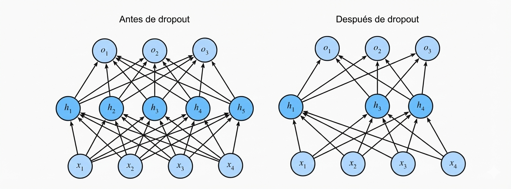
```

Típicamente, desactivamos el dropout en el momento de la prueba (test time). Dado un modelo entrenado y un nuevo ejemplo, no eliminamos ningún nodo y, por lo tanto, no necesitamos normalizar. Sin embargo, existen algunas excepciones: algunos investigadores utilizan el dropout en el momento de la prueba como una heurística para estimar la incertidumbre de las predicciones de la red neuronal: si las predicciones coinciden a través de muchas salidas diferentes de dropout, entonces podríamos decir que la red tiene mayor confianza.

### Implementación desde cero

Para implementar la función de dropout para una sola capa, debemos extraer tantas muestras de una variable aleatoria de Bernoulli (binaria) como dimensiones tenga nuestra capa, donde la variable toma el valor $1$ (mantener) con probabilidad $1 - p$ y $0$ (eliminar) con probabilidad $p$. Una forma sencilla de implementar esto es extraer primero muestras de la distribución uniforme $U[0, 1]$. Luego podemos conservar aquellos nodos para los cuales la muestra correspondiente sea mayor que $p$, descartando el resto.

En el siguiente código, implementamos una función dropout_layer que elimina elementos en el tensor de entrada X con probabilidad dropout, reescalando el resto como se describió anteriormente: dividiendo los supervivientes por 1.0 - dropout.

```{python}
def dropout_layer(X, dropout):
    assert 0 <= dropout <= 1
    if dropout == 1: return torch.zeros_like(X)
    mask = (torch.rand(X.shape) > dropout).float()
    return mask * X / (1.0 - dropout)
```

Podemos probar la función dropout_layer con algunos ejemplos. En las siguientes líneas de código, pasamos nuestra entrada X a través de la operación de dropout, con probabilidades $0$, $0.5$ y $1$, respectivamente.

```{python, fig.align='center'}
import torch

X = torch.arange(16, dtype = torch.float32).reshape((2, 8))

print('dropout_p = 0:', dropout_layer(X, 0))
print('dropout_p = 0.5:', dropout_layer(X, 0.5))
print('dropout_p = 1:', dropout_layer(X, 1))
```

### Definición del modelo

El modelo a continuación aplica dropout a la salida de cada capa oculta (siguiendo a la función de activación). Podemos configurar las probabilidades de dropout para cada capa de forma separada. Una elección común es establecer una probabilidad de dropout más baja en las capas cercanas a la de entrada. Nos aseguramos de que el dropout esté activo únicamente durante el entrenamiento.

```{python}
class DropoutMLPScratch(Classifier):
    def __init__(self, num_outputs, num_hiddens_1, num_hiddens_2,
                 dropout_1, dropout_2, lr):
        super().__init__()
        self.save_hyperparameters()
        self.lin1 = nn.LazyLinear(num_hiddens_1)
        self.lin2 = nn.LazyLinear(num_hiddens_2)
        self.lin3 = nn.LazyLinear(num_outputs)
        self.relu = nn.ReLU()

    def forward(self, X):
        H1 = self.relu(self.lin1(X.reshape((X.shape[0], -1))))
        if self.training:
            H1 = dropout_layer(H1, self.dropout_1)
        H2 = self.relu(self.lin2(H1))
        if self.training:
            H2 = dropout_layer(H2, self.dropout_2)
        return self.lin3(H2)
```


### Entrenamiento

Lo siguiente es similar al entrenamiento de los MLP descritos anteriormente.

```{python, fig.align='center'}
hparams = {
  'num_outputs':10, 
  'num_hiddens_1':256, 
  'num_hiddens_2':256,
  'dropout_1':0.5, 
  'dropout_2':0.5, 
  'lr':0.1
  }
           
model = DropoutMLPScratch(**hparams)
data = FashionMNISTData(batch_size=256)

trainer = Trainer(max_epochs=10)
trainer.fit(model, data)
```

```{r echo=FALSE, fig.align='center', out.height='150pt'}
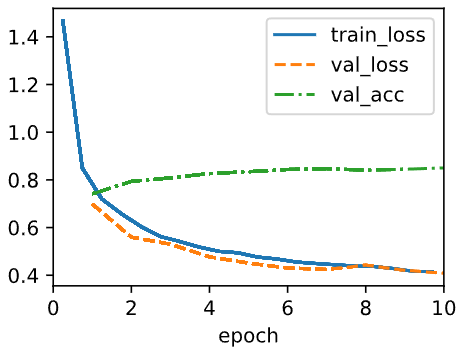
```

### Implementación concisa

Con las APIs de alto nivel, todo lo que necesitamos hacer es añadir una capa Dropout después de cada capa totalmente conectada (fully connected), pasando la probabilidad de dropout como único argumento a su constructor. Durante el entrenamiento, la capa Dropout eliminará aleatoriamente las salidas de la capa anterior (o, equivalentemente, las entradas a la capa posterior) de acuerdo con la probabilidad de dropout especificada. Cuando no se está en modo de entrenamiento, la capa Dropout simplemente deja pasar los datos durante la fase de prueba.

```{python, fig.align='center'}
class DropoutMLP(Classifier):
    def __init__(self, num_outputs, num_hiddens_1, num_hiddens_2,
                 dropout_1, dropout_2, lr):
        super().__init__()
        self.save_hyperparameters()
        
        self.net = nn.Sequential(
            nn.Flatten(), 
            nn.LazyLinear(num_hiddens_1), 
            nn.ReLU(),
            nn.Dropout(dropout_1), 
            nn.LazyLinear(num_hiddens_2), 
            nn.ReLU(),
            nn.Dropout(dropout_2), 
            nn.LazyLinear(num_outputs)
            )
    
    def forward(self, X):
        return self.net(X)
```

A continuación, entrenamos el modelo.

```{python, fig.align='center'}
model = DropoutMLP(**hparams)
trainer.fit(model, data)
```

```{r echo=FALSE, fig.align='center', out.height='150pt'}
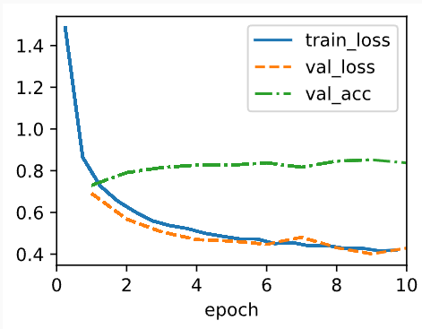
```

### Resumen

Además de controlar el número de dimensiones y el tamaño del vector de pesos, dropout es otra herramienta más para evitar el sobreajuste. A menudo, estas herramientas se utilizan de manera conjunta. Obsérvese que dropout se usa únicamente durante el entrenamiento: reemplaza una activación $h$ por una variable aleatoria cuyo valor esperado es $h$.

### Ejercicios

1. ¿Qué sucede si se cambian las probabilidades de dropout para la primera y la segunda capa? En particular, ¿qué ocurre si se intercambian las probabilidades de ambas capas? Diseña un experimento para responder a estas preguntas, describe tus resultados de forma cuantitativa y resume las conclusiones cualitativas.

2. Incrementa el número de épocas y compara los resultados obtenidos al usar dropout con aquellos en los que no se utiliza.

3. ¿Cuál es la varianza de las activaciones en cada capa oculta cuando se aplica dropout y cuando no se aplica? Dibuja una gráfica que muestre cómo evoluciona esta cantidad a lo largo del tiempo para ambos modelos.

4. ¿Por qué dropout no se utiliza típicamente en la fase de prueba?

5. Usando el modelo de esta sección como ejemplo, compara los efectos de usar dropout y weight decay (decaimiento de pesos). ¿Qué ocurre cuando dropout y weight decay se usan al mismo tiempo? ¿Son los resultados aditivos? ¿Existen rendimientos decrecientes (o algo peor)? ¿Se anulan entre sí?

6. ¿Qué sucede si aplicamos dropout a los pesos individuales de la matriz de pesos en lugar de a las activaciones?

7. Inventa otra técnica para inyectar ruido aleatorio en cada capa que sea distinta de la técnica estándar de dropout. ¿Puedes desarrollar un método que supere a dropout en el conjunto de datos Fashion-MNIST (para una arquitectura fija)?
=======
>>>>>>> cbe3c29 (book from container)

En la regularización dropout estándar, se ponen a cero una fracción de los nodos en cada capa y luego se corrige el sesgo de cada capa normalizando por la fracción de nodos que se conservaron (no eliminados). En otras palabras, con una probabilidad de dropout $p$, cada activación intermedia $h$ se sustituye por una variable aleatoria $h'$ de la siguiente manera:$$h' = \begin{cases} 
0 & \text{con probabilidad } p \\ 
\frac{h}{1-p} & \text{en otro caso} 
\end{cases}$$Por diseño, la esperanza se mantiene inalterada, es decir, $E[h'] = h$.

### Dropout en la práctica

Recuerda el MLP con una capa oculta y cinco unidades ocultas de la Sección 4.1.1. Cuando aplicamos dropout a una capa oculta, poniendo a cero cada unidad oculta con probabilidad $p$, el resultado puede verse como una red que contiene solo un subconjunto de las neuronas originales. En la Fig. 4.6.1, $h_2$ y $h_5$ han sido eliminadas. En consecuencia, el cálculo de las salidas ya no depende de $h_2$ o $h_5$ y sus respectivos gradientes también desaparecen al realizar la retropropagación (backpropagation). De esta manera, el cálculo de la capa de salida no puede ser excesivamente dependiente de ningún elemento individual de $h_1, \dots, h_5$.

```{r echo=FALSE, fig.cap="MLP antes y después del dropout", fig.align='center', out.height='300pt', out.width='650pt'}

```

Típicamente, desactivamos el dropout en el momento de la prueba (test time). Dado un modelo entrenado y un nuevo ejemplo, no eliminamos ningún nodo y, por lo tanto, no necesitamos normalizar. Sin embargo, existen algunas excepciones: algunos investigadores utilizan el dropout en el momento de la prueba como una heurística para estimar la incertidumbre de las predicciones de la red neuronal: si las predicciones coinciden a través de muchas salidas diferentes de dropout, entonces podríamos decir que la red tiene mayor confianza.

### Implementación desde cero

Para implementar la función de dropout para una sola capa, debemos extraer tantas muestras de una variable aleatoria de Bernoulli (binaria) como dimensiones tenga nuestra capa, donde la variable toma el valor $1$ (mantener) con probabilidad $1 - p$ y $0$ (eliminar) con probabilidad $p$. Una forma sencilla de implementar esto es extraer primero muestras de la distribución uniforme $U[0, 1]$. Luego podemos conservar aquellos nodos para los cuales la muestra correspondiente sea mayor que $p$, descartando el resto.

En el siguiente código, implementamos una función dropout_layer que elimina elementos en el tensor de entrada X con probabilidad dropout, reescalando el resto como se describió anteriormente: dividiendo los supervivientes por 1.0 - dropout.

```{python, fig.align='center'}
def dropout_layer(X, dropout):
    assert 0 <= dropout <= 1
    if dropout == 1: return torch.zeros_like(X)
    mask = (torch.rand(X.shape) > dropout).float()
    return mask * X / (1.0 - dropout)
```

Podemos probar la función dropout_layer con algunos ejemplos. En las siguientes líneas de código, pasamos nuestra entrada X a través de la operación de dropout, con probabilidades $0$, $0.5$ y $1$, respectivamente.

```{python, fig.align='center'}
import torch

X = torch.arange(16, dtype = torch.float32).reshape((2, 8))

print('dropout_p = 0:', dropout_layer(X, 0))
print('dropout_p = 0.5:', dropout_layer(X, 0.5))
print('dropout_p = 1:', dropout_layer(X, 1))
```

### Definición del modelo

El modelo a continuación aplica dropout a la salida de cada capa oculta (siguiendo a la función de activación). Podemos configurar las probabilidades de dropout para cada capa de forma separada. Una elección común es establecer una probabilidad de dropout más baja en las capas cercanas a la de entrada. Nos aseguramos de que el dropout esté activo únicamente durante el entrenamiento.

```{python, fig.align='center'}
class DropoutMLPScratch(Classifier):
    def __init__(self, num_outputs, num_hiddens_1, num_hiddens_2,
                 dropout_1, dropout_2, lr):
        super().__init__()
        self.save_hyperparameters()
        self.lin1 = nn.LazyLinear(num_hiddens_1)
        self.lin2 = nn.LazyLinear(num_hiddens_2)
        self.lin3 = nn.LazyLinear(num_outputs)
        self.relu = nn.ReLU()

    def forward(self, X):
        H1 = self.relu(self.lin1(X.reshape((X.shape[0], -1))))
        if self.training:
            H1 = dropout_layer(H1, self.dropout_1)
        H2 = self.relu(self.lin2(H1))
        if self.training:
            H2 = dropout_layer(H2, self.dropout_2)
        return self.lin3(H2)
```


### Entrenamiento

Lo siguiente es similar al entrenamiento de los MLP descritos anteriormente.

```{python, fig.align='center'}
hparams = {
  'num_outputs':10, 
  'num_hiddens_1':256, 
  'num_hiddens_2':256,
  'dropout_1':0.5, 
  'dropout_2':0.5, 
  'lr':0.1
  }

model = DropoutMLPScratch(**hparams)
data = FashionMNISTData(batch_size=256)

trainer = Trainer(max_epochs=10)
trainer.fit(model, data)
```

```{r echo=FALSE, fig.align='center', out.height='300pt', out.width='300pt'}

```

### Implementación concisa

Con las APIs de alto nivel, todo lo que necesitamos hacer es añadir una capa Dropout después de cada capa totalmente conectada (fully connected), pasando la probabilidad de dropout como único argumento a su constructor. Durante el entrenamiento, la capa Dropout eliminará aleatoriamente las salidas de la capa anterior (o, equivalentemente, las entradas a la capa posterior) de acuerdo con la probabilidad de dropout especificada. Cuando no se está en modo de entrenamiento, la capa Dropout simplemente deja pasar los datos durante la fase de prueba.

```{python, fig.align='center'}
class DropoutMLP(Classifier):
    def __init__(self, num_outputs, num_hiddens_1, num_hiddens_2,
                 dropout_1, dropout_2, lr):
        super().__init__()
        
        self.save_hyperparameters()
        
        self.net = nn.Sequential(
            nn.Flatten(), 
            nn.LazyLinear(num_hiddens_1), 
            nn.ReLU(),
            nn.Dropout(dropout_1), 
            nn.LazyLinear(num_hiddens_2), 
            nn.ReLU(),
            nn.Dropout(dropout_2), 
            nn.LazyLinear(num_outputs)
            )
    
    def forward(self, X):
        return self.net(X)
```

A continuación, entrenamos el modelo.

```{python, fig.align='center'}
model = DropoutMLP(**hparams)
trainer.fit(model, data)
```

```{r echo=FALSE, fig.align='center', out.height='300pt', out.width='300pt'}

```

### Resumen

Además de controlar el número de dimensiones y el tamaño del vector de pesos, dropout es otra herramienta más para evitar el sobreajuste. A menudo, estas herramientas se utilizan de manera conjunta. Obsérvese que dropout se usa únicamente durante el entrenamiento: reemplaza una activación $h$ por una variable aleatoria cuyo valor esperado es $h$.

### Ejercicios

1. ¿Qué sucede si se cambian las probabilidades de dropout para la primera y la segunda capa? En particular, ¿qué ocurre si se intercambian las probabilidades de ambas capas? Diseña un experimento para responder a estas preguntas, describe tus resultados de forma cuantitativa y resume las conclusiones cualitativas.

2. Incrementa el número de épocas y compara los resultados obtenidos al usar dropout con aquellos en los que no se utiliza.

3. ¿Cuál es la varianza de las activaciones en cada capa oculta cuando se aplica dropout y cuando no se aplica? Dibuja una gráfica que muestre cómo evoluciona esta cantidad a lo largo del tiempo para ambos modelos.

4. ¿Por qué dropout no se utiliza típicamente en la fase de prueba?

5. Usando el modelo de esta sección como ejemplo, compara los efectos de usar dropout y weight decay (decaimiento de pesos). ¿Qué ocurre cuando dropout y weight decay se usan al mismo tiempo? ¿Son los resultados aditivos? ¿Existen rendimientos decrecientes (o algo peor)? ¿Se anulan entre sí?

6. ¿Qué sucede si aplicamos dropout a los pesos individuales de la matriz de pesos en lugar de a las activaciones?

7. Inventa otra técnica para inyectar ruido aleatorio en cada capa que sea distinta de la técnica estándar de dropout. ¿Puedes desarrollar un método que supere a dropout en el conjunto de datos Fashion-MNIST (para una arquitectura fija)?

<!--chapter:end:05-Multilayer_Perceptron.Rmd-->

<!-- ::: watermark -->

<!--  -->

<!-- ::: -->

# GPUs

## Paralelismo y concurrencia

En esta sección partiremos de un ejercicio práctico. Si bien está pensado para realizarse en grupo, es lo suficientemente ilustrativo como para llevarse a cabo de manera individual.

**Ejercicio 1:**

Se recomienda que el ejercicio se realice de forma síncrona, ya sea de manera presencial o mediante videollamada, asegurando que todos los integrantes cuenten con acceso a un equipo de cómputo e internet.

El moderador del grupo deberá indicar el momento exacto de inicio, con el fin de que todos comiencen al mismo tiempo. Se sugiere que la actividad sea cronometrada.

El ejercicio consiste en reproducir el siguiente dibujo de manera individual en Google Sheets. La idea es asignar colores a las celdas para replicar, lo más fielmente posible, la imagen mostrada a continuación:

```{r echo=FALSE, fig.align='center'}
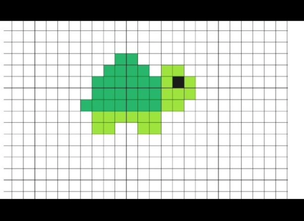
```

Para facilitar la actividad, hemos creado un documento que puede servir como plantilla. Si deseas utilizar este documento

Para facilitar la actividad, hemos creado un documento que puede servir como plantilla. Si deseas utilizar este [documento](https://docs.google.com/spreadsheets/d/12XuyaRboQAX6OrzU-j84IEfueJtjJJQ5qFegk01nfhc/edit?usp=sharing "Plantilla dibujo tortuga"), haz una copia para poder editarlo.

Al finalizar el dibujo, deberás notificar al moderador para que registre el tiempo conforme los participantes vayan concluyendo.

***Nota***: *Si no estás en grupo, basta con que te cronometres y realices la actividad de manera individual.*

**Ejercicio 2:**

La persona que haya obtenido el mejor tiempo deberá liderar el siguiente ejercicio:

```{r echo=FALSE, fig.align='center'}

```

Esta persona contará con 45 segundos para decidir quiénes formarán parte de su equipo y explicarles la estrategia que seguirán para realizar el ejercicio de manera colaborativa.

Una vez finalizada la fase de planeación, el equipo tendrá 120 segundos para ejecutar la tarea. Al concluir, el punto más importante será realizar una reflexión sobre qué se hizo bien y qué podría haberse hecho mejor.

***Algunas preguntas sugeridas:***

-   *¿El número de miembros que seleccionaste fue el optimo?*

-   *¿La estrategia que selecionaste fue la mejor o retrospectiva se te ocurre una mejor ahora?*

-   *¿Que pudimos mejorar?*

-   *¿Qué pasaría si este ejercicio lo hubieras realizado solo?*

-   *¿Qué pasaría si hubieras tenido que coordinar 1000 personas para este ejercicio?*

***Nota***: Si no estás en grupo, imagina la dinámica: planea qué instrucciones darías a un equipo para resolver el problema en el menor tiempo posible. Por ejemplo, podrías asignar a cada miembro un color específico de la imagen y posteriormente reflexionar si esa estrategia sería adecuada o no, y por qué.

### Reflexión: Concurrencia y Paralelismo

Los ejercicios anteriores no solo buscan replicar una imagen en el menor tiempo posible, sino provocar una experiencia directa sobre cómo organizamos el trabajo cuando intervienen varias personas. A través de esta dinámica es posible comprender, de manera intuitiva, los conceptos de **concurrencia** y **paralelismo**, así como la relación entre ambos.

#### ¿Qué es concurrencia?

La **concurrencia** es la capacidad de estructurar un problema de forma que múltiples tareas puedan progresar en el mismo intervalo de tiempo, aunque no necesariamente se ejecuten exactamente al mismo instante.

Implica organización, coordinación y administración de recursos compartidos. En el ejercicio 2, la fase de planeación es un claro ejemplo de concurrencia: decidir quién hará qué, cómo se dividirá el trabajo y cómo evitar interferencias (por ejemplo, que dos personas coloreen la misma celda).

En términos computacionales, la concurrencia se refiere a diseñar sistemas donde múltiples procesos o hilos avanzan de manera intercalada, gestionando correctamente el acceso a recursos.

#### ¿Qué es paralelismo?

El **paralelismo** ocurre cuando múltiples tareas se ejecutan literalmente al mismo tiempo. Esto requiere múltiples recursos físicos (por ejemplo, varios núcleos de CPU o múltiples personas trabajando simultáneamente).

En el ejercicio, el paralelismo se observa cuando varios integrantes del equipo colorean diferentes partes de la imagen al mismo tiempo. Aquí el objetivo es reducir el tiempo total mediante la ejecución simultánea de tareas independientes.

En computación, el paralelismo se logra cuando diferentes núcleos de procesamiento ejecutan instrucciones simultáneamente.

### Relación entre concurrencia y paralelismo

Aunque suelen usarse como sinónimos, no son lo mismo:

-   **La concurrencia es un modelo de organización.**
-   **El paralelismo es un modelo de ejecución.**

Podemos tener concurrencia sin paralelismo (por ejemplo, una sola persona alternando entre varias partes del dibujo). Pero no puede existir paralelismo efectivo sin una buena estrategia de concurrencia, ya que si el trabajo no está bien dividido o coordinado, la ejecución simultánea puede generar conflictos, retrabajo o ineficiencia.

El ejercicio demuestra que:

-   Dividir el trabajo sin estrategia puede generar cuellos de botella.
-   Aumentar el número de participantes no garantiza mejores resultados.
-   Coordinar a 1000 personas introduce complejidades adicionales: comunicación, sincronización y control de errores.

En sistemas computacionales ocurre exactamente lo mismo: añadir más procesadores no garantiza mayor rendimiento si el problema no está bien diseñado para ejecutarse en paralelo.

#### Conclusión

La principal enseñanza de estos ejercicios es que el rendimiento no depende únicamente de cuántos recursos tengamos, sino de **cómo organizamos el trabajo**.

La concurrencia nos obliga a pensar en la estructura y coordinación de las tareas. El paralelismo nos permite ejecutarlas simultáneamente para reducir el tiempo total. El paralelismo depende de una buena estrategia que permita concurrencia con una carga similar o identica para cada recurso por lo cual sino logramos generar concurrencia para la tarea el paralelismo no tiene forma de agilizar la tarea.

Para reforzar este último punto podemos ver 2 ejemplos, de la importancia de la concurrencia y de que no siempre es sencillo hacer concurrente una tarea.

Escenario donde la concurrencia es más viable

```{r echo=FALSE, fig.align='center'}

```

```{r echo=FALSE, fig.align='center'}

```

Escenario donde la concurrencia es un problema complejo quiza inviable

```{r echo=FALSE, fig.align='center'}

```

```{r echo=FALSE, fig.align='center'}

```

## Complejidad Computacional

Para acelerar una tarea no solo dependemos del hardware disponible ni de aplicar una estrategia adecuada de paralelización. Los **algoritmos** que utilizamos para resolver un problema también influyen de manera decisiva en el desempeño: algunos son más rápidos que otros, algunos ofrecen soluciones exactas y otros proporcionan aproximaciones que reducen el tiempo de cómputo a cambio de cierta precisión.

En este bloque nos centraremos en el análisis de la **complejidad computacional**, una técnica ampliamente utilizada para describir y comparar la velocidad con la que un algoritmo resuelve un problema. Más que medir el tiempo exacto de ejecución en una máquina específica, la complejidad computacional nos permite entender cómo crece el costo del algoritmo conforme aumenta el tamaño de la entrada, proporcionando un marco teórico para evaluar su eficiencia y escalabilidad.

### Analizando la complejidad computacional en el problema de ordenamiento de números

Para entender la complejidad computacional, lo abordaremos desde uno de los temas más simples pero más ilustrativos, el ordenamiento númerico.

Tu objetivo es ordenar todos estos papeles desde el número que tiene el menor número hasta el que tiene el mayor número en el menor número de pasos posibles.

Reglas: 1. Tienes una caja llena de papeles estos papeles serán los que debemos ordenar. 2. Adicionalmente tienes dos pilas de papeles una volteando hacia arriba (A), y la otra volteando hacia abajo (B) 3. No puedes ver los papeles mientras estan en la caja, solo al sacarlo, tambien podrás ver el papel que tenemos en la Pila A. 4. Solo puedes sacar un papel a la vez, si quieres sacar un nuevo, deberás regresar el papel a la caja o ponerlo en la pila.

Para ello tienes las siguientes lista de movimientos posibles:

1.  Sacar papel: Cada que saques un papel lo podras poner en la Pila A o en la Pila B

2.  Mover papel de la pila A: De la pila A puedes quitar el papel de hasta arriba unicamente cada que saques un nuevo papel de la caja. El papel de la pila A lo podrás pasar a la pila B y el papel que sacaste lo deberás poner en la pila A.

3.  Rellenar caja: Una vez tengamos la caja vacia, podemos rellenarla con los pales de la pila B y reiniciar el proceso.

```{r echo=FALSE, fig.align='center'}

```

Una aproximación para resolver este problema. Sería ir teniendo siempre el papel con menor valor en la cima de la pila A, si sale de la caja un papel con valor menor, aplicar movimiento 1 y 2, repetir este proceso n veces hasta ya no tener elementos en la caja. El movimiento 3 nos permite ir agregando un papel en cada ciclo en la Pila A (el de menor valor del ciclo).

Asumiendo que $n$ es el número de papeles en la caja de forma original, podemos describir una función que describa el número de movimiento en base al número de papeles que tenemos en la caja originalmente.

\$C(n) = \frac{n²}{2}m_1 + nhm_2 + nm_3 \$

Donde: $m_1$ es las veces que se aplica el movimiento 1. En cada ciclo se aplica $(n-c)$ c es el número del ciclo. $m_2$ es las veces que se aplica el movimiento 2. Donde $h$ es el número promedio de veces que se aplico el movimiento por ciclo. Por lo tanto $h \leq n$. $m_3$ es el número de veces que se aplica el movimiento 3. Este se aplica $n$, una vez por cada papel.

### Notación Big O

En análisis de algoritmos, la complejidad computacional se expresa comúnmente mediante la **notación Big-O**, que describe el orden de crecimiento del algoritmo en el peor caso.

Para obtener la notación Big-O:

1.  Se eliminan las constantes multiplicativas (( m_1, m_2, m_3 )).
2.  Se descartan los términos de menor orden.
3.  Se conserva únicamente el término de mayor crecimiento.

Dado que el término dominante en ( C(n) ) es proporcional a ( n\^2 ), la complejidad del algoritmo es:

$$O(n^2)$$

Esto significa que, si el número de papeles se duplica, el número de operaciones crece aproximadamente cuatro veces.

En conclusión, independientemente del hardware o del paralelismo empleado, la eficiencia del algoritmo está fuertemente determinada por su complejidad computacional. Un algoritmo ( O(n\^2) ) escalará considerablemente peor que uno ( O(n \log n) ) o ( O(n) ), incluso si ambos se ejecutan en la misma máquina.

### Bubble sort vs Merge sort.

En el ordenamiento existe un gran número de algoritmos que historicamente han competido para resolver este problema, tanto su complejidad computacional en espacio y tiempo. Como su versatilidad para se aplicados en tareas paralelizables.

Quizá algunos de los algoritmos más relevante que tenemos son el **Bubble sort** y el **Merge sort** daremos un breve analisis de ellos a continuación.

#### Bubble Sort

**Idea principal:** Es un algoritmo de ordenamiento simple que compara pares de elementos adyacentes e intercambia sus posiciones si están en el orden incorrecto. Este proceso se repite varias veces hasta que la lista queda ordenada.

En cada pasada, el elemento más grande “flota” hacia el final (de ahí el nombre *bubble*).

**Características:**

-   Fácil de entender e implementar.
-   No requiere memoria adicional significativa (es *in-place*).
-   Ineficiente para listas grandes.

**Complejidad computacional:**

-   Peor caso: ( O(n\^2) )
-   Caso promedio: ( O(n\^2) )
-   Mejor caso (si se optimiza y la lista ya está ordenada): ( O(n) )

En el peor caso realiza aproximadamente:

[ \frac{n(n-1)}{2}]

comparaciones, lo que implica un crecimiento cuadrático.

------------------------------------------------------------------------

#### Merge Sort

**Idea principal:** Es un algoritmo basado en la estrategia **divide y vencerás**:

1.  Divide la lista en dos mitades.
2.  Ordena recursivamente cada mitad.
3.  Combina (*merge*) las mitades ordenadas en una sola lista ordenada.

**Características:**

-   Algoritmo estable.
-   Desempeño consistente.
-   Requiere memoria adicional (no es *in-place*).

**Complejidad computacional:**

-   Peor caso: ( O(n \log n) )
-   Caso promedio: ( O(n \log n) )
-   Mejor caso: ( O(n \log n) )

La razón es que:

-   La lista se divide en ( \log n ) niveles.
-   En cada nivel se procesan ( n ) elementos durante la fase de mezcla.

------------------------------------------------------------------------

#### Comparación entre algoritmos de

| Algoritmo | Estrategia | Peor caso | Escalabilidad | Memoria extra | Estable |
|------------|------------|------------|--------------|------------|------------|
| Bubble Sort | Comparaciones locales | $O(n^2)$ | Baja | No | Sí |
| Selection Sort | Selección del mínimo | $O(n^2)$ | Baja | No | No |
| Insertion Sort | Inserción incremental | $O(n^2)$ | Media (en datos casi ordenados) | No | Sí |
| Merge Sort | Divide y vencerás | $O(n\log(n))$ | Alta | Sí | Sí |
| Quick Sort | Divide y vencerás (pivote) | $O(n^2)$ | Muy alta | No (in-place típico) | No\*\* |
| Heap Sort | Estructura de heap | $O(n\log(n))$ | Alta | No | No |

#### Conclusión

Ambos algoritmos resuelven correctamente el mismo problema: ordenar una lista. Sin embargo, su diferencia fundamental radica en **cómo crece su tiempo de ejecución conforme aumenta el tamaño de los datos**.

-   Bubble Sort tiene crecimiento cuadrático: si duplicamos ( n ), el tiempo se multiplica aproximadamente por cuatro.
-   Merge Sort tiene crecimiento ( n \log n ): al duplicar ( n ), el tiempo crece ligeramente más del doble.

Este contraste ilustra una idea central en complejidad computacional: **no basta con que un algoritmo funcione, debe escalar eficientemente**.

El estudio del ordenamiento permite visualizar claramente cómo la elección del algoritmo puede ser incluso más determinante que el hardware o la paralelización empleada.

## El papel del hardware

¿Cómo cambiaría la complejidad si pudieramos ver todos los papeles de forma simultanea y elegir el de menor valor?

El hardware nos brinda la forma de hacer realidad los algoritmos y ejecutarlos. En el ejercicio de ordenar los papeles establecimos reglas y movimientos.

Las reglas estan definidas por le hardware y por las estructura de datos, los movimientos estan definidos por el algoritmo.

Arquitectura con referencia de la memoria:

```{r echo=FALSE, fig.align='center'}
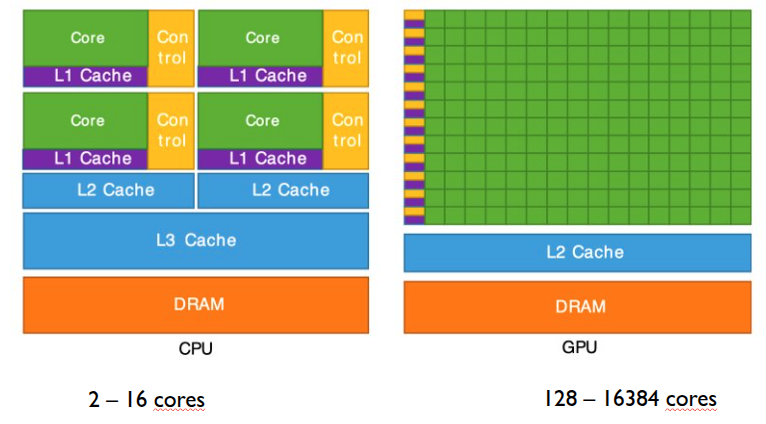
```

Arquitectura con referencia a la capacidad de paralelización:

```{r echo=FALSE, fig.align='center'}
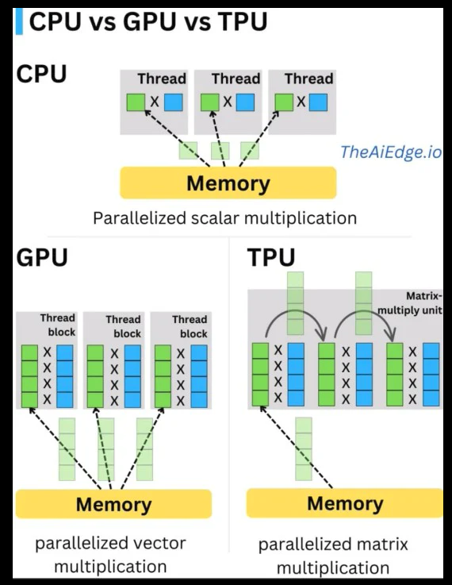
```

### Implementación de multiplicación de matrices en distintas arquitecturas

En esta sección comparamos la implementación de la multiplicación de matrices implementado desde en CPU sin paralelizar, CPU paralelizado hasta una implementación en GPU para identificar la diferencia de performance en una operación altamente concurrente y paralelizable fundamental en el aprendizaje profundo.

Implementación de la multiplicación de matrices - 1 core - AMD Ryzen9950X - $\sim 31.56s$

```{python echo=TRUE, fig.align='center'}
import random
import time

def generate_matrix(n, m):
    return [[random.random() for _ in range(m)] for _ in range(n)]

def matmul_cpu(A, B):
    n = len(A)
    m = len(B[0])
    p = len(B)

    # Crear matriz resultado
    C = [[0.0 for _ in range(m)] for _ in range(n)]

    for i in range(n):
        for j in range(m):
            sum_val = 0.0
            for k in range(p):
                sum_val += A[i][k] * B[k][j]
            C[i][j] = sum_val

    return C

# Ejemplo
N = 1024
A = generate_matrix(N, N)
B = generate_matrix(N, N)

start = time.time()
C = matmul_cpu(A, B)
end = time.time()

print("Tiempo CPU 1 core:", end - start)
```

Implementación de la multiplicación de matrices - 16 cores - AMD Ryzen9950X - $\sim 3.89s$

```{python eval=FALSE, fig.align='center', include=FALSE}
import multiprocessing as mp

def compute_row(args):
    i, A_row, B = args
    m = len(B[0])
    p = len(B)

    result_row = []
    for j in range(m):
        sum_val = 0.0
        for k in range(p):
            sum_val += A_row[k] * B[k][j]
        result_row.append(sum_val)

    return (i, result_row)

def matmul_parallel(A, B):
    n = len(A)

    with mp.Pool(mp.cpu_count()) as pool:
        results = pool.map(
            compute_row,
            [(i, A[i], B) for i in range(n)]
        )

    C = [None] * n
    for i, row in results:
        C[i] = row

    return C

if __name__ == "__main__":
    N = 1024
    A = generate_matrix(N, N)
    B = generate_matrix(N, N)

    start = time.time()
    C = matmul_parallel(A, B)
    end = time.time()

    print("Tiempo CPU multicore:", end - start)
```

Implementación de la multiplicación de matrices - GPU Paralelizado - RTX 5090 - $\sim 0.27s$

```{python eval=FALSE, fig.align='center', include=FALSE}
import numpy as np
from numba import cuda
import math
import time

@cuda.jit
def matmul_gpu(A, B, C):
    row, col = cuda.grid(2)

    if row < C.shape[0] and col < C.shape[1]:
        tmp = 0.
        for k in range(A.shape[1]):
            tmp += A[row, k] * B[k, col]
        C[row, col] = tmp


N = 1024
A = np.random.rand(N, N).astype(np.float32)
B = np.random.rand(N, N).astype(np.float32)
C = np.zeros((N, N), dtype=np.float32)

threadsperblock = (16, 16)
blockspergrid_x = math.ceil(N / threadsperblock[0])
blockspergrid_y = math.ceil(N / threadsperblock[1])
blockspergrid = (blockspergrid_x, blockspergrid_y)

start = time.time()
matmul_gpu[blockspergrid, threadsperblock](A, B, C)
cuda.synchronize()
end = time.time()

print("Tiempo GPU:", end - start)
```

### ¿Es viable acelerar cualquier algoritmo en GPU / TPU?

Cuando se habla del poder de las GPUs, es común escuchar cifras impresionantes: aceleraciones de 100x o incluso 1000x comparado con una CPU. Sin embargo, como señalan Gregg y Hazelwood en su artículo "Where is the Data?", estas cifras suelen contar solo una parte de la historia. La pregunta que olvidamos hacer es: **¿dónde están los datos antes de que la GPU empiece a trabajar, y dónde se necesitan después?**

```{r echo=FALSE, fig.align='center'}
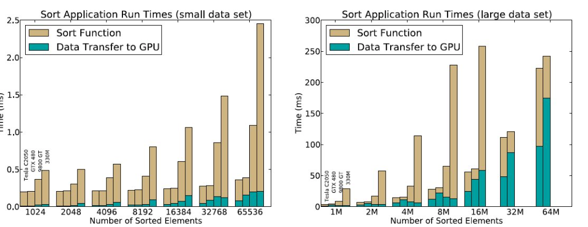
```

Pero hay una segunda pregunta, igual de importante: **¿cómo está organizado el trabajo que queremos acelerar?**

#### El costo oculto: mover los datos

Para que una GPU procese información, los datos deben viajar desde la memoria principal del sistema (donde la CPU los deja) hasta la memoria de la GPU. Este viaje se realiza a través del bus PCI Express, una autopista de datos que, aunque rápida, es considerablemente más lenta que la velocidad a la que la GPU puede calcular. El problema es que, una vez que la GPU termina su trabajo, muchas veces los resultados deben volver a hacer el viaje inverso para que la CPU pueda mostrarlos o usarlos en otra tarea.

Los autores del estudio demuestran que este "costo de transporte" es todo menos despreciable. En sus pruebas con once aplicaciones diferentes, descubrieron que al incluir el tiempo de transferencia de datos, el tiempo total de ejecución podía ser de **2 a 50 veces mayor** que el tiempo que la GPU pasó realmente calculando. Es decir, la GPU puede ser un chef increíblemente rápido, pero si pasa la mayor parte del tiempo esperando que le traigan los ingredientes, la comida no llegará antes a la mesa.

#### El segundo gran obstáculo: la concurrencia homogeneizable

Además del problema de la transferencia de datos, existe una barrera arquitectónica fundamental. Las GPUs están diseñadas para ejecutar miles de hilos en paralelo, pero con una condición: **todos deben hacer prácticamente lo mismo, siguiendo el mismo guión**.

Este modelo se conoce como SIMT (Single Instruction, Multiple Threads). Imagina una fábrica con miles de trabajadores, pero donde todos deben realizar exactamente la misma tarea al mismo tiempo. Si un trabajador necesita desviarse del guión (por ejemplo, porque su pieza es más complicada y requiere un tratamiento especial), el rendimiento de toda la fábrica se resiente.

Por lo tanto, un algoritmo es "homogeneizable" cuando puede dividirse en miles de tareas idénticas que realizan las mismas operaciones sobre datos diferentes. Los algoritmos que no cumplen esta condición presentan dos problemas graves:

-   **Algoritmos con baja concurrencia:** Si un problema solo se puede dividir en unas pocas tareas (por ejemplo, 8 hilos), una GPU con miles de núcleos pasará la mayor parte del tiempo desocupada. Es como tener una fábrica con 10,000 trabajadores para ensamblar un solo coche: la mayoría se quedarán mirando.
-   **Algoritmos con divergencia de control:** Si las tareas tienen que tomar caminos diferentes (condicionales del tipo "si el dato es par, haz A; si es impar, haz B"), la GPU se ve obligada a ejecutar primero todas las ramas A y luego todas las ramas B, desperdiciando ciclos y perdiendo gran parte de su ventaja.

#### ¿Cuándo merece la pena usar una GPU?

Combinando ambos factores (transferencia de datos y concurrencia homogeneizable), podemos identificar los casos favorables y desfavorables para la aceleración con GPU:

**El caso desfavorable (mucha transferencia, poco cálculo y/o baja homogeneizabilidad)**

Un algoritmo no se beneficiará de la GPU si presenta alguna de estas características:

-   **Es dominado por la transferencia de datos:** Como el algoritmo **SAXPY** (suma de vectores), donde la operación es tan simple que el tiempo de envío de los datos a la GPU eclipsa cualquier ganancia. El estudio muestra ejemplos donde la aplicación completa llegó a tardar **43 veces más** que el tiempo de cálculo en la GPU.
-   **Tiene baja concurrencia:** Problemas que solo pueden paralelizarse en unos pocos hilos no aprovechan la masividad de la GPU. La CPU, con sus pocos núcleos pero muy rápidos, será casi siempre más eficiente.
-   **Presenta alta divergencia de control:** Algoritmos con muchas bifurcaciones condicionales y patrones de acceso irregulares (como procesar estructuras de datos enlazadas o árboles con formas variables) obligan a la GPU a trabajar de forma ineficiente, perdiendo su ventaja competitiva.

**El caso favorable (mucha computación, poca transferencia y alta homogeneizabilidad)**

El caso ideal para una GPU es aquel que cumple tres condiciones: los datos llegan rápido, se quedan el mayor tiempo posible y el trabajo está perfectamente organizado en tareas idénticas.

-   **Ejemplo clásico:** Una simulación compleja como el método de **Monte Carlo** para valorar opciones financieras. Se envían pocos datos iniciales, la GPU ejecuta millones de trayectorias idénticas (cada hilo hace lo mismo), y al final solo devuelve un puñado de resultados. Aquí, el tiempo de transferencia es insignificante y la concurrencia es masiva y homogénea.
-   **Ejemplo adicional:** La multiplicación de matrices densas (**SGEMM**). Es una operación regular, predecible y masivamente paralela. Aunque tiene transferencia de datos, la cantidad de cálculo por dato es tan alta (complejidad O(n³)) que el costo de mover los datos se amortiza.

#### Entonces, ¿aceleramos cualquier algoritmo?

La respuesta es no. Acelerar un algoritmo en GPU no es automático ni universal. Para que la aceleración sea real, el algoritmo debe superar dos filtros:

1.  **El filtro de los datos:** El tiempo de cómputo en la GPU debe ser muy superior al tiempo de transferir los datos, o bien estos deben poder permanecer en la GPU para múltiples operaciones consecutivas.
2.  **El filtro de la concurrencia:** El problema debe poder dividirse en miles de tareas independientes que sigan un flujo de ejecución predecible y homogéneo.

Si tu algoritmo falla en alguno de estos dos puntos —ya sea porque mueve muchos datos y calcula poco, o porque es intrínsecamente irregular—, es muy probable que la CPU, que ya tiene los datos en su propia memoria y está optimizada para ejecutar código con bifurcaciones complejas, sea la opción más rápida y eficiente.

La próxima vez que alguien te hable de una GPU milagrosa, recuerda preguntar dos cosas: **"¿Dónde están los datos?"** y **"¿Cómo está organizado el trabajo?"**. Porque, como demuestra este estudio, las respuestas a esas preguntas marcan toda la diferencia entre una revolución de rendimiento y una decepción.

#### Cuales son las arquitecturas más comunes y favorables para procesar algoritmos de deeplearning

Claro, te ayudaré a generar una subsección basada en la información de la imagen, enfocada en las arquitecturas más comunes y favorables para deep learning. He estructurado la información de manera académica y fluida, integrando los datos de tu tabla en un texto explicativo.

Aquí tienes el texto propuesto para tu subsección:

------------------------------------------------------------------------

#### Cuales son las arquitecturas más comunes y favorables para procesar algoritmos de deep learning

El auge del *deep learning* ha impulsado el desarrollo de hardware especializado, alejándose del paradigma de los procesadores de propósito general para buscar arquitecturas que maximicen el paralelismo y la eficiencia energética. Las unidades de procesamiento han evolucionado para adaptarse a las demandas específicas de este tipo de algoritmos. A continuación, se describen las arquitecturas más comunes y favorables en este ámbito.

Tradicionalmente, la unidad central de procesamiento o **CPU** (Central Processing Unit) ha sido el pilar de la computación. Diseñada para tareas de propósito general con unos pocos núcleos potentes optimizados para procesamiento secuencial, su arquitectura resulta adecuada para el control lógico y el preprocesamiento de datos. Sin embargo, su capacidad de paralelismo limitado la hace menos favorable para la fase de entrenamiento masivo de redes neuronales.

En contraste, la unidad de procesamiento gráfico o **GPU** (Graphics Processing Unit) se convirtió en el caballo de batalla de la primera era del deep learning. Originalmente concebida para renderizar gráficos, su arquitectura masivamente paralela, compuesta por miles de núcleos más pequeños, le permite realizar innumerables operaciones matemáticas simultáneamente. Esta característica la hace ideal para el entrenamiento de grandes redes neuronales, aunque suele conllevar un alto consumo energético.

Con la necesidad de llevar la inteligencia artificial a dispositivos cotidianos, surgieron aceleradores especializados. La unidad de procesamiento neuronal o **NPU** (Neural Processing Unit) ejemplifica esta tendencia. Integrada comúnmente en sistemas en un chip (SoC) de teléfonos inteligentes y dispositivos IoT, su arquitectura está optimizada para operaciones matriciales y vectoriales con un consumo energético muy reducido, lo que la hace perfecta para la inferencia en el borde de la red (*edge inference*).

En el extremo opuesto, para las demandas de la nube, destacan unidades como la **TPU** (Tensor Processing Unit), diseñada por Google. Se trata de un circuito integrado específico para acelerar el cálculo de tensores, la operación fundamental en frameworks como TensorFlow. Optimizada para la multiplicación de matrices a gran escala, la TPU es una de las arquitecturas más potentes para el entrenamiento e inferencia en centros de datos, aunque su alto coste y consumo las circunscriben a entornos cloud especializados.

Finalmente, para orquestar la compleja infraestructura que soporta todo este cómputo, se emplea la unidad de procesamiento de datos o **DPU** (Data Processing Unit). Esta arquitectura, presente en centros de datos de alto rendimiento, actúa como un *SmartNIC* programable que acelera y descarga de los servidores las tareas relacionadas con el movimiento de datos, el networking y el almacenamiento. Al liberar a las CPU y GPU de estas tareas de *back-end*, las DPUs contribuyen a la eficiencia global de los clústeres de deep learning.

```{r echo=FALSE, fig.align='center'}
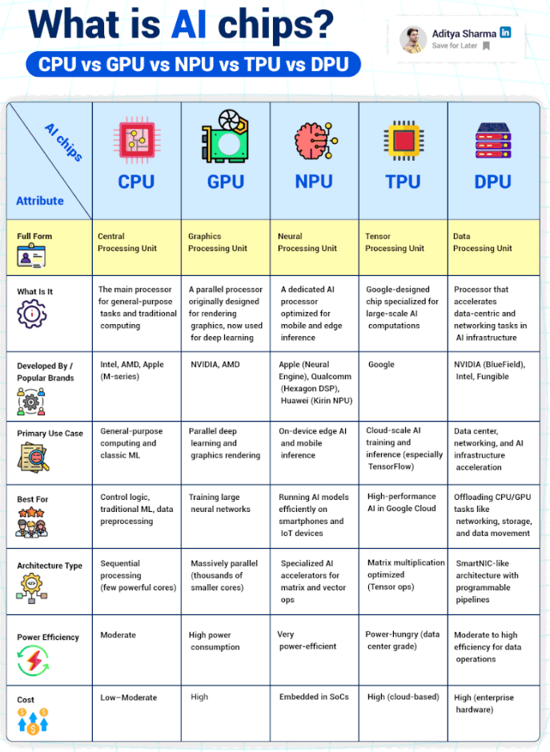
```

<!--chapter:end:06-Builders_Guide.Rmd-->

<!-- ::: watermark -->
<!--  -->
<!-- ::: -->

# Redes Neuronales Convolucionales

Las redes neuronales convolucionales, o **CNN** por sus siglas en inglés, fueron diseñadas para aprovechar la estructura espacial de las imágenes. A diferencia de una red completamente conectada, una CNN no trata a cada pixel como una variable aislada e independiente, sino como parte de un vecindario con relaciones locales muy importantes.

Esta idea trae dos ventajas centrales. Primero, reduce drásticamente el número de parámetros del modelo. Segundo, incorpora un sesgo inductivo muy útil: si un patrón visual aparece en una parte de la imagen, queremos poder reconocerlo también cuando aparece en otra.

En esta sección construiremos la intuición detrás de las convoluciones y después veremos cómo se aplican directamente sobre imágenes bidimensionales.

Fuente de referencia y adaptación original en español:

- [Dive into Deep Learning, Capítulo 7](https://d2l.ai/chapter_convolutional-neural-networks/index.html)
- [Sección 7.1: From Fully Connected Layers to Convolutions](https://d2l.ai/chapter_convolutional-neural-networks/why-conv.html)
- [Sección 7.2: Convolutions for Images](https://d2l.ai/chapter_convolutional-neural-networks/conv-layer.html)

## De capas densas a convoluciones

Si quisiéramos procesar una imagen con una red densa tradicional, podríamos aplanarla en un vector y conectar cada pixel con cada neurona oculta. El problema es que esta estrategia ignora la estructura espacial de la imagen y además introduce una cantidad enorme de parámetros.

Por ejemplo, una imagen de tamaño moderado puede contener cientos de miles de pixeles. Si cada unidad oculta dependiera de todos ellos, el costo en memoria y cómputo crecería demasiado rápido. Más importante todavía, perderíamos conocimiento útil sobre el dominio: en imágenes, los pixeles cercanos suelen estar más relacionados entre sí que los pixeles lejanos.

Las CNN resuelven esto imponiendo dos principios:

1. **Invariancia o equivarianza por traslación**. Un patrón relevante debe poder detectarse sin importar en qué parte de la imagen aparece.
2. **Localidad**. Para describir lo que ocurre en una posición, normalmente basta con mirar una región cercana.

Estas dos ideas nos llevan de forma natural a la operación de convolución.

## 7.1 De capas completamente conectadas a convoluciones

### 7.1.1 Invariancia

Imagina que queremos detectar un objeto en una imagen, por ejemplo un balón, un rostro o una señal de tránsito. Sería poco razonable que el sistema solo pudiera reconocerlo cuando aparece exactamente en una coordenada específica. Si el objeto se desplaza un poco hacia la derecha o hacia arriba, la respuesta del modelo debería seguir siendo coherente.

Ese comportamiento deseado se conoce como **invariancia por traslación** o, de manera más precisa en capas intermedias, **equivarianza por traslación**. En términos intuitivos, si el patrón se mueve en la imagen, su activación también se mueve de forma consistente en el mapa de características.


Una manera útil de pensar en esto es el juego de "¿Dónde está Wally?". Aunque el personaje cambie de posición dentro de la escena, seguimos buscando el mismo patrón visual: colores, forma, accesorios y contexto local.

### 7.1.2 Restringiendo un perceptrón multicapa

Supongamos que la entrada es una imagen bidimensional `X` y que la representación oculta es otra matriz `H` del mismo tamaño. Si usáramos una capa completamente conectada, cada posición `(i,j)` de `H` dependería de todas las posiciones `(k,l)` de `X`:

$$
[\mathbf{H}]_{i,j} = [\mathbf{U}]_{i,j} + \sum_k \sum_l [\mathsf{W}]_{i,j,k,l} [\mathbf{X}]_{k,l}
$$

Esta formulación es muy flexible, pero también muy costosa. Para convertirla en algo útil para visión por computadora, introducimos restricciones estructurales.

#### 7.1.2.1 Invariancia por traslación

Si queremos tratar del mismo modo al mismo patrón sin importar dónde aparece, los pesos no deberían depender explícitamente de la posición absoluta `(i,j)`. Podemos reescribir la transformación usando desplazamientos relativos:

$$
[\mathbf{H}]_{i,j} = u + \sum_a \sum_b [\mathbf{V}]_{a,b} [\mathbf{X}]_{i+a,j+b}
$$

Ahora el mismo conjunto de pesos `V` se reutiliza en todas las ubicaciones. Esto se conoce como **compartición de parámetros** y es una de las ideas más poderosas de las CNN.

#### 7.1.2.2 Localidad

El segundo supuesto es que no necesitamos observar toda la imagen para decidir qué ocurre en una posición local. Basta con mirar una ventana cercana. Entonces imponemos que los pesos sean cero fuera de una vecindad acotada:

$$
[\mathbf{H}]_{i,j} = u + \sum_{a=-\Delta}^{\Delta}\sum_{b=-\Delta}^{\Delta} [\mathbf{V}]_{a,b} [\mathbf{X}]_{i+a,j+b}
$$

Con esta restricción, el número de parámetros baja de manera drástica. En vez de aprender una matriz gigante de conexiones, solo aprendemos un filtro pequeño que se desliza por toda la imagen.

En esencia, esta ecuación ya describe una **capa convolucional**.

### 7.1.3 Convoluciones

En matemáticas, la convolución entre dos funciones puede definirse como:

$$
(f * g)(\mathbf{x}) = \int f(\mathbf{z}) g(\mathbf{x} - \mathbf{z}) d\mathbf{z}
$$

En el caso discreto unidimensional:

$$
(f * g)(i) = \sum_a f(a) g(i-a)
$$

Y en dos dimensiones:

$$
(f * g)(i,j) = \sum_a \sum_b f(a,b) g(i-a,j-b)
$$

En aprendizaje profundo, la operación que implementamos casi siempre es en realidad una **correlación cruzada**, porque no se invierte el kernel. Sin embargo, en la práctica todo el mundo la llama "convolución" y seguiremos esa convención.

### 7.1.4 Canales

Hasta aquí pensamos en una sola matriz de entrada, pero las imágenes reales suelen tener varios canales. Una imagen RGB, por ejemplo, tiene tres: rojo, verde y azul. Del mismo modo, una capa convolucional puede producir múltiples canales de salida, cada uno especializado en detectar cierto tipo de patrón.

En ese caso, la operación general toma la forma:

$$
[\mathsf{H}]_{i,j,d} = \sum_{a=-\Delta}^{\Delta}\sum_{b=-\Delta}^{\Delta}\sum_c [\mathsf{V}]_{a,b,c,d} [\mathsf{X}]_{i+a,j+b,c}
$$

donde:

- `c` indexa los canales de entrada
- `d` indexa los canales de salida
- `V` es el conjunto de filtros aprendibles


Cada filtro responde con mayor intensidad allí donde detecta un patrón particular. En capas profundas, esos patrones dejan de ser simples bordes o texturas y pueden representar partes de objetos o configuraciones visuales más complejas.

### 7.1.5 Resumen

- Las CNN explotan la estructura espacial de las imágenes.
- La compartición de parámetros permite detectar el mismo patrón en distintas posiciones.
- La localidad reduce el costo computacional y favorece el aprendizaje de patrones visuales cercanos.
- Una capa convolucional opera con filtros pequeños que se aplican a toda la entrada.
- Los canales permiten aprender múltiples detectores de características al mismo tiempo.

## 7.2 Convoluciones para imágenes

Ahora que ya tenemos la motivación, pasemos a la operación concreta sobre imágenes.

### 7.2.1 Operación de correlación cruzada

La operación básica toma una entrada bidimensional `X` y un kernel `K`, también llamado filtro. El kernel se desliza por la imagen y, en cada posición, calcula un producto punto entre sus valores y la región correspondiente de la entrada.


Si usamos:

$$
\mathbf{X} =
\begin{bmatrix}
0 & 1 & 2 \\
3 & 4 & 5 \\
6 & 7 & 8
\end{bmatrix},
\quad
\mathbf{K} =
\begin{bmatrix}
0 & 1 \\
2 & 3
\end{bmatrix}
$$

entonces la salida se obtiene evaluando:

$$
\begin{aligned}
0\times0 + 1\times1 + 3\times2 + 4\times3 &= 19\\
1\times0 + 2\times1 + 4\times2 + 5\times3 &= 25\\
3\times0 + 4\times1 + 6\times2 + 7\times3 &= 37\\
4\times0 + 5\times1 + 7\times2 + 8\times3 &= 43
\end{aligned}
$$

Por tanto:

$$
\mathbf{Y} =
\begin{bmatrix}
19 & 25 \\
37 & 43
\end{bmatrix}
$$

Si la entrada tiene tamaño `n_h x n_w` y el kernel tiene tamaño `k_h x k_w`, entonces la salida tendrá tamaño:

$$
(n_h-k_h+1) \times (n_w-k_w+1)
$$

### 7.2.2 Implementación manual en Python

Una implementación sencilla de correlación cruzada en dos dimensiones puede escribirse así:

```python
import torch

def corr2d(X, K):
    h, w = K.shape
    Y = torch.zeros((X.shape[0] - h + 1, X.shape[1] - w + 1))
    for i in range(Y.shape[0]):
        for j in range(Y.shape[1]):
            Y[i, j] = (X[i:i + h, j:j + w] * K).sum()
    return Y

X = torch.tensor([[0.0, 1.0, 2.0],
                  [3.0, 4.0, 5.0],
                  [6.0, 7.0, 8.0]])

K = torch.tensor([[0.0, 1.0],
                  [2.0, 3.0]])

print(corr2d(X, K))
```

Salida esperada:

```python
tensor([[19., 25.],
        [37., 43.]])
```

Este ejemplo es útil porque deja ver con claridad lo que hace la operación, aunque en la práctica las bibliotecas profundas usan implementaciones mucho más optimizadas.

### 7.2.3 Una capa convolucional simple

Una capa convolucional aprende automáticamente los valores del kernel y del sesgo. Conceptualmente, podríamos modelarla así:

```python
import torch
from torch import nn

class Conv2D(nn.Module):
    def __init__(self, kernel_size):
        super().__init__()
        self.weight = nn.Parameter(torch.rand(kernel_size))
        self.bias = nn.Parameter(torch.zeros(1))

    def forward(self, x):
        return corr2d(x, self.weight) + self.bias
```

En un entrenamiento real, esos parámetros se ajustan mediante descenso de gradiente para que el filtro detecte los patrones más útiles para la tarea.

### 7.2.4 Detección de bordes en imágenes

Una de las aplicaciones más intuitivas de un kernel es detectar bordes. Por ejemplo, si queremos identificar transiciones verticales, podemos usar un filtro como:

$$
\mathbf{K} =
\begin{bmatrix}
1 & -1
\end{bmatrix}
$$

Este kernel responde fuertemente cuando encuentra un cambio brusco entre una columna y la siguiente.

```python
import torch

X = torch.ones((6, 8))
X[:, 2:6] = 0
K = torch.tensor([[1.0, -1.0]])

Y = corr2d(X, K)
print(Y)
```

Aquí la imagen sintética contiene una franja vertical oscura en medio de una región clara. La salida tendrá activaciones marcadas justamente en las fronteras entre ambas regiones.

### 7.2.5 Aprendiendo un kernel

No siempre especificamos manualmente el filtro. También podemos dejar que la red lo aprenda. Si tomamos una entrada `X` y una salida deseada `Y`, podemos optimizar una capa convolucional para que descubra automáticamente un kernel que transforme `X` en `Y`.

```python
import torch
from torch import nn

X = X.reshape((1, 1, 6, 8))
Y = Y.reshape((1, 1, 6, 7))

conv2d = nn.Conv2d(1, 1, kernel_size=(1, 2), bias=False)
lr = 3e-2

for i in range(10):
    Y_hat = conv2d(X)
    loss = (Y_hat - Y) ** 2
    conv2d.zero_grad()
    loss.sum().backward()
    conv2d.weight.data[:] -= lr * conv2d.weight.grad
    if (i + 1) % 2 == 0:
        print(f"epoch {i+1}, loss {loss.sum():.3f}")

print(conv2d.weight.data.reshape((1, 2)))
```

Después de varias iteraciones, el kernel aprendido se acerca a `[[1, -1]]` o a una versión equivalente, mostrando que la capa puede descubrir por sí sola un detector de bordes.

### 7.2.6 Correlación cruzada y convolución

Conviene insistir en la diferencia terminológica:

- En **correlación cruzada**, el kernel se usa tal cual.
- En **convolución estricta**, el kernel se invierte horizontal y verticalmente antes de aplicarse.

En deep learning casi todas las implementaciones usan correlación cruzada, pero la comunidad mantiene el nombre de "convolución" por costumbre.

### 7.2.7 Mapa de características y campo receptivo

La salida de una capa convolucional suele llamarse **mapa de características**. Cada una de sus posiciones resume la respuesta del filtro en una región concreta de la entrada.

El **campo receptivo** de una neurona es la región de la entrada original que puede influir en su valor. En una primera capa, ese campo coincide con el tamaño del kernel. En redes profundas, el campo receptivo crece conforme apilamos más capas.

Esto es muy importante porque permite combinar evidencia local en patrones cada vez más globales:

- las primeras capas detectan bordes y texturas
- las capas intermedias reconocen partes
- las capas profundas integran configuraciones más complejas

### 7.2.8 Resumen

- La operación fundamental de una capa convolucional es la correlación cruzada.
- El kernel se desliza sobre la entrada y produce una salida más pequeña si no usamos relleno.
- Los filtros pueden diseñarse manualmente, por ejemplo para detectar bordes.
- En aprendizaje profundo, normalmente los filtros se aprenden a partir de los datos.
- Los mapas de características y el campo receptivo ayudan a interpretar cómo procesa información una CNN.

## Ideas clave del capítulo

Las redes convolucionales surgen al imponer una estructura adecuada para datos con organización espacial. En lugar de aprender conexiones arbitrarias entre todos los pixeles, aprenden filtros locales que se reutilizan a lo largo de toda la imagen. Esa combinación de localidad, compartición de parámetros y profundidad explica buena parte de su éxito en visión por computadora.

En las siguientes secciones veremos cómo ajustar el tamaño efectivo de la salida mediante *padding* y *stride*, cómo trabajar con múltiples canales y cómo construir arquitecturas convolucionales más completas.


<!--chapter:end:07-Convolutional_Neural_Networks.Rmd-->

<!-- ::: watermark -->
<!--  -->
<!-- ::: -->

# Redes Neuronales Convolucionales Modernas


<!--chapter:end:08-Modern_Convolutional_Neural_Networks.Rmd-->

<!-- ::: watermark -->
<!--  -->
<!-- ::: -->

# Redes Neuronales Recurrentes


<!--chapter:end:09-Recurrent_Neural_Networks.Rmd-->

<!-- ::: watermark -->
<!--  -->
<!-- ::: -->

# Redes Neuronales Recurrentes Modernas


<!--chapter:end:10-Modern_Recurrent_Neural_Networks.Rmd-->

<!-- ::: watermark -->
<!--  -->
<!-- ::: -->

# Mecanismos de Atención y Transformers


<!--chapter:end:11-Attention_Mechanisms_and_Transformers.Rmd-->

<!-- ::: watermark -->
<!--  -->
<!-- ::: -->

# (PART\*) Parte 3: Escalabilidad, Eficiencia y Aplicaciones {-} 

# Algoritmos de Optimización


<!--chapter:end:12-Optimization_Algorithms.Rmd-->

<!-- ::: watermark -->
<!--  -->
<!-- ::: -->

# Miscellanea: Intro to Graph Neural Networks {-} 

# Introducción a la Teoría de Gráficas.
## ¿Qué es una gráfica?

Una gráfica es un objeto matemático que representa un conjunto de objetos y las
relaciones entre ellos. Estos se usan para modelar fenómenos complejos, como la
interacción en redes sociales, redes de comunicaciones, las relaciones entre
citas de documentos, la configuración de compuestos químicos y demás.

```{python}
import torch
import torch.nn as nn
from torch.nn import Linear
import torch.nn.functional as F
import torch_geometric
from torch_geometric.datasets import Planetoid
from torch_geometric.utils import (
  to_dense_adj, to_networkx, degree
)

import numpy as np
import networkx as nx
import matplotlib.pyplot as plt
import pandas as pd
import random

# Load Zachary's Karate Club graph
G = nx.karate_club_graph()

print(f"Number of nodes: {G.number_of_nodes()}")
print(f"Number of edges: {G.number_of_edges()}")

```


```{python}
# Get the club membership attribute for coloring
club_labels = [G.nodes[i]['club'] for i in G.nodes]

# Color based on club membership ('Mr. Hi' or 'Officer')
color_map = [
  '#FF5733' if club == 'Mr. Hi' else '#3371FF' for club in club_labels
  ]

# Draw the graph
plt.figure(figsize=(8, 6))
pos = nx.spring_layout(G) # positions for all nodes
nx.draw_networkx_nodes(G, pos, node_color=color_map)
nx.draw_networkx_edges(G, pos, alpha=0.6)
nx.draw_networkx_labels(G, pos, font_color='white')
plt.title("Zachary's Karate Club Network")
plt.axis('off')
plt.show()

```

Matematicamente se representan como conjuntos de vértices (o nodos)
$V = \{v_1, \ldots, v_n \}$ y del conjunto de las relaciones entre ellas
$E = \{e_{i_1 i_j}, \ldots, e_{i_m i_m} \}$.


```{r echo=FALSE, fig.align='center'}
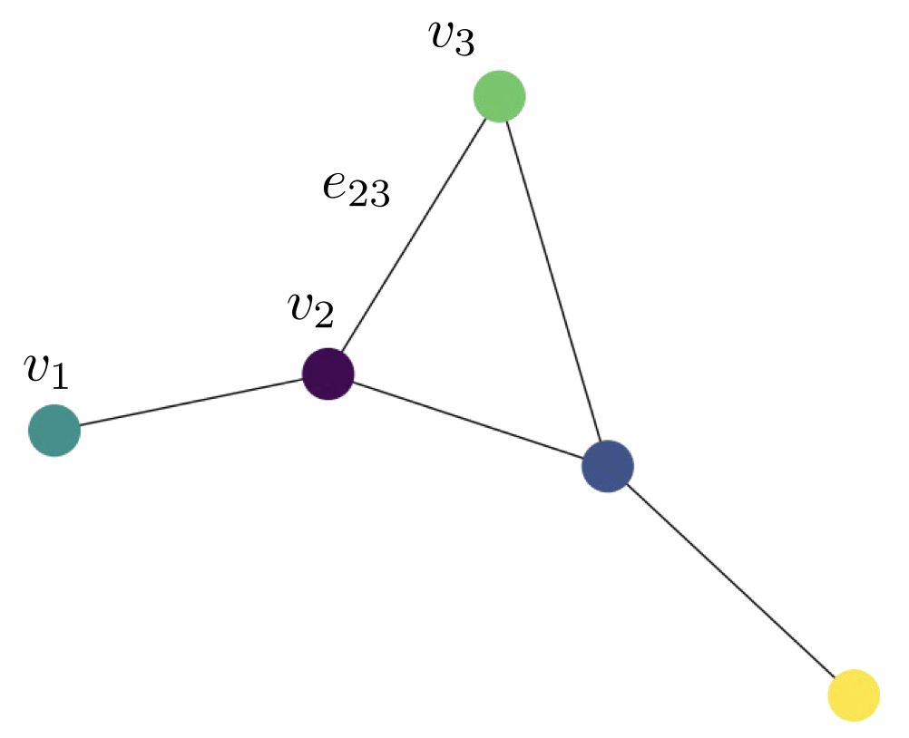
```


Si bien, el conjunto de aristas define la estructura de la gráfica es comun
generar representaciones alternativas. Entre ellas se encuentran:

* **Matriz de adjyacencias:** $A\in \mathbb{R}^n$, donde $n$ es el número de vertices
de la gráfica y las entradas de la matriz estan dadas como sigue

$$A_{ij} = \begin{cases}
    1,& \text{ existe arista entre } v_i \text{ y }v_j\\
    0,& \text{ en otro caso }
\end{cases}$$

```{r echo=FALSE, fig.align='center'}
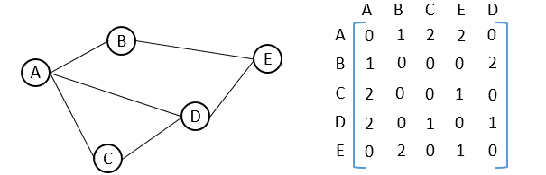
```
Es de notar que en la práctica, dicha matriz suele ser de tipo *sparse*, dado
que no todos los nodos están conectados.

* **Sparse Coodinate Format (COO):** Es una representacion tensorial de tipo
*sparse* de las estructura de la gráfica. La idea es solo almacenar los indices
de los nodos que denotan las adyacencias en la gráfica omitiendo aquellos 
lugares donde no hay relaciones ente nodos. Véase el siguiente [link](https://docs.pytorch.org/docs/stable/sparse.html#sparse-coo-tensors).


```{r echo=FALSE, fig.align='center'}
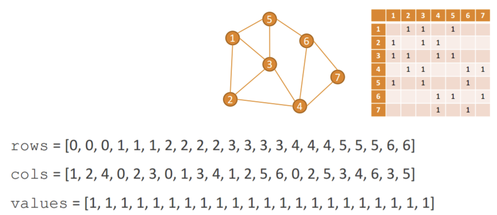
```


* Por otro lado, se puede considerar de forma opcional incluir en el análisis
a características numéricas y categorícas (*features*) de los vértices de la
gráfica.

```{r echo=FALSE, fig.align='center'}
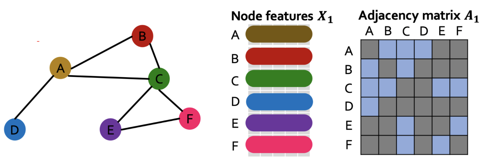
```

* **Grado de sus vertices:** el grado de un nodo $deg(v_i)$  como a la cantidad de aristas
donde dicho nodo está presente. Este se puede calcular como:

$$deg(v_i) = \sum_{i=1}^N A_{ij}$$

```{python}
G = nx.Graph()
G.add_edges_from([('A', 'B'), ('A', 'C'), ('B', 'D'),
('B', 'E'), ('C', 'F'), ('C', 'G')])

# Draw the graph
plt.figure(figsize=(8, 6))
pos = nx.spring_layout(G) # positions for all nodes
nx.draw_networkx_nodes(G, pos)
nx.draw_networkx_edges(G, pos, alpha=0.6)
nx.draw_networkx_labels(G, pos, font_color='white')
plt.title("Samaple Graph")
plt.axis('off')
plt.show()
```


```{python}
print(f"deg(A) = {G.degree['A']}")
print(f"deg(B) = {G.degree['B']}")
```

## Problemas clásicos de teoría de gráficas (selección)

###  Caminos y conectividad
**Problema:** determinar si dos nodos están conectados y cómo se propaga la información a través del grafo.  
**Aplicaciones:** navegación y mapas, análisis de redes sociales, propagación de epidemias, redes de comunicación.

### Detección de comunidades
**Problema:** identificar grupos de nodos densamente conectados entre sí.  
**Aplicaciones:** segmentación de usuarios, análisis de redes sociales, biología de sistemas, recomendación de contenidos.

### Centralidad e influencia
**Problema:** medir la importancia relativa de los nodos dentro de un grafo.  
**Aplicaciones:** ranking de páginas web, detección de líderes de opinión, identificación de nodos críticos en infraestructura, epidemiología.

### Emparejamiento y asignación
**Problema:** asignar nodos entre dos conjuntos respetando restricciones estructurales.  
**Aplicaciones:** asignación de tareas, sistemas de recomendación, mercados laborales, publicidad y subastas.


## Ecosistema de Herramientas para el Trabajo con Grafos
1) Software para Visualización y Análisis de Grafos

* *Gephi:* Herramienta open source la visualización interactiva y el análisis exploratorio de redes complejas y grandes grafos. https://gephi.org. La siguiente imagen fue generada en dicha herramienta

```{r echo=FALSE, fig.align='center'}
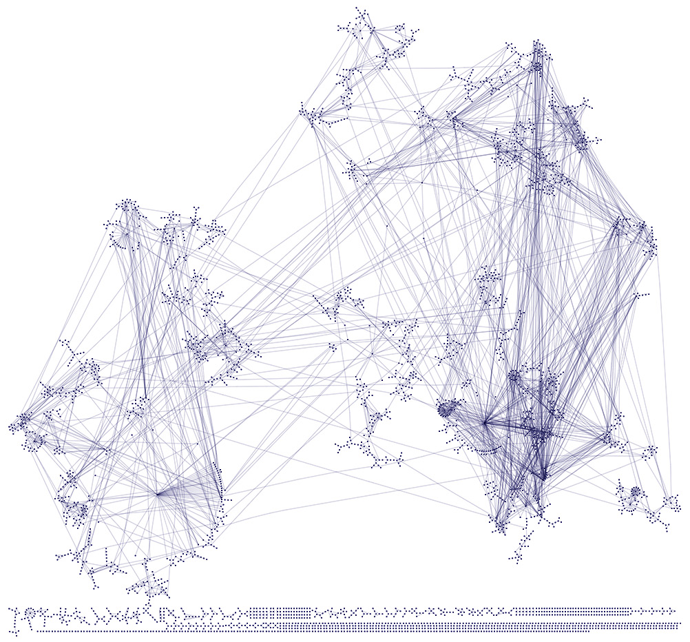
```

* **Bases de datos de Grafos:**
  * *Neo4j:* Sistema de gestión de bases de datos orientada a grafos que incluye el Graph Data Science (GDS) Library para ejecutar algoritmos directamente sobre los datos almacenados.
  * **Memgraph**: Base de datos de grafos con capacidades de Streaming https://memgraph.com
  * *AWS Neptune*: Base de datos serveless, funcioina en la nube de AWS https://aws.amazon.com/es/neptune/
* *Graphviz:* Herramienta basada en scripts (lenguaje DOT) que permite la generación automática de diagramas de grafos de manera estructural y jerárquica.

2) Librerías de Python para Manipulación y Algoritmos

* *NetworkX:* La librería de creación, manipulación y estudio de estructuras de
red; flexible e implementa algoritmos clásicos. https://networkx.org/en/
* *Graph:* Es un framework de Spark para trabajar con gráficas en ambientes distribuidas (https://spark.apache.org/graphx/)
* *Mercury-graph*: Libreria de BBVA para gráficos, disponible en Mercury, cuenta 
con algoritmos implementados para Python y Spark. https://www.bbvaaifactory.com/es/graph-analytics-with-mercury-graph/

3) Librerías de Deep Learning para Grafos (GNN)

* *PyTorch Geometric (PyG):* Construida sobre PyTorch. Ofrece implementaciones de última generación para operaciones de convolución y pooling en grafos. https://pytorch-geometric.readthedocs.io/en/latest/

* *Deep Graph Library (DGL):* Una librería optimizada y agnóstica al framework
(compatible con PyTorch, TensorFlow y JAX), diseñada para facilitar la
implementación de modelos GNN a escala industrial. https://www.dgl.ai


## ¿Por qué combinar Graficas y Deep Learning?
Cuando los datos de un problema, ademas de features numéricas tambien incorporan
estructura, puede resultar util tomarla en consideracion para tareas de ML.

Para ejemplificarlo, vamos a resolver el problema de clasificación de los datos
del *Cora* de la libreria *torch_geometric.datasets*.

Este es un conjunto de datos de una red de citas bibliográficas que relaciona
artículos científicos y citas bibliográficas de otros artículos en su texto.
La tabla siguiente hace un resumen

| # | Atributo                   | Valor                                    |
|---|----------------------------|------------------------------------------|
| 1 | Nodos                      | 2,708 (Artículos científicos)            |
| 2 | Aristas                    | 10,556 (Citas)                           |
| 3 | Características (Features) | 1,433 (Vector binario de palabras clave, Bag-of-Words) |
| 4 | Clases                     | 7 categorías de investigación            |


Las categorias de los artìculos son las siguientes:

| Categoria | Nombre                 | Descripción                                                              |
|-----------|------------------------|--------------------------------------------------------------------------|
| 0         | Theory                 | Aspectos teóricos, algoritmos fundamentales y pruebas matemáticas.       |
| 1         | Reinforcement Learning | Agentes que aprenden mediante prueba y error para maximizar recompensas. |
| 2         | Genetic Algorithms     | Algoritmos de optimización inspirados en la evolución biológica.         |
| 3         | Neural Networks        | Modelos basados en capas de neuronas artificiales y Deep Learning.       |
| 4         | Probabilistic Methods  | Modelos que gestionan la incertidumbre (Redes Bayesianas, etc.).         |
| 5         | Case Based             | Sistemas de razonamiento basados en casos y analogías previas.           |


```{python}
dataset = Planetoid(root='./tmp/cora', name='cora')
data = dataset[0]
```

```{python}
class GraphUtils:
    @staticmethod
    def create_adjacency_matrix(data):
        # Crea matriz de adyacencia
        adjacency = to_dense_adj(data.edge_index)[0]
        # Agrega una diagonal de unos (auto-referencia a nodos)
        adjacency = adjacency + torch.eye(len(adjacency))
        return adjacency

    @staticmethod
    def convert_to_networkx(graph, n_sample=None):
        g = to_networkx(graph, node_attrs=["x"])
        y = graph.y.numpy()
    
        if n_sample is not None:
            sampled_nodes  = random.sample(list(g.nodes), n_sample)
            g = g.subgraph(sampled_nodes)
            y = y[sampled_nodes]
    
        return g, y
    
    @staticmethod
    def plot_graph(g, y):
        plt.figure(figsize=(9, 7))
        nx.draw_spring(g, node_size=30, arrows=False, node_color=y)
        plt.show() 
```

Esta es una representación de una muestra de 1,000 artículos en el conjunto Cora.

```{python}
g, y = GraphUtils.convert_to_networkx(data, n_sample=1000)
GraphUtils.plot_graph(g, y)  
```
En complemento, ahora veremos el arreglo tabular de datos donde cada reglón es un
artículo, los features son el Bag of Words del corpus del artículo con las
palabras de toda la colección y la categoría a la que pertenece dicho artículo.

```{python}
cora_features = pd.DataFrame(dataset.x.numpy(),columns=["word"+str(i) for i in range(1433)])
cora_features["category"] = data.y

cora_features[cora_features.columns[-5:]].head(20)
```

Para la comparativa consistirá en los siguientes:

A) Un modelo de tipo Multilayer Percepton con dos capas que usa las features
numéricas para predecir la categoría a la que corresponde cada artículos

B) Un modelo que combina capaz, que conectan los datos las features
numèricas a una capa lineal y despúes multiplican la salida por la matriz de
adyacencias para involucrar la estrucura de la red.

### A. Multilayer Percepton en las features tabulares de Cora

```{python}
# Define MLP model
class MLP(torch.nn.Module):
    def __init__(self, dim_in, dim_h, dim_out):
        super().__init__()
        self.linear1 = Linear(dim_in, dim_h)
        self.linear2 = Linear(dim_h, dim_out)

    def forward(self, x):
        x = self.linear1(x)
        x = torch.relu(x)
        x = self.linear2(x)
        return F.log_softmax(x, dim=1)

    def fit(self, data, epochs, learning_rate=0.01, weight_decay=5e-4):
        criterion = torch.nn.CrossEntropyLoss()
        optimizer = torch.optim.Adam(self.parameters(), lr=learning_rate, weight_decay=weight_decay)

        self.train()
        for epoch in range(epochs+1):
            optimizer.zero_grad()
            out = self(data.x)
            loss = criterion(out[data.train_mask], data.y[data.train_mask])
            acc = self.accuracy(out[data.train_mask].argmax(dim=1), data.y[data.train_mask])
            loss.backward()
            optimizer.step()

            if epoch % 20 == 0:
                val_loss = criterion(out[data.val_mask], data.y[data.val_mask])
                val_acc = self.accuracy(out[data.val_mask].argmax(dim=1), data.y[data.val_mask])
                print(f'Epoch {epoch:>3} | Train Loss: {loss:.3f} | Train Acc:'
                      f' {acc*100:>5.2f}% | Val Loss: {val_loss:.2f} | '
                      f'Val Acc: {val_acc*100:.2f}%')

    @torch.no_grad()
    def test(self, data):
        self.eval()
        out = self(data.x)
        acc = self.accuracy(out.argmax(dim=1)[data.test_mask], data.y[data.test_mask])
        return acc

    @staticmethod
    def accuracy(y_pred, y_true):
        return torch.sum(y_pred == y_true).item() / len(y_true)
```

### B. Modelo basado en una capa lineal que se multiplica por la matriz de adyacencia.

```{python}
class GNNLayer(torch.nn.Module):
    def __init__(self, dim_in, dim_out):
        super().__init__()
        self.linear = Linear(dim_in, dim_out, bias=False)

    def forward(self, x, adjacency):
        x = self.linear(x)
        x = torch.sparse.mm(adjacency, x)
        return x
```

```{python}
class GNN(torch.nn.Module):
    def __init__(self, dim_in, dim_h, dim_out):
        super().__init__()
        self.gnn1 = GNNLayer(dim_in, dim_h)
        self.gnn2 = GNNLayer(dim_h, dim_out)

    def forward(self, x, adjacency):
        h = self.gnn1(x, adjacency)
        h = torch.relu(h)
        h = self.gnn2(h, adjacency)
        return F.log_softmax(h, dim=1)

    def fit(self, data, adjacency, epochs, learning_rate=0.01, weight_decay=5e-4):
        criterion = torch.nn.CrossEntropyLoss()
        optimizer = torch.optim.Adam(self.parameters(), lr=learning_rate, weight_decay=weight_decay)

        self.train()
        for epoch in range(epochs+1):
            optimizer.zero_grad()
            out = self(data.x, adjacency)
            loss = criterion(out[data.train_mask], data.y[data.train_mask])
            acc = MLP.accuracy(out[data.train_mask].argmax(dim=1), data.y[data.train_mask])
            loss.backward()
            optimizer.step()

            if epoch % 20 == 0:
                val_loss = criterion(out[data.val_mask], data.y[data.val_mask])
                val_acc = MLP.accuracy(out[data.val_mask].argmax(dim=1), data.y[data.val_mask])
                print(f'Epoch {epoch:>3} | Train Loss: {loss:.3f} | Train Acc:'
                      f' {acc*100:>5.2f}% | Val Loss: {val_loss:.2f} | '
                      f'Val Acc: {val_acc*100:.2f}%')

    @torch.no_grad()
    def test(self, data, adjacency):
        self.eval()
        out = self(data.x, adjacency)
        acc = MLP.accuracy(out.argmax(dim=1)[data.test_mask], data.y[data.test_mask])
        return acc
```

Ahora entrenamos ambos modelos:

```{python}
mlp = MLP(dataset.num_features, 16, dataset.num_classes)
print(mlp)
mlp.fit(data, epochs=100)
acc_mlp = mlp.test(data)
print(f'\nMLP test accuracy: {acc_mlp*100:.2f}%')
```

```{python}
adjacency = GraphUtils.create_adjacency_matrix(data)
gnn = GNN(dataset.num_features, 16, dataset.num_classes)
print(gnn)
gnn.fit(data, adjacency, epochs=100)
acc_gnn = gnn.test(data, adjacency)

print(f'\nGNN test accuracy: {acc_gnn*100:.2f}%')
```


```{python}
pd.DataFrame(
  {
    "modelo": ["MLP", "GNN"],
    "accuracy": [acc_mlp*100, acc_gnn*100]
  }
)
```

En este ejemplo, el factor que marco la diferencia de la accion de la matriz
de transaciones sobre los pesos de la red, pues intutivamente sirve para
comunicar la estructura de relaciones de los nodos en el proceso de aprendizaje.

Dicho modelo es una implementación *dummy* de una familia conocida como
**Graph Convolutional Networks** que abordaremos más adelante.

### ¿Qué esta haciendo la red?

En este caso usaremos los datos del Karate Club presentes en PyTorch Geoemtric.

Entrenaremos nuevamente una red con la misma idea previa, que las features
numéricas sean multiplicadas por la matriz de adyancencia


```{python}
from torch_geometric.datasets import KarateClub

# Import dataset from PyTorch Geometric
dataset = KarateClub()
data = dataset[0]
```

Podemos acceder a la información de la gráfica:

```{python}
# Print information
print(dataset)
print('------------')
print(f'Number of graphs: {len(dataset)}')
print(f'Number of features: {dataset.num_features}')
print(f'Number of classes: {dataset.num_classes}')
```

En este caso las features numéricas son solo encoding de los nodos con el indice
que se han numerado:

```{python}
print(f'x = {data.x.shape}')
print(data.x)

print(f'edge_index = {data.edge_index.shape}')
pd.DataFrame(data.x, columns=["x"+str(i+1) for i in range(data.x.shape[0])]).head()
```


```{python}
from torch_geometric.utils import to_networkx

G = to_networkx(data, to_undirected=True)
plt.figure(figsize=(12,12))
plt.axis('off')
nx.draw_networkx(G,
                pos=nx.spring_layout(G, seed=0),
                with_labels=True,
                node_size=400,
                node_color=data.y,
                cmap="hsv",
                vmin=-2,
                vmax=3,
                width=0.8,
                edge_color="grey",
                font_size=14
                )
plt.show()
```


```{python}
from torch.nn import Linear
from torch_geometric.nn import GCNConv

class GCN(torch.nn.Module):
    def __init__(self):
        super().__init__()
        self.gcn = GCNConv(dataset.num_features, 3)
        self.out = Linear(3, dataset.num_classes)

    def forward(self, x, edge_index):
        h = self.gcn(x, edge_index).relu()
        z = self.out(h)
        return h, z

model = GCN()
print(model)
```


```{python}
criterion = torch.nn.CrossEntropyLoss()
optimizer = torch.optim.Adam(model.parameters(), lr=0.02)

# Calculate accuracy
def accuracy(pred_y, y):
    return (pred_y == y).sum() / len(y)

# Data for animations
embeddings = []
losses = []
accuracies = []
outputs = []

# Training loop
for epoch in range(201):
    # Clear gradients
    optimizer.zero_grad()

    # Forward pass
    h, z = model(data.x, data.edge_index)

    # Calculate loss function
    loss = criterion(z, data.y)

    # Calculate accuracy
    acc = accuracy(z.argmax(dim=1), data.y)

    # Compute gradients
    loss.backward()

    # Tune parameters
    optimizer.step()

    # Store data for animations
    embeddings.append(h)
    losses.append(loss)
    accuracies.append(acc)
    outputs.append(z.argmax(dim=1))

    # Print metrics every 10 epochs
    if epoch % 10 == 0:
        print(f'Epoch {epoch:>3} | Loss: {loss:.2f} | Acc: {acc*100:.2f}%')
```

```{python}
plt.rcParams["animation.bitrate"] = 3000

def draw_predicted_graph(i):
    G = to_networkx(data, to_undirected=True)
    fig = plt.figure(figsize=(12, 12))
    plt.axis('off')
    nx.draw_networkx(G,
                    pos=nx.spring_layout(G, seed=0),
                    with_labels=True,
                    node_size=300,
                    node_color=outputs[i].numpy(),
                    cmap="hsv",
                    vmin=0,
                    vmax=5,
                    width=0.8,
                    edge_color="grey",
                    font_size=14
                    )
    plt.title(
      f'Epoch {i} | Loss: {losses[i]:.2f} | Acc: {accuracies[i]*100:.2f}%',
      fontsize=18, pad=20)
    plt.show()
```

```{python}
draw_predicted_graph(1)
```


```{python}
draw_predicted_graph(5)
```

```{python}
draw_predicted_graph(9)
```
```{python}
draw_predicted_graph(100)
```

En las imágenes se aprecia como poco a poco, los pesos se van ajustando, a través
de la información de la matriz de adyancias, para predecir las etiquetas de los nodos.

## Tipos de problemas de GNN

El aprendizaje automático en grafos se presenta en diversas modalidades:

* **Aprendizaje Supervisado/Semi-supervisado:**

  * *Clasificación de Nodos (o Aristas):* Nodos etiquetados → etiquetar otros nodos.
    * Ejemplos: Marketing (orientado/segmentaciones), predicción de interfaces proteicas.

  * *Clasificación de Grafos:* Grafos etiquetados → etiquetar nuevo grafo.
    * Ejemplos: Clasificación de moléculas, predicción de la eficacia de fármacos.

```{r echo=FALSE, fig.align='center'}
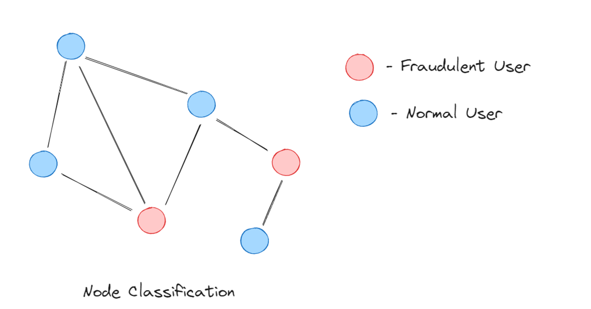
```


* **Aprendizaje No Supervisado (y Semi-supervisado)**
    * Ejemplos:
      * Detección de Comunidades: Un grafo → agrupar nodos
      * Análisis de redes sociales.

```{r echo=FALSE, fig.align='center'}
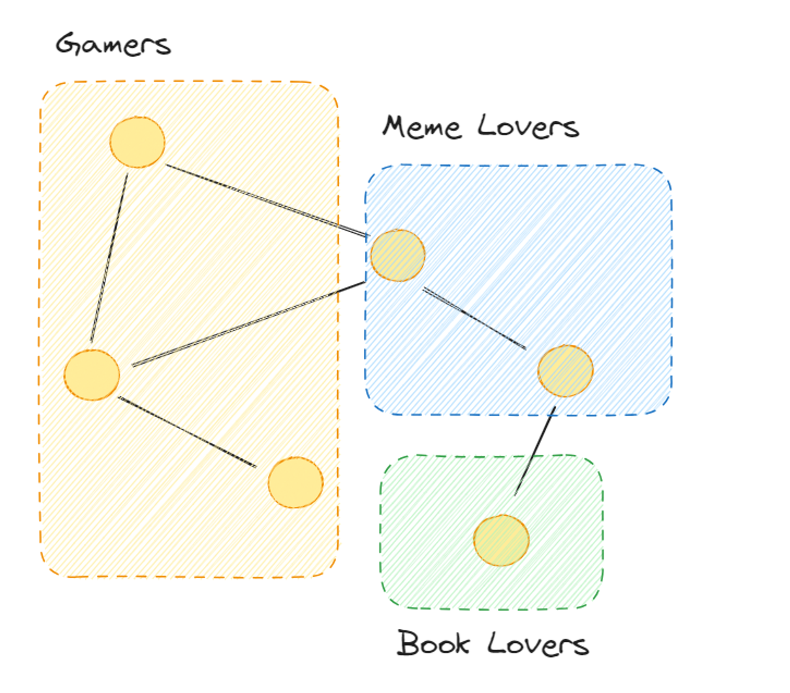
```


  * *Link prediction (o Vínculos): Un grafo → ¿posible nueva arista?*
    * Ejemplos: Sistemas de recomendación. Cabe mencionar que Uber usa modelos
    de este este estilo para hacer recomendaciones de comida https://www.uber.com/en-MX/blog/uber-eats-graph-learning/

```{r echo=FALSE, fig.align='center'}
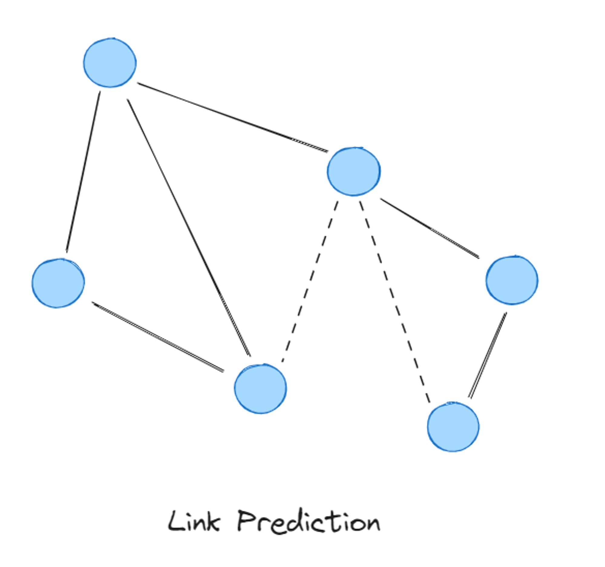
```

* **Otros tareas:**
  * Predicción (de nodo, de arista) en grafos dinámicos (simulación de sistemas físicos),
  * Generación de gráficas (diseño de fármacos)
  * Predicción de Tráfico: Google Maps hace estimaciones de condiciones de tráfico empleando Graph Nuera Networks https://deepmind.google/blog/traffic-prediction-with-advanced-graph-neural-networks/
  
```{r echo=FALSE, fig.align='center'}
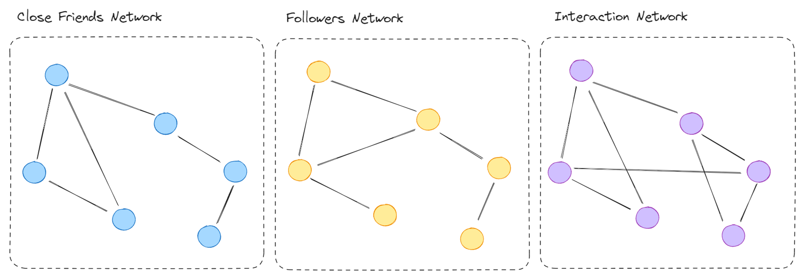
```

## ¿Existe un Teorema de Aproximación Univeral (TAU) para GNN's?

* Muchas pruebas del existentes del TAU para GNN son extensiones de del Teorema de Stone-Weierstrass,

* Un tema a resolver en problema a resolver es si dos gráficas son isomórficas.
  * Weisfeiler y Leman idearon una heurística que trata de determinar si dos
  gráficas son isomórficas entre si.
  * Los resultados algoritmos son invariantes ante permutaciones de etiquetado
  de las gráficas
  * En la práctica, es muy dificil encontrar gráficas isomórficas entre si.
  
* Algunos resultados prueban la universalidad bajo ciertas condiciones:
  *  Maron et al. On the Universality of Invariant Networks (2019)
  *"G-invariant networks are universal if high-order tensors are allowed (..)"*
  * Universal Invariant and Equivariant Graph Neural Network (2019) *"GNNs are universal approximators in probability for node classification & regression tasks, as they can approximate any measurable function that satisfies
  the 1–WL equivalence on nodes"*

## Enfoques de aprendizaje transductivo e inductivo

**Aprendizaje Transductivo:** En este paradigma, el modelo se entrena
considerando todo el grafo disponible, es decir, con todos los nodos y sus
relaciones (aristas) presentes durante la fase de entrenamiento, incluso aquellos
cuya informacion no se utiliza directamente para el cálculo de la función de pérdida.

**Nota:** Bajo dicho enfoque, un modelo aprende representaciones
(embeddings) dependientes de la estructura completa del grafo, por lo que **no
puede generalizar a nodos o subgrafos no observados durante el entrenamiento**.

**Aprendizaje Inductivo:** reservan conjuntos de datos de entrenamiento y prueba
separados. El proceso de aprendizaje ingesta los datos de entrenamiento y, a
continuación, el modelo aprendido se prueba utilizando los datos de prueba, que
no ha observado antes en ninguna capacidad.

```{r echo=FALSE, fig.align='center'}
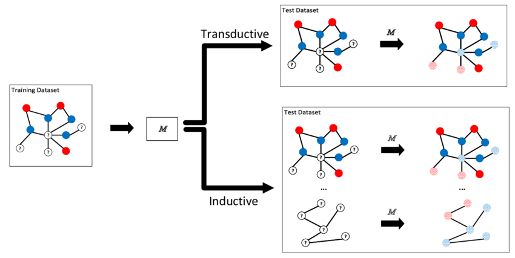
```


<!--chapter:end:21-Graphs_Introduction.Rmd-->

---
output:
  html_document: default
  pdf_document: default
---
<!-- ::: watermark -->
<!--  -->
<!-- ::: -->

# Graph Neural Network
## PyTorch Geometric y Graph Neural Networks

Como hemos visto, las Graph Neural Network son una combinación de redes
neuronales con datos no estructurados en forma de gráficas. Este 
proceso es interesante, pues en el proceso de aprendizaje los pesos
incorporan la estructura subyacente de las gráficas para
enriquecer las predicciones.

Como hemos comentado previamente, [PyTorch Geometric](https://pytorch-geometric.readthedocs.io/en/2.7.0/index.html)
(PyG) es una libreria de Python que está escrita basándose en el framework.

En PyG los objetos base para representar gráficas son de tipo
 `torch_geometric.data.Data`, que contienen los siguientes atributos por defecto:

* `data.x`: Matriz de características de los nodos con forma `[num_nodes, num_node_features]`.
* `data.edge_index`: En una representación de las aristas del grafo empleando el formato **Coordinate Format (COO)** 
(https://docs.pytorch.org/docs/stable/sparse.html#sparse-coo-docs) con forma `[2, num_edges]` y tipo `torch.long`.
* `data.edge_attr`: Matriz de features numéricas de las nodos con forma `[num_edges, num_edge_features]`.
* `data.y`: Objetivo contra el cual entrenar (puede tener una forma arbitraria); por ejemplo, objetivos a nivel de nodo con forma `[num_nodes, *]` o objetivos a nivel de grafo con forma `[1, *]`.
* `data.pos`: Matriz de posición de los nodos con forma [num_nodes, num_dimensions].

Cabe destacar que estos obejtos son no obligatorios.  para adaptarse a las distintas
tareas de aprendizaje de GNN's.

Para ejemplificar lo anterior veremos con se construye un GNN usando PyG. Primero definiremos
la matriz de adyancencias y la convertiremos en formato *COO*. Vamos a visualizarla con NetworkX.

```{python}
import networkx as nx
import numpy as np
import matplotlib.pyplot as plt

# Adjacency Matrix from Numpy
A = np.array([
    [0, 1, 1, 0],
    [1, 0, 1, 1],
    [1, 1, 0, 0],
    [0, 1, 0, 0]
])

# 2. Create the Graph. The nodes will be labeled 0, 1, 2, 3
G = nx.from_numpy_array(A)

# 3. Visualize the graph
pos = nx.spring_layout(G)
nx.draw(
    G,
    pos, 
    with_labels=True,
    node_color='skyblue',
    node_size=700,
    edge_color='k',
    linewidths=1,
    font_size=15
    )
plt.title("Graph from Adjacency Matrix (Undirected)")
plt.show()
```

Ahora convertimos la matriz de adyacencias a formato de coordenadas:

```{python}
import torch
from torch_geometric.utils import (dense_to_sparse, to_dense_adj)
A_np = np.array([
    [0, 1, 1, 0],
    [1, 0, 1, 1],
    [1, 1, 0, 0],
    [0, 1, 0, 0]
])

# Convertimos a Tensor de PyTorch (necesario para PyG)
A = torch.from_numpy(A_np)

print("="*40)
print("Adyacencias en formato COO")
# dense_to_sparse devuelve (edge_index, edge_attr)
edge_index, _ = dense_to_sparse(A)
print(edge_index)

print("="*40)
print("Reconstruimos la matriz densa de adyacencias")
dense_adj = to_dense_adj(edge_index)
print(dense_adj)
```


Ahora estamos en condiciones de definir el objeto de PyG que representa a las gráfica,
asignaremos numeros dummy a las features:

```{python}
from torch_geometric.data import Data

x = torch.tensor(np.random.rand(4, 5), dtype=torch.float)

data = Data(x=x, edge_index=edge_index)

print("="*40)
print("Features numericas de los nodos")
print(data.x)

print("="*40)
print("Informacion de adyacencias")
print(data.edge_index)
```

Finalmente a la hora de predecir, los modelos de Pytorch reciben los datos de las 
features numericas de cada nodo, así como el indice de las aristas que le corresponde

```
model(data.x, data.edge_index)
```

## Graph Convolutional Networks (GNN)

Para entender las GCN, primero debemos mirar hacia las CNN (Convolutional Neural
Networks) tradicionales. Las CNN son herramientas imágenes, pero las
imágenes son, en esencia, grafos muy ordenados como una rejilla perfecta de píxeles.

```{r echo=FALSE, fig.align='center'}
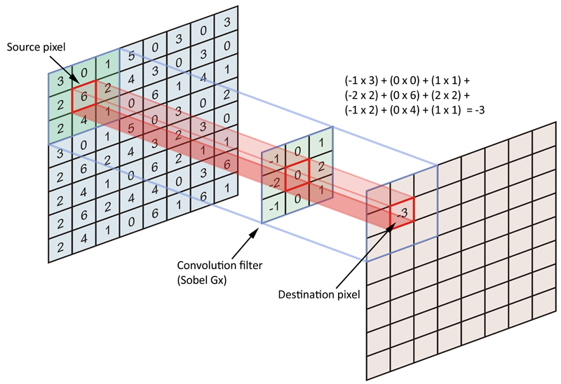
```

El problema surge cuando los datos son no euclidianos. Por ejemplo, en una red
social un usuario puede tener 5 amigos, otro 500. No hay un orden fijo y no
existe precisamente una dirección de "arriba" o "abajo" clara como en una foto.

De hecho, en una red social la estructura de conexiones es irregular y dinámica.

Esto motiva la necesidad tener modelos que extraigan características e 
información de los nodos (quienes son los usuarios) y de la estructura local 
(quiénes son sus amigos y cómo se relacionan).

## ¿Cómo funcionan?

Dichas redes fueron introducidas por Thomas N. Kipf y Max Welling (ver
https://openreview.net/pdf?id=SJU4ayYgl). La idea central de una convolución en
grafos es el *Message Passing*, es decir, que la estructura de una gráfica
permite que los nodos compartan la información de sus features junto con sus
vecinos en la red y ponderandolo por los pesos que la red aprende en su proceso
de entrenamiento.

Esto generaliza en algún sentido la acción de las redes convolucionales que procesan
imagenes, pero en vez de deslizar una ventana cuadrada (filtro) sobre píxeles, 
los nodos "interrogan" a sus vecinos.

```{r echo=FALSE, fig.align='center'}
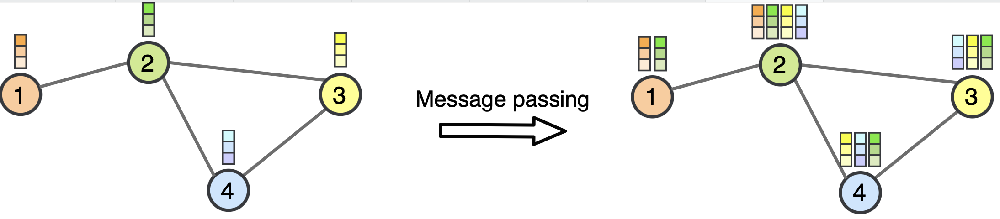
```


El proceso se resume en tres pasos clave que ocurren en cada capa: 1) **Agregación:** Cada nodo recolecta las características (vectores de datos) de sus vecinos inmediatos. Dado que las gráficas pueden ser etiquetadas de forma distinta, es de particular interés que las tranformaciones de agregación sean *invariantes bajo permutaciones*, 2) **Actualización:** El nodo combina esa información vecina con su propia información actual, 3) **Transformación:** Se aplica una función matemática (normalmente una matriz de pesos aprendible y una función de activación como ReLU) para generar una nueva representación del nodo.

Para mayor referencia, presentamos una expresion matematica de como se lleva
a cabo éste proceso en tales redes:

\begin{equation}
h_i^{(l+1)} = \sigma \left( \sum_{j \in \mathcal{N}(i) \cup \{i\}} \frac{1}{c_{ij}} h_j^{(l)} W^{(l)} \right)
\end{equation}

* $\mathcal{N}(i) \cup \{i\}$: Representa la vecindad del nodo $i$ incluyendo al
propio nodo (esto se conoce como añadir \textit{self-loops} para no olvidar la información propia).
* $h_j^{(l)}$: El estado del nodo vecino $j$ en la capa anterior.
* $W^{(l)}$: Una matriz de pesos compartida que la red aprende durante el entrenamiento.
* $c_{ij}$: Un factor de normalización (típicamente $\sqrt{d_i d_j}$) que evita
que los nodos con muchos vecinos tengan valores excesivamente altos, estabilizando el proceso de entrenamiento.
* $\sigma$: Una función de activación no lineal (como $\text{ReLU}$ o $\text{Sigmoid}$).
* $h_i^{(l+1)}$: Es el nuevo vector de características (\textit{embedding}) del nodo $i$ tras la convolución.

**Nota:** En el capítulo previo, el ejemplo con el que se introdujo a las
GNN's, la matriz de adyacencias no se normalizó.


Alternativamente, la red se puede presentar en forma matricial:

\begin{equation}
H^{(l+1)} = \sigma \left( \tilde{D}^{-\frac{1}{2}} \tilde{A} \tilde{D}^{-\frac{1}{2}} H^{(l)} W^{(l)} \right)
\end{equation}

* $H^{(l)} \in \mathbb{R}^{N \times F}$: Matriz de activaciones en la capa $l$.
* $\tilde{A} = A + I_N$: Matriz de adyacencia con auto-bucles (self-loops).
* $\tilde{D}_{ii} = \sum_j \tilde{A}_{ij}$: Matriz diagonal de grados de $\tilde{A}$.
* $W^{(l)} \in \mathbb{R}^{F \times F'}$: Matriz de pesos entrenables para la capa $l$.
* $\sigma(\cdot)$: Función de activación no lineal (e.g., ReLU).

La siguiente es una representación de una GNN con capaz convolucionales:

```{r echo=FALSE, fig.align='center', out.width="120%"}
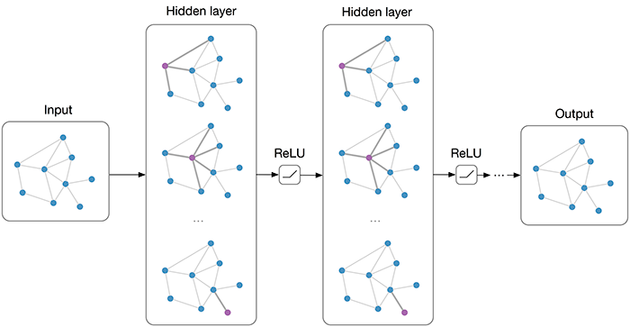
```


La representación matricial nos ayuda a tener una intución de cómo red conjunta
en el problema a difernetes ejes; por un lado  involucra un componente estrutural
al basarse directamente en los nodos y compartes informacion con su vecindad. En
segund termino a través de dicha herramienta los nodos comparten información
resumida de todos los nodos que están a k pasos de distancia de él.

Adicionalmente, utilizan representaciones matriciales de la teoria de gráficas
clásica como la matriz de adyacencias, la diognal de grados o el Laplaciano del
Grafo para operar en el dominio de las frecuencias.

## Implementación en PyTorch Geometric

### Ejemplo: Predicción del volumen de tráfico en Wikipedia (Regresión)

El siguiente ejemplo muestra como emplear las GCN para predecir el volumen de tráfico
en algunos sitios Wikipedia, es decir es un problema de Regresión.

En este sentido, los datos se recopilaron de la Wikipedia en inglés (diciembre de 2018).
Tales se asocian a redes de páginas sobre temas específicos (camaleones, cocodrilos y ardillas) donde los nodos representan artículos y las aristas son enlaces mutuos entre ellos. 

El archivo .csv que se lee en el codigo  contiene los identificadores de los nodos
y el tráfico mensual promedio entre octubre de 2017 y noviembre de 2018 para cada página.

https://snap.stanford.edu/data/wikipedia-article-networks.html

```{python}
import torch
import numpy as np
import matplotlib.pyplot as plt
#import seaborn as sns
import pandas as pd
from torch_geometric.datasets import WikipediaNetwork
from torch_geometric.nn import GCNConv
import torch.nn.functional as F
import torch_geometric.transforms as T
from sklearn.metrics import mean_squared_error, mean_absolute_error

# Clase para dividir los nodos en train, test y validation
chameleon_transform = T.RandomNodeSplit(num_val=300, num_test=300)
```

Descargamos la data:


```{python}
dataset = WikipediaNetwork(
    root="./data/",
    name="chameleon",
    transform = chameleon_transform
)

data = dataset[0]
```

Ahora visualizemos el gráfico:

```{python}
import networkx as nx
from torch_geometric.utils import (
  to_dense_adj, to_networkx
)
import random

class GraphUtils:
    @staticmethod
    def create_adjacency_matrix(data):
        # Crea matriz de adyacencia
        adjacency = to_dense_adj(data.edge_index)[0]
        # Agrega una diagonal de unos (auto-referencia a nodos)
        adjacency = adjacency + torch.eye(len(adjacency))
        return adjacency

    @staticmethod
    def convert_to_networkx(graph, n_sample=None):
        g = to_networkx(graph, node_attrs=["x"])
        y = graph.y.numpy()
    
        if n_sample is not None:
            sampled_nodes  = random.sample(list(g.nodes), n_sample)
            g = g.subgraph(sampled_nodes)
            y = y[sampled_nodes]
    
        return g, y
    
    @staticmethod
    def plot_graph(g, y):
        plt.figure(figsize=(9, 7))
        nx.draw_spring(g, node_size=30, arrows=False, node_color=y)
        plt.show() 
```

Algunas estadisticas

```{python}
print()
print(data)
print('===========================================================================================================')

# Gather some statistics about the graph.
print(f'Number of nodes: {data.num_nodes}')
print(f'Number of edges: {data.num_edges}')
print(f'Average node degree: {data.num_edges / data.num_nodes:.2f}')
print(f'Number of training nodes: {data.train_mask.sum()}')
print(f'Training node label rate: {int(data.train_mask.sum()) / data.num_nodes:.2f}')
print(f'Has isolated nodes: {data.has_isolated_nodes()}')
print(f'Has self-loops: {data.has_self_loops()}')
print(f'Is undirected: {data.is_undirected()}')
```

La siguiente es una grafica de 1,000 nodos de Cora:

```{python}
g, y = GraphUtils.convert_to_networkx(data, n_sample=1000)
GraphUtils.plot_graph(g, y)  
```
Ahora leeremos los datos de trafico a los sitios:


```{python}
df = pd.read_csv('./data/wikipedia/chameleon/musae_chameleon_target.csv')
```

Este archivo contiene el tráfico, medido en cantidas de visitas, que representan
los nodos del conjunto (sitios web de Wikipedia).

```{python}
df.head()
```
Vamos a concentranos en predecir el logaritmo de las visitas:

```{python}
values = np.log10(df['target'])
df['target'] = values
```

Ahora definiremos una red basada en capas de GCN para predeir el tráfico a los
nodos:

```{python}
class GCNRegressor(torch.nn.Module):
    def __init__(self, dim_in, dim_h, dim_out):
        super().__init__()
        self.gcn1 = GCNConv(dim_in, dim_h * 4)
        self.gcn2 = GCNConv(dim_h * 4, dim_h * 2)
        self.gcn3 = GCNConv(dim_h * 2, dim_h)
        self.linear = torch.nn.Linear(dim_h, dim_out)

    def forward(self, x, edge_index):
        h = self.gcn1(x, edge_index)
        h = torch.relu(h)
        h = F.dropout(h, p=0.5, training=self.training)
        h = self.gcn2(h, edge_index)
        h = torch.relu(h)
        h = F.dropout(h, p=0.5, training=self.training)
        h = self.gcn3(h, edge_index)
        h = torch.relu(h)
        h = self.linear(h)
        return h

    def fit(self, data, epochs):
        optimizer = torch.optim.Adam(
            self.parameters(),
            lr=0.02,
            weight_decay=5e-4
            )

        self.train()

        for epoch in range(epochs + 1):
            optimizer.zero_grad()
            out = self(data.x, data.edge_index)
            loss = F.mse_loss(
                out.squeeze()[data.train_mask],
                data.y[data.train_mask].float()
                )
            loss.backward()
            optimizer.step()
            if epoch % 20 == 0:
                val_loss = F.mse_loss(
                    out.squeeze()[data.val_mask],
                    data.y[data.val_mask]
                    )
                print(f"Epoch {epoch:>3} | Train Loss: {loss:.5f} | Val Loss: {val_loss:.5f}")

    def test(self, data):
        self.eval()
        out = self(data.x, data.edge_index)
        return F.mse_loss(out.squeeze()[data.test_mask], data.y[data.test_mask].float())
```

Ahora instanciamos el modelo:

```{python}
gcn_regressor = GCNRegressor(dataset.num_features, dim_h=128, dim_out=1)
print(gcn_regressor)
```

```{python}
gcn_regressor.fit(data, epochs=200)
loss = gcn_regressor.test(data)
print(f'\nGCN test loss: {loss:.5f}\n')
```
Ahora veamos los resultados con distintas metricas en el conjunto de test:

```{python}
out = gcn_regressor(data.x, data.edge_index)
y_pred = out.squeeze()[data.test_mask].detach().numpy()
mse = mean_squared_error(data.y[data.test_mask], y_pred)
mae = mean_absolute_error(data.y[data.test_mask], y_pred)
print('=' * 43)
print("GNN for Regression")
print("Chameleon Dataset - Traffic Prediction")
print(f'MSE = {mse:.4f} | RMSE = {np.sqrt(mse):.4f} | MAE = {mae:.4f}')
print('=' * 43)
```


```{python}
def plot_true_vs_predicted(y_true, y_pred):
    # Convert to numpy if they are torch tensors
    if hasattr(y_true, "detach"):
        y_true = y_true.detach().cpu().numpy()
    if hasattr(y_pred, "detach"):
        y_pred = y_pred.detach().cpu().numpy()
    
    # Ensure arrays are flattened (1D)
    y_true = y_true.flatten()
    y_pred = y_pred.flatten()

    plt.figure(figsize=(8, 8))
    
    sns.scatterplot(x=y_true, y=y_pred, alpha=0.6)

    # Determine plot limits for the identity line
    min_val = min(np.min(y_true), np.min(y_pred))
    max_val = max(np.max(y_true), np.max(y_pred))

    # Add the identity line (y = x)
    plt.plot([min_val, max_val], [min_val, max_val], color='red', linestyle='--', label='Perfect Prediction')

    plt.title('True Values vs. Predicted Values', fontsize=16)
    plt.xlabel('True Values ($y$)', fontsize=14)
    plt.ylabel('Predicted Values ($\hat{y}$)', fontsize=14)
    plt.grid(True, linestyle=':', alpha=0.6)
    plt.legend()
    plt.show()

# Calling the function correctly
#plot_true_vs_predicted(data.y[data.test_mask], y_pred)
```


```{python}
def plot_residuals_distribution(y_true, y_pred):
    # 1. Convert to numpy and flatten
    if hasattr(y_true, "detach"):
        y_true = y_true.detach().cpu().numpy()
    if hasattr(y_pred, "detach"):
        y_pred = y_pred.detach().cpu().numpy()
    
    y_true = y_true.flatten()
    y_pred = y_pred.flatten()

    # 2. Calculate the residuals
    residuals = y_true - y_pred
    
    # 3. Calculate key statistics
    mean_residual = np.mean(residuals)
    std_residual = np.std(residuals)

    # 4. Initialize the plot
    plt.figure(figsize=(10, 6))
    
    # 5. Create the histogram and KDE plot
    sns.histplot(
        residuals, 
        bins=30, 
        kde=True, 
        color='skyblue', 
        edgecolor='black',
        line_kws={'linewidth': 3, 'color': 'darkblue', 'label': 'KDE Curve'}
    )
    
    # 6. Add a vertical line at the mean
    plt.axvline(
        x=mean_residual, 
        color='red', 
        linestyle='--', 
        linewidth=2, 
        label=f'Mean: {mean_residual:.4f}'
    )
    
    # 7. Add titles and labels
    plt.title('Distribution of Residuals (Errors)', fontsize=16)
    plt.xlabel('Residual ($y - \hat{y}$)', fontsize=14)
    plt.ylabel('Frequency', fontsize=14)
    
    # 8. Add text box for statistics
    stats_text = f'Mean: {mean_residual:.4f}\nStd Dev: {std_residual:.4f}'
    plt.text(
        0.95, 0.95, 
        stats_text, 
        transform=plt.gca().transAxes, 
        verticalalignment='top', 
        horizontalalignment='right',
        fontsize=12,
        bbox=dict(boxstyle="round,pad=0.5", facecolor='white', alpha=0.8)
    )
    
    plt.legend()
    plt.grid(True, linestyle=':', alpha=0.6, axis='y')
    plt.show()

#plot_residuals_distribution(data.y[data.test_mask], y_pred)
```

### Ejemplo: Clasificación de artículos de investigación por categoría

```{python}
from torch_geometric.datasets import Planetoid
from torch_geometric.transforms import NormalizeFeatures
```

```{python}
dataset = Planetoid(
    root='./data/',
    name='Cora',
    transform=NormalizeFeatures()
    )

print()
print(f'Dataset: {dataset}:')
print('======================')
print(f'Number of graphs: {len(dataset)}')
print(f'Number of features: {dataset.num_features}')
print(f'Number of classes: {dataset.num_classes}')

data = dataset[0]  # Get the first graph object.

print()
print(data)
print('===========================================================================================================')

# Gather some statistics about the graph.
print(f'Number of nodes: {data.num_nodes}')
print(f'Number of edges: {data.num_edges}')
print(f'Average node degree: {data.num_edges / data.num_nodes:.2f}')
print(f'Number of training nodes: {data.train_mask.sum()}')
print(f'Training node label rate: {int(data.train_mask.sum()) / data.num_nodes:.2f}')
print(f'Has isolated nodes: {data.has_isolated_nodes()}')
print(f'Has self-loops: {data.has_self_loops()}')
print(f'Is undirected: {data.is_undirected()}')
```

La arquitectura de la red es representada en la siguiente imagen:

```{r echo=FALSE, fig.align='center', out.width="120%"}
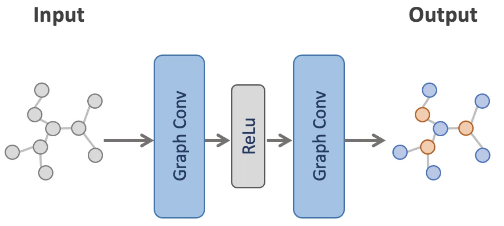
```

Esta es su implementación:


```{python}
import torch
import torch.nn.functional as F
from torch_geometric.nn import GCNConv

class GCNClassifier(torch.nn.Module):
    def __init__(self, dim_in, dim_h, dim_out):
        super().__init__()
        torch.manual_seed(1234567)

        self.gcn1 = GCNConv(dim_in, dim_h)
        self.gcn2 = GCNConv(dim_h, dim_out)

    def forward(self, x, edge_index):
        h = self.gcn1(x, edge_index)
        h = torch.relu(h)
        h = F.dropout(h, p=0.5, training=self.training)
        h = self.gcn2(h, edge_index)
        return h

    def fit(self, data, epochs, lr=0.01, weight_decay=5e-4):
        optimizer = torch.optim.Adam(
            self.parameters(),
            lr=lr,
            weight_decay=weight_decay
        )
        criterion = torch.nn.CrossEntropyLoss()

        self.train()

        for epoch in range(epochs + 1):
            optimizer.zero_grad()

            out = self(data.x, data.edge_index)
            loss = criterion(
                out[data.train_mask],
                data.y[data.train_mask]
            )

            loss.backward()
            optimizer.step()

            if epoch % 10 == 0:
                val_acc = self.validate(data)
                print(
                    f"Epoch {epoch:>3} | "
                    f"Train Loss: {loss:.4f} | "
                    f"Val Acc: {val_acc:.4f}"
                )

    @torch.no_grad()
    def validate(self, data):
        self.eval()
        out = self(data.x, data.edge_index)
        pred = out.argmax(dim=1)
        correct = pred[data.val_mask] == data.y[data.val_mask]
        return correct.sum().item() / int(data.val_mask.sum())

    @torch.no_grad()
    def test(self, data):
        self.eval()
        out = self(data.x, data.edge_index)
        pred = out.argmax(dim=1)
        correct = pred[data.test_mask] == data.y[data.test_mask]
        return correct.sum().item() / int(data.test_mask.sum())
```

```{python}
model = GCNClassifier(
    dim_in=dataset.num_features,
    dim_h=16,
    dim_out=dataset.num_classes
)

model.fit(data, epochs=200)

test_acc = model.test(data)
print(f"Test Accuracy: {test_acc:.4f}")

```


```{python}
import matplotlib.pyplot as plt
from sklearn.manifold import TSNE

def visualize(h, color):
    z = TSNE(n_components=2).fit_transform(h.detach().cpu().numpy())

    plt.figure(figsize=(10,10))
    plt.xticks([])
    plt.yticks([])

    plt.scatter(z[:, 0], z[:, 1], s=70, c=color, cmap="Set2")
    plt.show()
```


```{python}   
out = model(data.x, data.edge_index)
visualize(out, color=data.y)
```

## Graph Attention Network (GAT)

En las convoluciones tradicionales (GCN), la información de los vecinos se
agrega de forma estática. Normalmente, se usa un promedio o un factor basado
únicamente en el grado (cuántos amigos tienes), pero no en quiénes son esos
amigos o qué tan relevantes son para una tarea específica. 

La limitación: No todos los vecinos son igual de importantes.

Por ejemplo, en una red de citaciones de articulos académicdos sobre Deep Learning,
un artículo sobre "Deep Learning" puede citar 50 artículos, pero solo 3 son sus
bases teóricas fundamentales. Desortunadamente una red GCN trataría a los 50 por igual.

Las GAT introducen el **mecanismo de atención**, permitiendo que cada nodo decida
dinámicamente qué vecinos "escuchar" más y cuáles ignorar.

### ¿Cómo funcionan?

En líneas generales, la atención describe un promedio ponderado de múltiples
elementos, cuyos pesos se calculan dinámicamente a partir de una consulta de
entrada y las claves de los elementos.

Así como en otros entornos de Deeo Learning, este concepto se puede aplicar de
forma similar a los grafos; uno de ellos es la Red de Atención de Grafos (GAT, 
propuesta por el equipo de Petar Veličković en 2017 (https://arxiv.org/abs/1710.10903).

De forma similar a la GCN, la capa de atención de grafos crea un mensaje para
cada nodo mediante una matriz lineal de capas y pesos. Para la atención, 
utiliza el mensaje del propio nodo como consulta y los mensajes a promediar como
claves y valores (tenga en cuenta que esto también incluye el mensaje a sí mismo).

La función de puntuación se implementa como una MLP de una capa que asigna la consulta y la clave a un único valor

Entrando a mayor detalle, la idea clave es que el factor de normalización $c_ij$
(que en las GCN era fijo) se convierta en un coeficiente de atención aprendible $\alpha_ij$

De este modo, el mecanismo de atención se obtiene a partir de un proceso para
calcular la nueva representación de un nodo i se divide en tres pasos:

* **Transformación Lineal:** Se aplica una matriz de pesos W a todas las
características de los nodos para proyectarlos a una dimensión superior.

* **Cómputo de Coeficientes** ($e_{ij}$: Se calcula una "puntuación" de importancia 
entre el nodo i y su vecino j usando un mecanismo de atención (usualmente una
pequeña red neuronal de una sola capa).

\begin{equation}
e_{ij} = a\left( \mathbf{W} \vec{h}_i, \mathbf{W} \vec{h}_j \right)
\end{equation}

* **Normalización (Softmax)** Se aplica la función Softmax sobre todos los vecinos
para que la suma de las importancias sea igual a 1.

\begin{equation}
\alpha_{ij} = \text{softmax}_j(e_{ij}) = \frac{\exp(e_{ij})}{\sum_{k \in \mathcal{N}(i)} \exp(e_{ik})}
\end{equation}

Multi-Head Attention (Atención de múltiples cabezales)

Para estabilizar el aprendizaje, las GAT no usan solo un mecanismo de atención,
sino varios en paralelo (como en los Transformers). Cada "cabezal" puede aprender
a enfocarse en diferentes tipos de relaciones.

\begin{equation}
\vec{h}_i^{(l+1)} = \sigma \left( \sum_{j \in \mathcal{N}(i)} \alpha_{ij} \mathbf{W} \vec{h}_j^{(l)} \right)
\end{equation}

```{r echo=FALSE, fig.align='center', out.width="120%"}
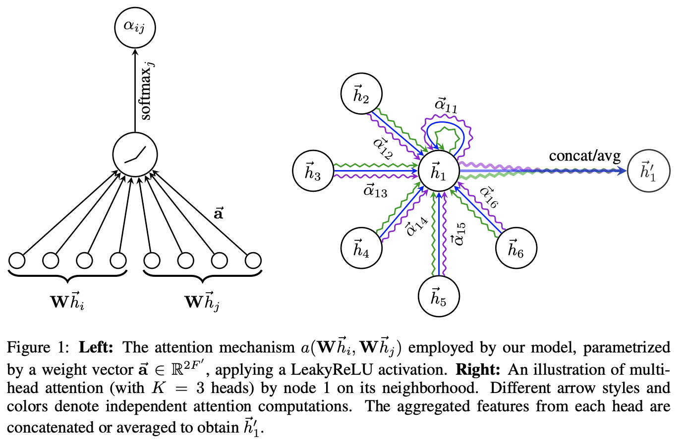
```

\begin{equation}
\alpha_{ij} = \frac{\exp\left(\text{LeakyReLU}\left(\mathbf{a}\left[\mathbf{W}h_i||\mathbf{W}h_j\right]\right)\right)}{\sum_{k\in\mathcal{N}_i} \exp\left(\text{LeakyReLU}\left(\mathbf{a}\left[\mathbf{W}h_i||\mathbf{W}h_k\right]\right)\right)}
\end{equation}

Enn resumen, los componentes de las GAT pueden esquematizarse como:

* $e_{ij}$: Es el coeficiente de atención (o puntuación) que indica la importancia de las características del nodo $j$ para el nodo $i$.
* $a(\cdot)$: Es un mecanismo de atención, generalmente implementado como una red neuronal de una sola capa (\textit{feed-forward}) que transforma la concatenación de los vectores de los nodos en un escalar.
* $\mathbf{W}$: Una matriz de pesos compartida que realiza una transformación lineal sobre las características de entrada de todos los nodos.
* $\alpha_{ij}$: Son los coeficientes de atención normalizados mediante la función \textit{softmax}, asegurando que la suma de las influencias de los vecinos de $i$ sea igual a 1.
* $\mathcal{N}(i)$: El conjunto de vecinos de primer orden del nodo $i$.
* $\vec{h}_i^{(l+1)}$: El nuevo vector de características generado para el nodo $i$, resultado de la suma ponderada de las características transformadas de su vecindad.
* $\exp(\cdot)$: La función exponencial, utilizada para calcular el peso relativo de cada conexión antes de la normalización.


## Implementación en PyTorch Geometric

### Ejemplo: Clasificación de artículos de investigación por categoría (Parte II)

Volveremos a trabajar con el conjunto de datos Cora, para predecir la categorìa
a la que pertnecen sus artìculos de investigacion. Como cambio, usaremos redes
GAT para revisar el cambio de performace en la predicción:

```{python}
import torch
import torch.nn.functional as F
from torch_geometric.nn import GATConv

class GATClassifier(torch.nn.Module):
    def __init__(self, dim_in, dim_h, dim_out, heads):
        super().__init__()
        torch.manual_seed(1234567)

        self.gat1 = GATConv(
            in_channels=dim_in,
            out_channels=dim_h,
            heads=heads,
            dropout=0.6
        )

        self.gat2 = GATConv(
            in_channels=dim_h * heads,
            out_channels=dim_out,
            heads=1,
            concat=False,
            dropout=0.6
        )

    def forward(self, x, edge_index):
        h = F.dropout(x, p=0.6, training=self.training)
        h = self.gat1(h, edge_index)
        h = F.elu(h)
        h = F.dropout(h, p=0.6, training=self.training)
        h = self.gat2(h, edge_index)
        return h

    def fit(self, data, epochs, lr=0.005, weight_decay=5e-4):
        optimizer = torch.optim.Adam(
            self.parameters(),
            lr=lr,
            weight_decay=weight_decay
        )
        criterion = torch.nn.CrossEntropyLoss()

        self.train()

        for epoch in range(epochs + 1):
            optimizer.zero_grad()

            out = self(data.x, data.edge_index)
            loss = criterion(
                out[data.train_mask],
                data.y[data.train_mask]
            )

            loss.backward()
            optimizer.step()

            if epoch % 10 == 0:
                val_acc = self.validate(data)
                test_acc = self.test(data)
                print(
                    f"Epoch {epoch:>3} | "
                    f"Train Loss: {loss:.4f} | "
                    f"Val Acc: {val_acc:.4f} | "
                    f"Test Acc: {test_acc:.4f}"
                )

    @torch.no_grad()
    def validate(self, data):
        self.eval()
        out = self(data.x, data.edge_index)
        pred = out.argmax(dim=1)
        correct = pred[data.val_mask] == data.y[data.val_mask]
        return correct.sum().item() / int(data.val_mask.sum())

    @torch.no_grad()
    def test(self, data):
        self.eval()
        out = self(data.x, data.edge_index)
        pred = out.argmax(dim=1)
        correct = pred[data.test_mask] == data.y[data.test_mask]
        return correct.sum().item() / int(data.test_mask.sum())

```

Ahora instanciamos el modelo:


```{python}
model = GATClassifier(
    dim_in=dataset.num_features,
    dim_h=6,
    dim_out=dataset.num_classes,
    heads=3
)

print(model)
```
Ahora entrenamos el modelo con capaz GAT:

```{python}
model.fit(data, epochs=50)
```
Ahora evaluamos al modelo:

```{python}
test_acc = model.test(data)
print(f"Final Test Accuracy: {test_acc:.4f}")
```


<!--chapter:end:22-Graph_Neural_Networks.Rmd-->

---
output:
  html_document: default
  pdf_document: default
---
<!-- ::: watermark -->
<!--  -->
<!-- ::: -->

# Embeddings y Graph Neural Network
## ¿Qué es un embedding?

En el aprendizaje automático tradicional, las categorías (como nombres de
ciudades, tipos de átomos o IDs de usuarios) se representaban mediante representaciones
numéricas como One-Hot Encoding.

Aunque de utilidad, en la práctica dicha soluciones padecen de algunos problemas:
i) **incapacidad semántica**: en el caso palabras, las representaciones de pareja
que tiene un significado cercano, sus encondings se pueden encontrar muy alejados
(e.g. El vector de "perro" [1,0,0] y el de "cachorro" [0,1,0] son ortogonales;
no tienen ninguna relación); ii) **explosión de memoria**:al tener muchos elementos,
cada vector puede tener un número grande dimensiones, pero que la mayoría sean de ceros (sparse).

Para dar solucion a este tema, se emplean los embeddings, los cuale son
representaciones densas de datos discretos. Es decir, para representar los puntos
consolidamos una transformacion de los datos hacia un espacio, que en 
lugar de crear un vector gigante de ceros y unos, representa a cada elemento
como un vector de números reales de tamaño fijo (por ejemplo, 128 o 300 dimensiones).

La idea esencial es proyectar los puntos en un espacio continuo de baja dimensión donde la
la similitud de los puntos (e.g semantica, geométrica, estructural) se conserve
geometricamente. Es decir puntos que son parecidos en el espacio original,
tengan una representacion cercana bajo dicha función.

En Deep Learning, los embeddding ajustando los pesos pesos de capaz de unaa red neuronal.
La red comienza con vectores aleatorios y a medida que la red intenta resolver 
una tarea (e.g. predecir la siguiente palabra, image o clasificar un nodo), se
ajustan la representación vectorial.

Al final, elementos que aparecen en contextos similares terminan "empujados"
hacia la misma zona en el espacio vectorial.

Para ejemplificarlo podemos construir embeddings para los elementos
del Dataset Iris.

```{python}
import torch
from torch import nn
from torch.utils.data import DataLoader, TensorDataset
import matplotlib.pyplot as plt
from sklearn.datasets import load_iris
from sklearn.decomposition import PCA

# Datos
iris = load_iris()
X = torch.tensor(iris.data, dtype=torch.float32)
y = torch.tensor(iris.target, dtype=torch.long)

dataset = TensorDataset(X, y)
loader = DataLoader(dataset, batch_size=32, shuffle=True)

# Modelo
class Classifier(nn.Module):
    def __init__(self, input_dim=4, emb_dim=8, num_classes=3):
        super().__init__()
        self.encoder = nn.Sequential(
            nn.Linear(input_dim, emb_dim),
            nn.ReLU()
        )
        self.classifier = nn.Linear(emb_dim, num_classes)

    def forward(self, x):
        z = self.encoder(x)
        return self.classifier(z), z

model = Classifier()
optimizer = torch.optim.Adam(model.parameters(), lr=0.01)
criterion = nn.CrossEntropyLoss()

# Entrenamiento breve
for epoch in range(100):
    for xb, yb in loader:
        optimizer.zero_grad()
        logits, _ = model(xb)
        loss = criterion(logits, yb)
        loss.backward()
        optimizer.step()
    if epoch % 10 == 0:
      print(f"Epoch {epoch:>3} | Loss: {loss:.5f}")

# Obtener embeddings
with torch.no_grad():
    embeddings = model.encoder(X).numpy()

print("Embeddings: ")
embeddings[:2]
```

Ahora usaremos PCA para obtener la representación de dichos puntos:

```{python}
# PCA a 2 dimensiones
pca = PCA(n_components=2)
emb_2d = pca.fit_transform(embeddings)

# Plot (una sola figura)
plt.figure()
scatter = plt.scatter(
    emb_2d[:, 0],
    emb_2d[:, 1],
    c=y
)
plt.xlabel("PCA 1")
plt.ylabel("PCA 2")
plt.title("Embedding del dataset Iris (PyTorch + PCA)")

# Leyenda correcta
handles, _ = scatter.legend_elements()
plt.legend(handles, iris.target_names, title="Clase")

plt.show()

```
Matematicamente, si tenemos V elementos y queremos vectores de tamaño d,
un embedding es una matriz $E$ que transforma los datos de entrada de la siguiente
forma:

\begin{equation}
E \in \mathbb{R}^{V \times d}
\end{equation}

En donde
* $E$: Matriz de parámetros aprendibles (Embedding Layer).
* $V$: Tamaño del vocabulario o número total de entidades.
* $d$: Dimensionalidad del espacio latente (hiperparámetro).
* $e_1 \cdot e_2$: Producto punto, que mide la dirección común de los vectores.
* $\|e\|$: Norma euclidiana que normaliza el vector para ignorar su magnitud y 
enfocarse en la orientación.

Para obtener el vector $e_i$ de un elemento con índice $i$, multiplicamos un 
vector $\textit{one-hot} $x_i$ por la matriz:

\begin{equation}
e_i = x_i^\top E
\end{equation}

Un forma común de saber qué tan parecidos son dos embeddings es mediante el
coseno del ángulo entre ellos:

\begin{equation}
\text{sim}(e_1, e_2) = \frac{e_1 \cdot e_2}{\|e_1\| \|e_2\|}
\end{equation}

Los embedding han tenido mucha adopcion en diversas aplicaciones de Deep Learning:

* NLP: Word2Vec, GloVe y los embeddings de Transformers (BERT/GPT) para entender el lenguaje.
* Sistemas de Recomendación: Representar usuarios y productos en el mismo espacio para medir su afinidad.
* Visión por Computador: Face Embeddings para reconocimiento facial (si dos fotos generan vectores cercanos, son la misma persona).
* GNNs: Todos los modelos previos (GCN, GAT, SAGE) generan, en última instancia, Node Embeddings.

## Word2Vec

WIP


## Node2Vec

Antes de que las GNN fueran el estándar, el reto era: ¿Cómo convertimos un nodo
de un grafo en un vector de números (embedding) que una red neuronal tradicional
pueda entender?

```{r echo=FALSE, fig.align='center', out.width="120%"}
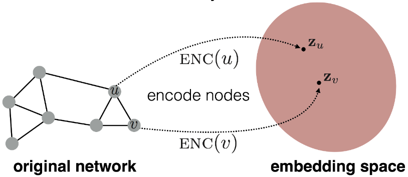
```

Como hemos mencionado previamente, en el área de procesamiento de lenguaje natural
se propuso al modelo *word2vec* en donde se construye un embedding de palabras
usando la idea que las palabras que aparecen en contextos similares deben
induceir vectores similares. Node2vec se construye con ideas similares: para
obtener nodos en contexto similares se ejecutan caminatas aleatorias sobre
la gráfica  (random walks), de forma que podemos tratar un grafo como un lenguaje.

Node2vec permite dicho el algoritmo explore el grafo de forma más flexible,
capturando tanto comunidades locales como roles estructurales. Dicha exploración
se basa en generar "paseos aleatorios" con cierto nivel de sesgo (biased random
walk) desde cada nodo y luego alimentar esos paseos a un modelo Skip-gram (el 
mismo de word2vec).

Las caminatas aleatorias en este enfoque tiene dos hiper-parámetros para explorar
la gráfica mediante caminan que obtienen nodos usando trayectorias que usan
información de los nodos visitados:

* **Parámetro de Retorno ($p$):** Controla la probabilidad de regresar inmediatamente al
nodo anterior. Un $p$ bajo favorece la exploración local (BFS - Breadth-First Search),
capturando la similitud estructural (nodos que actúan como "hubs").

* **Parámetro de "In-out" ($q$):** Controla la probabilidad de alejarse hacia nodos no visitados.
Un $q$ bajo favorece la exploración profunda (DFS - Depth-First Search), capturando comunidades o macro-estructuras.

Para calcular la representación $z_v$ de los nodos $v$ de la grafíca, se ajusta
la función de perdida con elobjetivo es maximizar la probabilidad de co-ocurrencia
de nodos en una vecindad:

\begin{equation}
\mathcal{L} = \sum_{w \in \mathcal{W}} - \log \left(\sigma(\mathbf{z}_v^{\top} \mathbf{z}_w) \right) + \sum_{w \sim \mathcal{V} \setminus \mathcal{W}} - \log \left( 1 - \sigma(\mathbf{z}_v^{\top} \mathbf{z}_w) \right),
\end{equation}

El factor de la derecha es es el negativa sampling, que induce una penalización
en la representación del embedding, es decir, si dos nodos no están relacionados
en las vecindades exploradas de las caminatas aleatorias, entonces los queremos
alejados.

Cabe destacar que *Node2Vec* es una representacion de tipo *Shallow Embedding*,
las cuales son representaciones vectoriales de baja dimensión mediante una tabla
de búsqueda , de modo que se maximiza la probabilidad de preservar las vecindades; 

A su vez, tales representaciones son utiles como entrada para una tarea posterior
determinada; por ejemplo, en tareas a nivel de nodo, pueden utilizarse directamente
como entrada para un clasificador final. Para tareas a nivel de aristas, las
representaciones a nivel de borde se pueden obtener mediante el promedio o el
producto de Hadamard.

Sin embargo, cuentan con ciertas limitaciones: i) no incorporan información de las
características asociada a nodos y/o aristas, ii) son representaciones transductivas
(es decir, no pueden aplicarse elementos no vistos en el entrenamiento, ya que
los parámetros aprendibles están fijados a los nodos de un grafo en particular. 

### Ejemplo: Aplicando el modelo de SkipGrams a Random Walks

En esta sección se presenta código que muestra una version simplificada de los elementos
de node2vec para la gráfica *Karate Club*, en primer término se calculan una secuencia de nodos obtenidos de
caminatas aleatorias que posteriormente se emplean para crear un encaje.

Dicho encaje se realiza con la clase *Word2Vec* de la libreria *gensim*.

Empleando la siguiente clase se simulan caminatas aleatorias a partir
de la estructura de la gráfica.

```{python}
import random
import numpy as np
import matplotlib.pyplot as plt
import networkx as nx
from sklearn.decomposition import PCA
from gensim.models import KeyedVectors, Word2Vec

class Graph():
    def __init__(self, nx_G, is_directed, p, q):
        self.G = nx_G
        self.is_directed = is_directed
        self.p = p
        self.q = q

    def node2vec_walk(self, walk_length, start_node):
        """
        Simulate a random walk starting from start node.
        """
        G = self.G
        alias_nodes = self.alias_nodes
        alias_edges = self.alias_edges

        walk = [start_node]

        while len(walk) < walk_length:
            cur = walk[-1]
            cur_nbrs = sorted(G.neighbors(cur))
            if len(cur_nbrs) > 0:
                if len(walk) == 1:
                    walk.append(
                        cur_nbrs[
                            alias_draw(
                                alias_nodes[cur][0],
                                alias_nodes[cur][1]
                            )
                        ]
                    )
                else:
                    prev = walk[-2]
                    next_node = cur_nbrs[
                        alias_draw(
                            alias_edges[(prev, cur)][0],
                            alias_edges[(prev, cur)][1]
                        )
                    ]
                    walk.append(next_node)
            else:
                break

        return walk

    def simulate_walks(self, num_walks, walk_length):
        """
        Repeatedly simulate random walks from each node.
        """
        G = self.G
        walks = []
        nodes = list(G.nodes())
        print('Walk iteration:')
        for walk_iter in range(num_walks):
            print(f'{walk_iter + 1} / {num_walks}')
            random.shuffle(nodes)
            for node in nodes:
                walks.append(
                    self.node2vec_walk(
                        walk_length=walk_length,
                        start_node=node
                    )
                )
        return walks

    def get_alias_edge(self, src, dst):
        """
        Get the alias edge setup lists for a given edge.
        """
        G = self.G
        p = self.p
        q = self.q

        unnormalized_probs = []
        for dst_nbr in sorted(G.neighbors(dst)):
            weight = G[dst][dst_nbr].get('weight', 1.0)

            if dst_nbr == src:
                unnormalized_probs.append(weight / p)
            elif G.has_edge(dst_nbr, src):
                unnormalized_probs.append(weight)
            else:
                unnormalized_probs.append(weight / q)

        norm_const = sum(unnormalized_probs)
        normalized_probs = [
            float(u_prob) / norm_const for u_prob in unnormalized_probs
        ]

        return alias_setup(normalized_probs)

    def preprocess_transition_probs(self):
        """
        Preprocessing of transition probabilities for guiding the random walks.
        """
        G = self.G
        is_directed = self.is_directed

        alias_nodes = {}
        for node in G.nodes():
            unnormalized_probs = [
                G[node][nbr].get('weight', 1.0)
                for nbr in sorted(G.neighbors(node))
            ]
            norm_const = sum(unnormalized_probs)
            normalized_probs = [
                float(u_prob) / norm_const for u_prob in unnormalized_probs
            ]
            alias_nodes[node] = alias_setup(normalized_probs)

        alias_edges = {}

        if is_directed:
            for edge in G.edges():
                alias_edges[edge] = self.get_alias_edge(edge[0], edge[1])
        else:
            for edge in G.edges():
                alias_edges[edge] = self.get_alias_edge(edge[0], edge[1])
                alias_edges[(edge[1], edge[0])] = self.get_alias_edge(edge[1], edge[0])

        self.alias_nodes = alias_nodes
        self.alias_edges = alias_edges


def alias_setup(probs):
    """
    Compute utility lists for non-uniform sampling from discrete distributions.
    """
    K = len(probs)
    q = np.zeros(K)
    J = np.zeros(K, dtype=int)

    smaller = []
    larger = []

    for kk, prob in enumerate(probs):
        q[kk] = K * prob
        if q[kk] < 1.0:
            smaller.append(kk)
        else:
            larger.append(kk)

    while smaller and larger:
        small = smaller.pop()
        large = larger.pop()

        J[small] = large
        q[large] = q[large] + q[small] - 1.0

        if q[large] < 1.0:
            smaller.append(large)
        else:
            larger.append(large)

    return J, q


def alias_draw(J, q):
    """
    Draw sample from a non-uniform discrete distribution using alias sampling.
    """
    K = len(J)
    kk = int(np.floor(np.random.rand() * K))

    if np.random.rand() < q[kk]:
        return kk
    else:
        return J[kk]
```
La siguiente función se en

```{python}
def learn_embeddings(
    walks,
    vector_size: int = 128,
    window: int = 10,
    workers: int = 8,
    epochs: int = 1
):
    """
    Learn embeddings by optimizing the Skip-gram objective using SGD.
    """

    # gensim requires lists, not iterators
    walks = [list(map(str, walk)) for walk in walks]

    model = Word2Vec(
        sentences=walks,
        vector_size=vector_size,
        window=window,
        min_count=0,
        sg=1,              # skip-gram
        workers=workers,
        epochs=epochs
    )

    # save in word2vec format (node2vec-compatible)
    model.wv.save_word2vec_format("embeddings.emb")

    return model

```

Establecidao lo anterior cargamos los datos que representan
a la gráfica del *Karate Club*:

```{python}
import networkx as nx

nx_G = nx.karate_club_graph()
G = Graph(nx_G, is_directed=False, p=0.8, q=0.1)

G.preprocess_transition_probs()
walks = G.simulate_walks(num_walks=20, walk_length=10)

```

Ahora podemos revisar como se ven las caminatas:

```{python}
walks[1]
```

A partir de este punto calculamos los encajes de los nodos

```{python}
model = learn_embeddings(walks,epochs=100)
```

**Nota:** Este encaje solo usa las caminatas, no involucra features
numéricas


Ahora mostraremos como se ve el encaje recién generado usado PCA:

```{python}
def load_embeddings(path="embeddings.emb"):
    kv = KeyedVectors.load_word2vec_format(path)
    nodes = kv.index_to_key
    X = np.array([kv[node] for node in nodes])
    return nodes, X

def plot_embeddings_pca(nodes, X, graph):
    pca = PCA(n_components=2, random_state=42)
    X_2d = pca.fit_transform(X)

    club_to_color = {
        "Mr. Hi": "tab:blue",
        "Officer": "tab:orange"
    }

    colors = [
        club_to_color[graph.nodes[int(node)]["club"]]
        for node in nodes
    ]

    plt.figure(figsize=(12, 10))
    plt.scatter(X_2d[:, 0], X_2d[:, 1], c=colors, s=80, alpha=0.85)

    for i, node in enumerate(nodes):
        plt.text(
            X_2d[i, 0] + 0.01,
            X_2d[i, 1] + 0.01,
            node,
            fontsize=9
        )

    for club, color in club_to_color.items():
        plt.scatter([], [], c=color, label=club)

    plt.legend(title="Karate Club Group")
    plt.title("Node2Vec Embeddings (PCA)")
    plt.xlabel("PC1")
    plt.ylabel("PC2")
    plt.grid(alpha=0.3)
    plt.tight_layout()
    plt.show()


# usage
G = nx.karate_club_graph()
nodes, X = load_embeddings("embeddings.emb")
plot_embeddings_pca(nodes, X, G)
```

A modo de comparativa, presentamos el gráfico del *Karate Club*.
Se aprecia la cercania de los nodos y el encaje de arriba.

```{python}
import networkx as nx
import matplotlib.pyplot as plt

# graph
G = nx.karate_club_graph()

# color by club
club_to_color = {
    "Mr. Hi": "tab:blue",
    "Officer": "tab:orange"
}

node_colors = [
    club_to_color[G.nodes[n]["club"]]
    for n in G.nodes()
]

# layout
pos = nx.spring_layout(G, seed=42)

# plot
plt.figure(figsize=(12, 10))
nx.draw_networkx_nodes(
    G,
    pos,
    node_color=node_colors,
    node_size=600,
    alpha=0.9
)
nx.draw_networkx_edges(G, pos, alpha=0.4)
nx.draw_networkx_labels(G, pos, font_size=9)
```

## SageConv

La mayoría de los modelos anteriores (como GCN o node2vec) asumen que el gráfica
es estático y que todos los nodos están presentes durante el entrenamiento. Esto
se conoce como aprendizaje transductivo.

Sin embargo, en aplicaciones prácticas, como en redes de sociales, la gráfica 
cambia dinámicamente en periodos muy cortos. Por ejemplo, al añadir un usuario
nuevo, los modelos transductivos no podrían llevar a cabo predicciones; tendríamos
que reentrenar todo el modelo desde cero para generar un embedding para ese nuevo nodo.

Este es un problema que es atacado por el modelo **GraphSAGE (SAGE viene de SAmple and aggreGatE)**
el cual tiene un  diseñado inductivo, en cual tiene un mecanismo de agregación 
de información que le permite generar representaciones para nodos que nunca
vio durante el entrenamiento.

Este modelo fue introducido en 2018 por un (equipo de Standford)[https://arxiv.org/pdf/1706.02216]. 
A diferencia de las GCN que utilizan la matriz de adyacencia completa, tal
opera mediante un proceso de muestreo de vecindad.

```{r echo=FALSE, fig.align='center'}
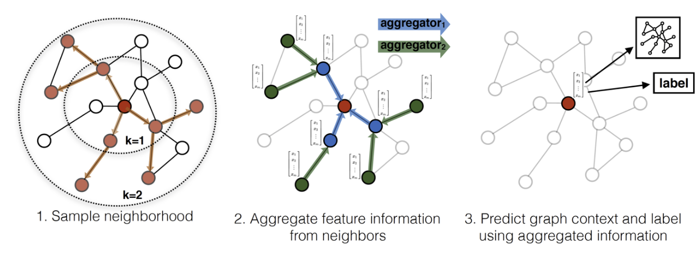
```

Los pasos del modelo se resumen a continuación:

* **A) Sampling:** En un primer paso, para cada nodo se genera una caminata aleatoria de nodos, con una longitud pre-fijada. 

* **B) Aggregation:**  Dichas caminatas, sirven para "resumir" la información de nodos que co-ocurren en la estructura de vecindades que exploraron en la gráfica. Dicha información se resumen mediante funciones de agregregacion $AGGREGATE_k$, como se presenta a continuación:

\begin{equation}
h_{\mathcal{N}(i)}^{(k)} = \text{AGGREGATE}_k \left( \{ h_j^{(k-1)}, \forall j \in \mathcal{N}(i) \} \right)
\end{equation}

En tal expresión, los términos involucrados se refieren a:

* $h_{\mathcal{N}(i)}^{(k)}$: Representación agregada de los vecinos del nodo $i$ en la capa $k$,
*$\text{AGGREGATE}_k$: Función de agregación de información de los nodos,
* $\text{concat}(\cdot, \cdot)$: Operación de concatenación que preserva la identidad del nodo central diferenciándola de su contexto,
* $\mathbf{W}^{(k)}$: Matriz de pesos aprendible de la capa $k$,
* $\sigma$: Función de activación no lineal.

Cabe destacar que en el artículo original se exploran las siguientes opciones de agregación:

* *Mean aggregator*: Promedio de los vectores,
* *LSTM aggregator*: Estimación con una red LSTM,
* *Pooling aggregator*: Aplica una red densa seguida de un operador de máximo ($Max( \cdot, 0)$).

* **C) Combinación y actualización:** Posteriormente, se concatena la información agregada con la representación actual del nodo y se proyecta:

\begin{equation}
h_i^{(k)} = \sigma \left( \mathbf{W}^{(k)} \cdot \text{concat}(h_i^{(k-1)}, h_{\mathcal{N}(i)}^{(k)}) \right)
\end{equation}

Es dable mencionar que, este modelo al incorporarse un nuevo nodo, las nuevas estimaciones se hacen
considerendo la agregación de información de los nodos vecinos. Es decir, elimina la dependencia de las predicciones usando la gráfica completa, por estrategia de agregación de los nodos en una vecindad, donde el proceso de cómo viaja la información queda representado por las funciones de agregación y el concatenado de la misma.


Para mejor referencia, se presenta la descripción original del algoritmo en el paper original 

```{r echo=FALSE, fig.align='center'}
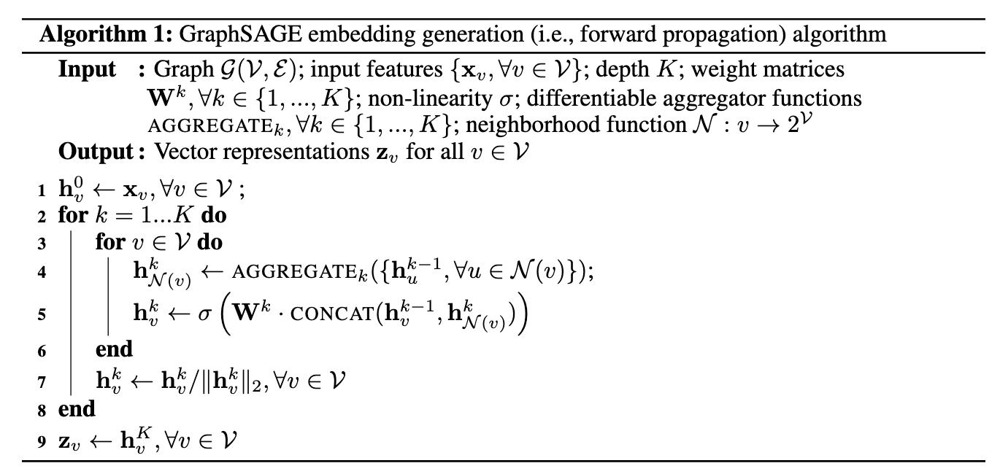
```


### Ejemplo: Clasificación de artículos de investigación por categoría (Parte II)

La arquitecura del ejemplo es la siguiente, donde usaremos un encaje denso
usando una Graph Convolution Network:

```{r echo=FALSE, fig.align='center', out.width="120%"}
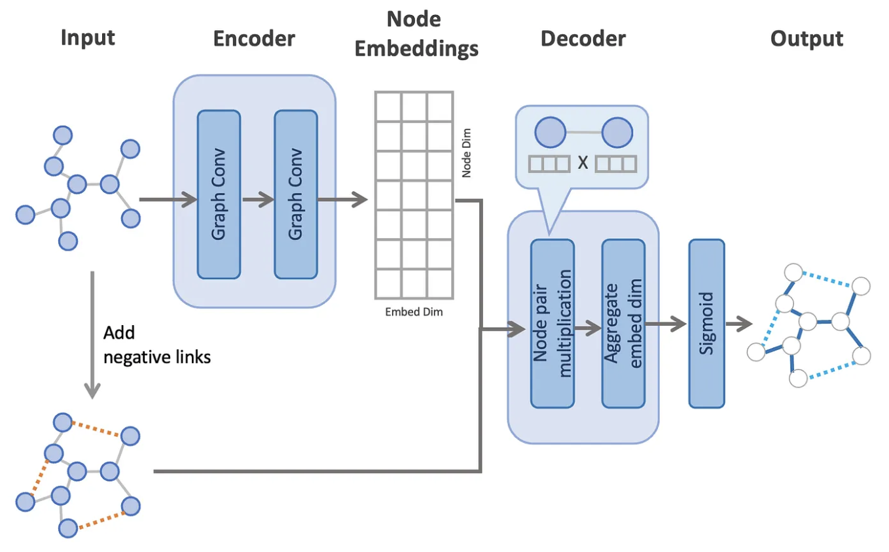
```

Leemos la data de 

```{python}
from sklearn.metrics import roc_auc_score

import torch
import torch.nn.functional as F
from torch import nn
import torch_geometric.transforms as T
from torch_geometric.datasets import Planetoid
from torch_geometric.nn import GCNConv
from torch_geometric.utils import negative_sampling
from sklearn.metrics import roc_auc_score

device = torch.device('cpu')

transform = T.Compose([
    T.NormalizeFeatures(),
    T.ToDevice(device),
    T.RandomLinkSplit(
      num_val=0.05,
      num_test=0.1,
      is_undirected=True,
      add_negative_train_samples=False),
])

dataset = Planetoid('./data/', name='Cora', transform=transform)

# After applying the `RandomLinkSplit` transform, the data is transformed from
# a data object to a list of tuples (train_data, val_data, test_data), with
# each element representing the corresponding split.
train_data, val_data, test_data = dataset[0]
```

Este es el modelo que emplearemos:


```{python}
class GCNLinkPredictor(nn.Module):
    def __init__(self, dim_in, dim_h, dim_z):
        super().__init__()
        torch.manual_seed(1234567)

        self.conv1 = GCNConv(dim_in, dim_h)
        self.conv2 = GCNConv(dim_h, dim_z)

        self.criterion = nn.BCEWithLogitsLoss()

    # -------------------------------------------------
    # Encoder
    # -------------------------------------------------
    def encode(self, x, edge_index):
        h = self.conv1(x, edge_index)
        h = F.relu(h)
        h = self.conv2(h, edge_index)
        return h

    # -------------------------------------------------
    # Decoder (dot product)
    # -------------------------------------------------
    def decode(self, z, edge_index):
        return (z[edge_index[0]] * z[edge_index[1]]).sum(dim=-1)

    def decode_all(self, z):
        adj = z @ z.t()
        return (adj > 0).nonzero(as_tuple=False).t()

    # -------------------------------------------------
    # Training
    # -------------------------------------------------
    def fit(self, train_data, val_data, test_data, epochs, lr=0.01):
        optimizer = torch.optim.Adam(self.parameters(), lr=lr)

        best_val_auc = 0.0
        best_test_auc = 0.0

        for epoch in range(1, epochs + 1):
            loss = self._train_epoch(train_data, optimizer)
            val_auc = self.validate(val_data)
            test_auc = self.test(test_data)

            if val_auc > best_val_auc:
                best_val_auc = val_auc
                best_test_auc = test_auc
                
                
            if epoch % 20 == 0:
              print(
                  f"Epoch {epoch:03d} | "
                  f"Loss: {loss:.4f} | "
                  f"Val AUC: {val_auc:.4f} | "
                  f"Test AUC: {test_auc:.4f}"
              )

        print(f"Final Test AUC: {best_test_auc:.4f}")

    def _train_epoch(self, data, optimizer):
        self.train()
        optimizer.zero_grad()

        z = self.encode(data.x, data.edge_index)

        neg_edge_index = negative_sampling(
            edge_index=data.edge_index,
            num_nodes=data.num_nodes,
            num_neg_samples=data.edge_label_index.size(1),
            method="sparse"
        )

        edge_index = torch.cat(
            [data.edge_label_index, neg_edge_index],
            dim=-1
        )

        edge_label = torch.cat(
            [
                data.edge_label,
                data.edge_label.new_zeros(neg_edge_index.size(1))
            ],
            dim=0
        )

        logits = self.decode(z, edge_index).view(-1)
        loss = self.criterion(logits, edge_label)

        loss.backward()
        optimizer.step()

        return loss.item()

    # -------------------------------------------------
    # Evaluation
    # -------------------------------------------------
    @torch.no_grad()
    def validate(self, data):
        return self._eval_auc(data)

    @torch.no_grad()
    def test(self, data):
        return self._eval_auc(data)

    @torch.no_grad()
    def _eval_auc(self, data):
        self.eval()
        z = self.encode(data.x, data.edge_index)
        logits = self.decode(z, data.edge_label_index).view(-1)
        probs = logits.sigmoid()

        return roc_auc_score(
            data.edge_label.cpu().numpy(),
            probs.cpu().numpy()
        )


```

Entrenaremos el modelo:

```{python}
model = GCNLinkPredictor(
    dim_in=dataset.num_features,
    dim_h=128,
    dim_z=64
).to(device)

model.fit(
    train_data=train_data,
    val_data=val_data,
    test_data=test_data,
    epochs=100,
    lr=0.01
)
```


```{python}
z = model.encode(test_data.x, test_data.edge_index)
final_edge_index = model.decode_all(z)
print("z")
print(z)
print("final_edge_index")
print(final_edge_index)
```

### Ejemplo: Clasificación de artículos de investigación por categoría (Parte II)

A continuación mostramos una arquitectura que permite hace la predicción de aristas 
usando GraphSage:


```{python}
import torch
import torch.nn as nn
import torch.nn.functional as F
from torch_cluster import random_walk
from sklearn.linear_model import LogisticRegression

import torch_geometric.transforms as T
from torch_geometric.nn import SAGEConv
from torch_geometric.datasets import Planetoid
from torch_geometric.data import NeighborSampler as RawNeighborSampler

import matplotlib.pyplot as plt
import seaborn as sns
```    

```{python}
dataset = 'Cora'
path = './data'
dataset = Planetoid(path, dataset, transform=T.NormalizeFeatures())
data = dataset[0]
```


```{python}
class NeighborSampler(RawNeighborSampler):
    def sample(self, batch):
        batch = torch.tensor(batch)
        row, col, _ = self.adj_t.coo()

        # For each node in `batch`, we sample a direct neighbor (as positive
        # example) and a random node (as negative example):
        pos_batch = random_walk(row, col, batch, walk_length=1,
                                coalesced=False)[:, 1]

        neg_batch = torch.randint(0, self.adj_t.size(1), (batch.numel(), ),
                                  dtype=torch.long)

        batch = torch.cat([batch, pos_batch, neg_batch], dim=0)
        return super(NeighborSampler, self).sample(batch)


train_loader = NeighborSampler(data.edge_index, sizes=[10, 10], batch_size=256,
                               shuffle=True, num_nodes=data.num_nodes)


class SAGE(nn.Module):
    def __init__(self, in_channels, hidden_channels, num_layers):
        super(SAGE, self).__init__()
        self.num_layers = num_layers
        self.convs = nn.ModuleList()
        
        for i in range(num_layers):
            in_channels = in_channels if i == 0 else hidden_channels
            self.convs.append(SAGEConv(in_channels, hidden_channels))

    def forward(self, x, adjs):
        for i, (edge_index, _, size) in enumerate(adjs):
            x_target = x[:size[1]]  # Target nodes are always placed first.
            x = self.convs[i]((x, x_target), edge_index)
            if i != self.num_layers - 1:
                x = x.relu()
                x = F.dropout(x, p=0.5, training=self.training)
        return x

    def full_forward(self, x, edge_index):
        for i, conv in enumerate(self.convs):
            x = conv(x, edge_index)
            if i != self.num_layers - 1:
                x = x.relu()
                x = F.dropout(x, p=0.5, training=self.training)
        return x


device = torch.device('cuda' if torch.cuda.is_available() else 'cpu')
model = SAGE(data.num_node_features, hidden_channels=64, num_layers=2)
model = model.to(device)
optimizer = torch.optim.Adam(model.parameters(), lr=0.01)
x, edge_index = data.x.to(device), data.edge_index.to(device)


def train():
    model.train()

    total_loss = 0
    for batch_size, n_id, adjs in train_loader:
        # `adjs` holds a list of `(edge_index, e_id, size)` tuples.
        adjs = [adj.to(device) for adj in adjs]
        optimizer.zero_grad()

        out = model(x[n_id], adjs)
        out, pos_out, neg_out = out.split(out.size(0) // 3, dim=0)

        pos_loss = F.logsigmoid((out * pos_out).sum(-1)).mean()
        neg_loss = F.logsigmoid(-(out * neg_out).sum(-1)).mean()
        loss = -pos_loss - neg_loss
        loss.backward()
        optimizer.step()

        total_loss += float(loss) * out.size(0)

    return total_loss / data.num_nodes


@torch.no_grad()
def test():
    model.eval()
    out = model.full_forward(x, edge_index).cpu()

    clf = LogisticRegression()
    clf.fit(out[data.train_mask], data.y[data.train_mask])

    val_acc = clf.score(out[data.val_mask], data.y[data.val_mask])
    test_acc = clf.score(out[data.test_mask], data.y[data.test_mask])

    return val_acc, test_acc


for epoch in range(1, 51):
    loss = train()
    val_acc, test_acc = test()
    print(f'Epoch: {epoch:03d}, Loss: {loss:.4f}, '
          f'Val: {val_acc:.4f}, Test: {test_acc:.4f}')
```

De lo anterior, podemos representar el embedding de los nodos mediante T-SNE:

```{python}
from sklearn.manifold import TSNE

with torch.no_grad():
    model.eval()
    out = model.full_forward(x, edge_index).cpu()

palette = {}
for n, y in enumerate(set(data.y.numpy())):
    palette[y] = f'C{n}'

embd = TSNE(
    n_components=2,
    perplexity=30,
    learning_rate='auto',
    init='pca',
    random_state=42
).fit_transform(out.numpy())

plt.figure(figsize=(10, 10))
sns.scatterplot(
    x=embd[:, 0],
    y=embd[:, 1],
    hue=data.y.cpu().numpy(),
    palette=palette
    )
plt.legend(bbox_to_anchor=(1, 1), loc='upper left')
plt.show()
```
Comparemoslo contra una visualización de las caracteristicas numéricas usando
T-SNE donde se aprecia más dispersion:

```{python}
embd_x = TSNE(
    n_components=2,
    perplexity=30,
    learning_rate='auto',
    init='pca',
    random_state=42
).fit_transform(data.x.numpy())

plt.figure(figsize=(10, 10))
sns.scatterplot(
    x=embd_x[:, 0],
    y=embd_x[:, 1],
    hue=data.y.cpu().numpy(),
    palette=palette
)
plt.legend(bbox_to_anchor=(1, 1), loc='upper left')
plt.show()
```

<!--chapter:end:23-Graphs-Embeddings.Rmd-->

