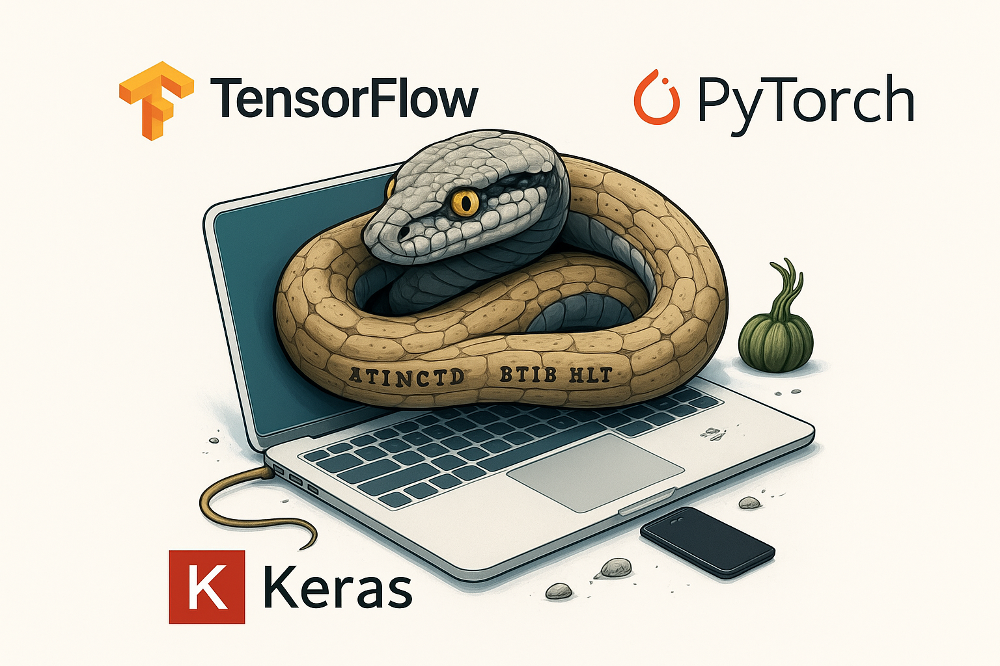
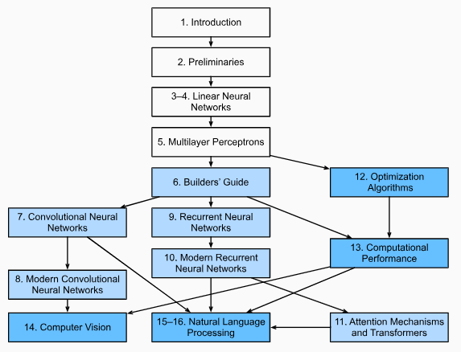

```{r setup, include=FALSE}
knitr::opts_chunk$set(
 echo = TRUE,
 warning = FALSE, 
 message = FALSE
 )

```

# BIENVENIDA {.unnumbered}

## Objetivo {.unnumbered}

Brindar al participante los elementos teóricos y prácticos básicos alrededor de la programación de ***REDES NEURONALES ARTIFICIALES***. Aprenderá las definiciones y aprenderá a distinguir estrategias y diferentes soluciones a problemas que pueden resolverse con algoritmos de deep learning y aprenderá a usar el conjunto de librerías en **Python** más novedoso, estructuradas y ampliamente usadas para la creación de estructuras neuronales aplicadas a problemas predictivos, clasificación y segmentación de imagenes, series de tiempo, procesamiento de lenguaje natural (NLP), etc.

```{r echo=FALSE, fig.align='center', out.height='350pt', out.width='600pt'}

```

## Alcances del Programa {.unnumbered}

Al finalizar este curso, el participante será capaz de consumir, manipular y visualizar información para resolver problemas de propósito general asociados a los datos. Apenderá a implementar diferentes algoritmos de machine learning y mejorar su desempeño predictivo en problemas de clasificación, regresión y segmentación.

Requisitos:

-   Computadora con al menos 8Gb Ram
-   Instalar Python con versión 3.11 o superior
-   Instalar un IDE preferido. Jupyter, RStudio, Spyder, VSCode, Colab

### Temario: {.unnumbered}

**00. Instalación**

**01. Introducción a Deep Learning**

**02. Preliminares**

**03. Redes Neuronales Lineales para Regresión**

**04. Redes neuronales Lineales para Clasificación**

**05. Perceptrón Multicapa**

**06. Guía del Constructor**

**07. Redes Neuronales Convolucionales**

**08. Redes Neuronales Convolucionales Modernas**

**09. Redes Neuronales Recurrentes**

**10. Redes Neuronales Recurrentes Modernas**

**11. Mecanismos de Atención y Transformers**

**12. Algoritmos de Optimización**

**13. Desempeño Computacional**

**14. Visión por Computadora**

**15. Procesamiento de Lenguaje Natural: Pre-entrenamiento**

**16. Procesamiento de Lenguaje Natural: Aplicaciones**

**17. Aprendizaje por Refuerzo**

**18. Procesos Gausianos**

**19. Optimización paramétrica**

**20. Redes Generativas Adversarias**

```{r echo=FALSE,fig.align='center',  out.width='500pt'}

```

## Código {.unnumbered}

La mayoría de las secciones de este material presentan código ejecutable. En definitiva algunas intuiciones se desarrollan mejor mediante ensayo y error, modificando el código poco a poco y observando los resultados.

El código será presentado en chunks visibles y detacados respecto del resto del texto. Este puede ser copiador mediante el botón superior del lado derecho para su revisión y replicación en algún otro ambiente de prueba.

```{python, eval=F}
import collections
import hashlib
import inspect
import math
import os
import random
import re
import shutil
import sys
import tarfile
import time
import zipfile
from collections import defaultdict
import pandas as pd
import requests
from IPython import display
from matplotlib import pyplot as plt
from matplotlib_inline import backend_inline
```

## Duración y evaluación del programa {.unnumbered}

-   El programa tiene una duración de XXX hrs.

-   Las sesiones serán atendidas los días XxXx, de 4:30 pm a 5:45 pm

-   Serán asignados ejercicios que el participante deberá resolver entre una semana y otra.

-   Durante todo el programa se realizarán prácticas para reforzar el aprendizaje.

## Recursos y dinámica {.unnumbered}

### Agenda {-}

Todos los participantes del Hub podrán participar aprendiendo y compartiendo el conocimiento.

Este es nuestro [documento](https://docs.google.com/spreadsheets/d/1ZbMttnLjYRvaW6ppJBMQ9YZmoBHiVUZjC9y96IOr03E/edit?gid=1890664429#gid=1890664429) para organizarnos internamente en cuanto a los temas a impartir, fechas y orden en que se irá compartiendo cada tema.

### Software {-}

En esta clase estaremos usando:

-   Python [da click aquí si aún no lo descargas](https://www.python.org/downloads/)
-   R & RStudio [da click aquí también](https://posit.co/downloads/)
-   Reticulate [da click para aprender](https://anderfernandez.com/blog/reticulate-usar-python-en-r/)
-   Bookdown [da click aquí también](https://bookdown.org/yihui/bookdown/)

### Bibliografía {-}

<table>
  <tr>
    <td style="width:150px; vertical-align:top;">
      <a href="https://D2L.ai" target="_blank">
        
      </a>
    </td>
    <td style="vertical-align:top; padding-left:15px;">
      **Dive into Deep Learning**  
      Autor: Zhang, Aston and Lipton, Zachary C. and Li, Mu and Smola, Alexander J. 
      Editorial: Cambridge University Press  
      Año: 2023  
   </td>
  </tr>  
  
  <tr>
    <td style="width:150px; vertical-align:top;">
      <a href="https://personalpages.manchester.ac.uk/staff/mingfei.sun/books/deep-learning.pdf" target="_blank">
        
      </a>
    </td>
    <td style="vertical-align:top; padding-left:15px;">
      **Deep Learning Foundations and Concepts**  
      Autor: Christopher M. Bishop with Hugh Bishop  
      Editorial: Springer  
      Año: 2023  
      ISBN: 978-3-031-45467-7
   </td>
  </tr>  
  
  <tr>
    <td style="width:150px; vertical-align:top;">
      <a href="http://14.139.161.31/OddSem-0822-1122/Hands-On_Machine_Learning_with_Scikit-Learn-Keras-and-TensorFlow-2nd-Edition-Aurelien-Geron.pdf" target="_blank">
        
      </a>
    </td>
    <td style="vertical-align:top; padding-left:15px;">
      **Hands On Machine Learning with Scikit-Learn, Keras and TensorFlow**  
      Autor: Aurélien Géron  
      Editorial: O´REILLY  
      Año: 2019  
      ISBN: 978-1-492-03264-9
    </td>
  </tr>
  
  <tr>
    <td style="width:150px; vertical-align:top;">
      <a href="https://www.andrew.cmu.edu/course/10-703/textbook/BartoSutton.pdf" target="_blank">
        
      </a>
    </td>
    <td style="vertical-align:top; padding-left:15px;">
      **Reinforcement Learning**  
      Autor: Richard S. Sutton, Andrew G. Barto  
      Editorial: The MIT Press  
      Año: 2018  
      ISBN: 978-0-262-19398-6
   </td>
  </tr>  

  <tr>
    <td style="width:150px; vertical-align:top;">
      <a href="https://bookdown.org/yihui/bookdown/" target="_blank">
        
      </a>
    </td>
    <td style="vertical-align:top; padding-left:15px;">
      **Bookdown**  
      Autor: Yihui Xie  
      Editorial: The R Series  
      Año: 2025  
   </td>
  </tr>  

</table>